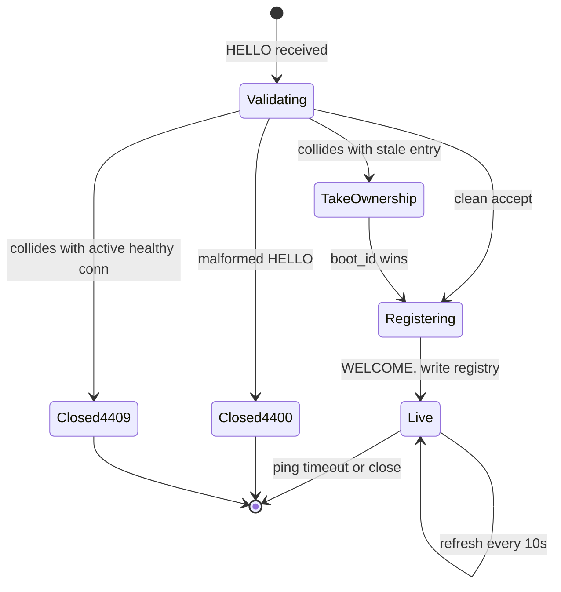

# Designing a websocket command broker for long-lived agent connections

*why your fleet wants to phone home and stay on the line*

A few thousand test rigs sit across half a dozen labs. A "rig" here is a bare-metal machine doing something noisy: burning in firmware, running regressions, scraping kernel logs. If you have managed an IoT fleet or a pool of long-running agents on remote hosts, the shape is the same: many independent machines, each running a long-lived agent, that a central system reaches on demand. A controller, `fleetlink`, needs to push commands to any of them within a second or two. "Reboot rig 0414." "Pull the last 500 lines of `dmesg`." "Start regression suite 7." Multiply by a thousand rigs and a busy operator hammering the UI.

The thesis up front, so the rest reads as one idea rather than a grab bag of gotchas: a persistent connection is a stateful object pretending to be a transport. Everything below follows from it.

The naive answer is HTTP polling. Every rig wakes up every N seconds, hits `GET /fleetlink/commands?rig=0414`, and runs whatever comes back. This works for about a week. Then the math catches up to you.

## Why HTTP polling falls apart

At a 5 second poll interval with 2000 rigs, each rig fires one request every 5 seconds, so the fleet generates 2000 / 5 = 400 requests per second of pure overhead before anyone has done anything useful. Each request burns a TCP handshake (or a TLS resumption), a header round trip with cookies and auth tokens, and a database lookup for that rig.

Latency is awful too: a command issued at t=0 lands between t=0 and t=5 seconds, averaging 2.5s. Cut the interval to 1 second and you have 2000 RPS of mostly-empty responses and a dead load balancer.

Long-polling fixes latency: every rig holds open a request for up to 30 seconds, the server parks it, and replies when a command shows up. But a request you hold open so the server can push to you is a websocket you have invented badly. You pay for an HTTP request frame, a parked goroutine or thread, and a forced disconnect every 30 seconds, all to deliver one command. (Req/s drops because each rig now sends one request per 30s: 2000 / 30 is about 67 RPS, plus a burst whenever the parked requests recycle together.)

Lined up side by side, the three options look like this for a 2000-rig fleet:

| Transport | Avg command latency | Steady-state req/s | Per-connection overhead |
|---|---|---|---|
| Polling (5s) | ~2.5s | 400 | TCP+TLS handshake + headers per poll |
| Long-polling (30s park) | ~50ms when idle, request still recycled every 30s | ~67 + bursts on reconnect | Parked goroutine/thread per rig, request frame every 30s |
| WebSocket | ~5-20ms (network limited) | 0 in steady state | One open socket per rig, ping/pong every 20s |

The websocket row makes overhead vanish in steady state, at the cost of every problem in the rest of this post. Commit to it: each rig opens one websocket to `fleetlink`, keeps it open for hours or days, and we push commands down it. Everything that goes wrong from here is the same stateful-object problem wearing a different hat.

## The shape of the broker

The rough topology:

```
   rig-0001 ─┐
   rig-0002 ─┤     ┌──────────────┐     ┌──────────┐
   rig-0003 ─┼─ws──┤ fleetlink-fe ├─────┤ fleetlink│
     ...    ─┤     │   (broker)   │     │  control │
   rig-2000 ─┘     └──────────────┘     └──────────┘
                       │   ▲
                       ▼   │
                    ┌────────┐
                    │  redis │  (pub/sub + connection registry)
                    └────────┘
```

`fleetlink-fe` is the broker. It holds live socket state (which rigs are connected right now) but no durable business state, so any instance is disposable: kill one without losing committed work. Its only job is to terminate websocket connections from rigs (the encrypted socket ends at the broker) and shuffle messages between them and the control plane. The control plane (`fleetlink control`) decides what commands to issue; the brokers are the data plane that carries them. Several broker instances run behind a TCP load balancer.

Redis does two jobs. The connection registry is a hash, `rig_id -> broker_instance_id`, so control can learn which broker owns a rig. Pub/sub is how control reaches that broker: rather than bypass the LB to dial `broker-fe-03` directly, control publishes the command on a per-broker channel, and the owning broker (subscribed to its own channel) writes it down the right socket. Registry answers "which broker," pub/sub answers "how do I hand it the message," and control stays oblivious to the LB topology.

The broker does almost no business logic. It speaks one protocol to rigs (websocket frames carrying JSON or msgpack), one to control (the pub/sub above, plus gRPC for synchronous calls), and translates. Keep it boring.

## Connection lifecycle

A new rig boots, reads its config, and dials `wss://fleetlink.example.internal/agent`. On connect, it sends a `HELLO` frame:

```json
{ "type": "hello", "rig_id": "rig-0414", "version": "agent-2.7.3", "boot_id": "b7a1...e9" }
```

The `boot_id` is a fresh UUID generated once per process start. It is the linchpin of correct reconnects: it tells "this rig's current process" apart from "a stale connection about to be replaced." The broker validates the rig's mTLS cert, looks up its identity, and accepts with a `WELCOME` or closes with a reason code. On `WELCOME` it writes `rig-0414 -> broker-fe-03` into Redis with a short TTL (say 60s) and re-runs the refresh script every 10s, inside that TTL.



The 4xxx close codes are application-defined; the websocket spec reserves 4000-4999 for your own use, and I echo HTTP status semantics into them, so 4400 reads like a 400 Bad Request and 4409 like a 409 Conflict. The three collision branches:

- **Malformed `HELLO`**: close 4400, log the cert subject, no Redis write.
- **Collision with an active healthy connection**: close the new connection 4409 and let the rig retry after backoff. Guards against a rig that cloned its config to a second machine.
- **Collision with a stale entry**: take ownership via the Lua script later in the post. The normal reconnect path.

Two things make this harder than it looks, each handled next: the connection can die without telling anyone, and the rig can reconnect to a different broker before the old entry expires.

## Ping, pong, and the half-open socket

Half-open TCP is the failure mode that bites everyone exactly once. The rig vanishes (power-cut, crash, yanked cable) but the broker's kernel never learns it is gone, so the socket sits in `ESTABLISHED` forever, looking alive while nothing is there. TCP only notices a dead peer when it sends and gets no acknowledgement, and a quiet command channel may send nothing for minutes. Diagnosing dead tunnels in general gets its own post later; here I focus on the websocket-frame piece.

Websocket has dedicated `PING` (opcode 0x9) and `PONG` (opcode 0xA) control frames defined in RFC 6455 sections 5.5.2 and 5.5.3 (https://www.rfc-editor.org/rfc/rfc6455.html), payload capped at 125 bytes. These force a round trip so the application can detect the dead peer TCP ignores. The broker sends a `PING` every 20 seconds, expects a `PONG` within 10, and forcibly closes after three misses.

```python
async def keepalive(conn):
    while True:
        await asyncio.sleep(20)
        pong_ok = False
        try:
            pong_waiter = await conn.ping()
            await asyncio.wait_for(pong_waiter, timeout=10)
            pong_ok = True
        except (asyncio.TimeoutError, websockets.ConnectionClosed, OSError):
            # Any ping failure counts as a missed pong.
            pass

        if pong_ok:
            conn.missed_pings = 0
        else:
            conn.missed_pings += 1
            if conn.missed_pings >= 3:
                await conn.close(code=4002, reason="ping timeout")
                return
```

`conn.ping()` returns a future that resolves when the matching `PONG` arrives; `wait_for` raises `TimeoutError` on silence. I'm explicit with `pong_ok` rather than relying on `try/except/else` so the success path is obvious.

Do not rely on the rig pinging the broker. Some flaky NAT in front of the rig may forward outgoing PINGs while dropping incoming traffic. The broker pings, the rig must pong, silence is death.

## Proxy idle timeouts (the broker owns this number)

Put anything between rigs and the broker (load balancer, reverse proxy, cloud LB) and you inherit its idle timeout, and that number drives every other liveness decision you make. One distinction matters: an **idle timeout** measures the gap between bytes, so any traffic in either direction resets it; a **connection-lifetime cap** measures wall-clock time since the socket opened and fires no matter how busy the connection is. A 20-second ping defeats an idle timeout but does nothing against a lifetime cap (which is why Azure's 4-hour ceiling below still closes you eventually). The defaults to memorize:

| Proxy | Default idle | Tunable? | Source |
|---|---|---|---|
| AWS NLB (TCP listener) | 350s | Yes, 60-6000s since Sept 2024 | [NLB configurable idle timeout](https://aws.amazon.com/blogs/networking-and-content-delivery/introducing-nlb-tcp-configurable-idle-timeout/) |
| AWS NLB (TLS listener) | 350s | No, fixed | same |
| AWS ALB | 60s | Yes, 1-4000s | [ALB attributes docs](https://docs.aws.amazon.com/elasticloadbalancing/latest/application/edit-load-balancer-attributes.html) |
| nginx `proxy_read_timeout` | 60s | Yes, per-directive (inter-read, not total) | [nginx proxy module](https://nginx.org/en/docs/http/ngx_http_proxy_module.html) |
| Azure Front Door (websocket) | 300s, plus 4h max connection lifetime | No | [Front Door websocket docs](https://learn.microsoft.com/en-us/azure/frontdoor/standard-premium/websocket) |
| Cloudflare Free/Pro (websocket) | 100s | Enterprise only | [Cloudflare websockets docs](https://developers.cloudflare.com/network/websockets/) |
| Most corporate squid/forward proxies | 60s, sometimes 30s | Depends on the team that owns it | local config |

One AWS quirk: an ALB resets its idle timer only on application data crossing the connection. A websocket ping frame counts because it is application-layer data the proxy forwards; a raw TCP keep-alive packet does not. So "a broker ping keeps the connection alive" works precisely because the ping is a websocket application frame, not a TCP-layer trick ([ALB user guide](https://docs.aws.amazon.com/elasticloadbalancing/latest/application/application-load-balancers.html#connection-idle-timeout)). NLB's cross-zone setting does not change the timeout but does change whether your keepalive shows up as cross-AZ on the bill.

A connection usually crosses several intermediaries in series (NAT box, CDN edge, L7 load balancer, reverse proxy), each running its own unsynchronized idle timer. The binding constraint is the minimum: the tightest timer fires first, and because they share the path, every connection on it dies together. The rule: ping faster than the tightest idle timeout, with margin, because an interval merely "less than" the timeout is fragile, one dropped ping or a latency spike pushes the next beat past the deadline. Keep the interval at roughly half the tightest timeout; 20s pings survive a 60s proxy. Verify by tracing one real connection through every hop and asking each ops team their timeouts. Do not trust the docs; read the running config.

(One nginx footgun: it caps a single request-header field at one `large_client_header_buffer`, default 8 KB, up to 4 buffers, see nginx.org/en/docs/http/ngx_http_core_module.html#large_client_header_buffers. `client_header_buffer_size` defaults to 1 KB for the initial read. A fat auth token in the `HELLO` upgrade request hits one of these before you reach the websocket handler.)

## Ordered command delivery

Once a connection is up, it carries commands from control, plus responses and unsolicited events from the rig. Two choices have outsized impact: ordering and acknowledgement.

For a single rig, commands should arrive in the order control issued them. If an operator clicks "stop regression" then "reboot", you do not want those reversed.

The simplest way: give each rig a single per-connection outbound queue and exactly one writer goroutine that drains it. The "exactly one" is load-bearing. TCP guarantees bytes written in order arrive in order, but only with a single source of writes: two goroutines writing the same socket concurrently interleave frames and reintroduce the reordering you were preventing. One queue, one writer, and in-order writes become in-order receives.

```go
type RigConn struct {
    id      string
    outbox  chan Command   // buffered, e.g. 128 deep
    ws      *websocket.Conn
    seqMu   sync.Mutex
}

// Called by the control plane when it issues a command. The seq is
// assigned here, NOT in the writer, so retries and replays preserve
// the original number. nextSeq() and the channel send are under one
// lock so concurrent callers cannot assign seq in one order and enqueue
// in another.
func (r *RigConn) Enqueue(cmd Command) error {
    r.seqMu.Lock()
    defer r.seqMu.Unlock()
    cmd.SeqNo = r.nextSeq()
    select {
    case r.outbox <- cmd:
        return nil
    default:
        return ErrOutboxFull
    }
}

func (r *RigConn) writer(ctx context.Context) {
    for {
        select {
        case <-ctx.Done():
            return
        case cmd := <-r.outbox:
            if err := r.ws.WriteJSON(cmd); err != nil {
                r.fail(err)
                return
            }
        }
    }
}
```

`outbox` is buffered; the `select` in `Enqueue` is the try-send idiom (non-blocking, `default` fires when full).

The rig sends back an `ACK` with that seq when it has accepted (not necessarily completed) the command. Within a single connection the broker does not retransmit on a missing ACK: an unacked command is surfaced to the operator (its seq lag shows in the error JSON below), not silently resent, because a blind resend over a still-open ordered socket risks double execution. The seq is a per-(rig, current connection attempt) routing token, not a log-stream offset; replay across reconnects is its own problem for a later post.

## Backpressure when one rig stalls

A rig stops reading: its agent is wedged in a syscall, a full disk blocks logging, or someone is single-stepping it in gdb. TCP flow control does the rest: the stalled rig's receive window shrinks to zero, the sender may not send past a zero window, so the broker's `WriteJSON` has nowhere to put the bytes and blocks. A shared writer goroutine stalls every other rig. One writer per rig (as above) isolates the damage, but the outbox channel fills up, and now control attempts to enqueue and blocks too. A stalled reader propagates back to the broker's write path.

A few choices, none perfect.

1. **Bounded outbox, drop oldest.** Cheap, but you silently lose commands, and worse, you tear a hole in the seq sequence. If you pick this, the rig must detect the gap (next seq jumps by more than one) and refuse to proceed rather than run a "reboot" without the "stop" that should have come first.
2. **Bounded outbox, drop newest with error.** New enqueue returns an error to control, which surfaces it to the operator. Honest.
3. **Bounded outbox, kill the connection.** If the outbox fills, declare the rig dead, close the socket, let it reconnect. Predictable.

For an interactive operator UI, option 2 is usually right: tell the human, let them decide. Control returns it as the enqueue RPC response, and the UI renders it next to the rig row:

```json
{
  "error": "rig_unresponsive",
  "rig_id": "rig-0414",
  "detail": "outbox full (128/128), oldest queued cmd age 47s",
  "last_ack_seq": 8421,
  "last_ack_at": "2026-04-12T14:03:11Z",
  "suggested_action": "force_reconnect"
}
```

The operator sees "rig-0414: unresponsive, last ack 47s ago, [Force reconnect]" and the button is option 3 wrapped in human consent. Automated loops with idempotent commands skip the human and go straight to option 3.

The bug to avoid: an unbounded outbox. On a stuck rig in a fleet of thousands, memory growth becomes an OOM in the broker, and every connection drops at once. Which brings us to reconnect storms.

## Reconnect storms

The broker dies, or restarts for a deploy, or the LB shuffles connections. Two thousand rigs all notice within a second and reconnect simultaneously. If broker startup involves any per-connection work that touches a shared resource (a database, a registry, an auth service), you overload it instantly. Mitigations, roughly in order of importance.

**Jittered reconnect on the rig side.** The biggest payoff:

```python
def reconnect_delay(attempt):
    base = min(2 ** attempt, 30)        # cap at 30s
    return random.uniform(0.5, 1.5) * base
```

- Spelled out: `attempt=0` → 1s, `=1` → 2s, `=2` → 4s, `=3` → 8s, `=4` → 16s, `=5` → 32s capped at 30s, then 30s forever. Capping prevents the rig from waiting an hour after the broker has been back up for fifty minutes.
- `random.uniform(0.5, 1.5) * base` is **proportional jitter**: a ±50% band centered on the backoff. This is not "full jitter," which (Marc Brooker, AWS Architecture Blog, "Exponential Backoff And Jitter," 2015) is `random.uniform(0, 1) * min(2 ** attempt, 30)`, uniform across `[0, cap]`, and spreads contention better. I keep the proportional version because it never returns near-zero, but name it honestly: it smears less aggressively.
- `attempt = 0` under the proportional form gives 0.5 to 1.5 seconds. Some teams want `attempt = 0` to mean "try immediately"; resist that during a storm, because a thousand rigs then retry at once before any backoff kicks in.

Without jitter, every rig that disconnected at the same instant reconnects at the same instant. With jitter, they smear across a window. If you remember one mechanical fix from this post, it is the `random.uniform`.

**Connection-rate limiting at the broker.** Accept new connections at a bounded rate per instance; excess connections get a backoff hint and wait longer. Uncomfortable to design (you are intentionally rejecting clients) but it stops the broker death-spiraling. A token-bucket on the Accept loop is enough:

```go
// 50 new conns/sec, burst 100.
var acceptBucket = rate.NewLimiter(rate.Limit(50), 100)

func acceptLoop(ln net.Listener) {
    for {
        raw, err := ln.Accept()
        if err != nil { return }

        if !acceptBucket.Allow() {
            // Reject BEFORE the websocket handshake: this is still a
            // plain TCP/HTTP conn, so we answer the HTTP Upgrade with a
            // 503 + Retry-After rather than a websocket close frame.
            backoff := 5 + rand.Intn(10) // 5-15s, jittered
            rejectWithHTTP503(raw, backoff)
            continue
        }

        go handleConn(raw)
    }
}
```

Rejecting at Accept time is the point: the connection has not completed the websocket handshake yet, so there is no websocket to close with an app-defined code. You answer the pending HTTP Upgrade with a `503` and a `Retry-After` header the rig reads before its next attempt. The 4xxx close codes (4400, 4409 from the lifecycle section, and 4503) only apply once a connection has upgraded and you decide to close it; 4000-4999 is the websocket private-use range, so 4503 mirrors HTTP 503, and its reason field is plain UTF-8 (max 123 bytes), enough for a `retry_after=<seconds>` hint.

**Stateless authentication.** If you authenticate by hitting an auth service per connection, that service falls over during a storm. We use mTLS as the primary credential: the broker validates the rig's client cert locally against a cached CA bundle, no per-connection round trip. The "fat auth token" above is an optional short-lived JWT carrying coarser scope (which command classes this rig may run), also validated locally. Hit the central auth service only for revocation checks, asynchronously, and tolerate the lag.

**Warmup the broker before the LB sends traffic.** Give a starting broker a few seconds before it advertises as healthy, so the Redis pool establishes, the CA bundle and revocation list load into memory, and the pub/sub subscription to its own command channel registers. Then the first wave of reconnecting rigs does not hit a process that cannot yet route a command. Skip warmup and the LB shoves 500 reconnects at a cold broker.

## Reconnects that race with their own ghost

A rig drops and reconnects in 1.2 seconds to a different broker. The Redis entry `rig-0414 -> broker_fe_03` from the previous connection still exists with TTL 58s. The new broker `broker_fe_07` writes `rig-0414 -> broker_fe_07` and starts refreshing.

Now control reads Redis to find rig 0414. Whichever broker wrote last wins. But `broker_fe_03` is still alive and still firing its own refresh timer because it hasn't noticed its socket is dead, and if its refresh lands after `broker_fe_07`'s write, control routes to a broker holding a corpse. This is the `boot_id` payoff: the only reliable way to tell `fe_03`'s stale process from `fe_07`'s live one is the per-process-start ID.

The fix is a single Lua script that makes every write conditional on the `boot_id`, and it works because of atomicity: Redis runs the whole script to completion on the server with no command interleaved, so the read-compare-write is one indivisible step and the ghost refresh can never sneak in between the check and the set. Store the registry value as the tuple `(boot_id, broker_id)`, `boot_id` in canonical 36-character hyphenated text. We use UUIDv7 for `boot_id`: a variant that puts a millisecond timestamp in its leading bits, so newer IDs sort after older ones, and the text form sorts the same way under a plain string compare. Store text, not the raw 16 bytes, because a raw byte can be `0x7C`, which collides with the `|` delimiter and breaks the `string.match` split. Then:

```lua
-- KEYS[1] = "rig:0414"
-- ARGV[1] = my_boot_id
-- ARGV[2] = my_broker_id
-- ARGV[3] = ttl_seconds
-- ARGV[4] = "hello" or "refresh"
local existing = redis.call("GET", KEYS[1])
local new_val  = ARGV[1] .. "|" .. ARGV[2]

if existing == false then
  redis.call("SET", KEYS[1], new_val, "EX", ARGV[3])
  return "ok"
end

local cur_boot, cur_broker = string.match(existing, "([^|]+)|([^|]+)")

if ARGV[4] == "hello" then
  -- New HELLO always wins if its boot_id is strictly newer.
  -- boot_ids are time-ordered UUIDv7s, so lexical compare is fine.
  if ARGV[1] > cur_boot then
    redis.call("SET", KEYS[1], new_val, "EX", ARGV[3])
    return "ok"
  end
  return "stale_hello"
end

-- "refresh" path: only the writer that owns the tuple may extend it.
if cur_boot == ARGV[1] and cur_broker == ARGV[2] then
  redis.call("EXPIRE", KEYS[1], ARGV[3])
  return "ok"
end
return "superseded"
```

Walking through the race:


The key step is t=14. Without the Lua check, `broker_fe_03`'s refresh would blindly `SET` the registry back to `(B1, fe_03)` and control would route to a corpse for up to one TTL. With the check, the script sees the mismatch, returns `superseded`, and the old broker tears down its dead socket. Two brokers can never both think they own a rig past the next refresh tick, the actual guarantee you need. UUIDv7's 48-bit Unix-ms timestamp in the high bits (RFC 9562) makes the compare order IDs by creation time. Intra-ms ordering depends on the generator method in section 6.2, which does not matter here: two reconnects in the same millisecond do not happen in practice.

## Things I have not covered but you will hit

A short list, because this post is long enough.

- **Message size limits.** Some clients send 10MB log dumps over the command channel. Don't let them: separate channel, separate limits, or a presigned-URL upload to object storage with a notification over the websocket.
- **Per-rig fairness.** One chatty rig can monopolize a broker's CPU. Token-bucket per connection.
- **Observability.** Per-connection metrics are expensive at 2000 connections. Aggregate by rig group, not per rig, and sample slow paths.
- **Graceful broker shutdown.** Send a `GOAWAY` frame, give rigs 10 seconds to reconnect elsewhere, then close, so the fleet does not all notice at the same millisecond.
- **Schema evolution.** Your protocol will change. Version every message, tolerate unknown fields, and refuse unknown message types loudly during development, silently in production.

Back to the line we opened with: a persistent connection is a stateful object pretending to be a transport. Treat liveness, ordering, backpressure, and identity across reconnects as design decisions, not surprises. Write them down.
