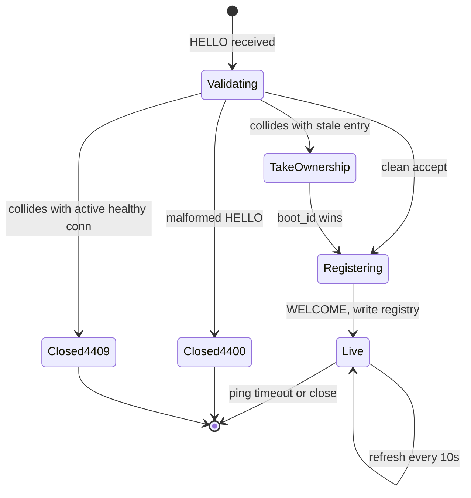
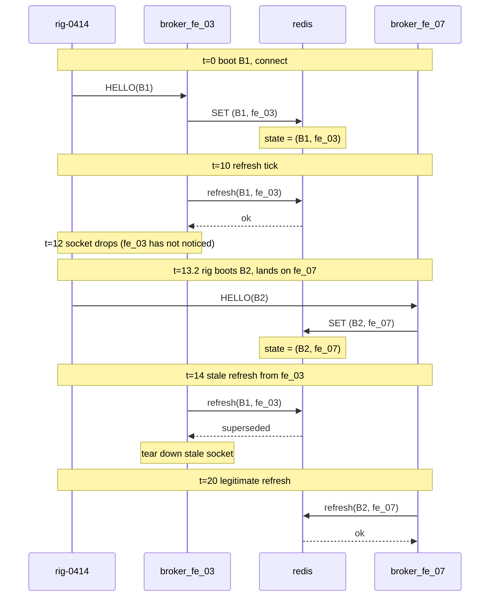

# Designing a websocket command broker for long-lived agent connections

*designing a broker that pushes commands to a fleet of remote machines over long-lived connections*

A few thousand test rigs sit across half a dozen labs. A "rig" is a bare-metal machine doing something noisy: burning in firmware, running regressions, scraping kernel logs. A controller, `fleetlink`, must push commands to any of them within a second or two. "Reboot rig 0414." "Pull the last 500 lines of `dmesg`." "Start regression suite 7." Now do that across a thousand rigs.

One idea sits under everything below: a connection you hold open for hours is not really a transport, it is a small piece of state you have to manage, and state can be wrong, can drift, can get duplicated.

The first instinct is HTTP polling. HTTP is request/response: a client sends a request, the server sends one response, and polling repeats that on a timer. Every rig sends `GET /fleetlink/commands?rig=0414` every N seconds and runs what comes back.

## Why HTTP polling falls apart

At a 5-second poll interval with 2000 rigs, the fleet generates 400 requests per second (RPS, or req/s) of pure overhead. Each request pays for a TCP handshake (the short exchange two machines do to open a connection, costing one round trip: one message out plus its reply) or a TLS resumption (a shortcut for re-opening an encrypted connection to a server you talked to recently), plus headers, cookies, an auth token, and a database lookup for that rig.

Latency, the time between issuing a command and the rig acting on it, is also poor: a command can wait the full poll interval. Cut the interval to 1 second and you get 2000 RPS of mostly-empty responses and a load balancer (LB, the box in front of your servers spreading incoming connections across them) that falls over.

Long-polling improves latency. Each rig opens a request and the server holds it open for up to 30 seconds, then replies the moment a command shows up, after which the rig opens a fresh request. But a request you hold open so the server can push data to you is most of what a websocket does, and you still pay for an HTTP request frame, tie up a worker per parked request, and force a reconnect every 30 seconds. RPS drops to about 67, plus a spike whenever parked requests recycle together.

The three options side by side for a 2000-rig fleet. "Steady state" means the normal running condition once everything is connected and idle, no reconnect churn.

| Transport | Avg command latency | Steady-state req/s | Per-connection overhead |
|---|---|---|---|
| Polling (5s) | ~2.5s | 400 | TCP+TLS handshake + headers per poll |
| Long-polling (30s park) | ~50ms when idle, request still recycled every 30s | ~67 + bursts on reconnect | Parked goroutine/thread per rig, request frame every 30s |
| WebSocket | ~5-20ms (network limited) | 0 in steady state | One open socket per rig, ping/pong every 20s |

A websocket is a single connection, opened with an ordinary HTTP request that then "upgrades" to a two-way channel, that stays open and lets either side send messages at any time without a new request each time. That is what zeroes the overhead in steady state. The cost is that you now own a long-lived connection, kept open for hours or days, that you push commands down.

## The shape of the broker

The rough topology:

```
   rig-0001 ─┐
   rig-0002 ─┤     ┌──────────────┐     ┌──────────┐
   rig-0003 ─┼─ws──┤ fleetlink-fe ├─────┤ fleetlink│
     ...    ─┤     │   (broker)   │     │  control │
   rig-2000 ─┘     └──────────────┘     └──────────┘
                       │   ▲
                       ▼   │
                    ┌────────┐
                    │  redis │  (pub/sub + connection registry)
                    └────────┘
```

`fleetlink-fe` is the broker. It holds live socket state (which rigs are connected right now) but no durable business state, so any instance is disposable. Its only job is to terminate websocket connections from rigs (the encrypted socket ends at the broker) and pass messages between the rigs and the part of the system that decides what to do.

Two terms for that split: the control plane makes decisions, here `fleetlink control`; the data plane carries the resulting traffic, here the brokers. Several brokers run behind a TCP load balancer, one that forwards raw connections without reading the HTTP or websocket layer above them.

Redis (an in-memory data store) does two jobs. The connection registry maps each rig to the broker that owns it: one Redis string key per rig, named `rig:0414`, whose value is the owning broker's id. (You could keep all rigs in a single Redis hash instead, but one key per rig lets each entry expire on its own and keeps the conditional-update script below simple.) The second job is publish/subscribe (pub/sub): a sender publishes to a named channel and any subscriber on it receives the message, without the two sides knowing about each other. So instead of reaching past the load balancer to dial `broker-fe-03`, control publishes the command on a per-broker channel and the owning broker, subscribed to its own channel, writes it down the right socket. Control never has to know the load-balancer layout.

The broker does almost no business logic. It speaks one protocol to rigs (websocket frames carrying JSON, or msgpack, a compact binary encoding of the same data) and one to control (the pub/sub above, plus gRPC, a request/response system for calls between services, for synchronous ones), and translates.

## Connection lifecycle

A new rig boots, dials `wss://fleetlink.example.internal/agent`, and sends a `HELLO` frame:

```json
{ "type": "hello", "rig_id": "rig-0414", "version": "agent-2.7.3", "boot_id": "b7a1...e9" }
```

The `boot_id` is a fresh UUID generated once per process start. A UUID (universally unique identifier) is a 128-bit value generated so two practically never collide, unique without a central authority handing out numbers. It makes reconnects correct: it tells "this rig's current process" apart from "a stale connection about to be replaced."

The broker validates the rig's mutual-TLS certificate, looks up its identity, and accepts with a `WELCOME` or closes with a reason code. On `WELCOME` it writes the key `rig:0414` with the value `broker-fe-03` into Redis with a short time to live (TTL), the number of seconds after which Redis deletes the key on its own, say 60s. A refresh every 10s pushes that expiry out, so the entry lives only as long as the broker keeps refreshing.



The 4xxx close codes are ours: the websocket spec reserves 4000-4999 for private use, so we map HTTP status meanings into them, with 4400 reading like a 400 (Bad Request) and 4409 like a 409 (Conflict). (An RFC is a published technical specification from the body that standardizes internet protocols; RFC 6455 defines websockets.) The three collision branches:

- **Malformed `HELLO`**: close 4400, log the certificate subject (the identity field naming who the certificate belongs to), no Redis write.
- **Collision with an active healthy connection**: close the new connection with 4409 and let the rig retry after a delay. This guards against a rig that cloned its config to a second machine.
- **Collision with a stale entry**: take ownership via the Redis script shown later. The normal reconnect path.

Two failures make this harder than it looks: the connection can die without telling anyone, and the rig can reconnect to a different broker before the old entry expires.

## Ping, pong, and the half-open socket

A half-open TCP connection is one where one side is gone but the other side's operating system has not noticed. The rig vanishes (power cut, crash, yanked cable) but the broker's kernel never learns it, so the socket sits in the `ESTABLISHED` state (TCP's normal "open and usable" state) forever. TCP only learns a peer is dead when it sends data and gets no acknowledgement back, and a quiet command channel may send nothing for minutes.

Websocket has dedicated control frames for exactly this: a `PING` (opcode 0x9) and a `PONG` (opcode 0xA), defined in RFC 6455 sections 5.5.2 and 5.5.3 (https://www.rfc-editor.org/rfc/rfc6455.html), with a payload capped at 125 bytes. (An opcode is the small number in a frame's header saying what kind of frame it is.) A ping forces a round trip, surfacing the dead peer. The broker sends a `PING` every 20 seconds, expects a `PONG` within 10, and closes after three misses in a row.

```python
async def keepalive(conn):
    while True:
        await asyncio.sleep(20)
        pong_ok = False
        try:
            pong_waiter = await conn.ping()
            await asyncio.wait_for(pong_waiter, timeout=10)
            pong_ok = True
        except (asyncio.TimeoutError, websockets.ConnectionClosed, OSError):
            pass  # any failure counts as a missed pong

        if pong_ok:
            conn.missed_pings = 0
        else:
            conn.missed_pings += 1
            if conn.missed_pings >= 3:
                await conn.close(code=4002, reason="ping timeout")
                return
```

The close code 4002 is another application-defined code in the 4000-4999 range, meaning "this connection went quiet and we are closing it." `conn.ping()` returns a future (a placeholder for a result that is not ready yet) that resolves when the matching `PONG` arrives; `wait_for` raises `TimeoutError` if it does not arrive in time.

Do not rely on the rig pinging the broker instead. A flaky NAT box (network address translation, which rewrites addresses so private machines can reach the wider network) in front of the rig may forward the rig's outgoing pings while dropping traffic coming back, so the broker pings and the rig answers.

## Proxy idle timeouts (the broker owns this number)

Put anything between rigs and the broker (a load balancer, a cloud LB, or a reverse proxy, a server in front of your real servers that forwards client requests to them) and you inherit its idle timeout. One distinction matters: an idle timeout measures the gap between bytes, so any traffic resets it, while a connection-lifetime cap measures wall-clock time since the socket opened and fires no matter how busy it is. A 20-second ping defeats an idle timeout but does nothing against a lifetime cap, which is why Azure's 4-hour ceiling below still closes you. Defaults to memorize:

| Proxy | Default idle | Tunable? | Source |
|---|---|---|---|
| AWS NLB (TCP listener) | 350s | Yes, 60-6000s since Sept 2024 | [NLB configurable idle timeout](https://aws.amazon.com/blogs/networking-and-content-delivery/introducing-nlb-tcp-configurable-idle-timeout/) |
| AWS NLB (TLS listener) | 350s | No, fixed | same |
| AWS ALB | 60s | Yes, 1-4000s | [ALB attributes docs](https://docs.aws.amazon.com/elasticloadbalancing/latest/application/edit-load-balancer-attributes.html) |
| nginx `proxy_read_timeout` | 60s | Yes, per-directive (inter-read, not total) | [nginx proxy module](https://nginx.org/en/docs/http/ngx_http_proxy_module.html) |
| Azure Front Door (websocket) | 300s, plus 4h max connection lifetime | No | [Front Door websocket docs](https://learn.microsoft.com/en-us/azure/frontdoor/standard-premium/websocket) |
| Cloudflare Free/Pro (websocket) | 100s | Enterprise only | [Cloudflare websockets docs](https://developers.cloudflare.com/network/websockets/) |
| Most corporate squid/forward proxies | 60s, sometimes 30s | Depends on the team that owns it | local config |

NLB and ALB are Amazon's two load-balancer products: the NLB (Network Load Balancer) works at the connection level, the ALB (Application Load Balancer) understands HTTP, which lives at layer 7 (L7, the application layer). One AWS quirk: an ALB resets its idle timer only when application data crosses, so a websocket ping frame counts but a raw TCP keep-alive packet does not ([ALB user guide](https://docs.aws.amazon.com/elasticloadbalancing/latest/application/application-load-balancers.html#connection-idle-timeout)). And NLB's cross-zone load balancing forwards connections to brokers in other availability zones (each an isolated datacenter location within a region), so your keepalive pings may travel between zones as billed cross-AZ traffic.

A connection usually passes through several intermediaries in a row (a NAT box, a CDN edge that proxies traffic to your origin, an L7 load balancer, a reverse proxy), each running its own idle timer with no coordination. The smallest of those timers controls you. So ping faster than the tightest idle timeout, with margin: an interval merely "less than" it is fragile, since one dropped ping pushes the next beat past the deadline. Keep it at roughly half; 20s pings survive a 60s proxy. Trace one real connection through every hop, and read the running config rather than the docs.

(One nginx detail: it caps a single request-header field at one `large_client_header_buffer`, default 8 KB, up to 4 buffers (nginx.org/en/docs/http/ngx_http_core_module.html#large_client_header_buffers), and `client_header_buffer_size` defaults to 1 KB for the initial read. A fat auth token in the `HELLO` upgrade request can hit one of these limits before your code ever sees the websocket.)

## Ordered command delivery

Once up, a connection carries commands from control plus responses and events from the rig, and two choices have outsized impact: ordering and acknowledgement. For a single rig, commands should arrive in the order control issued them. If an operator clicks "stop regression" then "reboot", you do not want those reversed. The simplest way: give each rig one outbound queue and exactly one writer goroutine that drains it. (A goroutine is Go's unit of concurrent work, a function running independently, lighter than an operating-system thread.) The "exactly one" matters: TCP guarantees bytes written in order arrive in order, but only with a single source of writes. Two goroutines writing the same socket interleave their frames and bring back the reordering.

```go
type RigConn struct {
    id      string
    outbox  chan Command   // buffered, e.g. 128 deep
    ws      *websocket.Conn
    seqMu   sync.Mutex
}

// Called by control when it issues a command. The seq is assigned here,
// NOT in the writer, so retries and replays keep the original number.
// nextSeq() and the channel send share one lock so concurrent callers
// cannot assign seq in one order and enqueue in another.
func (r *RigConn) Enqueue(cmd Command) error {
    r.seqMu.Lock()
    defer r.seqMu.Unlock()
    cmd.SeqNo = r.nextSeq()
    select {
    case r.outbox <- cmd:
        return nil
    default:
        return ErrOutboxFull
    }
}

func (r *RigConn) writer(ctx context.Context) {
    for {
        select {
        case <-ctx.Done():
            return
        case cmd := <-r.outbox:
            if err := r.ws.WriteJSON(cmd); err != nil {
                r.fail(err)
                return
            }
        }
    }
}
```

The `select` in `Enqueue` is a non-blocking send: if the buffered channel has room the command goes in, otherwise the `default` branch returns an error instead of blocking.

The rig sends back an `ACK` (acknowledgement) carrying that command's sequence number (its seq) once it has accepted the command, not necessarily finished it. Within a single connection the broker does not retransmit a missing ACK; it shows the unacknowledged command to the operator instead, because a blind resend over a still-open ordered socket risks running the same command twice. The seq is a routing token for this one connection attempt, not an offset into a durable log; replaying commands across a reconnect is a separate problem.

## Backpressure when one rig stalls

A rig stops reading from its socket: its program is stuck in a system call (a syscall, a request the program makes to the operating system, such as writing to disk), a full disk is blocking its logging, or someone is single-stepping it in gdb (a debugger). TCP's flow control takes over: it stops a fast sender from overwhelming a slow receiver, which advertises a receive window, the amount of data it will accept, past which the sender may not send. When the stalled rig's window hits zero (a "zero window"), the broker's `WriteJSON` has nowhere to put the bytes and blocks. That blocking is backpressure: a slow consumer pushing back up the chain and forcing the producer to slow or stop. One writer per rig isolates the damage, but then the outbox channel fills and control's enqueue blocks too: the stall has reached the broker's write path.

Three options, each with a real cost.

1. **Bounded outbox, drop oldest.** Cheap, but you silently lose commands and tear a hole in the sequence numbers. The rig must then detect the gap (the next seq jumps by more than one) and refuse to proceed, rather than run a "reboot" without the "stop" that should have come first.
2. **Bounded outbox, drop newest with error.** A new enqueue returns an error to control, which shows it to the operator instead of hiding the loss.
3. **Bounded outbox, kill the connection.** When it fills, declare the rig dead, close the socket, and let it reconnect.

For an interactive operator UI, option 2 is usually right: control returns the error as the enqueue RPC response and the UI renders it next to the rig's row:

```json
{
  "error": "rig_unresponsive",
  "rig_id": "rig-0414",
  "detail": "outbox full (128/128), oldest queued cmd age 47s",
  "last_ack_seq": 8421,
  "last_ack_at": "2026-04-12T14:03:11Z",
  "suggested_action": "force_reconnect"
}
```

The operator sees "rig-0414: unresponsive, last ack 47s ago, [Force reconnect]", and that button is option 3 with a person making the call. Automated loops running idempotent commands (safe to run more than once without changing the outcome) can skip the human and go straight there.

The bug to avoid is an unbounded outbox. With one stuck rig, the queue grows without limit until the broker runs out of memory (an OOM, which the operating system resolves by killing the process), dropping every connection on it at once.

## Reconnect storms

The broker dies, restarts for a deploy, or the load balancer reshuffles connections. Two thousand rigs all notice within a second and reconnect at once. If broker startup does per-connection work touching a shared resource (a database, a registry, an auth service), you overload it instantly. Mitigations, in rough order of importance.

**Jittered reconnect on the rig side.** The biggest payoff. The mechanism is exponential backoff: after each failed attempt, wait roughly twice as long as last time, up to a cap. Jitter adds randomness to that wait so rigs which failed together do not all retry at the same instant.

```python
def reconnect_delay(attempt):
    base = min(2 ** attempt, 30)        # cap at 30s
    return random.uniform(0.5, 1.5) * base
```

- Delays run 1s, 2s, 4s, 8s, 16s, then 30s forever; the cap stops a rig waiting an hour after the broker is already back up.
- `random.uniform(0.5, 1.5) * base` is **proportional jitter**: a band of plus or minus 50 percent around the backoff value. This is not "full jitter" (Marc Brooker, AWS Architecture Blog, "Exponential Backoff And Jitter," 2015), which is `random.uniform(0, 1) * min(2 ** attempt, 30)`, uniform across the whole range. I keep the proportional version because it never returns the near-zero delay full jitter can, which would put a thousand rigs back on the broker at once.

**Connection-rate limiting at the broker.** Accept new connections at a bounded rate per instance; beyond it, hand out a backoff hint. You turn clients away on purpose, but it stops the broker collapsing under its own load. A token-bucket on the accept loop is enough: it refills tokens at a fixed rate, each request takes one, and an empty bucket means refusal until it refills.

```go
// 50 new conns/sec, burst 100.
var acceptBucket = rate.NewLimiter(rate.Limit(50), 100)

func acceptLoop(ln net.Listener) {
    for {
        raw, err := ln.Accept()
        if err != nil { return }

        if !acceptBucket.Allow() {
            // Still a plain TCP/HTTP conn (no websocket yet), so answer
            // the HTTP Upgrade with 503 + Retry-After, not a close frame.
            backoff := 5 + rand.Intn(10) // 5-15s, jittered
            rejectWithHTTP503(raw, backoff)
            continue
        }

        go handleConn(raw)
    }
}
```

Rejecting at accept time is deliberate: with no websocket yet to close with an application-defined code, you answer the pending HTTP Upgrade with a `503` (the Service Unavailable status) and a `Retry-After` header telling the client how many seconds to wait. The 4xxx close codes apply only once a connection has upgraded; 4503 mirrors HTTP 503 and its reason field is plain UTF-8 text (max 123 bytes), enough for a `retry_after=<seconds>` hint.

**Stateless authentication.** Stateful means the broker calls a shared service to check each connection; stateless means it decides locally, so a storm cannot knock that service over. The primary credential is mutual TLS (mTLS, where the client proves its identity with its own certificate, not just the server): the broker validates the rig's client certificate locally against a cached CA bundle (the root certificates from the authorities you trust), no per-connection round trip. The "fat auth token" mentioned earlier is an optional short-lived JWT (JSON Web Token, a signed token the receiver verifies locally without calling the issuer); its scope, the classes of command it permits, is checked locally too. You hit the central auth service only for revocation checks (the record of credentials cancelled before normal expiry), done asynchronously.

**Warm up the broker before the load balancer sends traffic.** Give a starting broker a few seconds before it reports healthy, so its Redis pool is established, its CA bundle and revocation list are in memory, and its pub/sub subscription to its own command channel is registered. Skip the warmup and you get a cold start: the load balancer shoves 500 reconnects at a broker that cannot route yet.

## Reconnects that race a stale registry entry

A rig drops and reconnects in 1.2 seconds, this time to a different broker. The Redis key `rig:0414`, still holding `broker_fe_03` from before, has 58s of TTL left. The new broker `broker_fe_07` writes `rig:0414 = broker_fe_07` and refreshes.

But `broker_fe_03` is still alive and still firing its refresh timer, not having noticed its socket is dead. If its refresh lands after `broker_fe_07`'s write, control routes the command to a broker whose connection to the rig is already gone. This is where `boot_id` pays off: it is the only reliable way to tell `fe_03`'s stale process from `fe_07`'s live one.

The fix is a single Lua script. Lua is a small scripting language that Redis runs server-side, executing the whole script as one unit with no other command allowed in the middle. That property is atomicity: a stale refresh can never slip in between the check and the set. We make every write conditional on the `boot_id`, storing the `rig:0414` value as the pair `(boot_id, broker_id)`, with `boot_id` in its canonical 36-character hyphenated text form. We use UUIDv7, a variant whose text form sorts by creation time under a plain string comparison (the why is in the walkthrough below). Store the text, not the raw 16 bytes, because a raw byte can be `0x7C`, the `|` delimiter, breaking the `string.match` split.

```lua
-- KEYS[1] = "rig:0414"
-- ARGV[1] = my_boot_id
-- ARGV[2] = my_broker_id
-- ARGV[3] = ttl_seconds
-- ARGV[4] = "hello" or "refresh"
local existing = redis.call("GET", KEYS[1])
local new_val  = ARGV[1] .. "|" .. ARGV[2]

if existing == false then
  redis.call("SET", KEYS[1], new_val, "EX", ARGV[3])
  return "ok"
end

local cur_boot, cur_broker = string.match(existing, "([^|]+)|([^|]+)")

if ARGV[4] == "hello" then
  -- New HELLO wins if its boot_id is strictly newer.
  -- boot_ids are time-ordered UUIDv7s, so lexical compare works.
  if ARGV[1] > cur_boot then
    redis.call("SET", KEYS[1], new_val, "EX", ARGV[3])
    return "ok"
  end
  return "stale_hello"
end

-- "refresh" path: only the writer that owns the tuple may extend it.
if cur_boot == ARGV[1] and cur_broker == ARGV[2] then
  redis.call("EXPIRE", KEYS[1], ARGV[3])
  return "ok"
end
return "superseded"
```

Walking through the race:



The key step is t=14. Without the Lua check, `broker_fe_03`'s refresh would blindly `SET` the registry back to `(B1, fe_03)`, and control would route to a dead connection for up to one TTL. With the check, the script returns `superseded` and the old broker tears down its dead socket, so two brokers can never both believe they own a rig past the next refresh tick. UUIDv7's 48-bit Unix-millisecond timestamp in the high bits (RFC 9562) orders IDs by creation time; ordering within the same millisecond (section 6.2) does not matter, since two reconnects in the exact same millisecond do not happen in practice.

## Things I have not covered but you will hit

- **Message size limits.** Do not let clients send 10MB log dumps over the command channel: use a separate channel with separate limits, or hand out a presigned URL (a temporary, signed link granting limited access without separate credentials) so the rig uploads to object storage (a store for large files addressed by key, like S3) and sends only a notification.
- **Per-rig fairness.** One chatty rig can monopolize a broker's CPU; use a token-bucket per connection.
- **Observability.** Per-connection metrics get expensive at 2000 connections. Aggregate by rig group, and sample the slow paths.
- **Graceful broker shutdown.** Send a `GOAWAY` frame (a signal telling the other side to stop using this connection and go elsewhere), give rigs 10 seconds to reconnect to another broker, then close, so the fleet does not all drop at once.
- **Schema evolution.** Your protocol will change. Version every message, tolerate unknown fields, and refuse unknown message types loudly in development, quietly in production.

A connection you hold open is a piece of state, not just a pipe. Treat liveness, ordering, backpressure, and identity across reconnects as design decisions you make on purpose, not surprises you find later.
