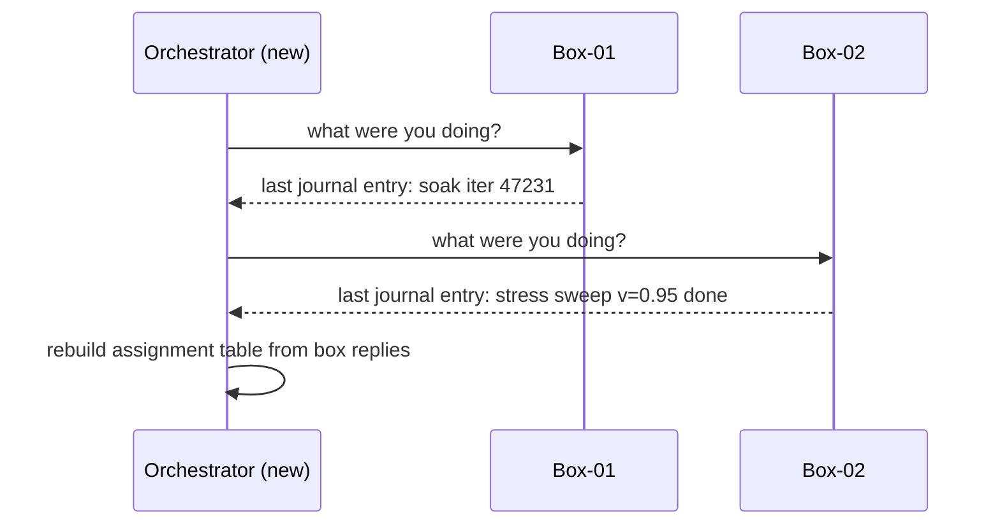

# Crash-only design for test rigs that reboot mid-run

*how to build a hardware test runner that survives power being yanked mid-job*

A tech walked down a row of boxes flipping breakers because the air handler had tripped and the room was climbing past 35C. Twenty boxes lost power in maybe eight seconds, no SIGTERM, just dark. When power came back, the harness on each box read a file, looked at where it had been, and kept going. Nobody reran anything. That is when the Candea and Fox paper ["Crash-Only Software"](https://www.usenix.org/conference/hotos-ix/crash-only-software) (HotOS IX, Lihue, Hawaii, May 2003) stopped being academic.

One distinction carries the whole essay. SIGTERM is a signal a process can catch: a chance to flush buffers and clean up before exiting. SIGKILL cannot be caught; the kernel just removes the process. A yanked power cable is worse than SIGKILL, because even the kernel does not run. So design for the most violent, uncatchable stop possible.

The thesis is simple: if your program has to handle crashes anyway (and it does, because hardware is hardware), then crash-recovery should be the *only* recovery path you *depend* on. Graceful shutdown is fine as a courtesy, but if any state your graceful path produces cannot be recovered by your crash path, you have a bug, not a feature.

There is one domain where crash-only design is not optional, it is the only thing that works: physical lab automation. If you run hardware regressions on bare-metal boxes, those machines are going to reboot. A lot. Because the test asked, the firmware hung, or someone pulled the wrong PDU outlet at 2am. The runner on each box needs to come back up and continue.

## The shape of the problem

Picture a lab full of 2U boxes (two rack units tall), each one a host CPU plus a few accelerator cards under test (later I call any device under test a "DUT," for Device Under Test). Each box also has a BMC, a Baseboard Management Controller: a small always-on chip that can reset or power-cycle the host even when the host OS is dead. That is "out-of-band control," a control path that does not go through the running OS. And in case the BMC itself wedges, each box is plugged into a PDU (Power Distribution Unit), a network-controlled power strip. A typical run on one box looks like:

1. Flash a candidate firmware image onto the cards
2. Power-cycle to load the new firmware
3. Run a smoke check (~5 minutes)
4. Run a soak test (~3 hours, hits memory, PCIe, thermals)
5. Run a stress matrix (~8 hours, sweeps voltage and clock)
6. Collect logs, decode RAS records, post a verdict

PCIe (PCI Express) is the high-speed bus that connects the host CPU to those accelerator cards. RAS stands for Reliability, Availability, Serviceability: the structured hardware-error logs a CPU or accelerator emits (corrected and uncorrected memory errors, bus faults, thermal events). Decoding them is how you tell a clean pass from a part that limped to the finish line, so they feed the verdict.

The clock on a single box is 12+ hours. At any given moment, several boxes are mid-reboot by design (the firmware load step, the stress steps that simulate brownouts, the watchdog tests). And a non-trivial number are mid-reboot by accident.

If you write this like a normal long-running job, where state lives in process memory and steps call each other via function returns, you will lose runs constantly. Every reboot costs a full restart of a 12-hour job. That math does not work.

## The seductive trap of graceful shutdown

The first instinct is to add cleanup. Wire up a SIGTERM handler. Flush the journal. Drain the queue. Mark the job as "paused" before going down. Then on the way back up, look for the "paused" flag and resume.

This is the wrong shape, for three reasons stacked on top of each other:

- The graceful path runs only sometimes. SIGTERM handlers do not fire on kernel panic, BMC hard reset, or a PDU yanking power. Those stops are uncatchable, so any state that only the SIGTERM handler produces is state you sometimes never get.
- The graceful path has its own bugs. Shutdown can race the operation that triggered it, and a half-flushed journal that neither code path knows how to read is worse than no journal.
- Two recovery paths means a rare ungraceful path nobody exercises until the room is on fire.

The crash-only answer: SIGTERM triggers exactly the same path as a crash. Drop everything that is not already durable, close anything cheap to close (a broker connection, a file handle that is already fsynced), and exit. If your system cannot survive a hard kill, fix the system; do not patch the shutdown.

## State has to be on disk before you need it

The non-negotiable rule for a crash-only runner: any state that needs to survive a reboot must be on durable storage before the operation that depends on it begins. Before, not after. The mechanism is usually `fsync` (the system call that forces a file's writes out of memory and onto the physical drive); the requirement is true durability, the bytes actually on stable media.

This is the opposite of how most code is written. Most code does the work, then records that the work happened. A crash-only box agent records the *intent* to do the work, then does it, then records completion. This is write-ahead logging applied to physical actions: the log record describing a change is made durable before the change's effects are. If you crash between intent and completion, on restart you see an intent with no completion, and you know to retry or roll forward.

The serialization order matters. Here is the simplest state machine for one step:

```
[idle] --write+fsync intent--> [intent_durable]
       --do the work-->        [executing]
       --write+fsync done-->   [done_durable]
```

Three states, two fsyncs. Each transition is gated by an fsync, which is the whole game. Anything between a write and its matching fsync lives in the page cache (the kernel's in-memory copy of recently written file data) and evaporates on power loss; I am collapsing the in-memory intermediates out of the diagram on purpose, so the fsync barriers are the only thing you see. Forget the fsync and every other reboot loses the last 30 seconds of progress. Looks like a hardware bug. It is not.

The actual append shape matters too, because "fsync the file" alone is a common bug. `fsync(fd)` flushes that file's data blocks and inode metadata. (An inode is the on-disk record holding a file's metadata: its size, permissions, and pointers to its data blocks.) But the directory entry that names the file and records its new size is a separate object in a separate buffer that `fsync(fd)` does not touch. So the data blocks can be on disk while the directory entry pointing at them is not, and after a crash the file is gone or truncated. You have to fsync the parent directory too. The minimum durable append is:

```python
import os, json

def journal_append(path, record):
    line = (json.dumps(record) + "\n").encode()
    # O_APPEND makes the write atomic with respect to other appenders:
    # the whole line lands as one unit, with no other appender's bytes
    # interleaved into it. fsync flushes file data + all inode metadata;
    # we still need a separate fsync on the parent directory so the
    # file's existence and size survive a crash.
    fd = os.open(path, os.O_WRONLY | os.O_APPEND | os.O_CREAT, 0o644)
    try:
        os.write(fd, line)
        os.fsync(fd)               # data + metadata of the file
    finally:
        os.close(fd)
    # fsync the directory so the file's existence and size survive.
    dfd = os.open(os.path.dirname(path), os.O_RDONLY)
    try:
        os.fsync(dfd)
    finally:
        os.close(dfd)
```

Two syscalls of actual durability cost (file fsync, dir fsync) per record. The dir fsync only matters on the append that creates or grows the file, but doing it every time is cheap and keeps the code one shape. If you are rewriting a state file rather than appending, the shape is write-temp + fsync(temp) + rename + fsync(dir); same idea, parent directory has to be sync'd or the rename can vanish.

The cost of those fsyncs bites you in hardware land, and it comes down to one feature: power-loss protection (PLP). An enterprise NVMe drive (NVMe, Non-Volatile Memory Express, is the fast interface modern solid-state drives use to talk to the CPU) with PLP has onboard capacitors that hold enough charge to flush its DRAM write cache to NAND if power drops. (DRAM is the fast volatile memory the drive uses as a staging cache; NAND is the slower flash that actually retains data without power.) Because the drive can promise that, it can acknowledge an fsync as soon as the data reaches its DRAM cache, which is fast. A consumer SSD without PLP has no such safety net, so to honor fsync it must push the data from DRAM cache through to NAND before acking. That extra hop is the latency cliff: on enterprise NVMe with PLP, fsync on a small append-only file typically lands in the tens-of-microseconds range; on a consumer SSD without PLP, the same call commonly takes several milliseconds. The contrast is the subject of Mark Callaghan's [Small Datum post on SSDs, PLP, and fsync latency](https://smalldatum.blogspot.com/2026/01/ssds-power-loss-protection-and-fsync.html). Worth measuring with `ioping -D`, which uses `O_DIRECT` to bypass the page cache and measure raw device latency (per the [ioping man page](https://manpages.ubuntu.com/manpages/xenial/man1/ioping.1.html)), on the actual lab hardware before you tune anything. One caveat: that number is a device floor. Your `journal_append` fsync goes through the filesystem (inode, directory entry, and the journaling that ext4 and xfs, the common Linux filesystems, do on top), so the real cost will be higher.

In practice I use a single append-only log file per box per run, something like:

```
/var/lib/harness/runs/{run_id}/{box_id}/journal.log
```

Each line is a JSON record with a monotonic sequence number, a phase name, a verb (`begin`, `end`, `checkpoint`), and a payload. The box agent appends, fsyncs, then acts. On restart, it reads the whole journal, replays into an in-memory state, and resumes from the last consistent point. Replay is last-write-wins: later records supersede earlier ones for the same record (identified by phase and verb), so `mark_done` cancels a prior `begin`. The journal is the source of truth; the in-memory state is a cache. To keep the file from growing without bound over a 12-hour run, the agent compacts on a clean phase boundary: write a fresh log seeded with one snapshot of the current replayed state, fsync, rename it over the old one, fsync the directory. Replay then only ever scans back to the last snapshot.

## Idempotence is not optional

Once you accept that any operation can be interrupted and retried, every operation has to be idempotent (running it twice has the same effect as running it once). This is harder than it sounds because the physical world is not idempotent. Flashing or power-cycling twice usually works. But posting results to a dashboard API twice produces duplicate rows, and decrementing a quota counter twice produces a wrong count; both need external dedupe to be replay-safe, not write-ahead logging alone.

The standard trick for making a network call safe to retry is a caller-supplied idempotency key: a unique token the client attaches so the server can recognize a repeat and process it only once. This turns at-least-once delivery into at-most-once effect. I wrote about the HTTP-layer version in [idempotency keys for deploy endpoints](/article/04-idempotency-keys-for-deploy-endpoints.html); read that for dedupe over a flaky network. The crash-only twist: the key has to outlive a yanked power cable, not just a dropped TCP connection. Allocate the key once, write it to the on-box journal, and fsync it before the network call ever happens. That way the same key survives a hard reset of the box that allocated it, and the receiver sees the same dedupe token on the retry from the recovered process.

```python
def post_verdict(box_id, phase, verdict):
    # Allocates on first call, fsyncs to the journal, returns the
    # same value on every subsequent call after a crash and resume.
    token = journal.get_or_create_token(box_id, phase, "post_verdict")
    dashboard.post(token=token, box=box_id, phase=phase, verdict=verdict)
    journal.mark_done(box_id, phase, "post_verdict")
```

The `get_or_create_token` call is the bit that matters. On first entry it allocates a new UUID (a Universally Unique Identifier, a random 128-bit value with effectively no chance of collision) and fsyncs it; on retry after a power-yank it reads the same UUID back off the journal during replay. There is still one race the client can never close on its own: the token is allocated and fsynced, the POST goes out, the server processes it, and then the ack is lost before it reaches the client. From the client side this looks like the request never arriving, so it must retry. Only the server knows whether it has seen this token before, so dedupe lives there. The dashboard treats the token as a primary key (the column whose value uniquely identifies a row, so a duplicate is rejected rather than inserted again), not a hint.

## Checkpoints that survive a yanked cable

The hard part of a multi-hour test is checkpointing during the test, not just between phases. If your soak test crashes at hour 2:45 of a 3-hour run, you want to resume from 2:45, not restart from zero.

For this to work, the soak test itself has to cooperate. It needs to:

1. Periodically write its progress to the journal (which iteration, which seed, which subtest)
2. Be designed so any iteration boundary is a valid resume point
3. Not hold critical state in DUT memory that disappears on power loss

Point 3 is the one people miss. If your test sets up some configuration on the device, runs a million iterations against it, and the device loses that configuration on every power blip, you must re-establish the configuration on every resume. So the resume logic has to know that configuration, which means it has to be in the journal too.

I usually model a test as a generator (a function that produces values one at a time and pauses in between, using `yield`, so it can hand back a checkpoint and then carry on from where it left off) that yields checkpoints:

```python
def soak_test(dut, journal):
    # The initializer is a lambda so it only runs when no prior
    # state exists on disk. After a crash, load_or_init reads the
    # last fsynced checkpoint and the lambda is never called, so
    # the seed stays pinned to whatever it was on the first run.
    state = journal.load_or_init(
        lambda: {"iter": 0, "seed": random_seed()}
    )
    rng = Random(state["seed"])
    # Re-establish DUT state from the journal, every time.
    # The seed in `state` is now guaranteed stable across resumes.
    dut.configure(memory_pattern=state["seed"])
    while state["iter"] < TOTAL_ITERS:
        run_one_iter(dut, rng, state["iter"])
        state["iter"] += 1
        if state["iter"] % 1000 == 0:
            journal.checkpoint(state)  # appends + fsyncs
```

The lambda matters, and the failure it prevents is sneaky: if you pass `random_seed()` directly, Python evaluates it at call time, so every entry into the function gets a fresh seed, and after a crash your resume silently changes the test inputs. The lambda defers that: `load_or_init` calls it once on a fresh start, persists the result, and on a resume ignores the lambda and returns the last checkpoint. The `dut.configure` call happens unconditionally, so the DUT is always in a known state. The loop picks up at the last checkpoint boundary. Worst case you lose 1000 iterations, which on a soak test is maybe 30 seconds.

The checkpoint cadence is a knob: too frequent and you spend more time fsyncing than testing; too rare and crashes cost too much. I usually aim for checkpoints every 30 to 60 seconds of real time. Time-based, not iteration-based, because iteration cost varies.

## The journal on the box is the source of truth

The orchestrator that schedules work also has to come up after a crash. I am deliberately not writing the reassign-stale-work code here: the heartbeat-reaper pattern (worker goes silent, scheduler reclaims the lease, work goes back in the queue) is well-trodden ground I cover in [job lifecycle as a finite state machine](/article/05-job-lifecycle-as-a-finite-state-machine.html) and [cancellation and cleanup in long-running workers](/article/10-cancellation-and-cleanup-in-long-running-workers.html). Read those for the software side. (A heartbeat is a periodic "still alive" ping a worker sends; a lease is a time-limited claim on a job that expires unless the worker keeps renewing it; the reaper is the part of the scheduler that collects timed-out leases and requeues the work.)

What is different in the hardware case is the source of truth. When the orchestrator restarts and wants to know what each box was doing, it does not trust its own memory of who it assigned what to. It asks each box, and the box answers from its on-disk journal:



The journal on the box is the system of record; the orchestrator's view is a cache. This inverts the usual orchestrator-knows-everything model and it is the only thing that survives the orchestrator itself being redeployed during a power-cycle of a third of the lab. The new instance just reads the world from the boxes; no graceful handoff. I have redeployed during a 2000-box-hour run and nothing flinched.

## Watchdogs all the way down

Crash-only design assumes things will crash. The corollary is that you need something to *notice* the crash and trigger recovery. Think of it as nested dead-man switches: each layer is a timer that fires unless someone keeps resetting it, and each wraps the layer below.

```
+------------------------------------+
| PDU watchdog (orchestrator)        |  last resort, kills outlet
+------------------------------------+
| BMC watchdog (out of band)         |  reboots host CPU
+------------------------------------+
| Kernel watchdog (hardware timer)   |  reboots on kernel hang
+------------------------------------+
| Harness watchdog (systemd)         |  restarts harness process
+------------------------------------+
| Test watchdog (heartbeat in test)  |  catches stuck test
+------------------------------------+
```

systemd is the Linux service manager that starts, stops, and restarts background services. The runner pets the systemd watchdog by calling `sd_notify("WATCHDOG=1")` (a small "I am still alive" ping to the service manager) at roughly half the `WatchdogSec` interval, the deadline you configure in the systemd unit. This is the standard userspace pattern documented in the [sd_notify man page](https://www.freedesktop.org/software/systemd/man/latest/sd_notify.html); miss the deadline and systemd kills the process and (with `Restart=on-watchdog`, the unit setting that restarts a service when its watchdog fires) brings it back. The kernel pets its hardware watchdog. The BMC has its own logic. At the top the PDU is the sledgehammer, a physical relay that kills the outlet when nothing else can be trusted. That layer is intentionally dumb: no scheduler, no leases, it just cuts power on a timeout.

Escalation is automatic. A cascade looks roughly like this in time, assuming a process that has stopped petting at t=0:

```
t=0s    harness stops calling sd_notify("WATCHDOG=1")
         |
         v  (~WatchdogSec, e.g. 10s)
t=10s   systemd: deadline missed -> SIGKILL harness, restart per Restart=on-watchdog
         |  if the runner comes back and resumes petting, cascade stops here
         v  (kernel softlockup / hardlockup threshold, often 20-60s)
t=~30s  kernel watchdog: no progress -> panic/reboot host CPU
         |  if BIOS comes back and host boots, cascade stops here
         v  (BMC stops hearing from host, often 1-3 min)
t=~3m   BMC: host stopped responding -> issue hard reset over IPMI/Redfish
         |  if reset clears the wedge, cascade stops here
         v  (PDU watchdog from orchestrator, often 5-10 min)
t=~10m  PDU: outlet has heard nothing -> cut power, wait, restore
```

A couple of those terms. A kernel softlockup is the CPU stuck spinning with interrupts on (a busy hang), a hardlockup is stuck with interrupts off (a deader hang); the kernel detects both. BIOS is the firmware that brings the host up far enough to load the operating system. IPMI and Redfish are the two standard protocols for talking to a BMC out-of-band, IPMI the older binary one, Redfish the newer HTTP/JSON one; "hard reset over IPMI/Redfish" just means the BMC is told to power-cycle the host CPU through one of them. The BMC line says "BMC stops hearing from host" because the BMC watches the host from outside: the host OS sends it a heartbeat, and when those stop, the BMC reaches in and resets the host. It does not run on the host or need the host OS alive, which is exactly why it can recover a host that the host itself cannot.

Each layer's timeout is measured independently, against that layer's own last contact, so the `t=` column is a worst-case combined trace, not a strict sequential timeline. The ordering still holds because what you tune is the timeout *durations*: you size each outer layer's timeout to be larger than the time the layer below takes to detect, fire, and recover. Exact numbers are knobs and depend on the hardware and the test.

The key property: every layer of recovery results in *the same state*, which is "the runner comes back up, reads journal, resumes." A soft restart and a hard PDU power-cycle look identical to the recovery logic. One code path.

## What you give up

Crash-only design is not free.

You give up the ability to do anything that genuinely cannot be retried. If a test physically damages a component (a destructive thermal test, say), you have to bake the "did we already do this?" check into the operation itself, and one box's journal alone cannot do it: the box that did the damage may be exactly the box that got reset, and on resume it cannot tell from its own log whether the heat ramp actually fired. So you need a second record that survives independently of any one box: a global, serial-keyed registry of spent parts.

Concretely, for a destructive overtemp test the order is: read the component's serial off the device, append a journal entry `{phase: "thermal_destruct", serial: "X9-44217", intent: "begin"}` and fsync, then **write the serial to the global consumed-parts table and wait for its durable ack before the heater ramps**. The global write happens before the irreversible act for the same reason the local intent does: if you crash after ramping but before recording globally, you would cook a second part on resume. So the consumed-parts table (kept by the orchestrator or a small service, with its own fsync discipline) is the gate, not an after-the-fact log. On resume, the box agent reads its own journal, sees `thermal_destruct begin` for `X9-44217` with no matching `end`, and looks it up in the consumed-parts table: present means the part is spent, so mark the phase done; absent means the ramp never started and retrying is safe. Two records, one rule: never start a destructive op until its serial is durably in the spent set.

You give up some performance to fsyncs. Every checkpoint costs a disk sync. On NVMe this is microseconds, on a tired SATA SSD (SATA is the older, slower drive interface that NVMe largely replaced) it can be milliseconds. For a test that does real work between checkpoints, this is rounding error. For a tight loop that wants to checkpoint every iteration, it is not. Pick your cadence accordingly.

You give up the cozy feeling of a clean shutdown. There is no "the system has finished its work and exited normally" message. The runner just stops being scheduled. The journal says everything is done. If you need a human-readable "we are done" signal, write it as the last journal entry and have a separate process notice it.

## The actual payoff

The payoff is that you stop caring about reboots. A box power-cycles, the runner comes back, the journal says "you were at iteration 47,231 of the soak test," and the test continues. An orchestrator redeploy ripples through the lab as a 30-second pause and then everything carries on.

After a building-wide UPS event (a UPS, or Uninterruptible Power Supply, is the battery bank that is supposed to carry the room through a power dip; when it fails, the room goes dark anyway), the room comes back without operator intervention. The graceful path was never load-bearing. The crash path is.
