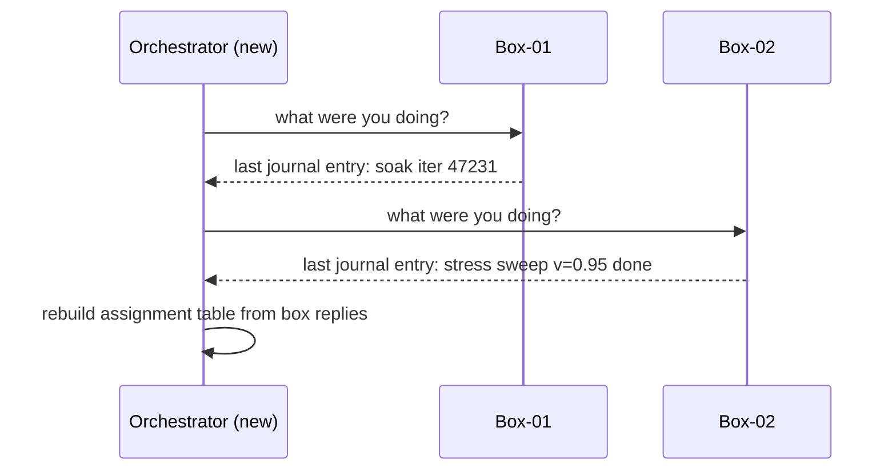

# Crash-only design for test rigs that reboot mid-run

*a power cable is an aggressive SIGKILL. Design the runner accordingly*

A tech walked down a row of boxes flipping breakers because the air handler had tripped and the room was climbing past 35C. Twenty boxes lost power in maybe eight seconds. No SIGTERM. No "please wait while we finish." Just dark. When power came back, the harness on each box read a file, looked at where it had been, and kept going. Nobody filed a ticket. Nobody reran anything. That is when the Candea and Fox paper ["Crash-Only Software"](https://www.usenix.org/conference/hotos-ix/crash-only-software) (HotOS IX, Lihue, Hawaii, May 2003) stopped being academic.

The thesis is almost rude in its simplicity: if your program has to handle crashes anyway (and it does, because hardware is hardware), then crash-recovery should be the *only* recovery path you *depend* on. Graceful shutdown is fine as a courtesy, but if any state your graceful path produces cannot be recovered by your crash path, you have a bug, not a feature.

This idea is unfashionable in normal application development, where everyone wants their PIDs to flush buffers and say goodbye. But there is one domain where crash-only design is not optional, it is the only thing that works: physical lab automation. If you run hardware regressions on bare-metal boxes, those machines are going to reboot. A lot. Sometimes because the test asked them to. Sometimes because the firmware hung. Sometimes because someone in the lab pulled the wrong PDU outlet at 2am. The runner on each box needs to come back up, figure out what was happening, and continue, without crying about it.

Here is how I build one. Names are invented; the patterns are not.

## The shape of the problem

Picture a lab full of 2U boxes, each one a host CPU plus a few accelerator cards under test, a BMC for out-of-band control, and a network-controlled power strip in case the BMC also wedges. A typical run on one box looks like:

1. Flash a candidate firmware image onto the cards
2. Power-cycle to load the new firmware
3. Run a smoke check (~5 minutes)
4. Run a soak test (~3 hours, hits memory, PCIe, thermals)
5. Run a stress matrix (~8 hours, sweeps voltage and clock)
6. Collect logs, decode RAS records, post a verdict

The clock on a single box is 12+ hours. At any given moment, several boxes are mid-reboot by design (the firmware load step, the stress steps that simulate brownouts, the watchdog tests). And a non-trivial number are mid-reboot by accident.

If you write this like a normal long-running job, where state lives in process memory and steps call each other via function returns, you will lose runs constantly. Every reboot, every wedge, every PDU click costs you a full restart of a 12-hour job. That math does not work.

## The seductive trap of graceful shutdown

The first instinct of every engineer who hits this problem is to add cleanup. Wire up a SIGTERM handler. Flush the journal. Drain the queue. Mark the job as "paused" before going down. Then on the way back up, look for the "paused" flag and resume.

This is the wrong shape, for three reasons stacked on top of each other:

- The graceful path runs only sometimes. SIGTERM handlers do not fire on kernel panic, BMC hard reset, or a PDU yanking power.
- The graceful path has its own bugs. Shutdown can race the operation that triggered it, and a half-flushed journal that neither code path knows how to read is worse than no journal.
- Two recovery paths means you have built the exact thing you were trying to avoid: a rare ungraceful path that nobody exercises until production is already on fire.

The crash-only answer: SIGTERM triggers exactly the same path as a crash. Drop everything that is not already durable, close anything cheap to close (a broker connection, a file handle that is already fsynced), and exit. If your system cannot survive a hard kill, fix the system; do not patch the shutdown.

## State lives on disk, or it does not exist

The non-negotiable rule for a crash-only runner: any state that needs to survive a reboot must be on durable storage *before* the operation that depends on it begins. Not after. Not eventually. Before.

This is the opposite of how most code is written. Most code does the work, then records that the work happened. A crash-only box agent records the *intent* to do the work, then does it, then records completion. The intent record is what lets you recover. If you crash between intent and completion, on restart you see an intent with no completion, and you know to either retry or roll forward.

The serialization order matters. Here is the simplest state machine for one step:

```
[idle] --write+fsync intent--> [intent_durable]
       --do the work-->        [executing]
       --write+fsync done-->   [done_durable]
```

Three states, two fsyncs. Each transition is gated by an fsync, which is the whole game. Anything between a write and its matching fsync lives in the page cache and evaporates on power loss; I am collapsing those in-memory intermediates out of the diagram on purpose, so the fsync barriers are the only thing you see. I have lost count of the runners where someone wrote a perfectly reasonable state machine and forgot the fsync, and every other reboot lost the last 30 seconds of progress. Felt like a hardware bug. Was not.

The actual append shape matters too, because "fsync the file" alone is a common bug. The file's data blocks can be on disk while the directory entry that points at them is not, and after a crash the file is gone or truncated. The minimum durable append is:

```python
import os, json

def journal_append(path, record):
    line = (json.dumps(record) + "\n").encode()
    # O_APPEND makes the write atomic w.r.t. other appenders.
    # fsync flushes file data + all inode metadata; we still need a
    # separate fsync on the parent directory so the file's existence
    # and size survive a crash.
    fd = os.open(path, os.O_WRONLY | os.O_APPEND | os.O_CREAT, 0o644)
    try:
        os.write(fd, line)
        os.fsync(fd)               # data + metadata of the file
    finally:
        os.close(fd)
    # fsync the directory so the file's existence and size survive.
    dfd = os.open(os.path.dirname(path), os.O_RDONLY)
    try:
        os.fsync(dfd)
    finally:
        os.close(dfd)
```

Two syscalls of actual durability cost (file fsync, dir fsync) per record. The dir fsync only matters on the first append that grows the file or creates it, but doing it every time is cheap insurance and keeps the code one shape. If you are rewriting a state file rather than appending, the shape is write-temp + fsync(temp) + rename + fsync(dir); same idea, parent directory has to be sync'd or the rename can vanish.

The cost of those fsyncs is the part that bites you in hardware land. On enterprise NVMe with power-loss protection, fsync on a small append-only file typically lands in the tens-of-microseconds range. On a consumer SSD without PLP, the same call commonly takes several milliseconds while data is pushed from DRAM cache to NAND. The consumer-vs-enterprise contrast is the subject of Mark Callaghan's [Small Datum post on SSDs, PLP, and fsync latency](https://smalldatum.blogspot.com/2026/01/ssds-power-loss-protection-and-fsync.html); two orders of magnitude is not unusual, and your checkpoint cadence assumptions stop holding when the drive changes. Worth measuring with `ioping -D`, which uses `O_DIRECT` to bypass the page cache and measure raw device latency (per the [ioping man page](https://manpages.ubuntu.com/manpages/xenial/man1/ioping.1.html)), on the actual lab hardware before you tune anything.

In practice I use a single append-only log file per box per run, something like:

```
/var/lib/harness/runs/{run_id}/{box_id}/journal.log
```

Each line is a JSON record with a monotonic sequence number, a phase name, a verb (`begin`, `end`, `checkpoint`), and a payload. The box agent appends, fsyncs, then acts. On restart, it reads the whole journal, replays into an in-memory state, and resumes from the last consistent point. The journal is the source of truth; the in-memory state is a cache.

## Idempotence is not optional

Once you accept that any operation can be interrupted and retried, every operation has to be safe to run more than once. This is harder than it sounds because the physical world is not idempotent. Flashing firmware twice usually works. Power-cycling twice usually works. But "post results to the dashboard API" twice produces duplicate rows. "Decrement a quota counter" twice produces a wrong count.

The standard at-most-once trick for network calls is a caller-supplied idempotency key; I wrote about the HTTP-layer version of that in [idempotency keys for deploy endpoints](/article/04-idempotency-keys-for-deploy-endpoints.html), and you should read that if dedupe over a flaky network is your problem. The crash-only twist here is that the key has to outlive a yanked power cable, not just a TCP reset. The key is allocated, written to the on-box journal, and fsynced *before* the network call ever happens. That way the same key survives a hard reset of the box that allocated it, and the receiver sees the same dedupe token on the retry from the recovered process.

```python
def post_verdict(box_id, phase, verdict):
    # Allocates on first call, fsyncs to the journal, returns the
    # same value on every subsequent call after a crash and resume.
    token = journal.get_or_create_token(box_id, phase, "post_verdict")
    dashboard.post(token=token, box=box_id, phase=phase, verdict=verdict)
    journal.mark_done(box_id, phase, "post_verdict")
```

The `get_or_create_token` call is the bit that matters. On first entry it allocates a new UUID and fsyncs it. On retry after a power-yank it reads the same UUID off disk. There is still one race the client cannot close: the token is allocated and fsynced, the network POST goes out, the server processes it, and the ACK is lost. The recovered process retries with the same token, so the deduplication has to happen server-side; the dashboard treats the token as a primary key, not as a hint. Trusting the client to not retry would be wrong, because in this design the client is required to retry.

## Checkpoints that survive a yanked cable

The hard part of a multi-hour test is checkpointing during the test, not just between phases. If your soak test crashes at hour 2:45 of a 3-hour run, you do not want to restart from zero. You want to resume from 2:45.

For this to work, the soak test itself has to cooperate. It needs to:

1. Periodically write its progress to the journal (which iteration, which seed, which subtest)
2. Be designed so any iteration boundary is a valid resume point
3. Not hold critical state in DUT memory that disappears on power loss

Point 3 is the one people miss. If your test sets up some configuration on the device, runs a million iterations against it, and the device loses that configuration on every power blip, you need to re-establish the configuration on every resume. Which means the resume logic has to know what configuration was set, which means *that* has to be in the journal too.

I usually model a test as a generator that yields checkpoints:

```python
def soak_test(dut, journal):
    # The initializer is a lambda so it only runs when no prior
    # state exists on disk. After a crash, load_or_init reads the
    # last fsynced checkpoint and the lambda is never called, so
    # the seed stays pinned to whatever it was on the first run.
    state = journal.load_or_init(
        lambda: {"iter": 0, "seed": random_seed()}
    )
    rng = Random(state["seed"])
    # Re-establish DUT state from the journal, every time.
    # The seed in `state` is now guaranteed stable across resumes.
    dut.configure(memory_pattern=state["seed"])
    while state["iter"] < TOTAL_ITERS:
        run_one_iter(dut, rng, state["iter"])
        state["iter"] += 1
        if state["iter"] % 1000 == 0:
            journal.checkpoint(state)  # appends + fsyncs
```

The lambda matters. If you pass `random_seed()` directly, Python evaluates it at call time and you get a fresh seed every time the function is entered, which means after a crash your "resume" silently changes the test inputs and any reproducibility you thought you had is gone. The lambda only fires when the journal is empty. On a fresh start, `load_or_init` calls it once and persists the result. On a resume after crash, it ignores the lambda and returns the last checkpoint. The `dut.configure` call happens unconditionally, so the DUT is always in a known state regardless of why we are here. The loop picks up at the last checkpoint boundary. Worst case you lose 1000 iterations of work, which on a soak test is maybe 30 seconds.

The checkpoint cadence is a knob: too frequent and you spend more time fsyncing than testing; too rare and crashes cost too much. I usually aim for checkpoints every 30 to 60 seconds of real time. Time-based, not iteration-based, because iteration cost varies.

## The journal on the box is the source of truth

The orchestrator that schedules work also has to come up after a crash. I am deliberately not going to write the reassign-stale-work code here, because the heartbeat-reaper pattern (worker goes silent, scheduler reclaims the lease, work goes back in the queue) is well-trodden ground and I cover it in [job lifecycle as a finite state machine](/article/05-job-lifecycle-as-a-finite-state-machine.html) and [cancellation and cleanup in long-running workers](/article/10-cancellation-and-cleanup-in-long-running-workers.html). Read those for the software side.

What is different in the hardware case is the source of truth. When the orchestrator restarts and wants to know what each box was doing, it does not trust its own memory of who it assigned what to. It asks each box, and the box answers from its on-disk journal:



The journal on the box is the system of record; the orchestrator's view is a cache. This inverts the usual orchestrator-knows-everything model and it is the only thing that survives the case where the orchestrator itself was redeployed during a power-cycle of a third of the lab. The new orchestrator instance just reads the world from the boxes. There is no "graceful handoff" between instances. Wonderfully boring to operate. I have redeployed during a 2000-box-hour run on a Friday afternoon, which is the highest compliment a system can earn.

## Watchdogs all the way down

Crash-only design assumes things will crash. The corollary is that you need something to *notice* the crash and trigger the recovery. On a test rig, this is a layered set of watchdogs:

```
+------------------------------------+
| PDU watchdog (orchestrator)        |  last resort, kills outlet
+------------------------------------+
| BMC watchdog (out of band)         |  reboots host CPU
+------------------------------------+
| Kernel watchdog (hardware timer)   |  reboots on kernel hang
+------------------------------------+
| Harness watchdog (systemd)         |  restarts harness process
+------------------------------------+
| Test watchdog (heartbeat in test)  |  catches stuck test
+------------------------------------+
```

Each layer assumes the layer above it might fail. The runner pets the systemd watchdog via `sd_notify("WATCHDOG=1")` at roughly half the `WatchdogSec` interval, which is the standard userspace pattern documented in the [sd_notify man page](https://www.freedesktop.org/software/systemd/man/latest/sd_notify.html); miss the deadline and systemd kills the process and (with `Restart=on-watchdog`) brings it back. The kernel pets its hardware watchdog. The BMC has its own logic. At the top of the stack the PDU is the sledgehammer, a physical relay that kills the outlet when nothing else can be trusted to. That layer is intentionally dumb. It does not run a scheduler, it does not reason about leases, it just cuts power on a timeout. Software-side stale-work reclaim (heartbeat thresholds, lease handoff, queue requeue) lives elsewhere and I would point you back at the job-lifecycle and cancellation posts for that; here I care about the layer where the answer to "is this box wedged" is solved with a relay and not with a state machine.

The whole point of the stack is that escalation is automatic. A cascade looks roughly like this in time, assuming a process that has stopped petting at t=0:

```
t=0s    harness stops calling sd_notify("WATCHDOG=1")
         |
         v  (~WatchdogSec, e.g. 10s)
t=10s   systemd: deadline missed -> SIGKILL harness, restart per Restart=on-watchdog
         |  if the runner comes back and resumes petting, cascade stops here
         v  (kernel softlockup / hardlockup threshold, often 20-60s)
t=~30s  kernel watchdog: no progress -> panic/reboot host CPU
         |  if BIOS comes back and host boots, cascade stops here
         v  (BMC heartbeat from host OS, often 1-3 min)
t=~3m   BMC: host stopped responding -> issue hard reset over IPMI/Redfish
         |  if reset clears the wedge, cascade stops here
         v  (PDU watchdog from orchestrator, often 5-10 min)
t=~10m  PDU: outlet has heard nothing -> cut power, wait, restore
```

Each layer's timeout is measured independently from the last contact at its layer, so the `t=` column is a worst-case combined trace, not a strict sequential timeline. The BMC's clock runs against its own last heartbeat from the host OS, not against the kernel watchdog's fire time; same for the PDU. Exact numbers are knobs and depend on the hardware and the test, but the shape is what matters: each timeout is comfortably larger than the recovery time of the layer below it, so the inner layer gets a real chance to fix things before the outer layer reaches for a bigger hammer.

The key property: every layer of recovery results in *the same state*, which is "the runner comes back up, reads journal, resumes." A soft restart of the runner process and a hard PDU power-cycle look identical from the perspective of the recovery logic. That is the whole point. One code path.

## What you give up

Crash-only design is not free. You give up some things, and it is worth being honest about them.

You give up the ability to do anything that genuinely cannot be retried. If a test physically damages a component (a destructive thermal test, say), you have to bake the "did we already do this?" check into the operation itself. Concretely, for a destructive overtemp test the order is: read the component's serial number off the device, append a journal entry `{phase: "thermal_destruct", serial: "X9-44217", intent: "begin"}` and fsync, then ramp the heater. On crash and resume, before doing anything, the box agent reads its own journal, sees `thermal_destruct begin` for serial `X9-44217` with no matching `end`, looks `X9-44217` up in a separate consumed-parts table (kept by the orchestrator or a small service, with its own fsync discipline), and if the serial is present it marks the phase done and moves on rather than cooking a second part. The journal is the local "I started," the consumed-parts table is the global "this serial is spent." Two records, one rule: never start a destructive op without writing intent first, never repeat one whose serial is already in the spent set.

You give up some performance to fsyncs. Every checkpoint costs a disk sync. On NVMe this is microseconds, on a tired SATA SSD it can be milliseconds. For a test that does real work between checkpoints, this is rounding error. For a tight loop that wants to checkpoint every iteration, it is not. Pick your cadence accordingly.

You give up the cozy feeling of a clean shutdown. There is no "the system has finished its work and exited normally" message. The runner just stops being scheduled. The journal says everything is done. If you need a human-readable "we are done" signal, write it as the last journal entry and have a separate process notice it.

## The actual payoff

The payoff is that you stop caring about reboots. A box power-cycles, the runner comes back, the journal says "you were at iteration 47,231 of the soak test," and the test continues. An orchestrator redeploy ripples through the lab as a 30-second pause and then everything carries on. A whole-lab power blip costs you the in-flight 30 seconds per box and nothing else.

After a building-wide UPS event, the room comes back without operator intervention. The graceful path was never load-bearing. The crash path is.
