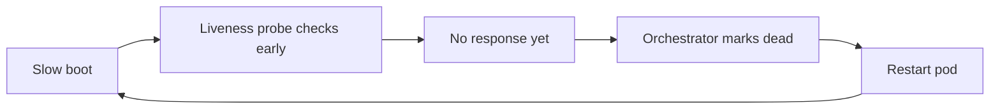
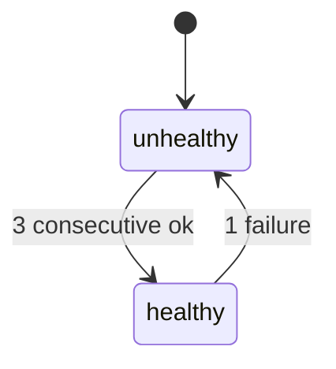

# Why your healthcheck endpoint lies

*why a healthcheck that returns success can still be wrong, and how to build one that means something*

A healthcheck endpoint is a URL your service exposes (often `/healthz`) that other systems hit to ask "are you working?" The answer is an HTTP status code: 200, which is the code a web server returns when a request worked, or some error code when it did not. Almost every `/healthz` I have inherited returned 200, even when the service behind it was broken.

That is usually not on purpose. Someone wrote `return Response(status=200)` on the first day and never touched it again. The service then grew a Postgres database, a Redis cache, a billing API it calls, and a feature flag service. The healthcheck still returned 200 as long as the process was running. In one case a load balancer kept a dead instance receiving traffic for six months: the instance still had an open network socket and `/healthz` was hardcoded to 200.

A few terms first. A load balancer (LB) sits in front of many copies of your service and decides which copy each request goes to. In Kubernetes, each running copy is a pod, and I will use "pod" that way. The whole set of running pods is the fleet. When the balancer is sending a pod traffic, that pod is "in rotation"; when it stops, the pod is "out of rotation."

The fleet in that incident sat behind a consistent-hash load balancer keyed on user ID. Consistent hashing maps each user ID to a fixed pod, so the same user lands on the same pod every time, including on retries. The balancer had no signal telling it the dead pod was dead, so it kept sending the same users to it. One dead pod in a roughly 40-pod fleet meant about 2.5% of users hashed to it and hit it again on every retry. That is what made it invisible: no spike to cross an alert threshold, no sudden burn against the error budget (the amount of failure you are allowed before you stop shipping new code), just a small steady loss of conversion (users who would have completed a purchase or signup but did not). Nobody caught it until a finance reconciliation, the check that recorded transactions match the money that actually moved, flagged the gap.

The rest of this post is how to build healthchecks that mean something without overloading the dependencies they check.

## The shallow check problem

The default healthcheck most frameworks ship with looks roughly like this:

```python
@app.route("/healthz")
def healthz():
    return {"status": "ok"}, 200
```

This checks whether the process is alive, dressed up as a check on whether the service is healthy. It answers one question: is the HTTP server accepting connections and able to build a response? That is the wrong level. A web service is a chain: accept a request, talk to a database, maybe hit a cache, call one or two downstream APIs (a downstream API is a service that yours calls to do its job), maybe write to a queue, return. The user cares about the whole chain. This check only verifies the front door.

So you can end up with every probe green, every log line saying "healthcheck ok," and the service dropping 80% of real traffic because the database connection pool is exhausted. (A connection pool is a fixed set of reusable database connections the service holds open; "exhausted" means every one is in use and new requests wait or fail.) Monitoring stays green because it is reading the same endpoint that is lying.

## The naive overcorrection

Once a team gets burned by a shallow check, the next move is usually the opposite mistake: a "deep" check that touches everything it depends on.

```python
@app.route("/healthz")
def healthz():
    db.execute("SELECT 1")
    cache.ping()
    requests.get("https://billing.example.com/healthz", timeout=2)
    requests.get("https://flags.example.com/healthz", timeout=2)
    return {"status": "ok"}, 200
```

(`SELECT 1` is a database query that does no real work; it is the cheapest way to confirm the database can answer at all.) This looks thorough, and it makes the system worse in three ways at once.

The load balancer probes this endpoint constantly. One probe every two seconds across fifty pods is twenty-five queries per second hitting your database, cache, and every downstream API, all from healthchecks and not from users. If a downstream API has a rate limit (a cap on how many requests it accepts per second before it starts rejecting them), your heartbeats eat into that cap. If the database has a connection limit, your healthcheck now competes with real traffic for connections.

The check is also coupled to everything it touches. If the billing API has a brief problem, every service that healthchecks against it goes unhealthy, the load balancer pulls every pod out of rotation, and your service is fully down because of a downstream system that maybe 10% of requests even use. The blast radius (how much breaks when one thing fails) is now your entire dependency graph.

And when one of these checks fails on and off, you get flapping: a pod going out of rotation, coming back, going out again, because the check keeps switching between pass and fail. Pods leave and rejoin the pool every thirty seconds, connection pools reset, cache warmups run again and again, latency spikes, retries cascade.

The naive deep check makes the system less reliable than the shallow one: it is now both a load amplifier and a failure amplifier.

## Liveness vs readiness vs startup

The fix starts with admitting that "healthcheck" is not one question. It is at least three, with different answers and different consumers.

**Liveness** answers: is this process so broken that the only fix is to kill it? A deadlocked event loop (the single thread that runs all the service's work, now stuck), an endless garbage collection pause (garbage collection, or GC, is the runtime reclaiming unused memory; a long pause freezes the process), or memory exhaustion so deep the handler cannot allocate a response. The action on failure is to restart the container, the isolated package the process runs inside. Liveness should be the shallowest check you have. If liveness checks dependencies, you build a feedback loop where a brief downstream problem restarts your whole fleet, the opposite of what you want.

**Readiness** answers: should the load balancer send this pod traffic right now? This is where dependency-awareness belongs. A failing readiness check pulls the pod out of rotation but does not restart it. The dangerous edge case is when readiness fails on every pod at once, leaving the balancer nothing to route to, and here implementations disagree. AWS ALB (Application Load Balancer) returns 503 (the HTTP error code a server returns when it cannot handle the request) once a target group, AWS's name for the set of instances behind one balancer, has zero healthy targets. Envoy's "panic threshold" does the opposite: when the healthy fraction drops below a set percentage (default 50%), it falls back to spreading traffic across all hosts, unready ones included. Know which behavior yours has before you let readiness depend on critical things.

**Startup** answers: has the slow boot finished? Large models loading into memory, JIT warmup (JIT, just-in-time compilation, is the runtime compiling hot code paths to machine code as the program runs; the first runs are slow until that finishes), cache pre-population, schema migrations (changes to the database structure applied at startup). Without a startup check these slow boots cause crashloops, where the orchestrator kills and restarts a pod over and over because it never becomes healthy. (The orchestrator is the system that starts, stops, and restarts containers; Kubernetes is one. A probe is a periodic healthcheck it runs on its own schedule.) The liveness probe starts checking before the process is ready, the orchestrator decides the pod is dead, and restarts a pod that was only booting:



The startup probe breaks the loop by gating the other two: it runs first, and the orchestrator turns off liveness and readiness until it succeeds. A concrete case: a 14-billion-parameter model takes 90 seconds to load from disk, the default liveness probe gives up after a few failures around the 30-second mark, and every deploy crashloops until someone adds a startup probe. Kubernetes added the startup probe as alpha in v1.16, beta in v1.18, and GA in v1.20 for this reason (https://kubernetes.io/docs/tasks/configure-pod-container/configure-liveness-readiness-startup-probes/).

These three are not interchangeable. Most outages I have seen blamed on "bad healthchecks" were one endpoint doing all three jobs.

## What each check should actually do

For a service with a database, cache, and two downstream APIs, this is the shape I reach for:

```python
@app.route("/livez")
def livez():
    # Process-internal only. No I/O.
    # If this returns non-200, the orchestrator restarts the pod.
    return {"status": "ok"}, 200


@app.route("/startupz")
def startupz():
    # Did the slow boot finish? Migrations applied, caches warmed,
    # config loaded. Set once at boot, then this is fast.
    if not boot_state.ready:
        return {"status": "starting", "reason": boot_state.reason}, 503
    return {"status": "ok"}, 200


@app.route("/readyz")
def readyz():
    # Should I receive traffic? Check things this pod actually needs
    # to serve a request. Use cached results, don't hammer dependencies.
    checks = dependency_cache.snapshot()
    failures = [name for name, ok in checks.items() if not ok and is_critical(name)]
    if failures:
        return {"status": "degraded", "failed": failures}, 503
    return {"status": "ok", "checks": checks}, 200
```

The key line is `dependency_cache.snapshot()`. The readiness handler does no I/O at all; it reads an in-memory snapshot and returns. The real dependency checks run off the request path, each on its own long-running background task and its own schedule, writing results into `dependency_cache`. So the probe rate and the actual dependency-check rate are two separate numbers: the readiness endpoint can be hit a thousand times a second while the database still sees only one `SELECT 1` every five seconds, because the query runs on the poller's `interval=5`, not on the probe rate. The cost of a deep check no longer grows with traffic or with the probe interval.

```python
async def poll_forever(name, check, interval, timeout):
    while True:
        try:
            await asyncio.wait_for(check(), timeout=timeout)
            dependency_cache.set(name, ok=True)
        except Exception as e:
            dependency_cache.set(name, ok=False, error=repr(e))
        await asyncio.sleep(interval)


async def start_pollers():
    # Each poller runs independently. No gather, no shared cadence.
    asyncio.create_task(poll_forever("db",      check_db,      interval=5,  timeout=2))
    asyncio.create_task(poll_forever("cache",   check_cache,   interval=5,  timeout=1))
    asyncio.create_task(poll_forever("billing", check_billing, interval=30, timeout=3))
    asyncio.create_task(poll_forever("flags",   check_flags,   interval=30, timeout=3))
```

The poller and the request handler both touch `dependency_cache` from different points in the event loop, so `set()` and `snapshot()` must be safe against a read that lands in the middle of a write. (asyncio is Python's single-threaded concurrency model: many tasks share one thread and hand off control only at `await` points.) In asyncio that safety is free as long as neither method awaits partway through: each runs start to finish before the loop schedules the other, so `snapshot()` never sees a half-written entry. On a threaded runtime you would put a lock around both.

```
  probe cadence (fast)                  poller cadence (slow, per-dep)

  LB ──▶ /readyz ──▶ dependency_cache         background poller ──▶ db
         (every 2s)   (in-memory read,        (every 5s)              │
                       <1ms, no I/O)                                  ▼
                            ▲                                  dependency_cache
                            │                                   (atomic write)
                            └──────── shared map ──────────────────────┘

  LB never touches db, cache, or downstream APIs directly.
  Probe rate and dependency-check rate are independent knobs.
```

(An atomic write is one that other readers either see completely or not at all, never half-done.)

## Critical vs non-critical dependencies

The next question is which dependencies count. The naive deep check treats every one as essential, which is why a single downstream failure takes the service offline. In reality they fall into tiers:

- **Hard dependencies.** The service is useless without them. For a checkout service, that is the primary database and the payment API. If these are down, readiness should fail.
- **Soft dependencies.** Used by some requests, but the service can serve a meaningful subset of traffic without them. The recommendation engine, the analytics sink, the search index. If these are down, the service should stay in rotation and return degraded responses for the affected endpoints.
- **Best-effort dependencies.** Telemetry, logging, feature flag refresh. The service might lose visibility but should never go unhealthy because of them.

Encoding this is mostly being explicit: a `dependency` decorator that tags each check with a tier, and a readiness handler that only fails on `Tier.HARD`:

```python
@dependency(name="db", tier=Tier.HARD, interval=5)
async def check_db():
    async with db.acquire() as conn:
        await conn.execute("SELECT 1")

@dependency(name="recommendations", tier=Tier.SOFT, interval=15)
async def check_recommendations():
    async with httpx.AsyncClient(timeout=2) as c:
        r = await c.get(f"{REC_HOST}/healthz")
        r.raise_for_status()
```

The readiness handler returns degraded-but-up when soft checks fail and routes the affected endpoints to a fallback, so the load balancer keeps sending traffic. Users see "recommendations unavailable" instead of a 503. The blast radius of a recommendation outage is now the recommendation feature, not the entire site.

## Fail-closed vs fail-open

Some dependencies are ones you genuinely cannot serve traffic without. Two terms up front: fail-closed means that when the dependency is unavailable you stop serving (deny the request); fail-open means you keep serving anyway, usually in a reduced mode. Auth is the usual fail-closed example, but only when you have to call the auth service to validate each request. Most modern setups verify JWTs locally instead.

A JWT (JSON Web Token, RFC 7519) is a signed token the client presents; the service checks the signature with the issuer's public key rather than calling back to the auth provider. Those keys live in a JWKS (JSON Web Key Set, RFC 7517), fetched once and cached. Validation then splits into two operations with different failure profiles. Per-request validation (verify the signature, check `exp`/`iss`/`aud`) runs locally against the cached JWKS and survives an auth-provider outage. Issuance and refresh, which hit the provider's token endpoint, break when the provider is down.

So failing open for a bounded window is reasonable here. But local validation still fails closed in a few cases: if the keys rotated mid-outage and the token's `kid` (the key-id field that selects which JWKS key to verify against) is no longer cached; if the JWKS cache expired and cannot be refreshed; or if your design needs per-request freshness, such as token introspection (asking the provider in real time whether a token is still valid, RFC 7662) or a revocation denylist (a list of tokens you have explicitly invalidated), both of which depend on the provider. The case is strongest when you have no local validation path at all: the provider is unreachable, you cannot prove the caller is who they claim to be, and letting requests through turns an availability problem into a security one. Then fail-closed is correct: readiness fails, traffic stops, and nobody gets unauthenticated access.

For most other dependencies, fail-open with a degraded mode is better. Cache down? Serve from origin, slower. Search index stale? Return a "results may be out of date" banner.

The rule I use: fail-closed when the result of failing open is worse than the outage; fail-open with a clear degraded path everywhere else. Write down which mode each dependency uses, because it is not obvious from the code.

## The probe-cost problem

Even with cached dependency checks, the probes themselves cost something. Kubernetes probe defaults are `periodSeconds=10`, `timeoutSeconds=1`, `failureThreshold=3`, `successThreshold=1`, `initialDelaySeconds=0` (https://kubernetes.io/docs/concepts/configuration/liveness-readiness-startup-probes/), which sounds harmless until you multiply it across a real fleet with tight intervals. The minimum supported `periodSeconds` is 1; sub-second probes are not allowed.

At small scale this is a rounding error. But the moment someone tightens the probe interval to get faster failover (switching to a healthy pod when one fails; 2-second probes show up in latency-sensitive setups), the math changes fast. The probe load on each pod is `probes_per_pod / periodSeconds`, and the fleet total scales linearly with pod count, as the table shows. (rps means requests per second.)

| Fleet size | periodSeconds | Probes per pod | Fleet probe rate | Notes |
|-----------:|--------------:|---------------:|-----------------:|-------|
|         50 |            10 | liveness + readiness | 10 rps | rounding error |
|        500 |            10 | liveness + readiness | 100 rps | still fine |
|        500 |             2 | liveness + readiness | 500 rps | noticeable log volume |
|       2000 |             2 | liveness + readiness | 2000 rps | before a single user shows up |
|       2000 |             2 | startup only (during boot window) | 1000 rps | Kubernetes disables L/R until startup succeeds |

The fourth row is the costly one: 2000 pods with both probes at 2-second intervals is 2000 requests per second of healthcheck traffic before a single user shows up. That floods your logs, your traces (records of a single request's path through the system), and your latency histograms (the distributions you use to see how response times spread), and spends a real chunk of every pod's CPU answering probes.

Two small fixes help:

1. **Do not log healthcheck requests.** Most logging middleware (code that runs on every request, before and after the handler) emits a structured log line for every `/livez` hit. Skip them at the middleware level so real requests are not buried in heartbeat noise.
2. **Do not trace healthcheck requests.** Tracing usually samples only a fraction of requests to keep the cost down; healthchecks spend that sampling budget on traffic nobody cares about and make every dashboard noisier.

```python
@app.middleware("http")
async def skip_healthcheck_logging(request, call_next):
    if request.url.path in ("/livez", "/readyz", "/startupz"):
        request.state.skip_logging = True
        request.state.skip_tracing = True
    return await call_next(request)
```

## The failure modes healthchecks specifically get wrong

Healthcheck handlers have their own failure modes that generic "test the failure path" advice does not cover. Two show up everywhere.

The first is the slow case. The dependency is not down, it is just taking 30 seconds to answer. A check with no timeout, or a timeout longer than the probe interval, will pile probes on top of each other. Coroutines (the lightweight tasks asyncio schedules on its one thread) stack up, connection pools drain, the process runs out of memory and gets killed (an OOM, out of memory), and now the healthcheck is the outage. Give every check a timeout strictly shorter than the poller interval, and make hitting that timeout flip the cached state to unhealthy, not leave the old value stuck.

The second is the flapping case. A dependency goes up and down every thirty seconds. Without hysteresis, readiness toggles in lockstep: pod out of rotation, pod back in, out, back in. Hysteresis is a term from control theory: put a deliberate gap between the threshold to leave a state and the threshold to re-enter it, so the system does not chatter across a single boundary. Each flap resets connection pools, thrashes cache warmups, and gives downstream services a burst of reconnects. Add a small rule: a pod must be healthy for N consecutive polls before flipping back to ready, even two or three samples. It costs a few seconds of extra downtime on recovery and stops the fleet from flooding the recovering dependency with reconnects all at once, a Distributed Denial of Service (DDoS) the fleet does to itself.



```python
class Hysteresis:
    def __init__(self, healthy_threshold=3, unhealthy_threshold=1):
        self.healthy_threshold = healthy_threshold
        self.unhealthy_threshold = unhealthy_threshold
        self.consecutive_healthy = 0
        self.consecutive_unhealthy = 0
        self.state = "unhealthy"  # start closed; require N healthy samples to enter rotation

    def observe(self, ok: bool) -> str:
        if ok:
            self.consecutive_healthy += 1
            self.consecutive_unhealthy = 0
            if self.state == "unhealthy" and self.consecutive_healthy >= self.healthy_threshold:
                self.state = "healthy"
        else:
            self.consecutive_unhealthy += 1
            self.consecutive_healthy = 0
            if self.state == "healthy" and self.consecutive_unhealthy >= self.unhealthy_threshold:
                self.state = "unhealthy"
        return self.state
```

Wire this into the poller: feed each result through `observe()` and write the returned state into `dependency_cache` instead of the raw `ok` flag. The asymmetry in the defaults is deliberate. Fail fast, recover slow: a single bad sample (`unhealthy_threshold=1`) takes the pod out immediately, and three good samples are required to bring it back, so you pull a misbehaving pod quickly and only let it back when you have evidence it stayed fixed. The one knob worth tuning is `unhealthy_threshold`: raise it to 2 if a single transient failure pulls pods out too eagerly, but keep it well below `healthy_threshold`.

A third one worth a sentence: orchestrators sometimes probe `/readyz` and `/livez` over different network paths (through a sidecar proxy versus from the kubelet on the node), and a check that passes over one can fail over the other. (A sidecar is a helper process running alongside the main one in the same pod; the kubelet is the Kubernetes agent on each node that runs and probes the pods on that node.) A common trap is mutual TLS (mTLS, where both sides present certificates) terminated at the sidecar: a probe through the sidecar gets a clean TLS handshake and sees 200, while the kubelet hitting the pod IP directly bypasses the sidecar, fails the handshake, and marks the pod unready. Probe over both paths before trusting the result.

These failure modes only surface when you break things on purpose. Test your healthcheck under fault injection, deliberately breaking a dependency to see what the check does, so you find out before the next outage instead of during it.
