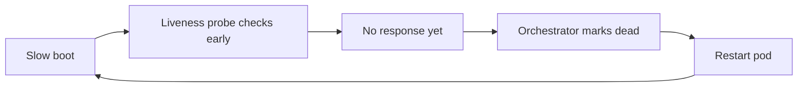
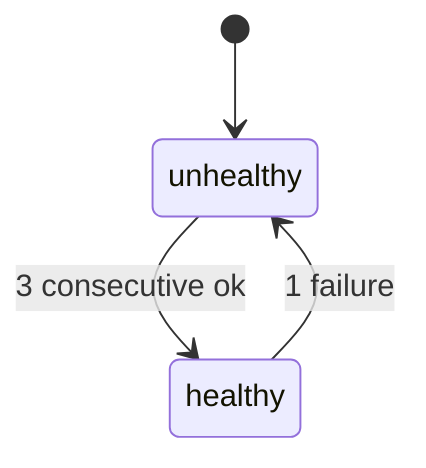

# Why your healthcheck endpoint lies

*a 200 OK is cheap. So is lying*

Every `/healthz` endpoint I have inherited returned 200. Most were lying.

The lie was rarely malicious; it was usually `return Response(status=200)` wired up on day one and never touched again. The service it claimed to represent had since grown a Postgres dependency, a Redis cache, a downstream billing API, and a feature flag service. The healthcheck still returned 200 if the process was breathing. The most expensive version of this I ever watched in the wild: a load balancer kept a dead pod in rotation for six months because the pod's TCP listener was up and `/healthz` was hardcoded to 200.

The fleet sat behind a consistent-hash load balancer keyed on user ID. Consistent hashing maps each user ID to a fixed pod, so the same user lands on the same pod every time, including on retries. The balancer had no signal to exclude the dead pod, so it kept pinning the same users to it. One dead pod in a roughly 40-pod fleet meant about 2.5% of users hashed to it, hit it again on every retry, and saw a flat, uniform failure rate while everyone else saw a perfect 200. That is exactly what made it invisible: no spike to cross an alert threshold, no burst against the error budget (the allowed amount of failure before you stop shipping), just a steady low-grade drag on conversion. Nobody noticed until a finance reconciliation flagged the gap.

This post is about why that happens, and how to build healthchecks that mean something without melting the dependencies they're supposed to be checking.

## The shallow check problem

The default healthcheck most frameworks ship with looks roughly like this:

```python
@app.route("/healthz")
def healthz():
    return {"status": "ok"}, 200
```

This is a process liveness check dressed up as a service health check. It answers exactly one question: is the HTTP server accepting connections and able to allocate a response?

It is dangerous because it sits at the wrong level. A modern web service is a chain: accept a request, talk to a database, maybe hit a cache, call one or two downstream APIs, possibly write to a queue, return. The user only cares about the chain. The shallow check only verifies the front door.

So you end up in the worst kind of outage: every probe is green, every log line says "healthcheck ok", and the actual service is silently dropping 80% of real traffic because the database connection pool is exhausted. Monitoring stays green because monitoring is looking at the same lying endpoint.

## The naive overcorrection

Once a team gets burned by a shallow check, the next mistake is usually the opposite. They write a "deep" check that touches everything:

```python
@app.route("/healthz")
def healthz():
    db.execute("SELECT 1")
    cache.ping()
    requests.get("https://billing.example.com/healthz", timeout=2)
    requests.get("https://flags.example.com/healthz", timeout=2)
    return {"status": "ok"}, 200
```

This feels rigorous. It is a footgun. Three things go wrong, often at the same time.

First, the load balancer probes this endpoint constantly. One probe every two seconds across fifty pods is twenty-five queries per second to your database, cache, and every downstream API, generated entirely by healthchecks. If the downstream API has a rate limit, you've just spent it on heartbeats. If the database has a connection limit, your healthcheck now competes with real traffic for slots.

Second, this check is transitively coupled: if the billing API has a hiccup, every service that healthchecks against it goes unhealthy, the load balancer pulls every pod out of rotation, and the service is now completely down because of an outage in a downstream system that maybe only 10% of requests actually use. The blast radius of any failure is now the entire dependency graph.

Third, when one of these checks fails intermittently, you'll get flapping. Pods leaving and rejoining the pool every thirty seconds. Connection pools resetting. Cache warmups happening over and over. Latency spikes. Cascading retries.

The naive deep check makes your system less reliable than the shallow one, because now your healthcheck is a load amplifier and a failure amplifier at the same time.

## Liveness vs readiness vs startup

The fix starts with admitting that "healthcheck" is not one question. It's at least three, with different answers and different consumers.

**Liveness** answers: is this process so broken that the only fix is to kill it? Deadlocked event loop, stuck in an infinite GC pause, or so far into memory exhaustion that the handler can no longer allocate a response. The action on failure is to restart the container. Liveness should be the shallowest check you have. If liveness checks dependencies, you create a feedback loop where a downstream blip restarts your entire fleet, which is exactly the wrong response.

**Readiness** answers: should the load balancer send this instance traffic right now? This is where dependency-awareness lives. A failing readiness check pulls the pod out of rotation but does not restart it. The dangerous edge case is when readiness fails across all pods, leaving the LB nothing to route to, and implementations diverge. AWS ALB returns 503 once a target group has zero healthy targets; Envoy's "panic threshold" does the opposite, falling back to load-balancing across all hosts including the unready ones when the healthy fraction drops below a configured percentage (default 50%). Know which behavior yours has before you trust readiness with critical dependencies.

**Startup** answers: has the slow boot finished? Large models loading into memory, JIT warmup, cache pre-population, schema migrations. Without a startup probe these slow boots cause crashloops, because the liveness probe starts checking before the process is ready and the orchestrator restarts a pod that was only booting:



The startup probe breaks the loop by gating the other two: it runs first, and the orchestrator disables liveness and readiness until it succeeds. Concrete version: a 14B-parameter model takes 90 seconds to load from disk; the default liveness probe gives up after a few failures around the 30-second mark; every deploy crashloops until someone adds a startup probe. Kubernetes added the startup probe as alpha in v1.16, beta in v1.18, GA in v1.20 for exactly this reason (https://kubernetes.io/docs/tasks/configure-pod-container/configure-liveness-readiness-startup-probes/).

These three are not interchangeable. Most outages I've seen from "bad healthchecks" are actually cases where one endpoint was being used for all three jobs.

## What each check should actually do

Concretely, for a typical web service with a database, cache, and two downstream APIs, here's the shape I reach for:

```python
@app.route("/livez")
def livez():
    # Process-internal only. No I/O.
    # If this returns non-200, the orchestrator restarts the pod.
    return {"status": "ok"}, 200


@app.route("/startupz")
def startupz():
    # Did the slow boot finish? Migrations applied, caches warmed,
    # config loaded. Set once at boot, then this is fast.
    if not boot_state.ready:
        return {"status": "starting", "reason": boot_state.reason}, 503
    return {"status": "ok"}, 200


@app.route("/readyz")
def readyz():
    # Should I receive traffic? Check things this pod actually needs
    # to serve a request. Use cached results, don't hammer dependencies.
    checks = dependency_cache.snapshot()
    failures = [name for name, ok in checks.items() if not ok and is_critical(name)]
    if failures:
        return {"status": "degraded", "failed": failures}, 503
    return {"status": "ok", "checks": checks}, 200
```

The crux is that `dependency_cache.snapshot()` call: the readiness handler does no I/O at all. It reads an in-memory snapshot and returns. The real dependency checks happen off the request path, each on its own long-running poller task and its own cadence, writing results into `dependency_cache`. So the load balancer's probe rate and the actual dependency check rate are two completely separate numbers: your readiness endpoint can be called a thousand times a second while the database still only sees one `SELECT 1` every five seconds, because the query is driven by the poller's `interval=5`, not the probe rate. The cost of a deep check no longer scales with traffic, or with the orchestrator's probe interval.

```python
async def poll_forever(name, check, interval, timeout):
    while True:
        try:
            await asyncio.wait_for(check(), timeout=timeout)
            dependency_cache.set(name, ok=True)
        except Exception as e:
            dependency_cache.set(name, ok=False, error=repr(e))
        await asyncio.sleep(interval)


async def start_pollers():
    # Each poller runs independently. No gather, no shared cadence.
    asyncio.create_task(poll_forever("db",      check_db,      interval=5,  timeout=2))
    asyncio.create_task(poll_forever("cache",   check_cache,   interval=5,  timeout=1))
    asyncio.create_task(poll_forever("billing", check_billing, interval=30, timeout=3))
    asyncio.create_task(poll_forever("flags",   check_flags,   interval=30, timeout=3))
```

The poller and the request handler touch `dependency_cache` from different points in the event loop, so `set()` and `snapshot()` must be safe against a read landing mid-write. In single-threaded asyncio that comes for free as long as neither method awaits partway through: each runs to completion before the loop schedules the other, so `snapshot()` always sees a fully written entry, never a torn one. On a threaded runtime you would put a lock around both.

```
  probe cadence (fast)                  poller cadence (slow, per-dep)

  LB ──▶ /readyz ──▶ dependency_cache         background poller ──▶ db
         (every 2s)   (in-memory read,        (every 5s)              │
                       <1ms, no I/O)                                  ▼
                            ▲                                  dependency_cache
                            │                                   (atomic write)
                            └──────── shared map ──────────────────────┘

  LB never touches db, cache, or downstream APIs directly.
  Probe rate and dependency-check rate are independent knobs.
```

## Critical vs non-critical dependencies

The next question is which dependencies count. The naive deep check treats every dependency as load-bearing, which is why one downstream burp takes the whole service offline. In reality, dependencies fall into tiers:

- **Hard dependencies.** The service is useless without them. For a checkout service, that's usually the primary database and the payment API. If these are down, readiness should fail.
- **Soft dependencies.** Used by some requests, but the service can serve a meaningful subset of traffic without them. The recommendation engine, the analytics sink, the search index. If these are down, the service should stay in rotation and return degraded responses for the affected endpoints.
- **Best-effort dependencies.** Telemetry, logging, feature flag refresh. The service might lose visibility but should never go unhealthy because of them.

Encoding this is mostly being explicit. A `dependency` decorator that tags each check with a tier, and a readiness handler that only fails on `Tier.HARD`:

```python
@dependency(name="db", tier=Tier.HARD, interval=5)
async def check_db():
    async with db.acquire() as conn:
        await conn.execute("SELECT 1")

@dependency(name="recommendations", tier=Tier.SOFT, interval=15)
async def check_recommendations():
    async with httpx.AsyncClient(timeout=2) as c:
        r = await c.get(f"{REC_HOST}/healthz")
        r.raise_for_status()
```

The readiness handler returns degraded-but-up when soft checks fail, and routes the affected endpoints to a fallback. The load balancer keeps sending traffic. Users hitting the fallback see "recommendations unavailable" instead of a 503. The blast radius of a recommendation outage is now the recommendation feature, not the entire site.

## Fail-closed vs fail-open

There is a class of dependency where you genuinely cannot serve traffic without it. Auth is the canonical example, with one caveat: this only applies when you have to call the auth service to validate each request. Most modern setups verify JWTs locally instead. A JWT (JSON Web Token, RFC 7519) is a signed token the client presents; the service checks the signature with the issuer's public key rather than phoning home. Those keys live in a JWKS (JSON Web Key Set, RFC 7517), fetched once and cached. So validation splits into two operations with different failure profiles: per-request validation (verify the signature, check `exp`/`iss`/`aud`) runs locally against the cached JWKS and survives an auth-provider outage, while issuance and refresh, which hit the provider's token endpoint, break during a blip.

So fail-open for a bounded window is reasonable here. But local validation still fails closed if the keys rotated mid-outage and the token's `kid` (the key-id field selecting which JWKS key to verify against) is no longer cached, if the JWKS cache expired and cannot be refreshed, or if your design needs per-request freshness such as token introspection (RFC 7662) or a revocation denylist, which are inherently provider-dependent. The fail-closed argument bites hardest when you have no local validation path at all: the auth provider is unreachable, you cannot prove the caller is who they say they are, and letting requests through would turn an availability incident into a security incident. There, fail-closed is correct: readiness fails, traffic stops, customers see an outage, and nobody gets unauthenticated access.

For most other dependencies, fail-open with a degraded mode is better. Cache down? Serve from origin, slower. Recommendation engine down? Show the popular-items fallback. Search index stale? Return a banner saying "results may be out of date."

The rule of thumb I use: fail-closed when the failure mode of fail-open is worse than the outage; fail-open with a clear degraded path everywhere else. And write down which mode each dependency uses, because the next person on call will not figure it out from the code.

## The probe-cost problem

Even with cached dependency checks, the probes themselves cost something. Kubernetes probe defaults are `periodSeconds=10`, `timeoutSeconds=1`, `failureThreshold=3`, `successThreshold=1`, `initialDelaySeconds=0` (https://kubernetes.io/docs/concepts/configuration/liveness-readiness-startup-probes/), which sounds harmless until you multiply across a real fleet with aggressive intervals. The minimum supported `periodSeconds` is 1; sub-second probes are not allowed.

At small scale this is a rounding error. But the moment someone tightens the probe interval to chase faster failover (2-second probes show up in latency-sensitive setups), the math changes fast. The probe-traffic load on each pod is `probes_per_pod / periodSeconds`, and the fleet total scales linearly with pod count. The table below works it out:

| Fleet size | periodSeconds | Probes per pod | Fleet probe rate | Notes |
|-----------:|--------------:|---------------:|-----------------:|-------|
|         50 |            10 | liveness + readiness | 10 rps | rounding error |
|        500 |            10 | liveness + readiness | 100 rps | still fine |
|        500 |             2 | liveness + readiness | 500 rps | logs start to drown |
|       2000 |             2 | liveness + readiness | 2000 rps | before a single user shows up |
|       2000 |             2 | startup only (during boot window) | 1000 rps | Kubernetes disables L/R until startup succeeds |

That fourth row is the one that hurts: 2000 pods with both probes at 2-second intervals is 2000 requests per second of pure healthcheck traffic before a single user shows up, drowning your logs, traces, and latency histograms, and spending a non-trivial chunk of every pod's CPU answering probes. If your readiness handler does any real work (even a cache read with JSON serialization), it adds up.

Two small fixes help a lot:

1. **Don't log healthcheck requests.** Most logging middleware will happily emit a structured log line for every `/livez` hit. Skip them at the middleware level, and the real requests stop drowning in heartbeat noise.
2. **Don't trace healthcheck requests.** Same reason. They sample your trace budget away from real traffic and make every dashboard noisier.

```python
@app.middleware("http")
async def skip_healthcheck_logging(request, call_next):
    if request.url.path in ("/livez", "/readyz", "/startupz"):
        request.state.skip_logging = True
        request.state.skip_tracing = True
    return await call_next(request)
```

## The failure modes healthchecks specifically get wrong

Healthcheck handlers have their own peculiar failure modes that generic "test the failure path" advice doesn't cover. Two in particular show up everywhere:

**The slow-and-sad case.** The dependency isn't down, it's just taking 30 seconds to answer. A naive check with no timeout, or a timeout longer than the probe interval, will pile probes on top of each other. Coroutines stack up, connection pools drain, the process OOMs, and now the healthcheck itself is the outage. Verify that every check has a timeout strictly shorter than the poller interval, and that hitting the timeout actually flips the cached state to unhealthy rather than leaving the previous value stuck.

**The flapping case.** A dependency goes up and down every thirty seconds. Without hysteresis, readiness toggles in lockstep: pod out of rotation, pod back in, out, back in. Hysteresis is a term from control theory: put a deliberate gap between the threshold to leave a state and the threshold to re-enter it, so the system does not chatter across a single boundary. Each flap resets connection pools, thrashes cache warmups, and gives downstream services a burst of reconnects. Add a small "must be healthy for N consecutive polls before flipping back to ready" rule, even just two or three samples. It costs a few seconds of extra downtime on recovery and saves you from the worst kind of self-inflicted DDoS.



```python
class Hysteresis:
    def __init__(self, healthy_threshold=3, unhealthy_threshold=1):
        self.healthy_threshold = healthy_threshold
        self.unhealthy_threshold = unhealthy_threshold
        self.consecutive_healthy = 0
        self.consecutive_unhealthy = 0
        self.state = "unhealthy"  # start closed; require N healthy samples to enter rotation

    def observe(self, ok: bool) -> str:
        if ok:
            self.consecutive_healthy += 1
            self.consecutive_unhealthy = 0
            if self.state == "unhealthy" and self.consecutive_healthy >= self.healthy_threshold:
                self.state = "healthy"
        else:
            self.consecutive_unhealthy += 1
            self.consecutive_healthy = 0
            if self.state == "healthy" and self.consecutive_unhealthy >= self.unhealthy_threshold:
                self.state = "unhealthy"
        return self.state
```

Wire this into the poller: feed each result through `observe()` and write the returned state into `dependency_cache` instead of the raw `ok` flag. The asymmetry in the defaults is the whole point. Fail fast, recover slow: a single bad sample (`unhealthy_threshold=1`) takes the pod out immediately, and three good samples are required to bring it back. That matches what you want, which is to pull a misbehaving pod quickly and only let it rejoin when you have evidence it stayed fixed. The one knob worth tuning per deployment is `unhealthy_threshold`: raise it to 2 if a single transient blip yanks pods out too eagerly, but keep it well below `healthy_threshold` so the fail-fast/recover-slow shape holds.

A third one worth a sentence: orchestrators sometimes probe `/readyz` and `/livez` from different network paths (a sidecar proxy vs the node-local kubelet), and a check that passes from one path can fail from the other. A common trap is mTLS terminated at the sidecar: a probe routed through the sidecar gets a clean TLS handshake and sees 200, while the kubelet hitting the pod IP directly bypasses the sidecar, fails the handshake, and marks the pod unready. Probe from both before you trust the result.

These failure modes only surface when you break things deliberately. Verify your healthcheck under fault injection, or the dashboard will read green during the next outage.
