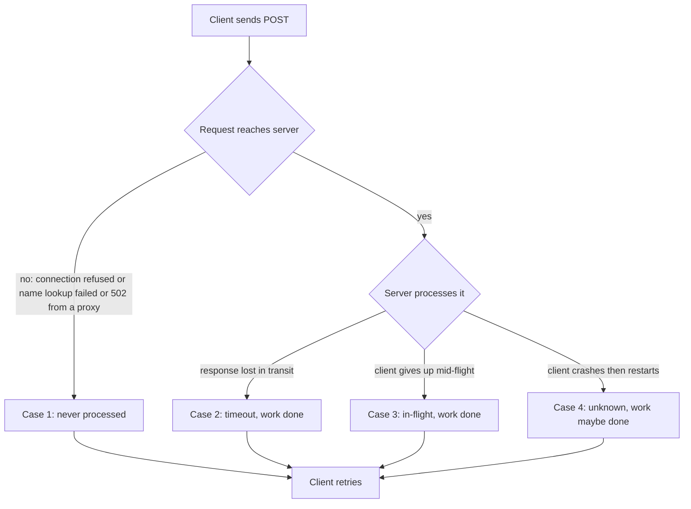

# Idempotency keys for deploy and provisioning endpoints

*how to make retries on infrastructure APIs safe, the way payment APIs already do*

Pick any mature payments client library (the prebuilt code a vendor ships so you do not write the HTTP calls by hand; people call it an SDK, short for software development kit) and you find the same pattern. Every request that changes something on the server takes a header called `Idempotency-Key`. The server stores the response under that header for a window of time, and a repeated request within that window gets the original response back instead of charging again.

Two terms. A request that changes server state is a *mutating request*; a `GET` that only reads is not. *Idempotent* means safe to run more than once without changing the outcome: once or five times, the result is the same.

This is well-trodden ground: blog posts, published specifications (an RFC is a "Request for Comments," the document format the internet community uses to write down how a protocol works), and an in-progress effort at the IETF (the Internet Engineering Task Force, the body that standardizes internet protocols) to register the header officially. That draft is named `draft-ietf-httpapi-idempotency-key-header`, just the filename of a work-in-progress proposal, not a magic string. This post is about the network-facing version: the HTTP header, the per-key fingerprint, the response cache, and the lineage from Stripe. (There is a related on-disk version that writes a per-operation token to a journal before doing the work; same idea, its own post.)

Now look at the deploy endpoint on whatever internal API creates, configures, or tears down your machines. That surface is usually the *control plane*: the part that manages resources, as opposed to the *data plane* that serves traffic once a resource exists. Or the provisioning API for your test fleet, or the firmware flash endpoint on the BMC (the baseboard management controller, the always-on chip that lets you power, monitor, and reflash a server even when its main operating system is down). Most of these endpoints offer no retry safety: you send a `POST`, poll a status URL, and if the network drops a packet at the wrong moment you are guessing about what happened.

The consequences here are usually worse than on a payments endpoint. Double-charging a card costs a chargeback. Double-flashing firmware mid-boot can render the machine permanently unbootable ("bricks the box"): the second flash overwrites a half-written image and a person has to visit the rack. Double-provisioning a worker leaves two machines fighting over one hostname, or leaks a lease (a time-bounded claim on a resource) that ties up capacity for a week.

## The shape of the problem

A fictional service `leasebroker` hands out worker nodes from a pool. A client calls:

```
POST /v1/workers
{
  "image": "worker-base:2025.11",
  "cpu": 16,
  "memory_gb": 64,
  "labels": {"team": "ml-eval", "purpose": "bench"}
}
```

`leasebroker` allocates a node, writes a lease to its database, calls the hypervisor (the software that creates and runs virtual machines) to boot the image, and returns:

```
201 Created
Location: /v1/workers/wkr-7Q2K9
{
  "id": "wkr-7Q2K9",
  "state": "booting",
  ...
}
```

The status codes that follow: `2xx` means success, `4xx` means the client's request was wrong, `5xx` means the server failed.

Four failure modes produce a retry, and from the client's side they look identical: in cases 2, 3, and 4 the server already did the work, in case 1 it did not.



Without idempotency, your fleet grows a phantom worker (a real, billed machine no client knows it asked for) every time a flaky link causes a retry, and you do not notice until the bill arrives.

## A workable key scheme

The Stripe-style contract is the right starting point. Keep the format plain:

```
POST /v1/workers
Idempotency-Key: 7c3f5d1e-91a4-4b8c-9f02-1c4a8e5b6d10
Content-Type: application/json

{ ...body... }
```

A few rules:

- The key is an *opaque string*: a value the server treats as meaningless bytes and never tries to interpret. The client picks whatever it wants, up to some sane length. 128 characters sits inside common reverse-proxy header limits (nginx allows 8 KB per header field by default), so you stay clear of `431` (request header fields too large). A version-4 UUID (a random 128-bit identifier) is the obvious default; just do not let it be empty.
- Scope the key per principal and per endpoint. A *principal* is the authenticated identity the request runs as: the API token or account. The same key from two different tokens must count as two different keys, and the same key sent to `POST /v1/workers` and `POST /v1/workers/{id}/reboot` should be treated as distinct. (Stripe scopes per account, with the key covering the full request; the IETF draft leaves the uniqueness scope to the server, so per-endpoint scoping is a recommendation, not a wire requirement.) The set of all keys is the *keyspace*. If it is shared and un-scoped, two tenants (separate customers sharing the same system) can pick the same key by chance, and one then receives the other's cached response: cross-tenant leakage, the harm to worry about.
- The server stores the key, a request fingerprint, and the eventual response for a configurable window. The *retry budget* is how long, and how many times, a client keeps retrying. 24 hours covers any realistic retry budget (a CI job retrying the next night, a human back from a meeting) and matches Stripe's v1 retention.
- Repeat requests with the same key return the stored response, always, even if the resource has since been deleted.

## The request fingerprint

A *request fingerprint* is a hash that identifies the exact contents of a request: feed in the body (and usually the method and path), get back a short value that changes when the request changes. A naive store keeps only the key and the response. A client sends key `K` with `{"cpu": 16}`, gets back `wkr-7Q2K9`, then later sends `K` with `{"cpu": 128}`, and neither obvious option is safe: returning the old id lies; allocating a new worker breaks idempotency. The right answer is to detect the mismatch and reject it with `409 Conflict`. (The IETF draft suggests `422 Unprocessable Entity`, the code for "well-formed but semantically invalid," and Stripe returns `400 Bad Request`; any of the three is defensible, so pick one and document it. This post uses `409` throughout.) Store a fingerprint the first time you see the key, then compare it on every reuse.

A stable hash of the *canonicalized* body is one valid fingerprint. To canonicalize means to rewrite the input into one standard form so that two requests that mean the same thing compare equal: sort the JSON keys, normalize whitespace, and so on. Many implementations instead hash the raw request bytes plus the method and path, because canonicalizing can accidentally merge two requests you meant to keep distinct. If your API treats `{"labels": {}}` and an absent `labels` field as different, a canonicalizer that drops empty objects hashes them the same, and the second caller silently gets the first's worker.

A stored record:

```
{
  "key": "7c3f5d1e-91a4-4b8c-9f02-1c4a8e5b6d10",
  "principal": "tok_abc123",
  "endpoint": "POST /v1/workers",
  "request_hash": "sha256:8e3a...",
  "state": "completed",          // or "in_flight"
  "response_status": 201,
  "response_body": "{...}",
  "response_headers": {...},
  "created_at": "...",
  "started_at": "...",
  "expires_at": "..."
}
```

The `state` field drives the next problem.

## Concurrent retries to the same key

A client sends key `K`, times out after 5 seconds, and retries while the original is still processing. Now two in-flight requests share the same key. If both threads check the store, see no record, and proceed, you provision two workers from one request.

The fix is a small *state machine* (a model with a fixed set of states and defined transitions between them) where the database does the locking. The states are roughly: no record, in-flight, completed, failed. A plain *upsert* (insert-or-update: insert the row if it is new, otherwise update the existing one) does not tell you which path it took. Postgres gives you that signal through a system column called `xmax`, part of its multi-version concurrency control bookkeeping. Multi-version concurrency control (MVCC) lets readers and writers work at the same time: instead of overwriting a row in place, Postgres keeps multiple versions of it, and each version is called a *tuple* (one stored copy of a row). On a freshly inserted tuple `xmax` is 0; when a statement locks or modifies an existing row, `xmax` becomes the current transaction's id, so `(xmax = 0)` reads as "I won the insert." It is documented and stable across versions, but Postgres-specific; other databases need their own row-count or `RETURNING` trick. (`RETURNING` is a SQL clause that hands you back values from the rows a statement just touched.)

There is a catch with the conflict action. `ON CONFLICT DO NOTHING` only returns a row for rows it actually inserted, so a conflicting row gives you no `xmax`. Use `ON CONFLICT DO UPDATE` with a no-op update, which returns a row either way:

```
INSERT INTO idempotency (key, principal, endpoint, request_hash, state)
VALUES (?, ?, ?, ?, 'in_flight')
ON CONFLICT (key, principal, endpoint) DO UPDATE SET key = EXCLUDED.key
RETURNING (xmax = 0) AS inserted;
```

The `DO UPDATE` writes the key back to its own value, so nothing changes semantically, but Postgres still takes a row lock and writes a new tuple version on the conflict path, which is why `xmax` flips to nonzero there. A freshly inserted row comes back `inserted = true` (`xmax = 0`); a conflicting row comes back `false`. The cost is one dead tuple (an old row version no longer needed) and a little WAL per conflict. WAL is the write-ahead log: the append-only record Postgres writes before changing data so it can recover after a crash. Autovacuum, Postgres's background cleanup, reclaims dead tuples, so the per-key table stays cheap.

If you own the request, process it; otherwise look up the row:

1. `state = 'completed'`, hash matches: return the stored response.
2. `state = 'completed'`, hash differs: return `409 Conflict`.
3. `state = 'in_flight'`: return `409 Conflict` with a `Retry-After` header, or block with a bounded wait. (You may see `425 Too Early` suggested; it is meant for the replay risk of TLS 1.3 early data (0-RTT), a narrow case, so `409` fits better.) The worst option is to proceed silently.

The race between two concurrent clients sending the same key:

```
  client A                store                  client B
     |                      |                       |
     |-- INSERT K, in_flight ->|                    |
     |     OK (owns request)   |                    |
     |                      |<-- INSERT K, in_flight |
     |                      |    conflict, no-op upd |
     |                      |<-- SELECT K           |
     |                      |    row: in_flight     |
     |                      |--> 409 Retry-After    |
     |-- processing...      |                       |
     |-- store.complete K ->|                       |
     |     row: completed   |                       |
     |                      |<-- SELECT K (B retry) |
     |                      |    row: completed     |
     |                      |--> stored response    |
```

"Block and wait" is sometimes `SELECT ... FOR UPDATE` against the row. It can exhaust your connection pool the first time a slow upstream causes a retry storm. A *connection pool* is the limited set of reusable database connections a service keeps open; once they are all held, every other request waits. A *retry storm* is many clients retrying at once and overwhelming the server. Default to a fast `409` and let the client back off.

The insert-or-conflict above is the create-time flavor of *optimistic locking*: take no explicit lock up front, attempt the write, and detect afterward whether someone beat you to it. The same shape generalizes to any contested state transition as a *compare-and-set* (CAS): read version N, write only if it is still N. The post on state machines for long-running operations covers that.

## What happens when the handler crashes mid-flight

A subtle failure mode hides in the state machine above. The handler inserts `state='in_flight'`, starts work, and dies: the process is killed, the container is evicted ("pod evicted," in Kubernetes terms, meaning the orchestrator removed the running unit), or it panics. The row stays, so every retry within the window hits case 3 and gets `409 Conflict` forever, locking the client out until the record expires, maybe 24 hours later.

You need a short TTL on the `in_flight` state itself, separate from the 24-hour response cache. TTL is "time to live": how long a record stays valid before it is treated as stale. `started_at` makes this work: the timestamp of the current claim attempt (distinct from `created_at`, when the row first appeared), reset each time someone claims the key. Five minutes is reasonable for fast operations, longer for genuine long-runners. The check:

```
state = 'in_flight' AND now() - started_at < in_flight_ttl  -> 409
state = 'in_flight' AND now() - started_at >= in_flight_ttl -> treat as free, attempt to claim
```

"Attempt to claim" is again an optimistic update: `UPDATE ... SET started_at = now() WHERE key = ? AND state = 'in_flight' AND started_at = ?`. Exactly one caller wins.

The full state machine for an idempotency record:

```
        +---------+
        |  none   |<--------------+
        +---------+               |
             |                    | TTL expired
             | INSERT ON CONFLICT | or sweeper
             v                    |
       +-----------+              |
       | in_flight |--------------+
       +-----------+
          |    |
 complete |    | handler error / panic
          v    v
     +-----------+   +--------+
     | completed |   | failed |--> retry -> in_flight
     +-----------+   +--------+
          |
          | window expires
          v
        none
```

The `none -> in_flight` edge is the atomic `INSERT ON CONFLICT`. The `in_flight -> none` edge via TTL is the safety valve.

A stronger version marks the row `failed` on terminal failure (an uncaught exception or a panic) so retries do not wait for the TTL. This works with a top-level cleanup block (`defer` or `finally`); it does not when the process is hard-killed, because the cleanup never runs. Do both: the TTL covers what cleanup cannot.

## The check-then-act handler and partial execution

There is a classic bug here called TOCTOU, "time-of-check to time-of-use." You check a condition (no worker exists yet), then act on it (allocate one), but the handler can die between check and act, so the next attempt re-checks against a half-finished world and makes the wrong call. Idempotency at the HTTP layer is necessary but not sufficient; the handler has to survive being cut off.

The naive provisioning handler:

```python
def provision_worker(req):
    key = req.headers["Idempotency-Key"]
    record = store.get_or_create(key, req)
    if record.state == "completed":
        return record.response

    # do the work
    node = pool.allocate(req.cpu, req.memory_gb)   # 1
    lease = leases.insert(node.id, req.principal)  # 2
    hypervisor.boot(node, req.image)               # 3

    response = make_response(node, lease)
    store.complete(key, response)
    return response
```

Each of these steps is a *side effect*: an action that changes state outside the function (allocating a node, writing a lease, booting a VM). Say step 2 succeeds and step 3 fails because the hypervisor is briefly unreachable. The handler raises, the client retries, and you have a leased node with no booted instance, plus another node from the retry, because `pool.allocate` is not idempotent.

The fix is to key every side effect off the same idempotency key, so retries converge on the same identifiers. Derive a stable sub-key per side effect:

```
allocation_id = stable_hash(key + ":alloc")
lease_id      = stable_hash(key + ":lease")
boot_id       = stable_hash(key + ":boot")
```

Deriving beats storing because it is deterministic: a retry, carrying the same `key`, recomputes the same `allocation_id` without reading any state first. (Plain namespacing like `key + ":alloc"` works too; hashing only buys you uniform length.)

The sub-key is just a name; it does not make a downstream system idempotent by itself. You pass `allocation_id` into `pool.allocate`, which must store it and return the existing allocation if it sees that id again. So `pool.allocate` becomes "allocate or return the existing allocation for this allocation_id," and `leases.insert` and `hypervisor.boot` get the same treatment.

An *idempotent* handler can be called twice and give the same answer; a *resumable* handler also skips steps it already finished:

```
attempt 1 (key K):
  pool.allocate(H1) -> MISS -> allocate, store H1 -> node-42
  leases.insert(H2) -> MISS -> insert,   store H2 -> lease-99
  hypervisor.boot(H3) -> MISS -> RPC fails, nothing stored
  handler raises, in_flight row stays (or cleared by panic handler)

attempt 2 (same K):
  pool.allocate(H1) -> HIT  -> returns node-42 (no new alloc)
  leases.insert(H2) -> HIT  -> returns lease-99 (no new lease)
  hypervisor.boot(H3) -> MISS -> RPC retried, succeeds
  store.complete(K, response)
```

(`RPC` is a remote procedure call: invoking a function that runs on another machine over the network, made to look like a local call.) Only `hypervisor.boot` re-runs.

If the hypervisor cannot accept a caller-supplied id, wrap it with a *two-phase pattern*: split the work into "record what you intend to do" and "do it," so a crash in between leaves a record you can recover from. Same shape behind the saga pattern (break one operation into steps, each with an undo) and the outbox pattern (write the intent to a local table in the same transaction as your state change, then a separate process makes the external call later). Insert a `pending` row keyed by `boot_id`, commit, make the slow call, then update with the `real_id`. Do not hold a database transaction open across the call; it is the slowest thing in the path and a long-held lock will drain your connection pool. On retry, you see the `pending` row and *reconcile*: ask the hypervisor what happened and fix the difference between what you intended and what exists.

The hard case is a crash after the call was issued but before you recorded `real_id`: your `pending` row has no real id to query by. Close that gap by stamping `boot_id` into the call as metadata the hypervisor echoes back (a tag or description field), then listing recent boots and matching on it. If there is no such field, treat the boot as ambiguous and re-issue only if re-issuing is itself safe.

## What about non-idempotent verbs like DELETE and PATCH?

Same scheme, slightly different semantics. `DELETE /v1/workers/{id}` is idempotent at the resource level (the first delete succeeds, later deletes return `404` or `204`), but the *response* is not. The first DELETE returns `204`; a retry hits an already-deleted resource, gets `404`, and if your client treats `404` as a failure it retries forever. That retry-on-an-already-done operation that can never succeed is a "doom loop."

Wrap it in the same key scheme: store the first response and return it on every retry.

```python
def delete_worker(req, worker_id):
    key = req.headers["Idempotency-Key"]
    # ON CONFLICT DO UPDATE ... RETURNING (xmax = 0) AS inserted, *
    record, inserted = store.claim(key, req)
    if not inserted:
        if record.state == "completed":
            return record.response             # always 204, even if row is gone
        return Response(status=409, headers={"Retry-After": "1"})

    workers.delete(worker_id)                  # 404 here is fine, treat as deleted
    response = Response(status=204)
    store.complete(key, response)
    return response
```

`store.claim` uses the same `ON CONFLICT DO UPDATE ... RETURNING (xmax = 0)` as the create path, so the conflict branch returns the existing row and `record.state` is readable. The second call never reaches `workers.delete`.

`POST /v1/workers/{id}/reboot` is the worst case. Reboot is not naturally idempotent: two calls cause two reboots, and on real hardware that can mean a stuck firmware update or a thermal trip. An idempotency key is the only safe way to retry it.

## Expiry, garbage collection, and storage

- The key store will grow. Pick an expiry and write a sweeper (a background job that deletes expired rows); do not let it become the biggest table.
- The expiry window must cover the longest retry budget any client uses. 24 hours fits most APIs; for provisioning where a CI job retries the next night, use 7 days.
- After expiry the key is reusable, usually fine because clients generate fresh keys per request; for extra safety, prefix keys with the day.
- Compress large response bodies. Full node metadata multiplies by retention window times request rate.
- Do not store `5xx` responses; `5xx` means "try again." Store only terminal responses: `2xx`, plus the `4xx` codes you are confident represent a permanent client error. The rule: cache the response if and only if the server made a durable state change, or decided no state change will ever happen for this request.

A quick lookup table for the common cases:

| Response                                       | Cache it? | Reasoning                                                |
|------------------------------------------------|-----------|----------------------------------------------------------|
| 2xx terminal (200, 201, 204)                   | Yes       | Durable state change; retries must see the same answer.  |
| 400 (bad image tag, malformed body)            | Yes       | Permanent client error; the same request will fail forever. |
| 403 (auth/permission denied)                   | Yes       | Permanent for this principal + payload.                  |
| 422 (validation failed)                        | Yes       | Same as 400, the body is wrong on purpose.              |
| 404 on a DELETE wrapper (first response)       | Yes       | Resource was already gone, but the answer is stable.     |
| 408 (request timeout)                          | No        | Server never finished; retry is exactly the right move.  |
| 429 (rate limited)                             | No        | Retryable by definition.                                 |
| 5xx (500, 502, 503, 504)                       | No        | "Try again" is the contract; caching defeats it.         |

## What the client should do

The client side:

- Generate the key once per logical operation, *before* the first attempt. Keep it across retries, and across process restarts if the operation matters.
- Retry on network failures and `5xx` with backoff. *Backoff* means waiting progressively longer between retries instead of hammering the server at a fixed interval. Do not generate a new key.
- On a `409` mismatch, do not retry. The body changed, a bug in the caller; surface it.
- On `2xx` you are done.

A common antipattern: the client library generates a fresh UUID inside the retry loop, on the theory that "UUIDs are unique, this is fine." That defeats the mechanism, because every attempt looks like a different operation to the server. Check what your client libraries do.

## Why infra teams skip this and what it costs

The usual reasons for skipping this do not hold up:

1. "Our clients are well-behaved internal services." Internal services run on flaky networks under load and retry as aggressively as anything external.
2. "Our operations are fast enough that retries are not a problem." Provisioning takes seconds to minutes, a wide window for a retry that lands after the original succeeds.
3. "We have eventual consistency, it sorts itself out." Phantom resources consume quota (your allotted capacity) until someone files a ticket.
4. "We will add it later." The retrofit usually turns up downstream systems that cannot accept caller-supplied ids, and cleanup drags on.

It is far cheaper to build this in from the start. The network format is about six lines of *middleware* (code that sits between the network and your handler and runs on every request), and the store is one table with three indices. The rest is three habits: fingerprint the request body, store the response under the key, and key every downstream side effect off that same value. Then the first time a client ships an aggressive retry policy, your fleet stays the size you asked for.
