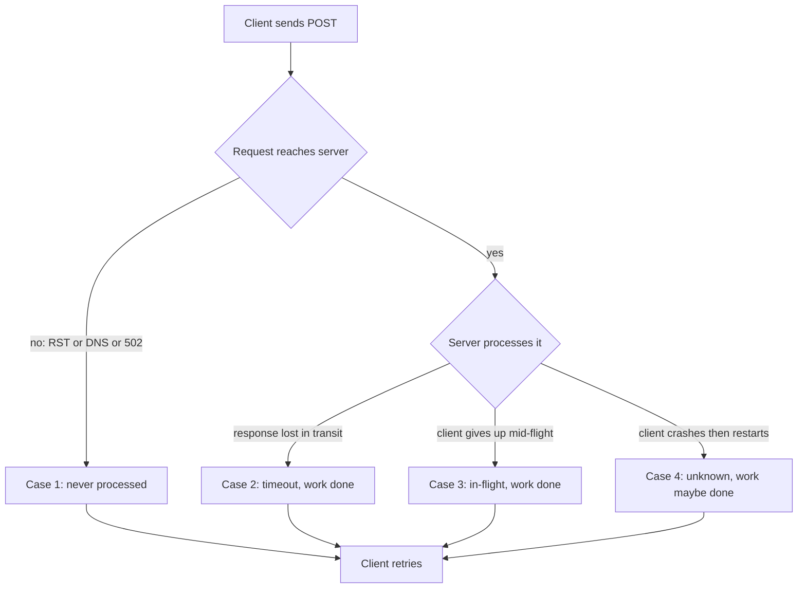

# Idempotency keys for deploy and provisioning endpoints

*stripe shipped this for cards in the mid-2010s, and your control plane is still rolling the dice*

Pick any reasonably mature payments SDK and you will find the same pattern: every mutating request takes an `Idempotency-Key` header, the server stores the response keyed by that header for some window, and a retry within the window returns the original response instead of charging the card again. Well-trodden ground: blog posts, RFCs, conference talks, and an in-flight IETF effort to register the header (`draft-ietf-httpapi-idempotency-key-header`). This post is about the wire format: HTTP header, per-key fingerprint, response cache, Stripe lineage, and how to apply it to infra. (Its on-disk cousin, writing a per-operation token to a journal before the side effect, is a different shape of the same idea and lives in its own post.)

Now go look at the deploy endpoint on whatever internal control plane you talk to (the API surface that creates, configures, or tears down resources, versus the data plane that serves traffic once a resource exists). Or the provisioning API for your test fleet. Or the firmware flash endpoint on the BMC (baseboard management controller, the always-on chip that lets you power, monitor, and reflash a machine out of band). Odds are the contract is "POST and pray, poll a status URL, and if the network burped, good luck."

This is bizarre. Double-charging a card costs a chargeback and an angry email. Double-flashing firmware mid-boot bricks the box: the second flash overwrites a half-written image, the box no longer boots, someone walks to the rack. Double-provisioning a worker leaves two workers fighting over a hostname, or a leaked lease that holds capacity hostage for a week.

Infra endpoints need idempotency more than payment endpoints, not less.

## The shape of the problem

Take a small fictional service `leasebroker` that hands out worker nodes from a pool. Clients call:

```
POST /v1/workers
{
  "image": "worker-base:2025.11",
  "cpu": 16,
  "memory_gb": 64,
  "labels": {"team": "ml-eval", "purpose": "bench"}
}
```

`leasebroker` allocates a node from the pool, writes a lease into its database, calls out to the hypervisor to boot the image, and returns:

```
201 Created
Location: /v1/workers/wkr-7Q2K9
{
  "id": "wkr-7Q2K9",
  "state": "booting",
  ...
}
```

Four failure modes produce a retry from the client's perspective. In cases 2, 3, and 4 the server already did the work; in case 1 it did not, and from the client's vantage these are indistinguishable.



Without idempotency, your fleet grows a phantom worker every time a flaky link causes a retry. You will not notice until the bill arrives or the pool runs dry.

## A workable key scheme

The Stripe-style contract is the right starting point; you mostly do not need to invent anything new. Keep the wire format boring:

```
POST /v1/workers
Idempotency-Key: 7c3f5d1e-91a4-4b8c-9f02-1c4a8e5b6d10
Content-Type: application/json

{ ...body... }
```

Rules of the road:

- The key is whatever opaque string the client wants, up to some sane length. 128 chars sits inside common reverse-proxy header limits (nginx allows 8 KB per single header field by default), so even with other ambient headers you stay clear of 431 (Request Header Fields Too Large) and 414 (URI Too Long). UUIDv4 is the obvious default; do not let it be the empty string.
- Scope the key per principal and per endpoint. "Principal" here means the authenticated identity the request runs as: the API token or account. The same key from two different tokens must be two different keys, and the same key sent to `POST /v1/workers` and `POST /v1/workers/{id}/reboot` should be treated as distinct. (Stripe scopes per account with the key covering the full request; the IETF draft leaves the uniqueness scope to the server, so per-endpoint scoping is a recommendation, not a wire requirement.) Scoping matters because in a shared, un-scoped keyspace two tenants can pick the same key, and one then receives the other's cached response or has its own request silently suppressed. That is a correctness and cross-tenant leakage problem first; degradation is secondary.
- The server stores the key, a request fingerprint, and the eventual response for a configurable window. 24h covers any realistic client retry budget (CI jobs retrying the next night, humans back from a meeting) and matches Stripe's v1 API retention. Anything shorter than your worst-case client retry budget is wrong.
- Subsequent requests with the same key return the stored response. Always. Even if the underlying resource has since been deleted.

The fingerprint is the part most implementations get wrong.

## The "request fingerprint" gotcha

A naive implementation stores only the key and the response. A client sends key `K` with `{"cpu": 16}`, gets back `wkr-7Q2K9`. Later it sends key `K` with `{"cpu": 128}`. What should happen?

Returning `wkr-7Q2K9` is dangerous: the client thinks it got a 128-CPU worker. Allocating a new worker is also dangerous: the contract said "this key is idempotent."

The right answer is to detect the mismatch and reject it with `409 Conflict`, with a body that says "this idempotency key was previously used with a different request payload." (The IETF draft suggests `422 Unprocessable Entity` and Stripe returns `400 Bad Request`; any of the three is defensible, so pick one and document it. This post uses 409 throughout.) Store a fingerprint of the request when you first see the key, and compare it on every reuse.

A stable hash of the canonicalized body (sorted JSON keys, normalized whitespace) is one valid fingerprint. Many implementations instead hash the raw request bytes plus method and path, because canonicalization can merge two requests you meant to keep distinct: if your API treats `{"labels": {}}` and an absent `labels` field differently, a canonicalizer that drops empty objects hashes them the same, and the second caller silently gets the first caller's worker. Raw bytes do not. Whatever you choose, compute once and compare forever.

A reasonable record looks like:

```
{
  "key": "7c3f5d1e-91a4-4b8c-9f02-1c4a8e5b6d10",
  "principal": "tok_abc123",
  "endpoint": "POST /v1/workers",
  "request_hash": "sha256:8e3a...",
  "state": "completed",          // or "in_flight"
  "response_status": 201,
  "response_body": "{...}",
  "response_headers": {...},
  "created_at": "...",
  "started_at": "...",
  "expires_at": "..."
}
```

The `state` field matters for the next problem.

## Concurrent retries to the same key

Client sends a request with key `K`, times out at 5 seconds, retries. The original is still being processed. Now two in-flight requests share the same key. If both threads check the store, see no record, and proceed, you have provisioned two workers from one logical request.

The fix is a small state machine with the store doing the locking. A plain upsert does not tell you which path it took: "this row is new because I inserted it" versus "this row already existed." Postgres gives you that signal through a system column called `xmax`, part of its MVCC (multi-version concurrency control) bookkeeping: on a freshly inserted row `xmax` is 0, and when a statement locks or modifies an existing row `xmax` is the current transaction's id (nonzero). So `(xmax = 0)` reads as "I won the insert." It is a documented column, stable across versions, but Postgres-specific; other engines need their own rowcount or `RETURNING` trick.

There is a catch with the conflict action. `ON CONFLICT DO NOTHING` only returns a row for rows it actually inserted, so a conflicting row gives you no `xmax` to inspect. To get the signal you want `ON CONFLICT DO UPDATE` with a no-op update, which returns a row in both cases:

```
INSERT INTO idempotency (key, principal, endpoint, request_hash, state)
VALUES (?, ?, ?, ?, 'in_flight')
ON CONFLICT (key, principal, endpoint) DO UPDATE SET key = EXCLUDED.key
RETURNING (xmax = 0) AS inserted;
```

The `DO UPDATE` writes the key back to its own value, so nothing changes semantically. But Postgres still takes a row lock and writes a new tuple version on the conflict path, which is why `xmax` flips to nonzero there. A freshly inserted row comes back `inserted = true` (`xmax = 0`); a conflicting row comes back `false`. The cost is a dead tuple and a little WAL per conflict, which autovacuum handles, so for a per-key table this is cheap.

If you own the request, process it. Otherwise look up the existing row. Three cases:

1. `state = 'completed'`, hash matches: return the stored response.
2. `state = 'completed'`, hash differs: return `409 Conflict`.
3. `state = 'in_flight'`: return `409 Conflict` with a `Retry-After` header, or block with a bounded wait. (You may see `425 Too Early` floated here; it is meant specifically for TLS 1.3 0-RTT early-data replay risk, not generic "not ready," so 409 is the cleaner fit.) The worst option is to silently proceed.

Visualized as a race between two concurrent clients sending the same key:

```
  client A                store                  client B
     |                      |                       |
     |-- INSERT K, in_flight ->|                    |
     |     OK (owns request)   |                    |
     |                      |<-- INSERT K, in_flight |
     |                      |    conflict, no-op upd |
     |                      |<-- SELECT K           |
     |                      |    row: in_flight     |
     |                      |--> 409 Retry-After    |
     |-- processing...      |                       |
     |-- store.complete K ->|                       |
     |     row: completed   |                       |
     |                      |<-- SELECT K (B retry) |
     |                      |    row: completed     |
     |                      |--> stored response    |
```

A wins because it inserted first; B takes the conflict path and gets a different signal, which is the entire reason that branch exists.

I have seen "block and wait" implemented as `SELECT ... FOR UPDATE` against the row. Tempting, because the client gets the right answer without retrying. Also a great way to exhaust your connection pool the first time a slow upstream causes a retry storm. Default to a fast 409 and let the client back off.

The insert-or-conflict above is the create-time flavor of optimistic locking: you take no explicit lock up front, you attempt the write and detect afterward whether someone beat you to it. The row's own existence is the lock, so the first writer wins. The same shape generalizes to any contested state transition as a compare-and-set on a version column (read version N, write only if it is still N), covered in the post on state machines for long-running operations.

## What happens when the handler crashes mid-flight

A subtle failure mode hides in the state machine above. The handler inserts `state='in_flight'`, starts work, dies (process killed, pod evicted, panic in step 2). The row stays. Every retry within the expiry window hits case 3 and gets `409 Conflict` forever, locking the client out until the record expires, possibly 24 hours away.

You need a short TTL on the `in_flight` state itself, separate from the 24h response cache. This is where `started_at` earns its place: the timestamp of the current claim attempt (distinct from `created_at`, when the row first appeared), reset each time someone claims the key. Five minutes is reasonable for fast operations, longer for genuine long-runners. The check:

```
state = 'in_flight' AND now() - started_at < in_flight_ttl  -> 409
state = 'in_flight' AND now() - started_at >= in_flight_ttl -> treat as free, attempt to claim
```

"Attempt to claim" is again an optimistic update: `UPDATE ... SET started_at = now() WHERE key = ? AND state = 'in_flight' AND started_at = ?`. Whoever wins owns the next attempt; the loser falls through to the lookup.

The full state machine for an idempotency record:

```
        +---------+
        |  none   |<--------------+
        +---------+               |
             |                    | TTL expired
             | INSERT ON CONFLICT | or sweeper
             v                    |
       +-----------+              |
       | in_flight |--------------+
       +-----------+
          |    |
 complete |    | handler error / panic
          v    v
     +-----------+   +--------+
     | completed |   | failed |--> retry -> in_flight
     +-----------+   +--------+
          |
          | window expires
          v
        none
```

The `none -> in_flight` edge is the atomic `INSERT ON CONFLICT`. The `in_flight -> none` edge via TTL is the safety valve above; without it a crashed handler locks the key for the full window.

A stronger version marks the row `failed` on terminal failure (uncaught exception, panic) so retries do not wait for the TTL. This works with a top-level `defer`/`finally` you trust; it does not when the process is hard-killed. Do both: the TTL covers the cases the cleanup path cannot.

## The TOCTOU trap in check-then-act handlers

TOCTOU is time-of-check to time-of-use: you check a condition (no worker exists yet), then act on it (allocate one), but your handler can die partway through and the next attempt re-checks against a half-finished world. Idempotency at the HTTP layer is necessary but not sufficient. The handler itself needs to be safe against partial execution.

Consider the naive provisioning handler:

```python
def provision_worker(req):
    key = req.headers["Idempotency-Key"]
    record = store.get_or_create(key, req)
    if record.state == "completed":
        return record.response

    # do the work
    node = pool.allocate(req.cpu, req.memory_gb)   # 1
    lease = leases.insert(node.id, req.principal)  # 2
    hypervisor.boot(node, req.image)               # 3

    response = make_response(node, lease)
    store.complete(key, response)
    return response
```

What happens when step 2 succeeds and step 3 fails because the hypervisor is briefly unreachable? The handler raises, the idempotency record stays `in_flight` (or worse, gets rolled back), the client retries, and you have a leased node with no booted instance. The retry allocates another node because `pool.allocate` is not idempotent.

The fix is to key every side effect inside the handler off the same idempotency key, so retries converge on the same identifiers. Derive a stable sub-key per side effect rather than store a list of them:

```
allocation_id = stable_hash(key + ":alloc")
lease_id      = stable_hash(key + ":lease")
boot_id       = stable_hash(key + ":boot")
```

Deriving beats storing because it is deterministic: a retry, carrying the same `key`, recomputes the same `allocation_id` without reading any state first. (Plain namespacing like `key + ":alloc"` works just as well; hashing only buys you uniform length.)

The sub-key is just a name; it does not make a downstream system idempotent by itself. You pass `allocation_id` into `pool.allocate`, and the pool must store it and return the existing allocation if it sees the same id again. So `pool.allocate` becomes "allocate or return the existing allocation for this allocation_id," `leases.insert` becomes "insert or return the existing lease," `hypervisor.boot` becomes "boot or report current state for this boot_id." Each downstream still needs its own idempotency story, and that is the real work.

The contrast: an idempotent handler can be safely called twice and gives the same answer; a resumable handler additionally skips steps it already finished. A retry that arrives after step 2 succeeded but step 3 failed walks past steps 1 and 2 and only re-attempts the boot:

```
attempt 1 (key K):
  pool.allocate(H1) -> MISS -> allocate, store H1 -> node-42
  leases.insert(H2) -> MISS -> insert,   store H2 -> lease-99
  hypervisor.boot(H3) -> MISS -> RPC fails, nothing stored
  handler raises, in_flight row stays (or cleared by panic handler)

attempt 2 (same K):
  pool.allocate(H1) -> HIT  -> returns node-42 (no new alloc)
  leases.insert(H2) -> HIT  -> returns lease-99 (no new lease)
  hypervisor.boot(H3) -> MISS -> RPC retried, succeeds
  store.complete(K, response)
```

Only `hypervisor.boot` re-runs. The earlier side effects are free because their sub-keys already resolved.

If the hypervisor cannot accept a caller-supplied id, wrap it with a two-phase pattern, the same shape you recognize from a saga or outbox: commit your intent, make the slow external call, reconcile on the next retry. Do NOT hold a DB transaction open across the hypervisor call; it is the slowest thing in the path and a long-held lock will eat your connection pool. Insert a `pending` row keyed by `boot_id` before the call, commit, make the call, update the row with the `real_id`. On retry, you see the `pending` row and ask the hypervisor what happened to the boot.

The hard case is a crash after the call was issued but before you recorded `real_id`: your `pending` row has no real id to query by. You close that gap by stamping `boot_id` into the call as client-visible metadata the hypervisor echoes back (a tag, name, or description field), then listing recent boots and matching on it. If the hypervisor exposes no such field, the honest fallback is to treat the boot as ambiguous and re-issue only if re-issuing is itself safe (the hypervisor rejects a duplicate boot for an already-running node). The intent survives the crash; reconciliation turns a half-finished external call into a known state.

## What about nonidempotent verbs like DELETE and PATCH?

Same scheme, slightly different semantics. `DELETE /v1/workers/{id}` is idempotent at the resource level (first delete succeeds, subsequent deletes 404 or 204), but the *response* is not: the second caller sees a different status code than the first. The first DELETE returns 204, a retry hits an already-deleted resource and gets 404, and if your client treats 404 as a failure it retries again, gets 404 again, and loops forever. That is the doom loop.

Wrap it in the same key scheme. Store the first response, return it on every retry within the window. The client always sees 204, even on the seventeenth retry, and the resource was deleted exactly once.

```python
def delete_worker(req, worker_id):
    key = req.headers["Idempotency-Key"]
    # ON CONFLICT DO UPDATE ... RETURNING (xmax = 0) AS inserted, *
    record, inserted = store.claim(key, req)
    if not inserted:
        if record.state == "completed":
            return record.response             # always 204, even if row is gone
        return Response(status=409, headers={"Retry-After": "1"})

    workers.delete(worker_id)                  # 404 here is fine, treat as deleted
    response = Response(status=204)
    store.complete(key, response)
    return response
```

`store.claim` uses the same `ON CONFLICT DO UPDATE ... RETURNING (xmax = 0)` as the create path, so the conflict branch returns the existing row and `record.state` is readable. The second call inside the window never reaches `workers.delete`; it returns the stored 204 even though the row is gone, which is what the retry loop wants.

`POST /v1/workers/{id}/reboot` is the dangerous one. Reboot is not naturally idempotent: two calls cause two reboots, and on real hardware that means a stuck firmware update or a thermal trip. Idempotency keys are the only way to retry it safely.

## Expiry, garbage collection, and storage

A few practical notes:

- The key store will grow. Pick an expiry, write a sweeper, do not let it become the largest table in the DB.
- The expiry window must cover the longest retry budget any client uses. 24h fits most APIs. For long-running provisioning where the client is a CI job that retries the next night, 7 days.
- After expiry the key is reusable. Usually fine because clients generate fresh keys per request; if paranoid, prefix keys with the day.
- Compress large response bodies. Provisioning responses with full node metadata multiply by retention window times request rate.
- Do not store 5xx responses. The whole point of 5xx is "try again." Store only terminal responses: 2xx, plus 4xx that you are confident represent a permanent client error. The rule: cache the response if and only if the server has made a durable state change *or* decided no state change will ever happen for this request.

A quick lookup table for the common cases:

| Response                                       | Cache it? | Reasoning                                                |
|------------------------------------------------|-----------|----------------------------------------------------------|
| 2xx terminal (200, 201, 204)                   | Yes       | Durable state change; retries must see the same answer.  |
| 400 (bad image tag, malformed body)            | Yes       | Permanent client error; the same request will fail forever. |
| 403 (auth/permission denied)                   | Yes       | Permanent for this principal + payload.                  |
| 422 (validation failed)                        | Yes       | Same as 400, the body is wrong on purpose.               |
| 404 on a DELETE wrapper (first response)       | Yes       | Resource was already gone, but the answer is stable.     |
| 408 (request timeout)                          | No        | Server never finished; retry is exactly the right move.  |
| 429 (rate limited)                             | No        | Retryable by definition.                                 |
| 5xx (500, 502, 503, 504)                       | No        | "Try again" is the contract; caching defeats it.         |

## What the client should do

Server-side discipline is half the story. The client contract:

- Generate the key once per logical operation, *before* the first attempt. Persist across retries. Persist across process restarts if the operation matters.
- Retry on network failures and 5xx with backoff. Do not generate a new key.
- On a 409 mismatch, do not retry. The body changed, which is a bug. Surface it.
- On 2xx you are done, no matter how many retries it took.

Common antipattern: the client library generates a fresh UUID inside the retry loop ("UUIDs are unique, this is fine"). It defeats the mechanism entirely. Audit your SDKs.

## Why infra teams skip this and what it costs

The usual excuses for skipping this on a control plane:

1. "Our clients are well-behaved internal services." They are not. Internal services run on flaky networks under load and retry as aggressively as anything external.
2. "Our operations are fast enough that retries are not a problem." Provisioning takes seconds to minutes, a wide window for a retry that lands after the original already succeeded.
3. "We have eventual consistency, it sorts itself out." Phantom resources sit there draining quota until someone files a ticket.
4. "We will add it later." The retrofit usually surfaces downstream systems that cannot accept caller-supplied ids, and cleanup becomes a multi-quarter project.

Build it in on day one. The wire format is six lines of middleware, the store is one table with three indices, and the hard part is making handlers safe, which you should be doing anyway. Fingerprint the body so a mismatch is caught instead of silently honored, store the response so retries inside the window are free, and key every downstream side effect off the same value so the handler is resumable, not merely idempotent. The first time a client SDK ships an aggressive retry policy, the fleet will not double.
