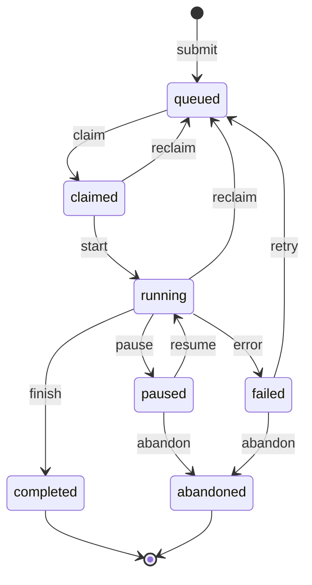
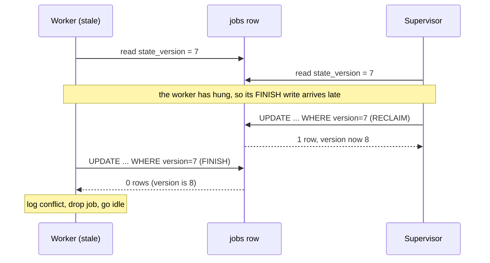

# Modeling job lifecycle as a finite state machine

*how to track the lifecycle of a background job so that impossible states cannot be built and real bugs become easy to find*

```python
from dataclasses import dataclass

@dataclass
class Job:
    is_queued: bool = True
    is_claimed: bool = False
    is_running: bool = False
    is_done: bool = False
    is_failed: bool = False
    is_paused: bool = False
    is_abandoned: bool = False
```

Seven independent true/false fields means 2^7 = 128 distinct combinations the type system will let you build, and any code path can flip any field, so all 128 are reachable in practice. A job is only ever supposed to be in about seven of them. The other 121 are combinations the domain never intended, each a latent bug that becomes reachable the moment the wrong interleaving of writes hits it. Somewhere in the codebase there is a comment that says `# TODO: figure out what to do when paused and failed both true`. That one TODO is hiding the rest.

Stop modelling job lifecycle as a bag of booleans and model it as a finite state machine (FSM): a system that is in exactly one named state at a time and moves between states only through a fixed, explicit set of transitions.

This post walks through how I model job lifecycle in a generic work runner I will call `relayd`.

## What goes wrong with booleans

The usual answer to "is `is_paused` allowed while `is_failed`?" works for six months, until a user notices their "completed" job was still being retried, and the support case takes three days to unwind because nobody can tell what state the job was actually in.

## States, in plain English

A job in `relayd` lives in exactly one of seven states:

```
queued        # accepted, waiting for a worker
claimed       # a worker has reserved it but not started
running       # actively executing
paused        # operator or supervisor halted it, can resume
completed     # finished cleanly (see the axis discussion below)
failed        # the job itself errored: worker crash, infra fault, timeout
abandoned     # we gave up; no further work, no retry, eligible for cleanup
```

Two things to call out. First, the FSM tracks the health of the *job machinery* (did the work run to completion?), which is a different axis from the *result the work computed* (did the work succeed?). `completed` lives on the first axis. `pytest` exits with code 1 after finding a real regression: that is `completed` (verdict: test failed). The `pytest` process gets killed by the kernel partway through collection because the machine ran out of memory (this is called being OOM-killed, short for out-of-memory killed): that is `failed`, the machinery broke and we never got a verdict. Conflating these two axes is the most common modeling error I see.

Second, `abandoned` is distinct from `failed`. `failed` is recoverable in principle; `abandoned` is the verdict that we are done retrying and the job can be cleaned up.

## Drawing the transitions

Here is the legal transition graph. The diagram anchors your intuition; the table that follows is authoritative.



The terminal states (states with no way out) are `completed` and `abandoned`. Once a job lands there, no event can move it. (The arrows into `[*]` show finality, not transitions, so do not count them.)

That finality is useful. A row that can never change again is safe to read concurrently without any coordination, so there is nothing to lock against. (A lock is a way to make other writers wait while you read or write a row; more on locks in the persistence section.) Your billing code, your archiver, and your metrics rollup can all trust those rows without holding a lock.

The transitions, written as `(from, event) -> to`:

```
(queued,    claim)   -> claimed
(claimed,   start)   -> running
(claimed,   reclaim) -> queued      # worker died before start
(running,   finish)  -> completed
(running,   error)   -> failed
(running,   pause)   -> paused
(paused,    resume)  -> running
(paused,   abandon)  -> abandoned
(running,  reclaim)  -> queued      # worker died mid-run
(failed,    retry)   -> queued
(failed,   abandon)  -> abandoned
```

Eleven transitions. Anything else (a `resume` on a `completed` job, a `start` on a `queued` job that skipped `claimed`, a `finish` on a `paused` job) is a bug, and your transition function should reject it with a hard error rather than guess.

One deliberate restriction: a `paused` job cannot directly `finish` or `error`. It must be resumed first. "Paused" means the worker is not executing right now, so it cannot have a fresh result to report. To dispose of a paused job without resuming it, use `abandon`. If your domain genuinely needs `(paused, finish) -> completed` (for example, an operator wants to mark partial work as done), add it explicitly to the table.

## The state table, in code

This is the version I actually run, give or take the logging.

```python
from dataclasses import dataclass
from enum import Enum

class State(Enum):
    QUEUED    = "queued"
    CLAIMED   = "claimed"
    RUNNING   = "running"
    PAUSED    = "paused"
    COMPLETED = "completed"
    FAILED    = "failed"
    ABANDONED = "abandoned"

class Event(Enum):
    CLAIM   = "claim"
    START   = "start"
    FINISH  = "finish"
    ERROR   = "error"
    PAUSE   = "pause"
    RESUME  = "resume"
    RECLAIM = "reclaim"
    RETRY   = "retry"
    ABANDON = "abandon"

TRANSITIONS = {
    (State.QUEUED,    Event.CLAIM):   State.CLAIMED,
    (State.CLAIMED,   Event.START):   State.RUNNING,
    (State.CLAIMED,   Event.RECLAIM): State.QUEUED,
    (State.RUNNING,   Event.FINISH):  State.COMPLETED,
    (State.RUNNING,   Event.ERROR):   State.FAILED,
    (State.RUNNING,   Event.PAUSE):   State.PAUSED,
    (State.RUNNING,   Event.RECLAIM): State.QUEUED,
    (State.PAUSED,    Event.RESUME):  State.RUNNING,
    (State.PAUSED,    Event.ABANDON): State.ABANDONED,
    (State.FAILED,    Event.RETRY):   State.QUEUED,
    (State.FAILED,    Event.ABANDON): State.ABANDONED,
}

TERMINAL = {State.COMPLETED, State.ABANDONED}

class IllegalTransition(Exception):
    pass

@dataclass
class Job:
    id: str
    state: State

    def apply(self, event: Event) -> "Job":
        if self.state in TERMINAL:
            raise IllegalTransition(
                f"job {self.id} is terminal ({self.state.value}); "
                f"refusing event {event.value}"
            )
        try:
            new_state = TRANSITIONS[(self.state, event)]
        except KeyError:
            raise IllegalTransition(
                f"job {self.id}: no transition from "
                f"{self.state.value} on {event.value}"
            )
        return Job(id=self.id, state=new_state)
```

Four properties of this code matter.

The transitions live in a dict, not in a tangle of `if` statements buried in handler methods. You can `pprint` the table, diff it across releases, and write a short check that every state is reachable from `queued`:

```python
def test_every_state_reachable_from_queued():
    seen = {State.QUEUED}
    frontier = [State.QUEUED]
    while frontier:
        s = frontier.pop()  # pop() takes the last item, so this walks depth-first
        for (src, _evt), dst in TRANSITIONS.items():
            if src == s and dst not in seen:
                seen.add(dst)
                frontier.append(dst)
    assert seen == set(State), f"unreachable: {set(State) - seen}"
```

Traversal order does not matter; either way we visit every reachable node and check the final `seen` set. That test has caught me twice: once when I added `PAUSED` and forgot the `RESUME` edge, and once when a refactor accidentally deleted `(FAILED, RETRY) -> QUEUED` and orphaned the whole retry path.

The `apply` method returns a new `Job` rather than changing the existing one in place. That is not Python dogma; it buys crash safety through the order of operations. You compute the candidate next state into a fresh object, persist that object, and only then adopt it as the live job. If the write fails, you discard the candidate and the old object is still valid, because nothing about it ever changed. In-place mutation is worse: the field is already overwritten when the write fails, so the live object holds a state that was never saved and you have to detect and revert it by hand.

The `IllegalTransition` exception is not a soft warning. It raises a hard error and pages a human via PagerDuty (an alerting service that calls or texts whoever is on call), because every illegal transition is either a bug in the orchestrator or evidence that two components disagree about a job's state. Both deserve a human looking at them.

## Persisting state so a dead worker does not poison you

The state machine is half the story. The other half is making the state survive a worker crash, a network partition (when part of your system cannot reach another part because the link between them is down or dropping packets, though both sides are still running), or a botched redeploy.

The persistence shape I use is plain: a `jobs` table with the current state, and a `job_events` append-only log of every transition. This pattern has a name, event sourcing (Fowler, 2005: https://martinfowler.com/eaaDev/EventSourcing.html); its core guarantee is that the log of events is the source of truth, so the current-state row is just a cached view (often called a projection) you could rebuild by replaying the log from the start. The schema also carries a `heartbeat_at` column: a heartbeat is a timestamp a live worker updates periodically to prove it is alive, which the supervisor reads to detect dead workers. The column appears in both the schema and the index below.

```sql
CREATE TABLE jobs (
    id            UUID PRIMARY KEY,
    state         TEXT NOT NULL,
    claimed_by    TEXT,
    claimed_at    TIMESTAMPTZ,
    heartbeat_at  TIMESTAMPTZ,
    state_version BIGINT NOT NULL DEFAULT 0
);

CREATE TABLE job_events (
    id         BIGSERIAL PRIMARY KEY,
    job_id     UUID NOT NULL REFERENCES jobs(id),
    from_state TEXT NOT NULL,
    to_state   TEXT NOT NULL,
    event      TEXT NOT NULL,
    actor      TEXT NOT NULL,
    at         TIMESTAMPTZ NOT NULL DEFAULT now(),
    payload    JSONB
);

-- The supervisor scan that drives reclaim runs every few seconds.
-- Without this index it is a full-table sequential scan on jobs once the
-- table has a few million rows. With it, the scan touches only
-- live work.
CREATE INDEX jobs_live_heartbeat
    ON jobs (heartbeat_at)
    WHERE state IN ('claimed', 'running');
```

A note on the column types: `UUID` is a random 128-bit identifier, `TIMESTAMPTZ` is a timestamp that records its time zone (short for timestamp with time zone), `BIGSERIAL` is an auto-incrementing 64-bit integer, and `JSONB` stores JSON in a binary form Postgres can index and query.

The `state_version` column implements an optimistic lock. The word "lock" here is worth a contrast. A pessimistic lock assumes conflicts are likely, so it grabs exclusive access to the row up front. An optimistic lock assumes conflicts are rare, so it reserves nothing up front: you read the current version, attempt a conditional write that only succeeds if the version has not changed since you read it, and if zero rows were affected, you re-read instead of assuming you won. Every transition does:

```sql
UPDATE jobs
   SET state = $new_state,
       state_version = state_version + 1,
       heartbeat_at = now()
 WHERE id = $job_id
   AND state_version = $expected_version
   AND state = $expected_state    -- redundant check; see note
RETURNING state_version;
```

This UPDATE is the FSM transition path, and it bumps `state_version`. The frequent liveness heartbeats from a healthy worker are a *separate* write path that touches only `heartbeat_at`, never `state` or `state_version`. That separation keeps the rule "nothing changes state except through `apply`" honest, and it is why a routine heartbeat does not invalidate a version an orchestrator is holding.

Two terms used below. An *invariant* is a rule about your data that must always hold true, no matter what code runs (for example, "a job is in exactly one state"). A *defense-in-depth check* is a second, redundant check that should never fire if everything else is correct; if it does fire, something is already broken.

The `state_version` check alone is sufficient: if no one else has transitioned the row, the version matches and so does the state. The extra `state = $expected_state` clause is that kind of redundant check. If it ever causes the `UPDATE` to fail when the version did match, your state and version have drifted apart. In a system where the only write path is `apply` plus the optimistic lock, that drift means something outside your assumptions has touched the row: a manual `UPDATE` run during an incident, a botched migration, or a second service writing to the same table. Treat it as an invariant violation, page on it, and audit the event log.

If the `UPDATE` returns zero rows in the normal case (version mismatch), someone else got there first. The PostgreSQL docs spell this out: a WHERE clause that matches no rows is not an error, the RETURNING set is empty, and the command tag reports a count of 0 (https://www.postgresql.org/docs/current/sql-update.html). You re-read the row, decide whether your event is still meaningful, and retry or bail; you do not blindly overwrite.

This is the right place to define a race condition, since it is the reason this matters. A race condition is a bug where two pieces of code touch the same data at the same time and the result depends on which one wins the timing. The pattern above is the difference between a runner that loses one job a month to a quiet race and one that does not.

For this single-row pattern you do not need the strictest isolation level; the default is enough. A database *transaction* is a group of reads and writes that the database treats as one all-or-nothing unit: either every change commits or none do. An *isolation level* controls how much one in-flight transaction can see of another's uncommitted work. READ COMMITTED, the default, only promises that you see data other transactions have already committed. SERIALIZABLE, the strictest, promises the end result is as if the transactions had run one at a time in some order. Step by step: the first `UPDATE` takes a row-level write lock (it reserves exclusive write access to that one row) and holds it until it commits. The second `UPDATE` blocks on that lock; when the first releases it, the second re-fetches the now-updated row and re-runs it through its own WHERE clause. (Postgres calls this re-fetch-and-recheck step EvalPlanQual; it happens automatically.) By then the version column has been incremented, so the `state_version = $expected_version` condition no longer matches, and the second `UPDATE` affects zero rows (https://www.postgresql.org/docs/current/transaction-iso.html).

A caveat on scope: this re-evaluation only re-checks the WHERE condition against the one target row. A stale single-row compare-and-set is safe under READ COMMITTED, but any invariant spanning *multiple* rows is not. "No more than N jobs in `running` at once across the whole table" cannot be enforced by a single-row version check; that needs SERIALIZABLE or explicit locking. And this is a PostgreSQL guarantee; on a different database, check its rules first.

The event log is not just for forensics. It is also how you answer "what is the longest a job has spent in `claimed` without progressing to `running`?", the kind of question that surfaces worker bugs. A rough dwell-time model:

| State       | Healthy dwell                | Unhealthy signal                                        |
|-------------|------------------------------|---------------------------------------------------------|
| `queued`    | seconds to minutes           | hours, with workers idle (scheduler stuck)              |
| `claimed`   | milliseconds                 | seconds or longer (worker dying between claim and start)|
| `running`   | job-dependent                | exceeds the job's own timeout (supervisor not reclaiming)|
| `paused`    | until an operator acts       | indefinite with no owner (forgotten by humans)          |
| `completed` | terminal, archived           | never archived (sweeper not running)                    |
| `failed`    | until retry or abandon       | indefinite (retry policy never fires)                   |
| `abandoned` | terminal                     | growing without bound (no cleanup running)              |

The supervisor watches `heartbeat_at`, and once it has gone stale (no update for longer than the reclaim threshold), it concludes the worker is dead and reclaims the job. A few multiples of the heartbeat interval is the right threshold on `claimed` and `running`: enough slack to ride out one or two missed beats from a busy-but-healthy worker, but not so much that a dead worker holds a job hostage for minutes. The well-known defaults all sit in that range. Kubernetes (as of v1.32+) ships a 50-second `node-monitor-grace-period` (how long the control plane waits without a node update before declaring the node dead) on top of a 10-second status-update interval (how often each node reports in), and Nomad defaults to a 10-second heartbeat grace (https://kubernetes.io/docs/reference/node/node-status/). Jobs sitting in `claimed` for thirty seconds while the heartbeat interval is one second tell you a worker is dying between claim and start.

## Reclaim as a first-class transition

The FSM makes "reclaim" a legal transition with the same shape as `start` or `finish`, so the recovery path is not a special-case branch buried in supervisor code. The FSM does not care what physically went wrong (a dead worker box, a stuck lease, a hung process); it cares only that an event arrived and the (state, event) pair is in the table. (A lease here is a time-limited claim a worker holds on a job; "stuck" means the worker holding it died without releasing it.)

A supervisor checks for jobs whose `heartbeat_at` has aged past the threshold and emits a `RECLAIM` event through the same `apply` function as every other transition:

```python
def issue_reclaim(db, job_id):
    row = db.query_one("SELECT state, state_version FROM jobs WHERE id = %s", job_id)
    job = Job(id=job_id, state=State(row.state))
    try:
        new_job = job.apply(Event.RECLAIM)
    except IllegalTransition:
        return  # someone else moved it; fine
    persist_transition(db, job, new_job, row.state_version,
                       actor="supervisor", event=Event.RECLAIM)
```

`persist_transition` runs the `UPDATE` shown earlier, threading `row.state_version` into the version check and `job.state` into `state = $expected_state`, and on a zero-row result returns a conflict the caller treats as "someone beat me to it." `apply` decides the move is legal; `persist_transition` makes it durable without clobbering a concurrent writer.

Three things follow from treating reclaim as another FSM event.

First, the supervisor does not need to know why the worker fell silent. `(claimed, reclaim)` and `(running, reclaim)` are both legal; everything else is not. Its job is to detect staleness and emit the event.

Second, the event lands in `job_events` alongside every other transition. "Show me every reclaim in the last hour, grouped by from-state" is one SQL statement. You wrote no reclaim-specific logging because there is nothing reclaim-specific to log.

Third, the optimistic lock cleanly handles the awkward case where the original worker is somehow still alive and tries to report back:



Both read version 7. The worker is the one that hung, so its `FINISH` write lands after the supervisor's `RECLAIM`. That `RECLAIM` bumped the row to 8 while the worker still holds 7, so the worker's `UPDATE` matches nothing and writes no zombie state. One limit: this guards only the state *write*. If the worker had already performed side effects before reporting back (an external API call, a charge, an email), the version check cannot undo those. For that you need idempotency keys or fencing tokens checked at the downstream resource itself, a separate concern from the FSM. An idempotency key is a unique id you attach to an operation so the downstream system can recognize a repeat and apply it only once (idempotent means safe to run more than once without changing the outcome). A fencing token is a number that only ever goes up, handed out with each claim; the downstream resource remembers the highest token it has seen and rejects any request carrying a lower one, so a stale worker is refused even if it arrives late.

This works because of one rule the state machine makes easy to enforce: nothing writes directly to the `state` column. Everything emits events, which go through `apply`, which checks the transition table, which writes through the optimistic lock. The whole system has exactly one path that changes a job's state.

## Illegal transitions are how you find bugs

When you ship this, expect your `IllegalTransition` rate to be non-zero for the first month. That is good. Every one is a real bug the old boolean version was silently swallowing. A few examples:

- A worker retries its `start` event when its first attempt times out, after the orchestrator has already moved on. Result: a `start` arriving on a `running` job. With booleans, this just bumps a timestamp and carries on. With a state machine it raises an alert, and the retry logic is usually a one-line fix once you can see what is happening.

- A pause endpoint that does not check whether the job is actually running. Operators "pause" completed jobs and get confused about why the UI shows `paused, last result: passed`. The state machine refuses the transition, the UI shows an error, operators stop doing it.

- During a rolling deploy (a deploy that replaces instances of the service a few at a time instead of all at once, so old and new versions run side by side for a while), supervisor-A and the freshly started supervisor-B both read the same stale `running` job at `state_version = 7` and both fire `RECLAIM`; the optimistic lock lets exactly one win, as in the diagram above. The job is reclaimed once. The event log shows two `RECLAIM` attempts from two actors, usually the first time anyone notices two supervisors have been running at once because nobody updated the systemd unit when the deploy script changed. (systemd is the Linux service manager that starts and supervises long-running programs; a unit is its config file for one service.)

## What this does not solve

A finite state machine for job lifecycle does not give you scheduling fairness, priority, resource awareness, or dependency graphs between jobs. Those are real problems and deserve their own designs. What the FSM gives you is a foundation those higher-level systems can trust: when they ask "what state is job X in?", they get one unambiguous answer and can reason about what is and is not possible.

Seven states, eleven transitions, an optimistic lock on the version column, and reclaim through the same machinery as everything else. The whole class of impossible boolean combinations stops being representable, and the bugs that remain announce themselves as illegal transitions in the log, which tells you where to look.
