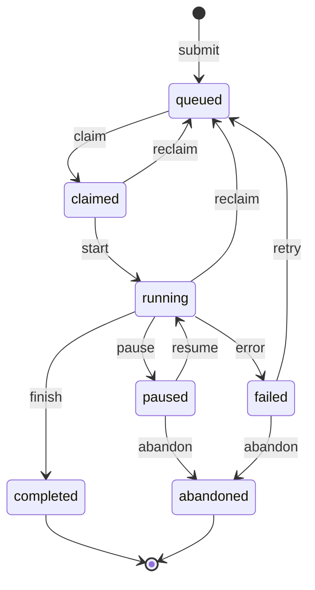
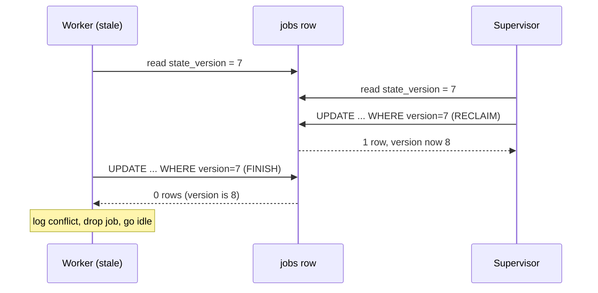

# Modeling job lifecycle as a finite state machine

*the cheapest reliability upgrade your job runner will ever get*

```python
from dataclasses import dataclass

@dataclass
class Job:
    is_queued: bool = True
    is_claimed: bool = False
    is_running: bool = False
    is_done: bool = False
    is_failed: bool = False
    is_paused: bool = False
    is_abandoned: bool = False
```

Seven independent booleans means 2^7 = 128 distinct combinations the type system will happily let you build, and over a job's life any field can be flipped by any code path, so all 128 are reachable in practice. How many is a job ever supposed to be in? Maybe seven, and those seven happen to be exactly the named states this post introduces. The other 121 are combinations the code can construct but the domain never intended, each a latent bug until the wrong interleaving of writes makes it reachable. Somewhere in the codebase there is a comment that says `# TODO: figure out what to do when paused and failed both true`. That comment is the bug, and it hides dozens of bugs behind one TODO.

The fix is not better naming. Stop modelling job lifecycle as a bag of booleans; model it as a finite state machine (FSM): a system that is in exactly one named state at a time and moves between states only through a fixed, explicit set of transitions. Once you write that machine down, a huge category of bugs becomes impossible to express, and the rest become trivial to find because they show up as illegal transitions in your logs.

This post walks through how I model job lifecycle in a generic work runner I will call `relayd`. The same shape works for any system that picks work off a queue, runs it on a worker, and reports back.

## Why the boolean soup always loses

The usual answer to "is `is_paused` allowed while `is_failed`?" is "make up the most plausible status and move on." It works for six months, until a user notices that their "completed" job had also produced a partial result that was still being retried, and the support escalation takes three days to unwind because nobody can tell what state the job had actually been in at any point.

## States, in plain English

A job in `relayd` lives in exactly one of seven states:

```
queued        # accepted, waiting for a worker
claimed       # a worker has reserved it but not started
running       # actively executing
paused        # operator or supervisor halted it, can resume
completed     # finished cleanly (see the axis discussion below)
failed        # the job itself errored: worker crash, infra fault, timeout
abandoned     # we gave up; no further work, no retry, sweep me up
```

Two things to call out. First, a principle: the FSM tracks the health of the *job machinery* (did the work run to completion?), which is a different axis from the *result the work computed* (did the work succeed?). `completed` lives on the first axis. Concretely: `pytest` exits with code 1 after finding a real regression, that is `completed` (verdict: test failed). The `pytest` process gets OOM-killed by the kernel halfway through collection, that is `failed` (the job machinery broke, we never got a verdict). Conflating these two axes is the single most common modeling error I see.

Second, `abandoned` is distinct from `failed`. `failed` is recoverable in principle. `abandoned` is the supervisor's verdict that we are done retrying, done caring, and the job is now garbage to be collected.

## Drawing the transitions

Here is the legal transition graph. Every arrow is a verb. The diagram is a sketch to anchor your intuition; the transition table that follows is the authoritative source, and if they disagree, trust the table.



The terminal states are `completed` and `abandoned`. Once a job lands there, no event can move it. (The arrows into `[*]` are not events; they are the diagram showing finality, so do not count them as transitions.)

That property is doing a lot of work for you. A row that can never change again is safe to read concurrently without any coordination, because there is no write that could race your read and nothing to lock against. Your billing code, your archiver, and your metrics rollup can all trust those rows without holding a lock.

The transitions, written as `(from, event) -> to`:

```
(queued,    claim)   -> claimed
(claimed,   start)   -> running
(claimed,   reclaim) -> queued      # worker died before start
(running,   finish)  -> completed
(running,   error)   -> failed
(running,   pause)   -> paused
(paused,    resume)  -> running
(paused,   abandon)  -> abandoned
(running,  reclaim)  -> queued      # worker died mid-run
(failed,    retry)   -> queued
(failed,   abandon)  -> abandoned
```

That is it. Eleven transitions. Anything else (a `resume` event on a `completed` job, a `start` on a `queued` job that skipped `claimed`, a `finish` on a `paused`) is a bug, and your transition function should refuse it loudly.

One deliberate restriction worth calling out: a `paused` job cannot directly `finish` or `error`. It must be resumed first. The reasoning is that "paused" means the worker is not executing right now, so it cannot have a fresh result to report. To dispose of a paused job without resuming it, use `abandon`. If your domain genuinely needs `(paused, finish) -> completed` (for example, an operator wants to mark partial work as done), add it explicitly to the table rather than letting it sneak in via a workaround.

## The state table, in code

The whole machine is the version I actually run, give or take the logging.

```python
from dataclasses import dataclass
from enum import Enum

class State(Enum):
    QUEUED    = "queued"
    CLAIMED   = "claimed"
    RUNNING   = "running"
    PAUSED    = "paused"
    COMPLETED = "completed"
    FAILED    = "failed"
    ABANDONED = "abandoned"

class Event(Enum):
    CLAIM   = "claim"
    START   = "start"
    FINISH  = "finish"
    ERROR   = "error"
    PAUSE   = "pause"
    RESUME  = "resume"
    RECLAIM = "reclaim"
    RETRY   = "retry"
    ABANDON = "abandon"

TRANSITIONS = {
    (State.QUEUED,    Event.CLAIM):   State.CLAIMED,
    (State.CLAIMED,   Event.START):   State.RUNNING,
    (State.CLAIMED,   Event.RECLAIM): State.QUEUED,
    (State.RUNNING,   Event.FINISH):  State.COMPLETED,
    (State.RUNNING,   Event.ERROR):   State.FAILED,
    (State.RUNNING,   Event.PAUSE):   State.PAUSED,
    (State.RUNNING,   Event.RECLAIM): State.QUEUED,
    (State.PAUSED,    Event.RESUME):  State.RUNNING,
    (State.PAUSED,    Event.ABANDON): State.ABANDONED,
    (State.FAILED,    Event.RETRY):   State.QUEUED,
    (State.FAILED,    Event.ABANDON): State.ABANDONED,
}

TERMINAL = {State.COMPLETED, State.ABANDONED}

class IllegalTransition(Exception):
    pass

@dataclass
class Job:
    id: str
    state: State

    def apply(self, event: Event) -> "Job":
        if self.state in TERMINAL:
            raise IllegalTransition(
                f"job {self.id} is terminal ({self.state.value}); "
                f"refusing event {event.value}"
            )
        try:
            new_state = TRANSITIONS[(self.state, event)]
        except KeyError:
            raise IllegalTransition(
                f"job {self.id}: no transition from "
                f"{self.state.value} on {event.value}"
            )
        return Job(id=self.id, state=new_state)
```

Four properties of this code matter.

The transitions live in a dict, not in a tangle of `if` statements buried in handler methods. You can `pprint` the table, diff it across releases, and write a ten-line reachability check that asserts every state is reachable from `queued`:

```python
def test_every_state_reachable_from_queued():
    seen = {State.QUEUED}
    frontier = [State.QUEUED]
    while frontier:
        s = frontier.pop()  # DFS order; reachability does not care
        for (src, _evt), dst in TRANSITIONS.items():
            if src == s and dst not in seen:
                seen.add(dst)
                frontier.append(dst)
    assert seen == set(State), f"unreachable: {set(State) - seen}"
```

Traversal order does not matter; we visit every reachable node and only check the final `seen` set. That test has caught me twice: once when I added `PAUSED` and forgot the `RESUME` edge, and once when a refactor accidentally deleted `(FAILED, RETRY) -> QUEUED` and orphaned the whole retry path.

The `apply` method returns a new `Job` rather than mutating in place. That is not Python dogma; it buys crash safety through the order of operations. You compute the candidate next state into a fresh object, persist that object to the database, and only then adopt it as the live job. If the write fails, you discard the candidate and the old object is still valid, because nothing about it ever changed. With in-place mutation you have already overwritten the field by the time the write fails, so you have to remember to revert it, and you will not always remember.

The `IllegalTransition` exception is not a soft warning. It is the loudest possible signal. In production it goes to PagerDuty, because every illegal transition is either a bug in the orchestrator or, more interestingly, evidence that two components disagree about a job's state. Both deserve a human looking at them.

## Persisting state so a dead worker does not poison you

The state machine is half the story. The other half is making the state survive a worker crash, a network partition, or a sloppy redeploy.

The persistence shape that has worked best for me is brutally boring: a `jobs` table with the current state, and a `job_events` append-only log of every transition. This pattern has a proper name, event sourcing (Fowler, 2005: https://martinfowler.com/eaaDev/EventSourcing.html); its core guarantee is that the log of events is the source of truth, so the current-state row is just a cached projection you could rebuild by replaying the log. The schema also carries a `heartbeat_at` column: a heartbeat is a timestamp a live worker updates periodically to prove it is alive, which the supervisor reads to detect dead workers. The column appears in both the schema and the index below.

```sql
CREATE TABLE jobs (
    id            UUID PRIMARY KEY,
    state         TEXT NOT NULL,
    claimed_by    TEXT,
    claimed_at    TIMESTAMPTZ,
    heartbeat_at  TIMESTAMPTZ,
    state_version BIGINT NOT NULL DEFAULT 0
);

CREATE TABLE job_events (
    id         BIGSERIAL PRIMARY KEY,
    job_id     UUID NOT NULL REFERENCES jobs(id),
    from_state TEXT NOT NULL,
    to_state   TEXT NOT NULL,
    event      TEXT NOT NULL,
    actor      TEXT NOT NULL,
    at         TIMESTAMPTZ NOT NULL DEFAULT now(),
    payload    JSONB
);

-- The supervisor scan that drives reclaim runs every few seconds.
-- Without this index it is a full-table seq scan on jobs once the
-- table has a few million rows. With it, the scan touches only
-- live work.
CREATE INDEX jobs_live_heartbeat
    ON jobs (heartbeat_at)
    WHERE state IN ('claimed', 'running');
```

The `state_version` column is an optimistic lock that guards FSM transitions: read the current version, attempt a conditional write that only succeeds if the version has not changed since you read it, and if zero rows were affected, re-read instead of assuming you won. It is cheap because it never holds a lock up front and only detects conflicts at write time. Every transition does:

```sql
UPDATE jobs
   SET state = $new_state,
       state_version = state_version + 1,
       heartbeat_at = now()
 WHERE id = $job_id
   AND state_version = $expected_version
   AND state = $expected_state    -- defense in depth; see note
RETURNING state_version;
```

This UPDATE is the FSM transition path, and it bumps `state_version`. The frequent liveness heartbeats from a healthy worker are a *separate* write path that touches only `heartbeat_at`, never `state` or `state_version`. That separation keeps the rule "nothing changes state except through `apply`" honest, and it is why a benign heartbeat does not invalidate a version an orchestrator is holding; if routine heartbeats bumped `state_version`, every optimistic lock would go stale constantly.

The `state_version` check alone is sufficient: if no one else has transitioned the row, the version matches and the state must match. The extra `state = $expected_state` clause is a defense-in-depth assertion. If it ever causes the `UPDATE` to fail when the version did match, you have a much worse bug, your state and version have drifted apart somehow, and you want to know loudly rather than paper over it. Treat that failure mode as an invariant violation, page on it, and audit the event log.

If the `UPDATE` returns zero rows in the normal case (version mismatch), someone else got there first. The PostgreSQL docs spell this out: a WHERE clause that matches no rows is not an error, the RETURNING set is empty, and the command tag reports a count of 0 (https://www.postgresql.org/docs/current/sql-update.html). You re-read the row, decide whether your event is still meaningful, and retry or bail. You do not blindly overwrite. This is the difference between a runner that loses one job a month to a quiet race and one that does not.

For this single-row pattern you do not need SERIALIZABLE isolation; READ COMMITTED is enough. (READ COMMITTED only promises you see committed data; SERIALIZABLE promises the result is as if transactions ran one at a time.) The first `UPDATE` takes a row-level write lock and holds it until it commits. The second blocks on that lock; when the first releases it, the second re-fetches the now-updated row and re-runs it through its own WHERE clause (EvalPlanQual). By then the version column has been incremented, so the `state_version = $expected_version` predicate no longer matches, and the second `UPDATE` affects zero rows (https://www.postgresql.org/docs/current/transaction-iso.html).

A caveat on scope: this re-evaluation only re-checks the predicate against the one target row. A stale single-row compare-and-set is safe under READ COMMITTED, but any invariant spanning *multiple* rows is not. "No more than N jobs in `running` at once across the whole table" cannot be enforced by a single-row version check; that needs SERIALIZABLE or explicit locking, because the decision depends on rows other than the one you are writing. And this re-evaluation is a PostgreSQL guarantee; on a different database, check its READ COMMITTED rules first.

The event log is not just for forensics, though it is great for that. It is also how you safely answer "what is the longest a job has spent in `claimed` without progressing to `running`?" which is the kind of question that makes worker bugs obvious. As a rough mental model for what each state's dwell-time distribution should look like:

| State       | Healthy dwell                | Unhealthy signal                                        |
|-------------|------------------------------|---------------------------------------------------------|
| `queued`    | seconds to minutes           | hours, with workers idle (scheduler stuck)              |
| `claimed`   | milliseconds                 | seconds or longer (worker dying between claim and start)|
| `running`   | job-dependent                | exceeds the job's own timeout (supervisor not reclaiming)|
| `paused`    | until an operator acts       | indefinite with no owner (forgotten by humans)          |
| `completed` | terminal, archived           | never archived (sweeper not running)                    |
| `failed`    | until retry or abandon       | indefinite (retry policy never fires)                   |
| `abandoned` | terminal                     | growing without bound (no GC)                           |

The supervisor watches `heartbeat_at`, and once it has gone stale (no update for longer than the reclaim threshold), it concludes the worker is dead and reclaims the job. A "few multiples of the heartbeat interval" is the right gut feel for that threshold on `claimed` and `running`: enough slack to ride out one or two missed beats from a busy-but-healthy worker, but not so much that a truly dead worker holds a job hostage for minutes. The well-known production defaults all sit in that range: Kubernetes (as of v1.32+) ships a 50-second node-monitor-grace-period on top of a 10-second status-update interval, and Nomad defaults to a 10-second heartbeat grace (https://kubernetes.io/docs/reference/node/node-status/). If you see jobs in `claimed` for thirty seconds while the heartbeat interval is one second, a worker is dying between claim and start, and you would never have known from the current-state table alone.

## Reclaim as a first-class transition

The FSM makes "reclaim" a legal transition with the same shape as `start` or `finish`, so the recovery path is not a special-case branch buried in supervisor code. Whatever physically went wrong (a dead worker box, a stuck lease, a hung process) is somebody else's problem; the FSM only cares that an event arrived and that the (state, event) pair is in the table.

A supervisor checks for jobs whose `heartbeat_at` has aged past a threshold and emits a `RECLAIM` event through the same `apply` function as every other transition:

```python
def issue_reclaim(db, job_id):
    row = db.query_one("SELECT state, state_version FROM jobs WHERE id = %s", job_id)
    job = Job(id=job_id, state=State(row.state))
    try:
        new_job = job.apply(Event.RECLAIM)
    except IllegalTransition:
        return  # someone else moved it; fine
    persist_transition(db, job, new_job, row.state_version,
                       actor="supervisor", event=Event.RECLAIM)
```

`persist_transition` runs exactly the `UPDATE` shown earlier, threading `row.state_version` into the version predicate and `job.state` into `state = $expected_state`, and on a zero-row result returns a conflict the caller treats as "someone beat me to it." The two are the halves of every transition: `apply` decides the move is legal, `persist_transition` makes it durable without clobbering a concurrent writer.

Three things follow from treating reclaim as just another FSM event.

First, the supervisor does not need to know why the worker fell silent. The FSM does not care. `(claimed, reclaim)` and `(running, reclaim)` are both legal; everything else is not. The supervisor's job is purely to detect staleness and emit the event.

Second, the event lands in `job_events` alongside every other transition. "Show me every reclaim in the last hour, grouped by from-state" is one SQL statement. You wrote no reclaim-specific logging because there was nothing reclaim-specific to log.

Third, the optimistic lock cleanly handles the awkward case where the original worker is somehow still alive and tries to report back:



The supervisor's `RECLAIM` bumped the row to 8 while the worker still holds 7, so the worker's `UPDATE` matches nothing and commits no zombie state. One limit: this guards only the state *write*. If the worker had already performed side effects before reporting back (an external API call, a charge, an email), the version check cannot undo those. Optimistic locking prevents a double state *transition*, not double *execution* of the underlying work. For that you need idempotency keys or fencing tokens checked at the downstream resource itself, a separate concern from the FSM.

This works because of one rule the state machine makes easy to enforce: nothing writes directly to the `state` column. Everything emits events, which go through `apply`, which checks the transition table, which writes through the optimistic lock. The whole system has exactly one path that can change a job's state.

## Illegal transitions are how you find bugs

When you ship this, expect your `IllegalTransition` rate to be non-zero for the first month. That is good. Every one is a real bug the old boolean-soup version was silently swallowing, and these are the bugs every job runner has. A few representative shapes:

- A worker retries its `start` event when its first attempt times out, after the orchestrator has already moved on. Result: a `start` event arriving on a `running` job. With booleans, this just bumps a timestamp and carries on. With a state machine, it pages you at 4am, and the retry logic is usually a one-line fix once you can see what is happening.

- A pause endpoint that does not check whether the job is actually running. Operators "pause" completed jobs and get confused about why the UI shows `paused, last result: passed`. The state machine refuses the transition, the UI shows an error, the operators stop doing it.

- During a rolling deploy, supervisor-A and the freshly started supervisor-B both read the same stale `running` job at `state_version = 7` and both fire `RECLAIM`; the optimistic lock lets exactly one win, as in the diagram above. The job is reclaimed once. The event log shows two `RECLAIM` attempts from two actors, which is usually the first time anyone notices that two supervisors have been running side by side because nobody updated the systemd unit when the deploy script changed.

The state machine does not prevent any of this. It makes the bugs loud, so you fix them instead of building scar tissue around them.

## What this does not solve

A finite state machine for job lifecycle does not give you scheduling fairness, priority, resource awareness, or dependency graphs between jobs. Those are real problems and deserve their own designs. What the FSM gives you is a foundation those higher-level systems can trust: when they ask "what state is job X in?", they get a single, unambiguous answer, and they can reason about what is and is not possible from there.

Seven states, eleven transitions, an optimistic lock on the version column, and reclaim through the same machinery as everything else. The bugs you have been chasing largely stop existing, and the ones that remain will tell you exactly where they are.
