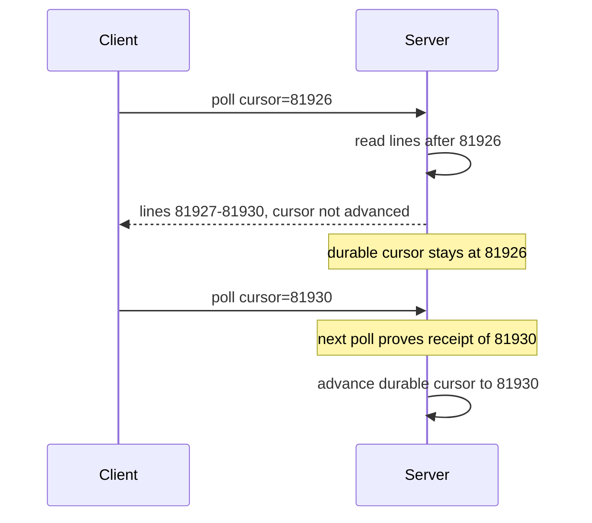

# Streaming live logs to the browser without WebSockets

*how to push log lines to a browser in real time when WebSockets are blocked, and the four mechanisms that work instead*

Every internal tool eventually grows a live-logs tab. Someone opens the page and expects lines to scroll in real time. The first instinct is always the same: WebSockets. A WebSocket is a persistent two-way connection that runs over a single TCP connection (TCP, Transmission Control Protocol, is the reliable byte-stream channel underneath HTTP). It works until traffic crosses an intermediary server that strips one of the headers the WebSocket needs, and then the connection fails with HTTP status 504 (Gateway Timeout: an intermediary gave up waiting for a usable response) every 30 seconds.

This post covers what to do when WebSockets are not available: four ways to move log bytes from a server to a browser that survive in restrictive corporate networks, what each costs, and a per-tab connection limit that affects all of them. Throughout, I use "transport" to mean the wire mechanism: how bytes travel between the server and the browser.

The running example is a log-tailing service I will call `tailroom`. Its input is bursty: a quiet baseline, then spikes when a build hits its link stage and one process dumps a few thousand lines in a couple of seconds. A user opens a job page and wants to see lines as they are produced, ideally with under a second of delay (that delay is the latency), and expects the page to keep up during a burst.

## Why WebSockets fail in the wild

A WebSocket starts as an ordinary HTTP/1.1 `GET` request carrying an `Upgrade: websocket` header. (This is the opening handshake, defined in RFC 6455. An RFC is a numbered internet standards document.) The `Upgrade` header asks the server to switch the connection from HTTP to the WebSocket protocol. The server is supposed to answer with HTTP status 101, called "Switching Protocols": both sides stop speaking HTTP now. After that, they exchange data in *frames*: small binary records, each prefixed with its own length so the receiver knows where one ends and the next begins. Three different behaviors in an intermediary can break that path.

A proxy can fail to understand the protocol. A proxy is a server in the middle of a connection that forwards traffic; a reverse proxy specifically sits in front of your application and forwards client requests to it. `Upgrade` and `Connection` are what RFC 7230 calls hop-by-hop headers: they describe a single segment of the connection and are not forwarded to the next, so each intermediary consumes its own copy. A proxy that only speaks HTTP/1.1 and does not implement the upgrade just opens a plain `GET` to the origin. (The origin is the server identified by scheme, host, and port together, for example `https://app.example.com:443`.) The origin answers with its normal route handler. The client was waiting for a `101` carrying a correct `Sec-WebSocket-Accept` value, derived from the `Sec-WebSocket-Key` the client sent to prove the server did the handshake. Instead it gets an ordinary `200 OK`, gives up, and fires `error` then `close`. The socket never opens, and you can see that it never opened.

An idle timeout can kill the flow. A load balancer (LB) is the device that spreads incoming traffic across several servers. Many default to roughly a 60s idle timeout, meaning "close the connection if no bytes move for this long." AWS Application Load Balancer (ALB) is 60s; nginx, a widely used reverse proxy, has the same default in its `proxy_read_timeout` setting. The timer fires only when no bytes move in either direction, which is why streaming apps send a periodic heartbeat to keep it from firing.

An intermediary can drop some frames. A security appliance that understands WebSocket framing might cap the frame size or block certain frame types, so small text frames pass and large binary ones disappear. The connection stays up; specific messages vanish.

From the browser's side, none of these look like "WebSockets are blocked"; they look like flaky reconnects. Here are the same three, marked `[1]` `[2]` `[3]`, on the path a single tab takes.

```
   browser              corporate proxy             origin
  ┌───────┐            ┌────────────────┐         ┌────────┐
  │  tab  │── GET ────▶│ HTTP/1.1 only  │── ?? ──▶│  app   │
  │       │  Upgrade:  │                │         │        │
  │       │  websocket │ [1] strips     │         │        │
  │       │            │     Upgrade    │         │        │
  │       │◀── 200 ────│ [2] 60s idle   │◀────────│        │
  │       │   (no ws)  │     timeout    │         │        │
  │       │            │ [3] inspects   │         │        │
  └───────┘            │     frames     │         └────────┘
                       └────────────────┘
```

`[1]` is why your connection becomes a regular HTTP/1.1 GET. `[2]` is why "it works for 30 seconds then dies" gets reported. `[3]` is why some frames make it and others do not. A deeper treatment of LB idle timeouts and replay-on-reconnect lives in the companion piece I refer to as blog 01. The practical conclusion: stop fighting the proxy and pick a transport it understands.

## Transport 1: Server-Sent Events

Server-Sent Events (SSE) is the obvious first choice and usually the right one. It is just an HTTP/1.1 GET request whose response never closes, sent with a content type of `text/event-stream`. The content type, declared in the `Content-Type` header, tells the browser what kind of data the body holds; `text/event-stream` is the type reserved for SSE, and it tells the browser to parse the body line by line in the format I show next.

```
GET /jobs/42/stream HTTP/1.1
Accept: text/event-stream

HTTP/1.1 200 OK
Content-Type: text/event-stream
Cache-Control: no-cache
X-Accel-Buffering: no

data: worker-3 | 14:02:11 | linking stage 2
id: 81923

data: worker-1 | 14:02:11 | test suite passed (244/244)
id: 81924

: keepalive
```

`X-Accel-Buffering: no` tells a reverse proxy not to buffer this response. Without it, the proxy can collect your "live" stream and deliver it in lumps (more on that below).

That last line, starting with a colon, is an SSE comment. The HTML standard is maintained by a group called WHATWG, and per their spec a line whose first character is a colon is ignored by the browser. The spec calls out this kind of comment as a keepalive: a byte sent on a schedule purely to keep an intermediary from declaring the connection idle. The browser ignores it, but proxies still see the bytes, so it resets their idle timers. A heartbeat (the same keepalive byte) every 15-30s, tuned to the shortest idle timeout on your path, keeps most corporate proxies from idle-killing the connection.

One spec detail worth knowing: SSE events are terminated by a blank line, and a multi-line payload uses a repeated `data:` prefix on each line, which the browser joins with newlines into one `event.data` string. A 3-line log entry is three `data:` lines then one blank line, not three separate events.

The browser side is built in:

```js
const es = new EventSource(`/jobs/${jobId}/stream?since=${lastId}`);
es.onmessage = (e) => appendLine(e.data);
es.onerror = () => {
  // Browser auto-reconnects with Last-Event-ID header
  // (only once it has actually received an event with id:).
  // You don't need to write reconnect logic.
};
```

`EventSource` reconnects on its own and automatically sends back the last `id:` it saw, as a `Last-Event-ID` request header. One caveat on the retry delay: the spec defines a single flat reconnection delay (a few seconds) that the server can change with a `retry:` field in milliseconds. It is a fixed interval, not exponential backoff (where each failed retry waits longer than the last), so do not count on the browser to back off under sustained failure. The genuinely useful part is the cursor, the saved position marker that says how far the client has read: the browser tracks it for you. It only sends `Last-Event-ID` once it has received an event carrying an `id:` field; without ids you get reconnect but no resume position. That automatic round trip is unique to SSE; with chunked HTTP or WebSockets you build the equivalent by hand, which is why I reach for SSE first.

The catches:

- One direction only. Server to client. If the user clicks a "pause tailing" button and you want the server to know, that is a separate POST request.
- No binary. The body is UTF-8 text framed by newlines. (UTF-8 is the standard text encoding where each character takes 1 to 4 bytes.) To send binary you encode it as base64, which represents raw bytes as plain ASCII text, or better, keep binary out of your log stream.
- Per-host connection budget. A long-lived SSE connection holds one of the browser's per-origin connection slots for its entire life. The section below covers this.

## Transport 2: chunked HTTP with a long-lived response

Before SSE existed, people did this by hand. The server holds the response open and writes pieces as data arrives. This is "chunked transfer," an HTTP/1.1 feature where the server sends the body as a series of chunks instead of one fixed-length block, which lets it keep the response open indefinitely. (HTTP/1.0, the older version, has no such feature, which matters in a moment.) The client uses `fetch` and reads the body as a `ReadableStream`, a browser interface that hands you the bytes as they arrive instead of waiting for the whole response.

```js
const res = await fetch(`/jobs/${jobId}/stream-raw`);
const reader = res.body.getReader();
const decoder = new TextDecoder();
let buf = '';
while (true) {
  const { value, done } = await reader.read();
  if (done) break;
  buf += decoder.decode(value, { stream: true });
  let nl;
  while ((nl = buf.indexOf('\n')) !== -1) {
    appendLine(buf.slice(0, nl));
    buf = buf.slice(nl + 1);
  }
}
// Flush any trailing partial UTF-8 sequence held by the decoder.
buf += decoder.decode();
if (buf) appendLine(buf);
```

`TextDecoder` with `{ stream: true }` is the important part. A `TextDecoder` turns bytes into text. A single UTF-8 character is 1 to 4 bytes, and a network read can hand you a buffer that ends partway through a multi-byte character. With `{ stream: true }` the decoder holds the partial sequence across reads, so an emoji split across two reads comes out intact instead of two pieces of garbage. The final `decoder.decode()` with no argument flushes whatever is still buffered when the server closes.

Why do this instead of SSE? Three reasons hold up. You want to stream binary directly (formats like protobuf or msgpack, which are compact binary serialization formats) and do not want to base64 it. Or you need custom framing with sequence numbers or batch markers that SSE's flat event model cannot express. Or some intermediary dislikes the `text/event-stream` content type. I once saw an old web application firewall (a WAF, the inline filter that inspects HTTP traffic for attacks) that buffered SSE responses entirely but streamed `application/octet-stream` (the content type for arbitrary binary data) just fine. The cost: you write your own reconnect, resume, and keepalive; there is no `Last-Event-ID` handling done for you.

One important detail: if there is an nginx or similar reverse proxy in front of your app, set `X-Accel-Buffering: no` on the response. nginx's `proxy_buffering` setting (a directive in its config file controlling how it forwards a response) is on by default, so without it your "live" stream arrives in delayed bursts. Buffering is the most common cause of "streams locally but not in prod," but not the only one: gzip compression can also buffer, an HTTP/1.0 upstream disables chunked transfer so you often need `proxy_http_version 1.1;`, and `proxy_read_timeout` can cut the connection. All produce the same symptom; check buffering first.

## Transport 3: long-polling

Long-polling is the fallback when nothing streaming works. The client makes a normal HTTP request. The server holds it open until either there are new log lines to return or some timeout (typically 25-30 seconds) elapses. The server returns, the client reads the data, and immediately fires another request carrying a cursor (the saved position it has read up to).

```
GET /jobs/42/poll?cursor=81924&max_wait=25s
=> [{ id: 81925, line: "..." }, { id: 81926, line: "..." }]

GET /jobs/42/poll?cursor=81926&max_wait=25s
=> []   // 25s elapsed with no new data

GET /jobs/42/poll?cursor=81926&max_wait=25s
=> [{ id: 81927, ... }]
```

This works literally everywhere; I have shipped it into environments so locked down that even SSE was buffered. Three real downsides. A latency floor: a gap between "server returns" and "client fires the next request" (5-50ms) during which new lines pile up, and you cannot get below it. Request amplification: one request per gap, so a 1-hour job watched by 10 viewers polling every 8 seconds is about 4,500 requests for that hour. And the cursor is awkward to advance correctly. You cannot make "advance the cursor" and "deliver the lines" one atomic operation (atomic meaning all-or-nothing, no partial result), because delivery crosses an unreliable network and you never know for certain the client received the response.



The fix is to treat the *next* request as proof of receipt. Until the client polls with the new value, the server keeps the old cursor and is free to re-send. A lost response just means the next poll re-reads from 81926 instead of leaving a gap.

Long-polling wins when you have few viewers, low update frequency, and a network so hostile that nothing else works. Also when every request must pass through a strict auth layer with short-lived tokens, since each poll re-authenticates naturally.

## Transport 4: message-bus fan-out

The first three transports are about how bytes get from your HTTP server to the browser. This fourth is a different problem: how do the lines from N workers get to the HTTP server in the first place?

In the naive design, each worker writes its log lines somewhere (a database, a file, a tailing socket) and the HTTP server polls or tails that thing for every connected browser. This falls over once you have a few workers and a few viewers: you now have N times M open file handles, or N times M database queries per second.

The fix is a fan-out bus. Fan-out means one source delivered to many consumers. Workers publish lines to a single topic, keyed by job ID. A topic is a named channel; this style of messaging is called publish-subscribe, or pub/sub: publishers send messages to a topic and any number of subscribers receive them, without either side knowing about the other. The HTTP server subscribes once per connected browser and forwards what it receives.

```
worker-1 ──┐
worker-2 ──┼──► [bus topic: job.42] ──┬──► browser A (via SSE)
worker-3 ──┘                          ├──► browser B (via SSE)
                                      └──► browser C (via chunked HTTP)
```

A minimal bridge from Redis pub/sub into SSE is about ten lines of Node. (Redis is an in-memory datastore with a built-in pub/sub bus.)

```js
import { createClient } from 'redis';
import express from 'express';

const app = express();
app.get('/jobs/:id/stream', async (req, res) => {
  res.set({
    'Content-Type': 'text/event-stream',
    'Cache-Control': 'no-cache',
    'X-Accel-Buffering': 'no',
  });
  const sub = createClient();
  await sub.connect();
  await sub.subscribe(`job.${req.params.id}`, (line, channel) => {
    res.write(`data: ${line}\n\n`);
  });
  req.on('close', () => sub.quit());
});
```

Workers run `PUBLISH job.42 "<line>"` and every subscribed HTTP handler forwards it: N workers fan out through one topic instead of coupling to each viewer. This minimal version opens one Redis subscriber per browser, the first thing to consolidate as viewer counts climb. The production shape is a single shared subscriber per process that does demultiplexing by channel: splitting the one combined stream back into separate per-job streams.

What counts as "the bus"? Whatever you already run. Redis pub/sub is simple to set up and fine at low to moderate scale. NATS, a lightweight messaging system, is nicer if you want subject hierarchies like `job.42.worker.3` and reliable delivery. Kafka, a distributed log and streaming platform, is more than you need for live tailing, but if you already run it for log archival you can subscribe to the same topic from your tailing API.

One thing to avoid: do not have each worker push directly to a per-browser endpoint. That couples your worker code to your UI's connection state; workers should not know or care who is watching.

## The per-tab connection budget

Browsers cap concurrent HTTP/1.1 connections per origin at **6**. Chrome and Edge use 6 in the Chromium source (`net/socket/client_socket_pool_manager.cc`); Firefox's `network.http.max-persistent-connections-per-server` preference also defaults to 6. Treat 6 as the portable ceiling.

For a single log-tailing page, that is fine: one SSE connection, five spare. But the limit counts every connection to that origin, so the page load competes with SSE for slots: JavaScript chunks, images, and other requests all draw from the same six. If a user opens five job tabs at once, each holding an SSE connection, they are at five of six before the sixth tab starts fetching its assets, and that next page load spins, blocked, until one of the SSE connections closes.

This is the bug that gets filed as "the dashboard randomly freezes when I have a lot of tabs open," and it is hard to debug because nothing is actually broken. The browser is doing what the spec requires.

Three ways to deal with it:

1. **Use HTTP/2.** Where HTTP/1.1 needs a separate TCP connection for each in-flight request, HTTP/2 multiplexes many logical streams over one TCP connection: it carries multiple independent request/response streams at once over a single connection. The 6-per-origin limit then becomes effectively irrelevant, which makes SSE over HTTP/2 the cleanest fix. It raises the limit rather than removing it: a per-connection cap still applies through `SETTINGS_MAX_CONCURRENT_STREAMS`, a value each side advertises in a settings frame at the start of the connection, typically 100 or more, plenty for tailing. The other catch: some old proxies do not speak HTTP/2 either, and you can end up back where you started.

2. **Share one connection across tabs with a SharedWorker.** A `SharedWorker` is a background script shared by all tabs of the same origin. One SharedWorker holds one SSE connection, subscribes to every job ID the user is watching, and uses `postMessage` (the browser API for sending data between a worker and a page) to deliver lines to each tab. This works in production but is harder to build and maintain than the others.

3. **Domain sharding.** Serve your streaming endpoint from `stream.example.com` instead of `app.example.com`. The 6-connection limit is per origin, so streaming traffic on a separate origin does not compete with regular page loads. This is the practical fix for HTTP/1.1 environments and costs you one TLS certificate (the cert that proves the domain's identity) and one DNS record (the Domain Name System entry that maps the name to an address).

## Backpressure: what happens when the user opens a 4-hour job

Backpressure is what happens when data arrives faster than the consumer can handle it. A common case: a user opens a job that has run four hours and produced 600,000 log lines, and wants to scroll back to line 30,000 for one warning.

Shipping all 600,000 lines down the connection on connect does not work. Even at 1KB per line that is 600MB held in a browser tab. The DOM cost alone (the DOM, or Document Object Model, is the in-memory tree of page elements the browser builds, one node per line) exhausts the tab's memory long before you finish receiving; on a 4GB laptop the tab runs out of memory (OOM) and crashes. This browser-tab memory ceiling is the part specific to log streaming, separate from any server-side queue policy, which is blog 01's territory.

Two parts to the fix:

1. **Tail and browse are different modes.** The live stream gives the most recent N lines and then tails new ones. Scrolling backwards is a separate paginated request against a backing store: a database, an object store (a service that stores files as objects), or whatever you have. Do not make one endpoint do both.

2. **Cap what the tab holds.** Pick a ceiling, say 20,000 lines, and once you cross it, evict from the top with an "older lines available via search" affordance. At ~200 bytes per line that is roughly 4MB of raw text resident. Pair it with a virtualized scroll list (react-window, TanStack Virtual, or your framework's equivalent), which renders only the visible rows, so total tab footprint stays in tens of MB rather than hundreds.

## Reconnect semantics

Three things will disconnect your stream: the network blipping, the laptop going to sleep, and the proxy's idle timeout. The general pattern, stamp every event with a sequence number and replay on reconnect, is covered in blog 01. The SSE-specific shortcut:

With `EventSource`, the browser remembers the last `id:` it received and, on reconnect, automatically sends it as the `Last-Event-ID` request header. Your server has to:

- Read `Last-Event-ID` from the reconnect request (if present).
- Replay buffered events from that ID, then continue live.
- Keep a small in-memory window per job, indexed by ID, so replay is an O(1) lookup plus a range scan over the records after it.

That window is a ring buffer: a fixed-size circular store of the most recent `{id, line}` records that overwrites the oldest entry once full, so memory stays bounded no matter how long the job runs. Because ids are monotonic (always increasing), the lookup is just arithmetic: the slot for a given id is `(id - baseId) % size`. In pseudocode:

```js
app.get('/jobs/:id/stream', (req, res) => {
  const buf = ringBufferFor(req.params.id);   // [{id, line}, ...]
  const since = parseInt(req.header('Last-Event-ID') || '0', 10);

  // 1. Replay everything in the ring buffer after `since`.
  //    If `since` is older than the buffer's oldest entry, the
  //    client missed lines that have already been evicted.
  if (since && since < buf.oldestId()) {
    res.write(`event: gap\ndata: replay window exceeded\n\n`);
  }
  for (const ev of buf.sliceAfter(since)) {
    res.write(`id: ${ev.id}\ndata: ${ev.line}\n\n`);
  }

  // 2. Subscribe live and forward new events as they arrive.
  const unsub = buf.onAppend((ev) => {
    res.write(`id: ${ev.id}\ndata: ${ev.line}\n\n`);
  });
  req.on('close', unsub);
});
```

`buf.sliceAfter(since)` returns everything newer than `since`, and `buf.onAppend` fires for each new line as workers publish it. The `gap` event matters: if the disconnect lasted longer than the window holds, the requested id has already been evicted, so rather than silently drop those lines you tell the client to fall back to the paginated browse store. The window size is the one parameter to tune. Too short and a 60-second laptop-lid-close causes a gap; too long and a popular job eats your RAM. I start at 5 minutes and adjust from actual reconnect-gap data.

## Picking one

In the table, "S to C" means server-to-client (one direction), and "Bi (req)" means two-way done by sending a fresh request each time.

| Transport     | Direction | Binary       | Built-in reconnect + cursor      | Proxy friendly | Request amplification | When to pick                                  |
|---------------|-----------|--------------|----------------------------------|----------------|-----------------------|-----------------------------------------------|
| SSE           | S to C    | No (text)    | Yes (`Last-Event-ID` in browser) | High           | 1 long-lived GET      | Default; generic live tail                    |
| Chunked HTTP  | S to C    | Yes          | No (DIY)                         | High           | 1 long-lived GET      | Binary framing or SSE specifically buffered   |
| Long-polling  | Bi (req)  | Yes (body)   | DIY cursor on every poll         | Highest        | High (one req per gap)| Hostile networks where streaming is blocked   |
| Bus fan-out   | N/A       | Bus-dependent| N/A (it's the backend, not wire) | N/A            | 1 sub per viewer      | Whenever N workers fan out to M viewers       |

Starting from zero on a generic "tail logs from N workers to a browser tab" problem, my default is SSE with Redis (or similar) pub/sub backing the fan-out, served from a sharded subdomain. That handles about 85% of cases. I switch to chunked HTTP if I need binary framing or a hostile intermediary is buffering SSE specifically, and to long-polling only after verifying that nothing streaming works at all.

The transport is the straightforward part. The connection budget, backpressure, and resume protocol decide whether the page actually works.
