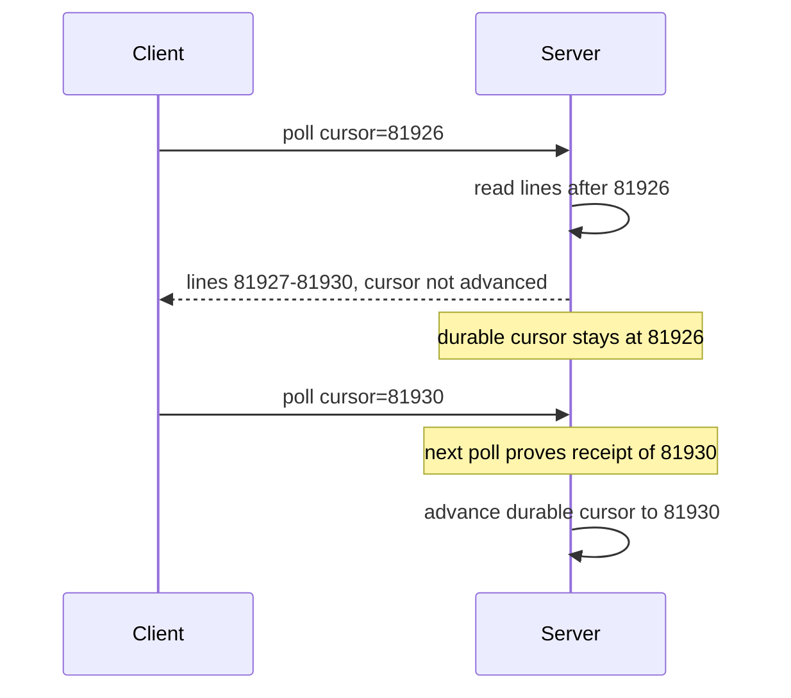

# Streaming live logs to the browser without WebSockets

*how to push log lines to a browser in real time when WebSockets are blocked, and the four mechanisms that work instead*

Every internal tool eventually grows a live-logs tab, and someone opens it expecting lines to scroll in real time. Most reach for WebSockets first. A WebSocket is a persistent two-way connection that runs over a single TCP connection (TCP, Transmission Control Protocol, is the reliable byte-stream channel underneath HTTP). It works until traffic crosses an intermediary that strips a header the WebSocket needs, and then the connection fails with HTTP status 504 (Gateway Timeout: an intermediary gave up waiting for a usable response) every 30 seconds.

I use "transport" to mean the wire mechanism: how bytes travel between server and browser.

The running example is a log-tailing service I will call `tailroom`. Its input is bursty: a quiet baseline, then spikes when one process dumps a few thousand lines in a couple of seconds. A user opens a job page and wants to see lines as they are produced, ideally with under a second of delay (that delay is the latency), and wants the page to keep up.

## Why WebSockets fail in the wild

A WebSocket starts as an ordinary HTTP/1.1 `GET` carrying an `Upgrade: websocket` header. (This is the opening handshake, defined in RFC 6455. An RFC is a numbered internet standards document.) The `Upgrade` header asks the server to switch from HTTP to the WebSocket protocol; the server answers with HTTP status 101, "Switching Protocols," after which both sides exchange data in *frames*: small binary records each prefixed with its own length. Three intermediary behaviors can break that path.

A proxy can fail to understand the protocol. A proxy is a server in the middle of a connection that forwards traffic; a reverse proxy sits in front of your app and forwards client requests to it. `Upgrade` and `Connection` are what RFC 7230 calls hop-by-hop headers: they describe a single segment of the connection and are not forwarded onward, so each intermediary consumes its own copy. A proxy that only speaks HTTP/1.1 and does not implement the upgrade just opens a plain `GET` to the origin. (The origin is the server identified by scheme, host, and port, for example `https://app.example.com:443`.) The client was waiting for a `101` carrying a correct `Sec-WebSocket-Accept` value, derived from the `Sec-WebSocket-Key` it sent to prove the server did the handshake; instead it gets an ordinary `200 OK` from the route handler, gives up, and fires `error` then `close`.

An idle timeout can kill the flow. A load balancer (LB) is the device that spreads incoming traffic across several servers. Many default to roughly a 60s idle timeout: close the connection if no bytes move for that long. AWS Application Load Balancer (ALB) is 60s; nginx, a widely used reverse proxy, has the same default in `proxy_read_timeout`. It trips only when no bytes move either direction, which is why streaming apps send a periodic heartbeat.

An intermediary can drop some frames. A security appliance that understands WebSocket framing might cap the frame size or block certain frame types, so small text frames pass and large binary ones disappear. The connection stays up while messages vanish.

From the browser's side, none of these look like "WebSockets are blocked"; they look like flaky reconnects. The same three on one tab's path:

```
   browser              corporate proxy             origin
  ┌───────┐            ┌────────────────┐         ┌────────┐
  │  tab  │── GET ────▶│ HTTP/1.1 only  │── ?? ──▶│  app   │
  │       │  Upgrade:  │                │         │        │
  │       │  websocket │ [1] strips     │         │        │
  │       │            │     Upgrade    │         │        │
  │       │◀── 200 ────│ [2] 60s idle   │◀────────│        │
  │       │   (no ws)  │     timeout    │         │        │
  │       │            │ [3] inspects   │         │        │
  └───────┘            │     frames     │         └────────┘
                       └────────────────┘
```

The deeper treatment of LB idle timeouts and replay-on-reconnect lives in blog 01; the takeaway is to stop fighting the proxy and pick a transport it understands.

## Transport 1: Server-Sent Events

Server-Sent Events (SSE) is the obvious first choice and usually the right one: an HTTP/1.1 GET request whose response never closes, sent with a `Content-Type` of `text/event-stream`. The content type tells the browser what kind of data the body holds; this one is reserved for SSE and tells it to parse the body line by line, in the format below.

```
GET /jobs/42/stream HTTP/1.1
Accept: text/event-stream

HTTP/1.1 200 OK
Content-Type: text/event-stream
Cache-Control: no-cache
X-Accel-Buffering: no

data: worker-3 | 14:02:11 | linking stage 2
id: 81923

data: worker-1 | 14:02:11 | test suite passed (244/244)
id: 81924

: keepalive
```

`X-Accel-Buffering: no` tells a reverse proxy not to buffer this response.

That last line, starting with a colon, is an SSE comment. The HTML standard is maintained by a group called WHATWG, and per their spec a line whose first character is a colon is ignored by the browser. The spec calls out this kind of comment as a keepalive: a byte sent on a schedule purely to keep an intermediary from declaring the connection idle. The browser ignores it, but proxies see the bytes and reset their idle timers. A heartbeat every 15-30s, tuned to the shortest idle timeout on your path, keeps most proxies from idle-killing it.

One spec detail: SSE events are terminated by a blank line, and a multi-line payload repeats the `data:` prefix on each line, which the browser joins with newlines into one `event.data` string.

The browser side is built in:

```js
const es = new EventSource(`/jobs/${jobId}/stream?since=${lastId}`);
es.onmessage = (e) => appendLine(e.data);
es.onerror = () => {
  // Browser auto-reconnects with Last-Event-ID header
  // (only once it has actually received an event with id:).
  // You don't need to write reconnect logic.
};
```

`EventSource` reconnects on its own and sends back the last `id:` it saw, as a `Last-Event-ID` request header. One caveat on the retry delay: the spec defines a single flat reconnection delay (a few seconds, implementation-defined) that the server can override with a `retry:` field in milliseconds. It is a fixed interval, not exponential backoff (where each failed retry waits longer than the last), so the browser will not back off under sustained failure. The genuinely useful part is the resume cursor, the saved position marker tracked for you: it only sends `Last-Event-ID` once it has received an event carrying an `id:` field, so without ids you get reconnect but no resume. That automatic round trip is unique to SSE.

The catches:

- One direction only, server to client. A "pause tailing" click that the server needs to know about is a separate POST request.
- No binary. The body is UTF-8 text framed by newlines. (UTF-8 is the standard text encoding where each character takes 1 to 4 bytes.) To send binary you encode it as base64, which represents raw bytes as plain ASCII text, or better, keep binary out of the log stream.
- Per-host connection budget. A long-lived SSE connection holds one of the browser's per-origin slots for its entire life.

## Transport 2: chunked HTTP with a long-lived response

Before SSE, people did this by hand: the server holds the response open and writes pieces as data arrives. This is "chunked transfer," an HTTP/1.1 feature where the server sends the body as a series of chunks instead of one fixed-length block, keeping the response open indefinitely. (HTTP/1.0, the older version, has no such feature.) The client uses `fetch` and reads the body as a `ReadableStream`, a browser interface that hands you bytes as they arrive rather than after the whole response.

```js
const res = await fetch(`/jobs/${jobId}/stream-raw`);
const reader = res.body.getReader();
const decoder = new TextDecoder();
let buf = '';
while (true) {
  const { value, done } = await reader.read();
  if (done) break;
  buf += decoder.decode(value, { stream: true });
  let nl;
  while ((nl = buf.indexOf('\n')) !== -1) {
    appendLine(buf.slice(0, nl));
    buf = buf.slice(nl + 1);
  }
}
// Flush any trailing partial UTF-8 sequence held by the decoder.
buf += decoder.decode();
if (buf) appendLine(buf);
```

`TextDecoder` (which turns bytes into text) with `{ stream: true }` is the important part. A single UTF-8 character is 1 to 4 bytes, and a network read can hand you a buffer that ends partway through a multi-byte character. With `{ stream: true }` the decoder holds that partial sequence across reads, so an emoji split across two reads comes out intact. The final `decoder.decode()` with no argument flushes whatever is still buffered at close.

Why do this instead of SSE? Three reasons hold up. You want to stream binary directly (formats like protobuf or msgpack, compact binary serialization formats) without base64. Or you need custom framing with sequence numbers or batch markers that SSE's flat event model cannot express. Or some intermediary dislikes the `text/event-stream` content type: I once saw an old web application firewall (a WAF, the inline filter that inspects HTTP traffic for attacks) buffer SSE entirely yet stream `application/octet-stream` (the content type for arbitrary binary data) fine. The cost: you write your own reconnect, resume, and keepalive, with no `Last-Event-ID` for free.

One important detail: with an nginx or similar reverse proxy in front, set `X-Accel-Buffering: no` on the response. nginx's `proxy_buffering` setting (a directive controlling how it forwards a response) is on by default, so without it your "live" stream arrives in delayed bursts. Buffering is the most common cause of "streams locally but not in prod," but not the only one: gzip can also buffer; an HTTP/1.0 upstream disables chunked transfer, so you often need `proxy_http_version 1.1;`; and `proxy_read_timeout` can cut the connection. Same symptom; check buffering first.

## Transport 3: long-polling

Long-polling is the fallback when nothing streaming works. The client makes a normal HTTP request; the server holds it open until there are new log lines to return or a timeout (typically 25-30 seconds) elapses. The server returns, the client reads the data and immediately fires another request carrying a cursor (the saved position it has read up to).

```
GET /jobs/42/poll?cursor=81924&max_wait=25s
=> [{ id: 81925, line: "..." }, { id: 81926, line: "..." }]

GET /jobs/42/poll?cursor=81926&max_wait=25s
=> []   // 25s elapsed with no new data

GET /jobs/42/poll?cursor=81926&max_wait=25s
=> [{ id: 81927, ... }]
```

This works everywhere; I have shipped it into environments so locked down even SSE was buffered. Three real downsides. A latency floor: the gap between "server returns" and "client fires the next request" (5-50ms) where new lines pile up. Request amplification: one request per gap, so a 1-hour job with 10 viewers polling every 8 seconds is about 4,500 requests. And the cursor is awkward: "advance the cursor" and "deliver the lines" cannot be one atomic operation (atomic meaning all-or-nothing, no partial result), because the response could be lost on the way back, so the server never learns whether the client got those lines.



The fix is to treat the *next* request as proof of receipt: when the client comes back asking for lines after 81930, that request can only have been built from a response it received, so the server now knows 81930 arrived. Until then it keeps the old cursor and may re-send, so a lost response just means the next poll re-reads from 81926 rather than leaving a gap.

Long-polling wins with few viewers, low update frequency, and a network so hostile nothing else works. Also when every request must pass through a strict authentication layer (the part that checks who the caller is) with short-lived tokens, since each poll re-authenticates.

## Transport 4: message-bus fan-out

The first three transports move bytes from your HTTP server to the browser. This fourth is a different problem: how do the lines from N workers reach the HTTP server at all?

In the naive design, each worker writes its log lines somewhere (a database, a file, a tailing socket) and the HTTP server polls or tails that for every connected browser. This falls over once you have a few of each: N times M open file handles, or N times M database queries per second.

The fix is a fan-out bus. Fan-out means one source delivered to many consumers. Workers publish lines to a single topic, keyed by job ID. A topic is a named channel; this messaging style is called publish-subscribe, or pub/sub: publishers send to a topic and any number of subscribers receive them, without either side knowing the other. The HTTP server subscribes once per browser and forwards what it receives.

```
worker-1 ──┐
worker-2 ──┼──► [bus topic: job.42] ──┬──► browser A (via SSE)
worker-3 ──┘                          ├──► browser B (via SSE)
                                      └──► browser C (via chunked HTTP)
```

A minimal bridge from Redis pub/sub into SSE is about ten lines of Node. (Redis is an in-memory datastore with a built-in pub/sub bus.)

```js
import { createClient } from 'redis';
import express from 'express';

const app = express();
app.get('/jobs/:id/stream', async (req, res) => {
  res.set({
    'Content-Type': 'text/event-stream',
    'Cache-Control': 'no-cache',
    'X-Accel-Buffering': 'no',
  });
  const sub = createClient();
  await sub.connect();
  await sub.subscribe(`job.${req.params.id}`, (line, channel) => {
    res.write(`data: ${line}\n\n`);
  });
  req.on('close', () => sub.quit());
});
```

Workers run `PUBLISH job.42 "<line>"` and every subscribed HTTP handler forwards it. This version opens one Redis subscriber per browser, the first thing to consolidate as viewers climb: the production shape is a single shared subscriber per process that demultiplexes by channel, splitting the one combined stream into separate per-job streams.

What counts as "the bus"? Whatever you already run. Redis pub/sub is simple and fine at low to moderate scale. NATS, a lightweight messaging system, is nicer if you want subject hierarchies like `job.42.worker.3` plus reliable delivery. Kafka, a distributed log and streaming platform, is more than you need for live tailing, but if you already run it for log archival you can subscribe to the same topic from your tailing API for free fan-out.

One thing to avoid: do not have each worker push directly to a per-browser endpoint. That couples worker code to UI connection state; workers should not care who is watching.

## The per-tab connection budget

Browsers cap concurrent HTTP/1.1 connections per origin at **6**. Chrome and Edge use 6 in the Chromium source (`net/socket/client_socket_pool_manager.cc`); Firefox's `network.http.max-persistent-connections-per-server` preference defaults to 6. Treat 6 as the portable ceiling.

For a single log-tailing page, that is fine: one SSE connection, five spare. But the limit counts every connection to that origin, so JavaScript chunks, images, and other page-load requests compete for the same six. Open five job tabs at once, each holding an SSE connection, and you are at five of six before the sixth tab fetches its assets; that load spins, blocked, until an SSE connection closes.

This is the bug filed as "the dashboard randomly freezes with a lot of tabs open."

Three ways to deal with it:

1. **Use HTTP/2.** Where HTTP/1.1 needs a separate TCP connection per in-flight request, HTTP/2 multiplexes: it carries many independent request/response streams at once over one TCP connection. The 6-per-origin limit then becomes effectively irrelevant, making SSE over HTTP/2 the cleanest fix. It raises the cap rather than removing it: a per-connection limit still applies through `SETTINGS_MAX_CONCURRENT_STREAMS`, a value each side advertises in a settings frame at the start of the connection, typically 100 or more, plenty for tailing. The catch: some old proxies do not speak HTTP/2 either, leaving you back where you started.

2. **Share one connection across tabs with a SharedWorker.** A `SharedWorker` is a background script shared by all tabs of the same origin. One holds a single SSE connection, subscribes to every job ID the user is watching, and uses `postMessage` (the browser API for sending data between a worker and a page) to deliver lines to each tab. Works in production, but harder to maintain than the others.

3. **Domain sharding.** Serve your streaming endpoint from `stream.example.com` instead of `app.example.com`. The 6-connection limit is per origin, so streaming on a separate origin does not compete with page loads. This is the practical fix for HTTP/1.1 environments and costs one TLS certificate (the cert that proves the domain's identity) and one DNS record (the Domain Name System entry that maps the name to an address).

## Backpressure: what happens when the user opens a 4-hour job

Backpressure is what happens when data arrives faster than the consumer can handle it. A common case: a user opens a job that ran four hours and produced 600,000 log lines, then wants to scroll back to line 30,000 for one warning.

Shipping all 600,000 lines on connect does not work. Even at 1KB per line that is 600MB in a browser tab. The DOM cost alone (the DOM, or Document Object Model, is the in-memory tree of page elements the browser builds, with one node per line plus whatever off-screen scrollback your virtualizer keeps live) runs the tab out of memory before you finish receiving; on a 4GB laptop it hits OOM (out of memory) and crashes. This browser-tab memory ceiling is the part specific to log streaming; the server-side queue policy is blog 01's territory.

Two parts to the fix:

1. **Tail and browse are different modes.** The live stream gives the most recent N lines, then tails new ones. Scrolling backwards is a separate paginated request against a backing store: a database, an object store (a service that stores files as objects), or whatever you have. One endpoint should not do both.

2. **Cap what the tab holds.** Pick a ceiling, say 20,000 lines, and once you cross it, evict from the top with an "older lines available via search" affordance. At ~200 bytes per line that is roughly 4MB resident. Pair it with a virtualized scroll list (react-window, TanStack Virtual, or your framework's equivalent), which renders only the visible rows, so total tab footprint stays in tens of MB, not hundreds.

## Reconnect semantics

Three things disconnect your stream: the network blipping, the laptop sleeping, and the proxy's idle timeout. The general pattern, stamp every event with a sequence number and replay on reconnect, is covered in blog 01. The SSE-specific shortcut:

Since the browser sends `Last-Event-ID` on reconnect for free, your server has to:

- Replay buffered events from that ID, then continue live.
- Keep a small in-memory window per job, indexed by ID, so replay is an O(1) lookup (O(1), or constant time, means the work to find the entry does not grow as the buffer fills) plus a range scan over the records after it.

That window is a ring buffer: a fixed-size circular store of the most recent `{id, line}` records that overwrites the oldest once full, so memory stays bounded however long the job runs. Because ids are monotonic (always increasing), the lookup is just arithmetic: the slot for a given id is `(id - baseId) % size`. In pseudocode:

```js
app.get('/jobs/:id/stream', (req, res) => {
  const buf = ringBufferFor(req.params.id);   // [{id, line}, ...]
  const since = parseInt(req.header('Last-Event-ID') || '0', 10);

  // 1. Replay everything in the ring buffer after `since`.
  //    If `since` is older than the buffer's oldest entry, the
  //    client missed lines that have already been evicted.
  if (since && since < buf.oldestId()) {
    res.write(`event: gap\ndata: replay window exceeded\n\n`);
  }
  for (const ev of buf.sliceAfter(since)) {
    res.write(`id: ${ev.id}\ndata: ${ev.line}\n\n`);
  }

  // 2. Subscribe live and forward new events as they arrive.
  const unsub = buf.onAppend((ev) => {
    res.write(`id: ${ev.id}\ndata: ${ev.line}\n\n`);
  });
  req.on('close', unsub);
});
```

The `gap` event matters: if the disconnect outlasted the window, the requested id is already evicted, so rather than silently drop those lines you tell the client to fall back to the paginated browse store. The window size is the one parameter to tune: too short and a 60-second laptop-lid-close causes a gap; too long and a popular job eats your RAM. I start at 5 minutes and adjust from reconnect-gap data.

## Picking one

In the table, "S to C" means server-to-client (one direction), and "Bi (req)" means two-way via a fresh request each time.

| Transport     | Direction | Binary       | Built-in reconnect + cursor      | Proxy friendly | Request amplification | When to pick                                  |
|---------------|-----------|--------------|----------------------------------|----------------|-----------------------|-----------------------------------------------|
| SSE           | S to C    | No (text)    | Yes (`Last-Event-ID` in browser) | High           | 1 long-lived GET      | Default; generic live tail                    |
| Chunked HTTP  | S to C    | Yes          | No (DIY)                         | High           | 1 long-lived GET      | Binary framing or SSE specifically buffered   |
| Long-polling  | Bi (req)  | Yes (body)   | DIY cursor on every poll         | Highest        | High (one req per gap)| Hostile networks where streaming is blocked   |
| Bus fan-out   | N/A       | Bus-dependent| N/A (it's the backend, not wire) | N/A            | 1 sub per viewer      | Whenever N workers fan out to M viewers       |

For a generic "tail logs from N workers to a browser tab" problem, my default is SSE with Redis pub/sub backing the fan-out, served from a sharded subdomain. That handles about 85% of cases. Chunked HTTP if I need binary framing or a hostile intermediary buffers SSE specifically; long-polling only after verifying nothing streaming works. The transport is the straightforward part; the connection budget, backpressure, and resume protocol decide whether the page actually works.
