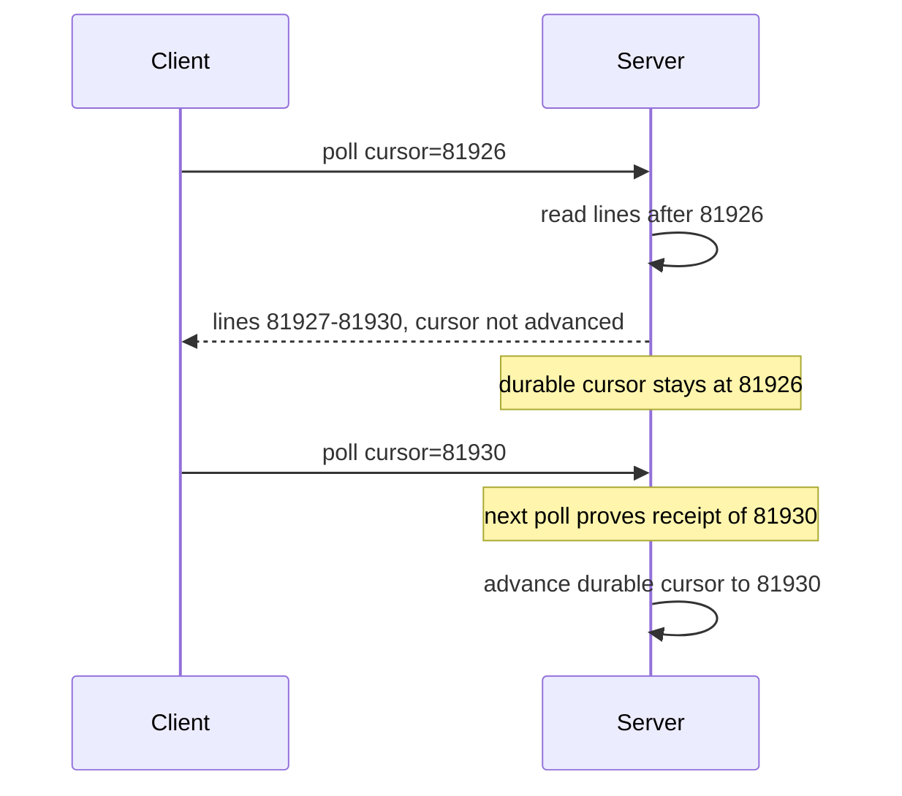

# Streaming live logs to the browser without WebSockets

*four boring transports, one annoying corporate proxy, and the connection budget nobody warns you about*

Every internal tool grows a live-logs tab. Someone opens the page and expects lines to scroll in real time. The first instinct is always the same: WebSockets. It works until traffic crosses a proxy that strips the `Upgrade` header and the connection degrades to a 504 every 30 seconds.

This post is about what to do when WebSockets aren't on the table. I'll walk through the four transports that actually survive in hostile network environments, what each one costs, and the per-tab connection budget that will eventually bite you no matter which one you pick.

The example throughout: a log-tailing service I'll call `tailroom`. Its input is bursty by nature, a quiet baseline punctuated by spikes when a build hits its link stage and a single process dumps a few thousand lines in a couple of seconds. A user opens a job page and wants to see lines as they're emitted, ideally with under a second of latency, and they expect the page to keep up when the burst hits.

## Why WebSockets fail in the wild

A WebSocket starts life as an ordinary HTTP/1.1 `GET` carrying an `Upgrade: websocket` header (the opening handshake, RFC 6455). The server is supposed to answer `101 Switching Protocols`, after which both sides stop speaking HTTP and exchange data in *frames*, small length-prefixed binary records. Three independent intermediary behaviors can break that path:

- **A proxy doesn't speak the protocol.** `Upgrade` and `Connection` are hop-by-hop headers (RFC 7230): each connection segment consumes them rather than passing them on. An HTTP/1.1-only proxy that doesn't implement the upgrade opens a plain `GET` to the origin, which answers with its normal route handler. The client requires a `101` carrying a correct `Sec-WebSocket-Accept` (derived from its `Sec-WebSocket-Key` to prove the server did the handshake); it instead gets an ordinary `200`, aborts, and fires `error` then `close`. The socket observably never opens.
- **An idle timeout kills the flow.** Many load balancers default to roughly a 60s idle timeout (AWS ALB is 60s; nginx's `proxy_read_timeout` is also 60s). The timer fires only when *no bytes move in either direction* for the interval, which is exactly why streaming apps add keepalives.
- **An intermediary drops some frames.** A security appliance that understands WebSocket framing may cap frame size or filter certain frame types, so small text frames pass and big binary ones vanish. The connection stays up; specific messages just disappear.

None of these look like "WebSockets are blocked" from the browser's side; they look like flaky reconnects and an on-call ticket the next morning. Here are the same three behaviors, marked `[1]` `[2]` `[3]`, in the path a single tab takes:

```
   browser              corporate proxy             origin
  ┌───────┐            ┌────────────────┐         ┌────────┐
  │  tab  │── GET ────▶│ HTTP/1.1 only  │── ?? ──▶│  app   │
  │       │  Upgrade:  │                │         │        │
  │       │  websocket │ [1] strips     │         │        │
  │       │            │     Upgrade    │         │        │
  │       │◀── 200 ────│ [2] 60s idle   │◀────────│        │
  │       │   (no ws)  │     timeout    │         │        │
  │       │            │ [3] inspects   │         │        │
  └───────┘            │     frames     │         └────────┘
                       └────────────────┘
```

`[1]` is why your connection becomes a regular HTTP/1.1 GET. `[2]` is why "it works for 30 seconds then dies" gets reported. `[3]` is why some frames make it and others don't. A deeper treatment of LB idle timeouts and replay-on-reconnect lives in the companion piece I refer to as blog 01. Once you've debugged this twice, you stop fighting the proxy and pick a transport it understands natively.

## Transport 1: Server-Sent Events

SSE is the obvious first choice and usually the right one. It's just an HTTP/1.1 GET that never closes, with a `text/event-stream` content type and a specific line format the browser parses for you.

```
GET /jobs/42/stream HTTP/1.1
Accept: text/event-stream

HTTP/1.1 200 OK
Content-Type: text/event-stream
Cache-Control: no-cache
X-Accel-Buffering: no

data: worker-3 | 14:02:11 | linking stage 2
id: 81923

data: worker-1 | 14:02:11 | test suite passed (244/244)
id: 81924

: keepalive
```

`X-Accel-Buffering: no` tells a reverse proxy not to buffer this response; without it the proxy can accumulate your "live" stream and deliver it in lumps. More in the chunked-HTTP section.

That last line, starting with a colon, is an SSE comment. Per the WHATWG HTML spec a line whose first character is a colon is ignored by the browser, and the spec calls out this kind of comment as a keepalive. Proxies still see the bytes, so the comment resets their idle timers. The right cadence depends on the shortest idle timeout on your path; a heartbeat every 15-30s keeps the vast majority of corporate proxies from idle-killing the connection.

One spec detail worth knowing: SSE events are terminated by a blank line, and multi-line payloads use repeated `data:` prefixes which the browser joins with newlines into a single `event.data` string. So a 3-line log entry is three `data:` lines followed by one blank line, not three separate events.

The browser side is built in:

```js
const es = new EventSource(`/jobs/${jobId}/stream?since=${lastId}`);
es.onmessage = (e) => appendLine(e.data);
es.onerror = () => {
  // Browser auto-reconnects with Last-Event-ID header
  // (only once it has actually received an event with id:).
  // You don't need to write reconnect logic.
};
```

`EventSource` reconnects on its own and automatically sends back the last `id:` it saw as a `Last-Event-ID` request header. One caveat on the backoff: the spec defines a single flat reconnection delay (a few seconds, implementation-defined) that the server can change with a `retry:` field in milliseconds, applied until the next `retry:`. It is a fixed interval, not exponential backoff, so don't count on the browser to back off under sustained failure. What you *do* get for free is the cursor: the browser tracks it, not you. It only sends `Last-Event-ID` once it has received an event carrying `id:`; if your stream never emits ids, you get reconnect but no replay cursor. This round trip is genuinely unique to SSE; with chunked HTTP or WebSockets you build the equivalent by hand. It is the reason I reach for SSE first.

The catches:

- **One direction only.** Server to client. If the user clicks a "pause tailing" button and you want the server to know, that's a separate POST.
- **No binary.** It's UTF-8 text framed by newlines. Encode binary as base64 or, better, don't put binary in your log stream.
- **Per-host connection budget.** A long-lived SSE connection eats one of a browser's per-origin connection slots for its entire life. Its own section below covers this.

## Transport 2: chunked HTTP with a long-lived response

Before SSE existed, people did this manually. The server holds the response open and writes chunks as data arrives. The client uses `fetch` with a `ReadableStream` and parses chunks itself.

```js
const res = await fetch(`/jobs/${jobId}/stream-raw`);
const reader = res.body.getReader();
const decoder = new TextDecoder();
let buf = '';
while (true) {
  const { value, done } = await reader.read();
  if (done) break;
  buf += decoder.decode(value, { stream: true });
  let nl;
  while ((nl = buf.indexOf('\n')) !== -1) {
    appendLine(buf.slice(0, nl));
    buf = buf.slice(nl + 1);
  }
}
// Flush any trailing partial UTF-8 sequence held by the decoder.
buf += decoder.decode();
if (buf) appendLine(buf);
```

`TextDecoder` with `{ stream: true }` is the important bit. A UTF-8 character is 1 to 4 bytes, and a network `read()` can return a buffer ending partway through a multi-byte character. With `{ stream: true }` the decoder holds the partial sequence across reads, so an emoji split across two `read()` calls comes out intact instead of as two pieces of garbage. The final `decoder.decode()` with no argument flushes anything still buffered when the server closes the stream.

Why do this instead of SSE? Three reasons hold up: you want to stream binary (protobuf, msgpack) and don't want to base64 it; you need custom framing with sequence numbers or batch markers that SSE's flat event model can't express; or some intermediary doesn't like the `text/event-stream` content type. I've seen one ancient WAF (web application firewall, the inline filter that inspects HTTP traffic for attacks) that buffered SSE responses entirely but happily streamed `application/octet-stream`.

The cost: you write your own reconnect, resume, and keepalive. There's no `Last-Event-ID` magic.

One important detail: if there's an Nginx or similar reverse proxy in front of your app, set `X-Accel-Buffering: no` on the response. Nginx's `proxy_buffering` is on by default, so your "live" stream arrives in delayed bursts. Buffering is the leading cause of "streams locally but not in prod," though not the only one: gzip buffering, an HTTP/1.0 upstream that disables chunked transfer (you often need `proxy_http_version 1.1;`), and `proxy_read_timeout` cutting the connection all produce the same symptom. Check buffering first.

## Transport 3: long-polling

Long-polling is the fallback when nothing streaming works. The client makes a normal HTTP request. The server holds it open until either (a) there are new log lines to return, or (b) some timeout (typically 25-30 seconds) elapses. The server returns, the client reads the data, and immediately fires another request with a cursor.

```
GET /jobs/42/poll?cursor=81924&max_wait=25s
=> [{ id: 81925, line: "..." }, { id: 81926, line: "..." }]

GET /jobs/42/poll?cursor=81926&max_wait=25s
=> []   // 25s elapsed with no new data

GET /jobs/42/poll?cursor=81926&max_wait=25s
=> [{ id: 81927, ... }]
```

This works literally everywhere. I've shipped long-polling to environments so locked down that even SSE was buffered. It's also miserable on three fronts. There's a latency floor between "server returns" and "client fires the next request" where lines pile up (5-50ms). Request amplification is brutal: one request per gap, so a 1-hour job watched by 10 viewers on an 8s cadence is about 4,500 requests for the hour. And cursor handling is a trap: you can't make "advance cursor" and "deliver" one atomic unit, because delivery crosses an unreliable network and you never know for sure the client received it.



The fix is to treat the *next* request as proof of receipt. Until the client polls with the new value, the server keeps the old cursor and is free to re-send; a lost response just means the next poll re-reads from 81926 instead of leaving a gap.

When does long-polling win? When you have few viewers, low update frequency, and a network so hostile that nothing else works. Also when every request must go through a strict auth layer with short-lived tokens, because each poll re-authenticates naturally.

## Transport 4: message-bus fan-out

The first three transports are about how bytes get from your HTTP server to the browser. This fourth one is about a different problem: how do the log lines from N workers get to the HTTP server in the first place?

In the naive design, each worker writes its log lines somewhere (a database, a file, a tailing socket) and the HTTP server polls or tails that thing for every connected browser. This falls over the moment you have a few workers and a few viewers. Now you have N times M open file handles or N times M database queries per second.

The fix is a fan-out bus. Workers publish lines to a single topic, keyed by job ID. The HTTP server subscribes once per connected browser and forwards what it receives.

```
worker-1 ──┐
worker-2 ──┼──► [bus topic: job.42] ──┬──► browser A (via SSE)
worker-3 ──┘                          ├──► browser B (via SSE)
                                      └──► browser C (via chunked HTTP)
```

A minimal Redis pub/sub bridge into SSE is about ten lines of Node:

```js
import { createClient } from 'redis';
import express from 'express';

const app = express();
app.get('/jobs/:id/stream', async (req, res) => {
  res.set({
    'Content-Type': 'text/event-stream',
    'Cache-Control': 'no-cache',
    'X-Accel-Buffering': 'no',
  });
  const sub = createClient();
  await sub.connect();
  await sub.subscribe(`job.${req.params.id}`, (line, channel) => {
    res.write(`data: ${line}\n\n`);
  });
  req.on('close', () => sub.quit());
});
```

Workers `PUBLISH job.42 "<line>"` and every subscribed HTTP handler forwards it: N workers fan out through one topic instead of coupling to each viewer. Note that this minimal version opens one Redis subscriber per browser, which is fine at low to moderate scale but is the first thing to consolidate as viewer counts climb; a single shared subscriber per process, demultiplexing by channel, is the production shape.

What's "the bus"? Whatever you already have. Redis pub/sub works fine at low to moderate scale and is dead simple. NATS is nicer if you want subject hierarchies (`job.42.worker.3`) and reliable delivery. Kafka is overkill for live tailing, but if you're already using it for log archival you can subscribe to the same topic from your tailing API and get fan-out for free.

The one thing to avoid: don't have each worker push directly to a per-browser endpoint. That couples your worker code to your UI's connection state. Workers should not know or care who's watching.

## The per-tab connection budget

Browsers cap concurrent HTTP/1.1 connections per origin at **6**. Chrome and Edge use 6 in the Chromium source (`net/socket/client_socket_pool_manager.cc`); Firefox's `network.http.max-persistent-connections-per-server` pref defaults to 6 as well. Treat 6 as the portable ceiling.

For a single log-tailing page, that's fine: one SSE connection, five spare. But the limit is per-origin total, so the page load itself competes with SSE for slots (JS chunks, images, XHRs all draw from the same six). If your user opens five job tabs at once, each holding an SSE connection, they're at five out of six before the sixth tab even starts fetching its assets, and that next page load blocks waiting for a slot. The page sits there spinning until one of the SSE connections closes.

This is the bug that gets filed as "the dashboard randomly freezes when I have a lot of tabs open" and it is genuinely hard to debug because nothing is broken. The browser is doing exactly what the spec says.

Three ways to deal with it:

1. **Use HTTP/2.** Where HTTP/1.1 needs a separate TCP connection per in-flight request, HTTP/2 multiplexes many logical streams over one TCP connection, so the 6-per-origin limit becomes effectively irrelevant. SSE over HTTP/2 is the cleanest fix. It raises the limit but doesn't eliminate it: a per-connection cap still applies via `SETTINGS_MAX_CONCURRENT_STREAMS` (the value each peer advertises in its settings frame), typically 100 or more, which is plenty for tailing. The other catch: some old proxies don't speak HTTP/2 either, and you might be back where you started.

2. **Share one connection across tabs with a SharedWorker.** A `SharedWorker` is shared by all tabs of the same origin. One SharedWorker holds one SSE connection, subscribes to all the job IDs the user is watching, and uses `postMessage` to deliver lines to each tab. This works and I've seen it in production, but the developer ergonomics are not great.

3. **Domain sharding.** Serve your streaming endpoint from `stream.example.com` instead of `app.example.com`. The 6-connection limit is per origin, so streaming traffic doesn't compete with regular page loads. This is the pragmatic fix for HTTP/1.1 environments and costs you one cert and one DNS record.

## Backpressure, or what happens when the user opens a 4-hour job

Here's a scenario that will eventually happen: a user opens a job that's been running for four hours and has produced 600,000 log lines. They want to scroll back to line 30,000 to find that one warning. What does your system do?

The wrong answer is to ship all 600,000 lines down the wire on connect. Even at 1KB per line that's 600MB held in a browser tab. The DOM cost alone (one node per line, plus whatever scrollback your virtualizer keeps live) will OOM the tab on a 4GB laptop long before you finish receiving. The browser-tab memory ceiling is the part that's actually specific to log streaming, separate from any server-side queue policy (which is blog 01's territory).

The right answer has two parts:

1. **Tail vs. browse are different modes.** The live stream gives you the most recent N lines and then live tails. Scrolling backwards is a separate paginated request against a backing store (database, object store, whatever). Don't try to make one endpoint do both.

2. **Cap what the tab holds.** Pick a ceiling, say 20,000 lines, and once you cross it, evict from the top with an "older lines available via search" affordance. At ~200 bytes per line that's roughly 4MB of raw text resident; pair it with a virtualized scroll list (react-window, TanStack Virtual, your framework's equivalent) so the DOM only renders the visible window and total tab footprint stays in the tens of MB rather than hundreds.

## Reconnect semantics, because everything disconnects

Three things will disconnect your stream: the network blipping, the user's laptop going to sleep, and the proxy's idle timeout. All three will happen. The general "stamp every event with a sequence number and replay on reconnect" pattern is covered in blog 01; what's worth saying here is the SSE-specific shortcut.

With `EventSource`, the browser remembers the last `id:` it received and, on reconnect, automatically sends it as the `Last-Event-ID` request header. Your server just has to:

- Read `Last-Event-ID` from the reconnect request (if present).
- Replay buffered events from that ID, then continue live.
- Keep a small in-memory window per job, indexed by ID, so replay is O(1) lookup followed by a range scan.

That window is a ring buffer: a fixed-size circular store of the most recent `{id, line}` records that overwrites the oldest entry once full, so memory stays bounded no matter how long the job runs. Because ids are monotonic, the O(1) lookup is just arithmetic: the slot for a given id is `(id - baseId) % size`. In pseudocode, the handler looks like this:

```js
app.get('/jobs/:id/stream', (req, res) => {
  const buf = ringBufferFor(req.params.id);   // [{id, line}, ...]
  const since = parseInt(req.header('Last-Event-ID') || '0', 10);

  // 1. Replay everything in the ring buffer after `since`.
  //    If `since` is older than the buffer's oldest entry, the
  //    client missed lines that have already been evicted.
  if (since && since < buf.oldestId()) {
    res.write(`event: gap\ndata: replay window exceeded\n\n`);
  }
  for (const ev of buf.sliceAfter(since)) {
    res.write(`id: ${ev.id}\ndata: ${ev.line}\n\n`);
  }

  // 2. Subscribe live and forward new events as they arrive.
  const unsub = buf.onAppend((ev) => {
    res.write(`id: ${ev.id}\ndata: ${ev.line}\n\n`);
  });
  req.on('close', unsub);
});
```

`buf.sliceAfter(since)` returns everything newer than `since`, and `buf.onAppend` fires for each new line as workers publish it. The `gap` event matters: if the disconnect lasted longer than the window holds, the requested id has already been evicted, so rather than silently drop those lines you tell the client to fall back to the paginated browse store. The window size is the one parameter to tune. Too short and a 60-second laptop-lid-close causes a gap; too long and a popular job eats your RAM. I usually start at 5 minutes and adjust based on actual reconnect-gap data.

## Picking one

| Transport     | Direction | Binary       | Built-in reconnect + cursor      | Proxy friendly | Request amplification | When to pick                                  |
|---------------|-----------|--------------|----------------------------------|----------------|-----------------------|-----------------------------------------------|
| SSE           | S to C    | No (text)    | Yes (`Last-Event-ID` in browser) | High           | 1 long-lived GET      | Default; generic live tail                    |
| Chunked HTTP  | S to C    | Yes          | No (DIY)                         | High           | 1 long-lived GET      | Binary framing or SSE specifically buffered   |
| Long-polling  | Bi (req)  | Yes (body)   | DIY cursor on every poll         | Highest        | High (one req per gap)| Hostile networks where streaming is blocked   |
| Bus fan-out   | N/A       | Bus-dependent| N/A (it's the backend, not wire) | N/A            | 1 sub per viewer      | Whenever N workers fan out to M viewers       |

If I'm starting from zero on a generic "tail logs from N workers to a browser tab" problem, my default is SSE with a Redis (or similar) pub/sub backing the fan-out, served from a sharded subdomain. That covers maybe 85% of cases.

I'd switch to chunked HTTP if I needed binary framing or a hostile intermediary was buffering SSE specifically. I'd switch to long-polling only after verifying that nothing streamy worked at all.

Transport is the easy part. Connection budget, backpressure, and resume protocol decide whether the page works.
