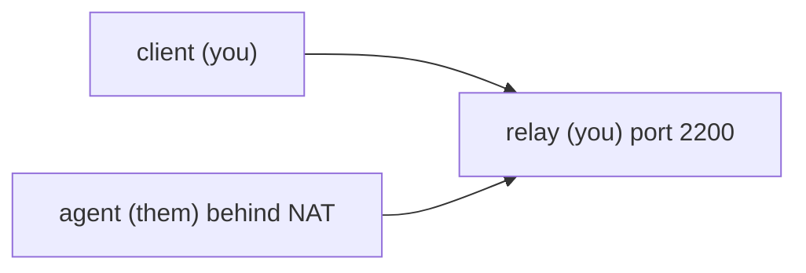
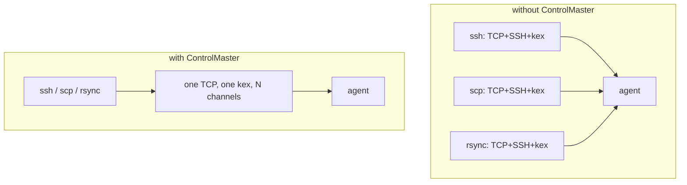
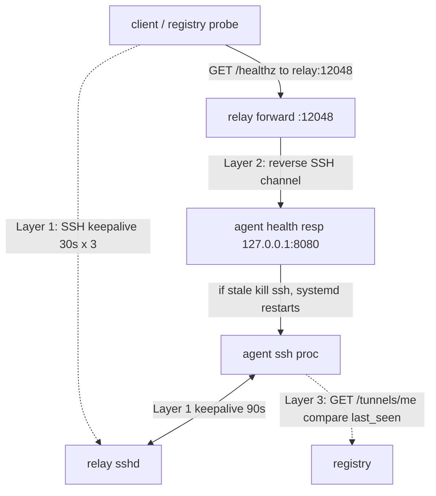

# Reverse-tunnel agents for hosts you cannot reach

*patterns for boxes you cannot SSH into directly*

You ship a customer appliance. It sits in their datacenter, behind their firewall, on a VLAN that drops inbound TCP on the floor, behind NAT that hides it behind one shared public address. The practical consequence: a connection you start from outside has nowhere to land. Your support contract says you will push firmware updates and pull diagnostic logs on demand. You cannot SSH in. You cannot port-forward to it. The customer's security team will not poke a hole for you, and you do not want them to.

What you can do is have the appliance dial out:

```bash
ssh -N -R 2200:localhost:22 tunnel@relay.example.net
```

Two flags carry this line. `-N` means "do not run a remote command, just hold the connection open." `-R 2200:localhost:22` is a *reverse* port forward: it asks the far end (the relay) to listen on port 2200 and pipe anything that arrives there back down this connection to the appliance's local port 22.

Here is the insight that makes the pattern work: an established TCP connection is bidirectional, and the firewall only blocks *new* inbound connections, never packets belonging to a connection already in flight. Once the appliance has dialed out and the SSH session is up, "inbound-feeling" traffic to port 2200 is just bytes traveling back along a connection the appliance itself opened. Anyone who can reach the relay can now SSH into the appliance through port 2200, while inbound from the customer's perspective stays firmly blocked.

## The basic shape

You have three roles:



The **agent** is the unreachable box. It runs the `ssh -N -R 2200:localhost:22 tunnel@relay.example.net` line above. The `-R` tells the relay: "open port 2200 on yourself, and any TCP connection that lands there, send it back down this SSH channel to my local port 22." With sshd's default `GatewayPorts no`, the relay binds that forwarded port to loopback only, so port 2200 answers from the relay itself but not from arbitrary external hosts. That is exactly what you want: clients reach the agent by hopping through the relay, and the final hop runs *on the relay*, where loopback resolves.

The **relay** is a small VM you own with a public IP that accepts SSH on 22 from anywhere you allow. It runs nothing special: a TCP rendezvous point with a stable address you can destroy and recreate from config. Sizing is modest. Each connected agent forks a per-connection sshd child, roughly 5 to 8 MB RSS (resident set size, the physical memory the process holds) when idle. That figure misleads for aggregate planning, because forked sshd children share their code, libc, and libcrypto pages copy-on-write, yet RSS counts those shared pages in every child even though the kernel pays for them once. A *dirty* page is one a process has written to; a *private* page is one not shared with any other process. The per-child cost you actually pay is the private-dirty pages each child adds, which is roughly its PSS (proportional set size: shared pages counted only by their fair share across the processes that share them, private pages counted in full). So a few thousand idle tunnels in 512 MB is achievable but optimistic, and depends entirely on sharing. CPU is a non-issue until you run heavy traffic through the channels.

The **client** is your CI runner, your laptop, or any system that wants to push commands to the agent. It uses `ProxyJump`:

```bash
ssh -J tunnel@relay.example.net -p 2200 root@localhost
```

`-J` (ProxyJump) tells SSH to first connect to the jump host, then open the real connection *from there*. From the relay's vantage point the agent lives at `localhost:2200`, the loopback port the relay forwards down the channel, so `-p 2200 root@localhost` evaluated on the relay lands on the agent. Everything else is what running it in production teaches you.

## Managing the connection from the wrong side

The first non-obvious thing: the agent is the only party that can establish the tunnel. The relay cannot dial out and create one. The process that manages the tunnel lives on the unreachable side, so you cannot just push it a new config and bounce it. You have to design it to recover from its own mistakes.

A systemd unit on the agent is the lightest reasonable thing that works:

```ini
[Unit]
Description=Reverse tunnel to relay
After=network-online.target
Wants=network-online.target

[Service]
ExecStart=/usr/bin/ssh -N -R 2200:localhost:22 \
    -o ServerAliveInterval=30 \
    -o ServerAliveCountMax=3 \
    -o ExitOnForwardFailure=yes \
    -o StrictHostKeyChecking=accept-new \
    -i /etc/tunnel/id_ed25519 \
    tunnel@relay.example.net
Restart=always
RestartSec=10
User=tunnel

[Install]
WantedBy=multi-user.target
```

Two of those options are worth naming. `-i /etc/tunnel/id_ed25519` points SSH at the agent's private key file, which the agent uses to prove who it is to the relay. `StrictHostKeyChecking=accept-new` tells SSH to trust the relay's host key the first time it sees it and record it, but to error out if that key ever changes afterward, which catches a relay that has been swapped out from under you.

Two SSH-specific gotchas the generic "let the supervisor restart it" advice does not cover. `ExitOnForwardFailure=yes` matters here. When the SSH process dies uncleanly, the relay's bound listener on port 2200 lingers for tens of seconds, because the relay's sshd has not yet noticed the parent connection is gone. When the agent reconnects, the new `-R 2200` bind fails because the old listener still owns the port, and by default SSH holds the tunnel open anyway. That is the zombie tunnel: the SSH connection is up, the agent thinks it published a port, but nothing on the relay routes to it, so every client connection hangs. `ExitOnForwardFailure=yes` makes SSH treat a bind failure as fatal and exit, so the supervisor restarts it. One caveat: this option only fires when the bind itself fails. It does not catch PermitOpen denials (PermitOpen is an sshd setting that restricts which host and port a forward may target, so a forward can be rejected for reasons other than the port being taken), downstream TCP failures, or a network that simply stops carrying packets (see `ssh_config(5)`).

The second gotcha involves two *different* keepalive mechanisms at different layers, and conflating them is the trap. The first is SSH's own application-level keepalive: the SSH process sends probe messages and gives up after a set count, and each side only watches the other. The agent's `ServerAliveInterval`/`ServerAliveCountMax` detect a dead *relay*; the relay's `ClientAliveInterval`/`ClientAliveCountMax` detect a dead *agent*. You need both, because neither side probes itself. The second mechanism is the kernel's TCP keepalive, below SSH entirely. If you do not set the relay's `ClientAlive*` options, the relay's sshd holds those zombie bound ports until the kernel's TCP keepalive finally tears the dead socket down, and that default is glacial: `tcp_keepalive_time` is 7200 seconds, two hours, before the first probe even fires (`man 7 tcp`, which also documents `tcp_keepalive_probes` and `tcp_keepalive_intvl`). So do not wait for the kernel: set the relay's `ClientAliveInterval`/`ClientAliveCountMax` to 30 / 3 to match the agent side, so both ends agree that a missing keepalive for about 90 seconds (roughly `interval * count`) means dead.

`autossh` is fine if you like belt-and-suspenders, but with `ExitOnForwardFailure` plus a sane supervisor it does not add much.

## The port allocation problem

If every agent forwards to port 2200, you can have exactly one agent. The fix is per-agent ports, and the right way to do that is to not hand-maintain a port map across a thousand machines.

The pattern I have seen work: each agent registers itself at the relay on startup, gets back a port and an expiry, then dials the tunnel with that port (`ssh -R 12047:localhost:22 ...`). The registry is a tiny service (a single Go binary, or a Lambda, whatever) that owns the port map. It keys ports by a stable agent ID, some hash of the machine's hardware identifier or a UUID you bake in at provision time. When the agent dies and comes back, it gets the same port. When a new agent registers, it gets the next free one.

A registry response is mostly boring:

```json
{
  "agent_id": "bench-17",
  "relay_host": "relay.example.net",
  "relay_port": 12047,
  "health_port": 12048,
  "cert_expires_at": "2026-06-10T00:00:00Z",
  "last_seen_at": "2026-06-03T11:42:08Z"
}
```

Encode that port into DNS if you can. A DNS SRV record advertises a named service as `<prio> <weight> <port> <target>`, exactly the host-and-port pair you need, and that name becomes the single source of truth CI can resolve with a plain `dig` instead of teaching every tool to call a JSON API. The catch: stock OpenSSH does not consume SRV records on its own (tracked upstream as Bugzilla 2217 for over a decade), so you need a wrapper that resolves the record and rewrites the host:port before invoking `ssh`:

```bash
#!/usr/bin/env bash
# usage: tssh bench-17 [extra ssh args...]
set -euo pipefail
host="$1"; shift
srv=$(dig +short SRV "_ssh._tcp.${host}.tunnels.example.net" | head -n1)
# SRV record: "<prio> <weight> <port> <target>."
# target = relay hostname, port = the per-agent forwarded port on the relay
port=$(awk '{print $3}' <<<"$srv")
relay=$(awk '{sub(/\.$/,"",$4); print $4}' <<<"$srv")
exec ssh -J "tunnel@${relay}" -p "$port" root@localhost "$@"
```

## Key rotation without bricking the fleet

Here is the trap: the agent uses an SSH key to authenticate to the relay, and that key sits on the agent. If you rotate the relay's `authorized_keys` and forget to update an agent, that agent is now permanently unreachable, because the only way you had to reach it was the tunnel you just broke.

Two rules.

First, **always overlap**. New key gets added to `authorized_keys` before old key gets removed. Schedule the removal at least a full deployment cycle later. If you have agents that come online once a week (lab benches powered off on weekends, say), the overlap window is at least two weeks.

Second, **use certificates, not raw keys**. SSH has its own certificate format (simpler than X.509/TLS certs, and not interchangeable with them): you generate an SSH CA (certificate authority) keypair once, sign each agent's public key with the CA to produce a short-lived certificate, and configure the relay's sshd with `TrustedUserCAKeys` pointing at the CA's *public* key. The before/after is the point. Before, the relay had to learn about each agent individually through `authorized_keys`. After, the relay only ever checks "is this cert signed by my CA, and is it still valid?" and never holds a per-agent key list. OpenSSH grew certificate-authority support in 5.4 (March 2010), so nearly every supported distro has it. Certs can be short-lived (a week, a day) and the CA can revoke them.

```bash
# on the CA host
ssh-keygen -s ca_key -I "agent-bench-17" -n tunnel \
    -V +1w agent_key.pub
```

The cert ends up next to the key on the agent, and SSH picks it up automatically. When it expires, the agent's next reconnect fails until it fetches a new one, which should be a cron job pulling from the registry.

The agent must be able to fetch new certs even when its tunnel is broken. This is a genuine chicken-and-egg problem: you would like to ship the new cert over the tunnel, but the tunnel may be down precisely because the old cert expired. So bootstrap that channel separately, over HTTPS to the registry with a separate credential.

If your environment is locked down enough that the agent's *only* outbound is SSH to the relay (common in customer-appliance and air-gap-adjacent setups), you cannot bootstrap cert renewal over HTTPS at all. In that case, push fresh certs *through* the tunnel itself well before the existing cert expires, and overlap aggressively. The rule: lifetime minus the renewal interval is your safety margin. A cert that lives a week, renewed every two days, gives five days of slack, enough to survive several missed renewals while the tunnel is flapping.

## Multiplexing many sessions over one tunnel

Opening a fresh TCP connection through the reverse tunnel for every command is fine for low volume. Once your CI runs parallel jobs against the same agent, you want SSH's `ControlMaster`:

```
Host bench-*
    ControlMaster auto
    ControlPath ~/.ssh/cm-%r@%h:%p
    ControlPersist 10m
```

With this set on the client side, the first `ssh` to a given agent opens a master connection. Subsequent `ssh`, `scp`, and `rsync` calls to the same agent reuse it, skipping the TCP handshake, the SSH handshake, and the key exchange. The difference for a thousand quick commands is roughly the difference between an afternoon and lunch. `ControlPersist 10m` keeps the master alive for ten minutes of idle time after the last session disconnects, so back-to-back jobs amortize the setup cost.

The shape on the wire:



The reverse tunnel already gives the same property in the other direction for free: the single `-R` SSH connection from the agent carries every client session as a separate channel multiplexed over one TCP stream. Combined with `ControlPersist` on the client, a job that runs fifty commands ends up looking like one TCP session on the wire.

You pay for this with head-of-line blocking. Every multiplexed channel shares the one underlying TCP byte stream, so a single big transfer monopolizes it and stalls everything queued behind it: if one command pegs the channel with `scp` of a large log, others wait their turn. This is TCP-level HOL blocking. For most lab use it does not matter. For high-throughput pipelines, run two tunnels: one for control-plane RPC, one for bulk data transfer.

## Detecting dead tunnels

Here is the failure mode that has burned every team I have worked with. The tunnel looks healthy. The SSH process is running on the agent. `netstat` on the relay shows the connection established. You connect to port 12047 and the TCP handshake completes. Then nothing. The connection just hangs.

The short version: nothing actively probes the end-to-end path unless you make it. A half-open TCP connection is one where one side silently went away, but the other side never sent anything to find out, so its socket still reads as ESTABLISHED. Both the SSH process and the kernel socket can believe everything is fine while the path between agent and relay is gone. For tunnels you want all three layers below.



**Layer 1: SSH-level keepalives.** SSH does not enable these by default (`ServerAliveInterval` is 0 out of the box), so the 90-second window is a value you choose, not one you inherit. `ServerAliveInterval=30` plus `ServerAliveCountMax=3` from the systemd unit above means the client sends a keepalive every 30 seconds and, after three missed responses, tears the connection down. Add the systemd restart (`RestartSec=10`), the new SSH handshake, and re-registration, and end-to-end recovery is more like 100 to 120 seconds (the 90 seconds is detection alone). The important point is what this layer does *not* catch: SSH keepalives watch the transport connection, not the individual forwarded channels, so a channel can be dead while the connection still answers.

**Layer 2: A probe that traverses the tunnel itself.** This is the part specific to reverse tunnels. It is not enough to ask "is the agent healthy?" (you cannot reach it directly anyway); you need to ask "does traffic still make it from the public side of the relay, through the forwarded port, down the SSH channel, and back?" Run a small health responder on the agent and forward an additional port for it:

```bash
ssh -N -R 12047:localhost:22 -R 12048:localhost:8080 \
    tunnel@relay.example.net
```

Then have the registry probe `relay.example.net:12048/healthz` once a minute. If the response stops, you know the tunnel pathway is broken even if the agent's local /healthz on `127.0.0.1:8080` would answer instantly.

**Layer 3: Agent-side self-check.** This is the only check that catches the case where the relay-side socket is fine but the relay has been restarted and forgotten the port reservation. Two separate things remember that port 12047 maps to this agent. The registry remembers it in its own database. The relay remembers it only in the live sshd process that holds the reverse forward, and that memory dies when the process does. After a relay restart, the agent's SSH socket can stay up or quickly reconnect, both ends' sockets look fine, but the published port now goes nowhere because the live sshd no longer has the mapping. The bridge between the two is `last_seen_at`: the registry only refreshes that timestamp when a Layer 2 probe actually traverses the live path, so a stale `last_seen_at` means the live path is gone even though the registry's database still lists the port. So the agent periodically asks the registry (over HTTPS, or via the tunnel if HTTPS is not available) "do you see my tunnel as up?" If the answer is no but the agent thinks its tunnel is up, it kills its own SSH process and lets the supervisor restart it.

```bash
#!/usr/bin/env bash
# /usr/local/bin/tunnel-selfcheck, run from a 60s systemd timer
set -euo pipefail
me=$(cat /etc/tunnel/agent_id)
resp=$(curl -fsS --max-time 5 "https://registry.example.net/tunnels/${me}")
last_seen=$(jq -r '.last_seen_at' <<<"$resp")
# treat anything older than 3 minutes as the registry saying "I don't see you"
# requires GNU date; swap for `python3 -c` or `gawk` on BSD/Alpine boxes.
if [[ $(date -d "$last_seen" +%s) -lt $(( $(date +%s) - 180 )) ]]; then
    logger -t tunnel-selfcheck "registry says stale ($last_seen); killing ssh"
    systemctl kill --signal=TERM tunnel.service
fi
```

Together, these three layers reduce mean time to detection from "your CI job times out at whatever your timeout is, often around 30 minutes" to "the tunnel is back in about 100 to 120 seconds, and you mostly do not notice."

## A small thing about hostnames

When you SSH through a `ProxyJump` to `localhost:12047`, your `known_hosts` ends up full of entries for `[localhost]:12047`, `[localhost]:12048`, and so on. They all look the same to SSH, and when port assignments drift (the registry gives bench-17 a new port after it re-registers), you get noisy host-key warnings.

The fix is `HostKeyAlias`:

```
Host bench-17
    HostName localhost
    Port 12047
    ProxyJump tunnel@relay.example.net
    HostKeyAlias bench-17
    User root
```

Now `known_hosts` keys on `bench-17`, not on the port number, and port reassignments do not cause warnings.

## What this is not

This is the right pattern for a few hundred to a few thousand agents. It is not the right pattern for tens of thousands. Past that scale you outgrow SSH and reach for one of two families:

- **Managed reverse-tunnel services.** Cloudflare Tunnel, frp, inlets, and Teleport all run an agent on the unreachable host and a controller you operate (or someone else operates) on the public side. You get the same dial-out shape this post describes, plus connection pooling, identity, and audit baked in.
- **Mesh VPNs.** Tailscale / headscale, Nebula, and ZeroTier put every agent on an overlay network so it is reachable as a first-class participant. Different mental model: there is no "tunnel" you maintain, just a virtual network the agent joins on boot. Worth the switch if you want bidirectional connectivity and not just push-from-client.

Both are bigger commitments than what is described here. Pick one because the size or shape of the problem actually changed, not because reverse-SSH got hard.

For boxes behind NAT, reverse SSH plus a port registry plus the three-layer health check covers the common case. The agent owns the connection, and a connection whose sockets read as ESTABLISHED on both ends can already carry nothing across the actual path. Design for both.
