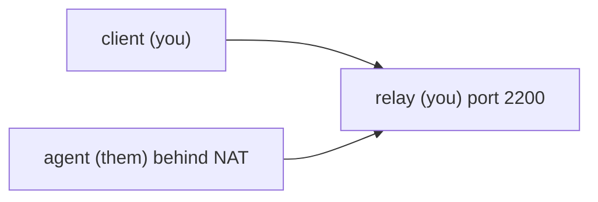
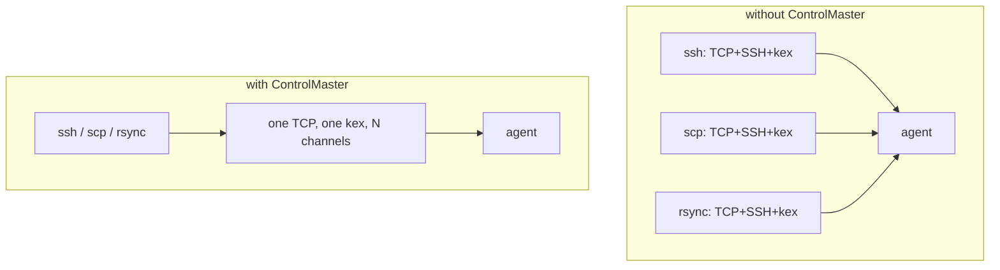
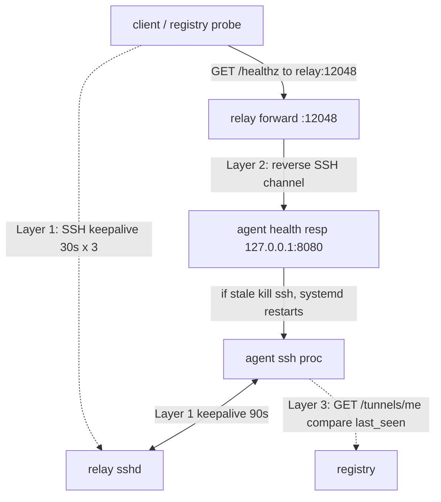

# Reverse-tunnel agents for hosts you cannot reach

*how to run commands on a machine you cannot connect to directly*

You ship a customer appliance. It sits in their datacenter, behind their firewall, on a VLAN (a virtual local network, a logical slice of the physical network the firewall treats as its own segment) that blocks all inbound connections, behind NAT (network address translation, which lets many machines share one public internet address by rewriting the addresses on packets as they leave and return). The effect: no port on any public address maps back to your box, so a connection you start from outside has nowhere to land. Your support contract says you will push firmware updates and pull diagnostic logs on demand. You cannot SSH in (SSH, "secure shell," is the standard tool for opening an encrypted command session to a remote machine), and you cannot forward a port to it. The customer's security team will not open a hole, and you do not want them to.

You can have the appliance dial out:

```bash
ssh -N -R 2200:localhost:22 tunnel@relay.example.net
```

Two flags carry this line. `-N` means "do not run a remote command, just hold the connection open" (we want the tunnel, not a shell). `-R 2200:localhost:22` is a *reverse* port forward: it asks the relay to listen on port 2200 and pipe anything that arrives there back down this connection to the appliance's local port 22.

This works because of how a TCP connection behaves. TCP is the protocol most network connections use; once two machines have set one up, either side can send data over it in both directions. A firewall that blocks inbound connections is only blocking the *start* of a new connection coming in. It does not block data flowing on a connection that is already open. So once the appliance has dialed out and the SSH session is up, traffic arriving at port 2200 on the relay is just bytes traveling back along a connection the appliance itself opened. Anyone who can reach the relay can now SSH into the appliance through port 2200. Inbound to the customer is still fully blocked; from your side, the box is reachable.

What deserves attention is what happens once you have more than five machines and need this to stay alive for months.

## The basic shape

You have three roles:



The **agent** is the unreachable box. It runs the `ssh -N -R 2200:localhost:22 tunnel@relay.example.net` line above. With the default setting `GatewayPorts no` on sshd (sshd is the SSH server, the background program that listens for and accepts SSH connections), the relay binds that forwarded port to loopback only. Loopback, also called localhost, is the address 127.0.0.1: the machine talking to itself, traffic that never leaves the box. So port 2200 answers from the relay itself but not from outside hosts. That is what you want: clients reach the agent by hopping through the relay, and the final hop runs *on the relay*, where loopback resolves.

The **relay** is a small VM (virtual machine, a software-emulated computer running on shared hardware) you own, with a public address that accepts SSH on port 22 from anywhere you allow. It is just a meeting point with a stable address; treat it as disposable, recreated from config rather than repaired by hand. Sizing is modest. Each agent forks a per-connection sshd child, roughly 5 to 8 MB RSS (resident set size, the physical memory the process holds) when idle. That figure misleads you for capacity planning, because forked sshd children share their code, libc, and libcrypto pages copy-on-write. Copy-on-write means the children all read from one shared copy of those pages, and the kernel makes a private copy only when a child writes to a page. RSS counts those shared pages in *every* child even though the kernel pays for them once. What you actually pay per child is its private dirty pages: a page is "dirty" once a process has written to it, and "private" means it is not shared, so a child's private dirty pages are the memory that exists only because that child exists. Plan against that number, which is roughly its PSS (proportional set size: each shared page is divided across the processes sharing it, so a page shared by ten children counts as one-tenth of a page in each, while private pages count in full). A few thousand idle tunnels in 512 MB is achievable but optimistic, and depends entirely on that sharing holding up. CPU is a non-issue until you push heavy traffic.

The **client** is your CI runner (the machine that automatically builds and tests your code; CI is short for continuous integration), your laptop, or any system that pushes commands to the agent. It uses `ProxyJump`.

```bash
ssh -J tunnel@relay.example.net -p 2200 root@localhost
```

`-J` (ProxyJump) tells SSH to first connect to a jump host, then open the real connection *from there*. A jump host (also called a bastion) is an intermediate machine you connect through to reach a target you cannot reach directly; the relay is the jump host here. From the relay's vantage point the agent lives at `localhost:2200`, the loopback port the relay forwards down the channel, so `-p 2200 root@localhost`, evaluated on the relay, lands on the agent. Everything past this basic pattern is what running it in production teaches you.

## Managing the connection from the wrong side

The agent is the only party that can establish the tunnel; the relay cannot dial out and create one. So whatever process manages the tunnel must live on the unreachable side, which means you cannot push it a new config and bounce it. It has to recover from its own mistakes.

A systemd unit on the agent is the lightest reasonable thing that works. systemd is the program that starts and manages services on most Linux machines; it launches a service at boot and restarts it if it dies. A "unit" is the small config file that tells systemd how to run one service. A program that watches a service and restarts it when it exits is called a supervisor, which is the role systemd plays here.

```ini
[Unit]
Description=Reverse tunnel to relay
After=network-online.target
Wants=network-online.target

[Service]
ExecStart=/usr/bin/ssh -N -R 2200:localhost:22 \
    -o ServerAliveInterval=30 \
    -o ServerAliveCountMax=3 \
    -o ExitOnForwardFailure=yes \
    -o StrictHostKeyChecking=accept-new \
    -i /etc/tunnel/id_ed25519 \
    tunnel@relay.example.net
Restart=always
RestartSec=10
User=tunnel

[Install]
WantedBy=multi-user.target
```

Two options in that `ExecStart` line are worth naming. `-i /etc/tunnel/id_ed25519` points SSH at the agent's private key file, which the agent uses to prove who it is to the relay. `StrictHostKeyChecking=accept-new` trusts the relay's host key the first time, then errors out if that key ever changes later, the sensible default for an unattended service that cannot ask a human.

Two SSH-specific gotchas the generic "let the supervisor restart it" advice misses.

`ExitOnForwardFailure=yes` matters. When the SSH process dies uncleanly, the relay's bound listener on port 2200 lingers for tens of seconds, because the relay's sshd has not yet noticed the parent connection is gone. When the agent reconnects, the new `-R 2200` bind fails because the old listener still owns the port, and by default SSH holds the tunnel open anyway with no working remote forward. That is a zombie tunnel: the SSH connection is up, the agent thinks it published a port, but nothing on the relay routes to it, so every client connection hangs. `ExitOnForwardFailure=yes` makes SSH treat a bind failure as fatal and exit, so the supervisor restarts it. One caveat: it only fires when the bind itself fails. It does not catch a `PermitOpen` denial (an sshd setting that restricts which host and port a forward may target, so a forward can be rejected for reasons other than the port being taken), a downstream TCP failure, or a network that stops carrying packets (see `ssh_config(5)`).

The second gotcha involves two *different* keepalive mechanisms at different layers. A keepalive is a small probe one side sends periodically to confirm the other is there; if enough go unanswered, the connection is declared dead. The first kind is SSH's own application-level keepalive: the SSH process sends probe messages and gives up after a set count, and each side only watches the other. The agent's `ServerAliveInterval`/`ServerAliveCountMax` detect a dead *relay*; the relay's `ClientAliveInterval`/`ClientAliveCountMax` detect a dead *agent*. You need both, because neither side probes itself. The second kind is the kernel's TCP keepalive, which lives below SSH entirely. If you do not set the relay's `ClientAlive*` options, the relay's sshd holds those zombie bound ports until the kernel's TCP keepalive finally tears the dead socket down, and that default is glacial: `tcp_keepalive_time` is 7200 seconds, two hours, before the first probe even fires (`man 7 tcp`). Do not wait for the kernel. Set the relay's `ClientAliveInterval`/`ClientAliveCountMax` to 30 / 3 to match the agent side, so both ends agree that a keepalive missing for about 90 seconds (roughly `interval * count`) means dead. (`autossh` is fine as a second layer, but with `ExitOnForwardFailure` plus a sane supervisor it does not add much.)

## The port allocation problem

If every agent forwards to port 2200, you can have exactly one agent. The answer is per-agent ports, but you do not want to hand-maintain a port map across a thousand boxes.

The pattern I have seen work: each agent registers itself at the relay on startup, gets back a port and an expiry, then dials the tunnel with that port (`ssh -R 12047:localhost:22 ...`). The registry is a tiny service (a single Go binary, or an AWS Lambda function, which is a small piece of code that runs on demand without you managing a server) that owns the port map. It keys ports by a stable agent ID, some hash of the machine's hardware identifier or a UUID baked in at provision time. When an agent dies and comes back, it gets the same port; a new agent gets the next free one.

The registry response:

```json
{
  "agent_id": "bench-17",
  "relay_host": "relay.example.net",
  "relay_port": 12047,
  "health_port": 12048,
  "cert_expires_at": "2026-06-10T00:00:00Z",
  "last_seen_at": "2026-06-03T11:42:08Z"
}
```

Encode that port into DNS if you can. DNS (the domain name system) is the network's directory: it turns a name into the information needed to reach a service. A DNS SRV record advertises a named service as `<prio> <weight> <port> <target>`, exactly the host-and-port pair you need, and that name becomes the single source of truth CI can resolve with a plain `dig` (a command-line DNS query tool) rather than teaching every tool to call a JSON API. Stock OpenSSH does not read SRV records on its own (tracked upstream as Bugzilla 2217 for over a decade), so you need a wrapper that resolves the record and rewrites the host:port before invoking `ssh`:

```bash
#!/usr/bin/env bash
# usage: tssh bench-17 [extra ssh args...]
set -euo pipefail
host="$1"; shift
srv=$(dig +short SRV "_ssh._tcp.${host}.tunnels.example.net" | head -n1)
# SRV record: "<prio> <weight> <port> <target>."
# target = relay hostname, port = the per-agent forwarded port on the relay
port=$(awk '{print $3}' <<<"$srv")
relay=$(awk '{sub(/\.$/,"",$4); print $4}' <<<"$srv")
exec ssh -J "tunnel@${relay}" -p "$port" root@localhost "$@"
```

The SRV record, and any TXT record (a DNS record that holds free-form text) you add alongside it, are for your tooling to read, not for SSH itself.

## Key rotation without bricking the fleet

The agent uses an SSH key to prove who it is to the relay. If you rotate the relay's `authorized_keys` (the file listing which keys the relay accepts) and forget to update an agent, that agent is now permanently unreachable, because the only way you had to reach it was the tunnel you just broke. Two rules.

First, **always overlap**. The new key goes into `authorized_keys` before the old one comes out, and the removal is scheduled at least a full deployment cycle later. If your agents come online once a week (lab benches powered off on weekends, say), the overlap window is at least two weeks.

Second, **use certificates, not raw keys**. SSH has its own certificate format, simpler than X.509 certificates (the standard format used by TLS, the encryption layer behind HTTPS) and not interchangeable with them. You generate an SSH CA (certificate authority) keypair once, sign each agent's public key with the CA to produce a short-lived certificate, and configure the relay's sshd with `TrustedUserCAKeys` pointing at the CA's *public* key. Instead of learning about each agent individually through `authorized_keys`, the relay only checks "is this cert signed by my CA, and is it still valid?" and never holds a per-agent key list. OpenSSH grew certificate-authority support in 5.4 (March 2010), so nearly every supported distro has it. Certs can be short-lived (a week, a day) and the CA can revoke them.

```bash
# on the CA host
ssh-keygen -s ca_key -I "agent-bench-17" -n tunnel \
    -V +1w agent_key.pub
```

The cert ends up next to the key on the agent, and SSH picks it up automatically. When it expires, the agent's next reconnect fails until it fetches a new one; a cron job pulling from the registry handles it.

The agent must be able to fetch new certs even when its tunnel is broken. This is a chicken-and-egg problem: you would like to ship the new cert over the tunnel, but the tunnel may be down precisely because the old cert expired. Bootstrap that channel separately, over HTTPS to the registry with its own credential.

If your environment is locked down enough that the agent's *only* outbound is SSH to the relay (common in customer-appliance setups, and in air-gapped ones, where the machine has no general internet access), you cannot bootstrap cert renewal over HTTPS. Push fresh certs *through* the tunnel itself well before the existing cert expires, and overlap aggressively. The rule: lifetime minus the renewal interval is your safety margin. A cert that lives a week, renewed every two days, gives five days of slack, enough to survive several missed renewals while the tunnel is flapping.

## Multiplexing many sessions over one tunnel

Opening a fresh TCP connection through the reverse tunnel for every command is fine at low volume. Once your CI runs parallel jobs against the same agent, you want SSH's `ControlMaster`:

```
Host bench-*
    ControlMaster auto
    ControlPath ~/.ssh/cm-%r@%h:%p
    ControlPersist 10m
```

With this set on the client side, the first `ssh` to a given agent opens a master connection. Subsequent `ssh`, `scp`, and `rsync` calls to the same agent reuse it, skipping the TCP handshake, the SSH handshake, and the key exchange. (The key exchange, sometimes shortened to kex, is the step at the start of an SSH connection where the two sides agree on the session's encryption keys; it is the expensive part of setup.) For a thousand quick commands, reusing one connection turns a slow run into a fast one. `ControlPersist 10m` keeps the master alive for ten minutes of idle time after the last session disconnects, so back-to-back jobs share the setup cost. The shape:



The reverse tunnel already gives you the same property in the other direction for free: the single `-R` SSH connection from the agent carries every client session as a separate channel, all multiplexed over one TCP stream. (Multiplexing means running many logical streams over one connection.) Combined with `ControlPersist` on the client, a job that runs fifty commands looks like one TCP session on the wire.

You pay for this with head-of-line blocking. Every multiplexed channel shares the one underlying TCP byte stream, so a single big transfer monopolizes it and stalls everything queued behind it: an `scp` of a large log pegs the channel and the others wait. This is TCP-level head-of-line blocking (HOL blocking). For most lab use it does not matter. For high-throughput pipelines, run two tunnels: one for control-plane traffic (the commands that tell the agent what to do) and one for bulk data.

## Detecting dead tunnels

This failure mode has burned every team I have worked with. The tunnel looks healthy. The SSH process is running on the agent. `netstat` on the relay shows the connection as ESTABLISHED. (`netstat` lists the machine's network connections; ESTABLISHED is TCP's state name for a connection that is fully open and live.) You connect to port 12047, the TCP handshake completes, and then nothing happens. The connection just hangs.

Nothing actively probes the end-to-end path unless you make it. A half-open TCP connection is one where one side silently went away, but the other never sent anything to find out, so its socket still reads as ESTABLISHED. The SSH process and the kernel socket can both believe everything is fine while the path between agent and relay is gone. For tunnels you want all three layers below.



**Layer 1: SSH-level keepalives.** SSH does not enable these by default (`ServerAliveInterval` is 0 out of the box), so the 90-second detection window is a value you choose, not one you inherit. `ServerAliveInterval=30` plus `ServerAliveCountMax=3` from the systemd unit above means the client sends a keepalive every 30 seconds and, after three missed responses, tears the connection down. Add the systemd restart (`RestartSec=10`), the new SSH handshake, and re-registration, and end-to-end recovery is more like 100 to 120 seconds (the 90 is detection only). What this layer does *not* catch matters: SSH keepalives watch the transport connection, not the forwarded channels, so a channel can be dead while the connection answers.

**Layer 2: A probe that traverses the tunnel itself.** This is the part specific to reverse tunnels. The question is not "is the agent healthy?" but "does traffic still make it from the public side of the relay, through the forwarded port, down the SSH channel, and back?" Run a small health responder on the agent and forward an additional port for it:

```bash
ssh -N -R 12047:localhost:22 -R 12048:localhost:8080 \
    tunnel@relay.example.net
```

Then have the registry probe `relay.example.net:12048/healthz` once a minute. If the response stops, the tunnel pathway is broken even if the agent's local /healthz on `127.0.0.1:8080` would answer instantly. A direct /healthz on the agent tells you nothing, since you cannot reach it directly, which is the whole reason this pattern exists.

**Layer 3: Agent-side self-check.** This catches the case where the relay-side socket is fine but the relay has been restarted and forgotten the port reservation. Two separate things "remember" the port, and they are not the same. The registry is its own service with its own database, so across a relay restart it still has the agent's port written down. The live mapping from port 12047 to this agent's channel, though, lives only in the relay's running sshd process and dies with it. So after a relay restart, the registry still claims the agent is on port 12047, both ends' sockets can look fine, but the routing the relay was doing is gone and the published port goes nowhere. What bridges the gap is `last_seen_at`: the registry only refreshes it when the Layer 2 health probe actually makes it down the live path and back, so once the live path is dead, `last_seen_at` stops moving. So the agent periodically asks the registry (over HTTPS, or via the tunnel if HTTPS is unavailable) for its own `last_seen_at`; if it has gone stale, the agent kills its own SSH process and lets the supervisor restart it.

```bash
#!/usr/bin/env bash
# /usr/local/bin/tunnel-selfcheck, run from a 60s systemd timer
set -euo pipefail
me=$(cat /etc/tunnel/agent_id)
resp=$(curl -fsS --max-time 5 "https://registry.example.net/tunnels/${me}")
last_seen=$(jq -r '.last_seen_at' <<<"$resp")
# treat anything older than 3 minutes as the registry saying "I don't see you"
# requires GNU date; swap for `python3 -c` or `gawk` on BSD/Alpine boxes.
if [[ $(date -d "$last_seen" +%s) -lt $(( $(date +%s) - 180 )) ]]; then
    logger -t tunnel-selfcheck "registry says stale ($last_seen); killing ssh"
    systemctl kill --signal=TERM tunnel.service
fi
```

Together, these three layers cut the mean time to detection (the average delay between a tunnel dying and you noticing) from "your CI job times out at whatever your timeout is, often around 30 minutes" to "the tunnel is back in about 100 to 120 seconds, and you mostly do not notice."


## A small thing about hostnames

When you SSH through a `ProxyJump` to `localhost:12047`, your `known_hosts` fills up with entries for `[localhost]:12047`, `[localhost]:12048`, and so on. They all look the same to SSH, so when port assignments drift (the registry gives bench-17 a new port after it re-registers) you get noisy host-key warnings. The fix is `HostKeyAlias`:

```
Host bench-17
    HostName localhost
    Port 12047
    ProxyJump tunnel@relay.example.net
    HostKeyAlias bench-17
    User root
```

Now `known_hosts` keys on `bench-17`, not the port number, so port reassignments do not cause warnings.

## What this is not

This is the right pattern for a few hundred to a few thousand agents, not for tens of thousands. Past that scale you outgrow SSH and reach for one of two families:

- **Managed reverse-tunnel services.** Cloudflare Tunnel, frp, inlets, and Teleport all run an agent on the unreachable host and a controller on the public side. You get the same dial-out shape described here, plus connection pooling, identity, and audit baked in.
- **Mesh VPNs.** Tailscale / headscale, Nebula, and ZeroTier put every agent on an overlay network so it is reachable as a first-class participant. A VPN (virtual private network) is a network laid over the real one so machines in different physical locations behave as if they share one local network; an overlay network is that virtual layer, and "mesh" means the agents connect directly to each other rather than routing through one hub. There is no "tunnel" you maintain, just a network the agent joins on boot. Worth the switch if you want connectivity in both directions, not just push-from-client.

Both are bigger commitments than what is described here. Do not pick one because reverse-SSH got hard; pick one because the size or shape of the problem changed.


For boxes behind NAT, reverse SSH plus a port registry plus the three-layer health check covers the common case. The agent is the only side that can open the connection, and a connection whose sockets read as ESTABLISHED on both ends can already carry nothing across the actual path. Design for both.
