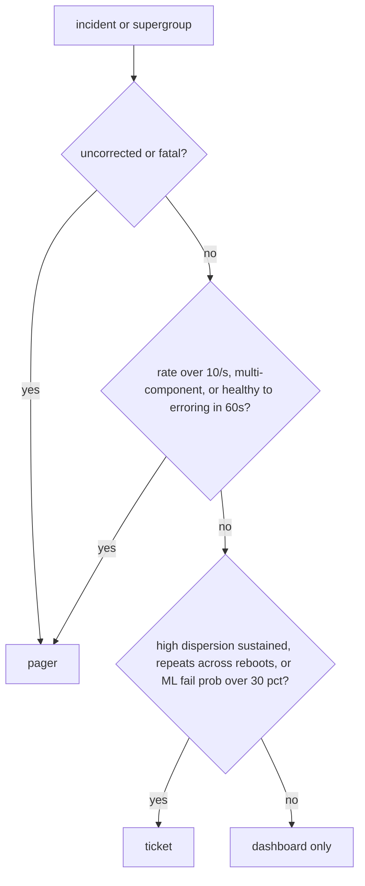

# Turning RAS telemetry into actionable signals

*how to take the stream of hardware error reports from the kernel and decide which ones should wake someone up*

RAS stands for Reliability, Availability, and Serviceability: the hardware self-monitoring that lets a machine detect, report, and sometimes recover from physical faults before they take down a workload. A single RAS event from `rasdaemon` (the Linux userspace daemon that logs hardware errors) looks roughly like this:

```
mce: [Hardware Error]: Machine check events logged
EDAC MC0: 1 CE memory read error on CPU_SrcID#0_MC#0_Chan#2_DIMM#1
  (channel:2 slot:1 page:0x3a124 offset:0x140 grain:32 syndrome:0x0)
```

The acronyms: ECC (Error-Correcting Code) memory stores extra bits so single-bit flips are detected and fixed in hardware; a CE (Corrected Error) is that fix happening; EDAC (Error Detection And Correction) is the kernel subsystem that surfaces memory errors; an MCE (Machine Check Exception) is the CPU's mechanism for reporting a detected hardware fault.

A *node* is one machine, one server. A *fleet* is all the machines you operate, here thousands of nodes. Multiply that one event by a few hundred event classes across the fleet and you have more error reports per second than a human could read. The classes span the whole machine. Memory controllers report corrected ECC errors. PCIe links log recoverable AERs: PCIe is Peripheral Component Interconnect Express, the bus connecting devices like GPUs and fast SSDs to the CPU, and an AER (Advanced Error Reporting) is the bus-level equivalent of ECC. CPUs emit MCEs for cache parity errors. GPUs surface XID events (catch-all GPU error codes) for everything from a failing fan to failing stacked memory, which is HBM (High Bandwidth Memory): DRAM chips bonded directly onto the GPU package, and when one stack degrades the GPU loses memory it cannot route around. The kernel forwards all of it to userspace through several overlapping channels (`/dev/mcelog`, `rasdaemon`, `edac`, `dmesg`, plus whatever vendor-specific socket the platform exposes), so one physical incident can reach you through two or three.

A *page* is the high-urgency action that wakes an engineer right now, usually through an alerting service like PagerDuty, which calls or texts whoever is *on call*: the engineer currently responsible for alerts, on a rotation so it is not always the same person woken at 3am. A *ticket* is the lower-urgency outcome: a tracked work item for normal hours.

Send that raw stream straight to the pager across a few thousand nodes and the on-call will start ignoring it, then leave the rotation. A simple exporter (the component that publishes events downstream) at that scale can generate tens of thousands of alerts in the first hour.

This post is about the layer between that raw stream and the pager. It turns "node-1471 emitted 14 corrected ECC events in the last 30 seconds" into one of four outcomes: silence, a dashboard tick, a ticket, or replace this DIMM before it fails uncorrectably.

## What RAS events actually look like

Strip away the vendor packaging and almost every RAS event shares one shape:

```
timestamp     : 2026-06-03T11:42:17.331Z
node_id       : compute-1471
component     : DIMM_A2
severity      : corrected | uncorrected | fatal
class         : memory | cache | pcie | thermal | power | accelerator
event_code    : MEM_ECC_CORR
location      : socket=0 channel=2 dimm=1 rank=0 row=0x3A12 col=0x14
count         : 1
raw           : { ...whatever blob the vendor dumped... }
```

Everything you care about derives from those eight fields plus memory of what came before.

The one transform that takes real work is parsing the vendor location string into this schema: `CPU_SrcID#0_MC#0_Chan#2_DIMM#1` becomes `socket=0 channel=2 dimm=1`, tagged `component=DIMM_A2`. Note the two names for one part: `DIMM_A2` is the silkscreen label (the printed marking on the board) that a technician reads, `dimm=1` is the controller-relative index the topology graph keys on. Keep both.

Two fields mislead first-time builders: severity and count. A "corrected" event can be a healthy DIMM doing exactly what ECC was designed to do, or a DIMM about to fail. A `count=1` event can repeat 9,000 times in a minute.

The signal is in the shape of the stream over time, so treat each event as one noisy sample from a hidden process (the health of a physical part), never as an alertable unit. That reframing drives every stage below.

## The pipeline shape

The layout I keep ending up at after building this four times. The component names below (`ras-broker`, `coalescer`, and so on) describe the roles, not real software.

```
   nodes (10k+)
       |
       v
+------------------+     +------------------+     +------------------+
|  node-collector  | --> |    ras-broker    | --> |    coalescer     |
|    (per-host)    |     | (NATS jetstream  |     |  (sliding wins)  |
|                  |     |     or Kafka)    |     |                  |
+------------------+     +------------------+     +------------------+
                                                           |
                                                           v
                                                  +------------------+
                                                  |    correlator    |
                                                  |   (cross-comp)   |
                                                  +------------------+
                                                           |
                                                           v
                                       +-----------------------------+
                                       |  policy engine + thresholds |
                                       +-----------------------------+
                                          |          |          |
                                          v          v          v
                                      dashboard   ticket      pager
```

The broker box (Kafka, or NATS JetStream) is a message broker: a service that durably queues events between stages, so a producer can keep handing off even when the consumer is slow or briefly down, and nothing is lost in between. Kafka is the widely used one; NATS is lighter-weight, and its JetStream mode adds the same durable queue behavior.

The collector is dumb on purpose. It tails the kernel sources, normalizes into the canonical event above, attaches a fleet-wide monotonic sequence number (a counter that only ever increases, so every event has a strict order), and pushes. No filtering: a clever collector masks real failures silently. Everything interesting happens downstream of the broker, where you have the full history and you're not running on the node you're trying to diagnose.

## Step one: deduplicate the obvious noise

A lot of RAS sources fire the same logical event more than once for one physical incident, which tells you how much to distrust the raw count.

Start with the kernel's MCE polling. An error reaches the kernel as an interrupt (the hardware signals the CPU the moment something happens) or via a poll (the kernel checks a status register on a timer). Many hardware errors arrive the second way, via a periodic poll of the per-bank status registers. (A *bank* here is a group of hardware status registers the CPU uses to report machine-check errors.) To stay responsive during a fault, that poller is adaptive: in `mce_timer_fn()` (`arch/x86/kernel/cpu/mce/core.c`) the interval is halved on every poll that finds an error, down to a floor of `HZ/100`, and doubled back when polls come back clean. `HZ` is the kernel's timer-tick frequency, set at build time by `CONFIG_HZ`, and time is counted in ticks called jiffies. `HZ/100` is one hundredth of a second's worth of ticks, so it is always about 10ms regardless of `CONFIG_HZ` (see also `Documentation/x86/x86_64/machinecheck`).

The faster poll does not re-emit the same bank: `machine_check_poll()` clears each bank's status register right after logging it, including the valid bit (the flag the hardware sets to say "this bank holds a real error"), so the next poll sees it empty. The real duplicate sources are concurrency: a CMCI interrupt (Corrected Machine Check Interrupt) can race the poll timer on a bank not yet cleared, and a bank shared across a package (the physical CPU chip module) can be polled by two CPUs. Some BMCs (Baseboard Management Controllers, the always-on service processor on the board) also mirror the same SEL entry (System Event Log) through two out-of-band interfaces, IPMI and Redfish, the protocols a service processor exposes for remote monitoring when the main OS is down. One incident, two reporting paths.

First pass is exact dedup on `(node_id, component, event_code, location, timestamp_truncated_to_100ms)`. (The timestamp is epoch milliseconds, the count since 1970, so integer-dividing by 100 buckets it into 100ms windows.) A hash set with a TTL (time-to-live, entries expire after a set duration) and a 30-second window handles this cheaply. The "drops 20-40%" claim you'll hear is workload-dependent (near zero on a clean fleet, past 40% during an incident), so measure your own data first. It is lossless only for exact re-emissions: keying on a fixed field set truncated to 100ms collapses anything differing only in sub-100ms timing or in a field outside the key (severity, counters, message text, trace IDs), so two genuinely separate occurrences in one bucket get merged.

```python
def dedup_key(ev):
    return (ev.node_id, ev.component, ev.event_code,
            ev.location, ev.timestamp // 100)  # epoch ms -> 100ms buckets

seen = TTLSet(window=30)  # exact membership, no false positives
for ev in stream:
    if dedup_key(ev) in seen:
        metrics.duplicates.inc()
        continue
    seen.add(dedup_key(ev))
    out.publish(ev)
```

Do not reach for a bloom filter here unless you have profiled and the hash set is actually too big. A bloom filter is a compact set-membership test that can give false positives: it sometimes says "already seen" for something it never has, and for dedup that means a real RAS event silently disappears. If memory forces it, pick a false-positive rate explicitly (sizing relations at `en.wikipedia.org/wiki/Bloom_filter#Probability_of_false_positives`) and emit a "dropped-as-duplicate" counter so the loss is visible.

## Step two: coalesce into incident objects

Raw events are the wrong unit. The unit you want is an **incident**: "DIMM A2 on node-1471 had a burst of N corrected errors over T seconds." You make incidents by coalescing events with a sliding window keyed on the failing part.

The natural coalescing key for memory is `(node_id, socket, channel, dimm)`. Key on the part, not on `(node_id, address)`: a degrading DIMM scatters bit flips across many rows, so address-level buckets each stay below threshold and the part-level failure never shows up. The DIMM is the right bucket for the replace decision because it is the field-replaceable unit, the smallest piece a technician can swap out, which is why standard EDAC/`rasdaemon` practice thresholds per DIMM or rank.

Keep the fine-grained `(page, row, bank, rank)` keys too: they drive cheaper remediations that fix a single bad spot without pulling the DIMM, like page-offlining (retiring one memory page so the system stops using it) or row sparing (swapping in a spare row for a bad one).

For PCIe it's `(node_id, segment, bus, device)`. For CPU cache it's `(node_id, socket, core, cache_level)`. The right key is the thing you would physically replace.

A sliding window implementation that's been reliable for me:

```python
class IncidentWindow:
    def __init__(self, window_sec=300, flush_idle_sec=60):
        self.window = window_sec
        self.flush_idle = flush_idle_sec
        self.incidents = {}  # key -> Incident

    def feed(self, ev):
        key = coalesce_key(ev)
        inc = self.incidents.get(key)
        now = ev.timestamp
        # idle gap: the part went quiet, close this incident
        # and start a fresh one under the same key
        if inc is None or now - inc.last_seen > self.flush_idle:
            if inc is not None:
                yield inc.finalize()
            inc = Incident(key, started=now)
            self.incidents[key] = inc
        inc.add(ev)
        # window cap: an incident has run too long, force it out
        for k, i in list(self.incidents.items()):
            if now - i.last_seen > self.window:
                yield i.finalize()
                del self.incidents[k]
```

The inner sweep is fine for a sketch, but it scans every open incident on every event, so during a fleet-wide thermal event with tens of thousands of open incidents that loop becomes the bottleneck. Replace it with one of three: a separate periodic flush task that sweeps every few seconds (simplest), a delay queue keyed by expiry, or a min-heap with lazy invalidation. A min-heap (a binary heap that always gives you the smallest item first) cannot cheaply update an item's priority in place (the `decrease-key` operation), so push a fresh `(expiry, key, snapshot)` on every update and discard a popped entry whose snapshot no longer matches. Per-event cost stays O(1) amortized however many are open.

Two timeouts matter. `flush_idle_sec` is how long with no events before we close the incident and ship it; sixty seconds is a reasonable default for memory. `window_sec` is the hard ceiling: without it, a slowly-degrading part would never alert because its incident object would keep growing silently.

The incident you ship downstream has a richer shape:

```
incident_id    : inc-2026-06-03-compute-1471-DIMM_A2-001
key            : node=compute-1471 socket=0 channel=2 dimm=1
started        : 2026-06-03T11:42:17.331Z
ended          : 2026-06-03T11:44:17.812Z
duration_sec   : 120
event_count    : 1500
event_rate     : 12.5 ev/sec
severity_max   : corrected
unique_rows    : 47
unique_cols    : 312
unique_banks   : 8
first_event    : { ... }
last_event     : { ... }
worst_event    : { ... }
```

Notice `unique_rows` and `unique_banks`. These separate "one stuck bit" from a DIMM heading for failure: a stuck bit repeats the same `(row, col, bank)` thousands of times; a degrading DIMM scatters errors across many rows. Coalescing by count alone throws this signal away.

## Step three: correlate across components

Half the time the failing component is not the one reporting the error. Cases that look like one bug but are another:

- A failing power supply causes voltage ripple on the memory rails (the supply lines that feed the DIMMs), which throws corrected ECC events on every DIMM on that side of the board. Alert per-DIMM and you'll page on six DIMMs at once when the real fix is one PSU.
- A bad PCIe riser (the board that extends a PCIe slot so a card can plug in at an angle) causes correctable AERs on the GPU plugged into it, AND correctable errors on the NVMe in the slot below (NVMe is the fast SSD interface), AND a BMC thermal anomaly as the GPU throttles. One bad cable, three alarm sources.
- A CPU running too hot throws cache parity MCEs that look exactly like silicon defects until you correlate with thermal sensor history.

The common thread is physical adjacency: parts that share a power rail, a slot, or a cooling zone fail together because they share a cause. So after the coalescer, you want a correlator that groups incidents within a time window by **physical proximity**, using a graph from your node inventory that connects parts sharing physical infrastructure: which DIMMs share a memory controller, which slots a riser, which components a power rail, which sensors a cooling zone. Same root cause becomes a hop count.

```
correlator pseudocode:
  for each new incident I:
    related = []
    for each open incident J in last 120s:
      if proximity_distance(I, J) <= 2:
        related.append(J)
    if related:
      merge_into_supergroup(I, related)
    else:
      open new supergroup(I)
```

A *supergroup* is a merged cluster of related incidents that probably share one root cause. `proximity_distance` is the depth of the lowest shared ancestor in your hardware topology, not the path length between leaves. Two DIMMs on the same memory controller share that MC as their lowest common ancestor, so `distance = 1`; same socket but different MC gives 2; same node but different socket gives 3. Smaller distance means a more specific shared cause. Merge at distance <= 2.

The containment topology for one node looks like this:

```
                      node:compute-1471          <-- 3
                     /                 \
                socket:0           socket:1      <-- 2
                /     \             /     \
              MC:0   MC:1         MC:0   MC:1    <-- 1
             /  \    /  \         /  \    /  \
           A0  A1  A2  A3       B0  B1  B2  B3   <-- 0 (DIMMs)
```

Illustrative only; real memory controllers carry more channels and DIMMs than the four drawn here, which is why a rule like "more than 4 DIMMs on one controller" makes sense.

PSU and cooling-zone relationships do not fit the pure containment tree: a PSU feeds multiple nodes, so it sits above the per-node subtrees and its events land at distance 4+. So the correlator graph is the containment tree plus cross-cutting edges for shared rails and cooling zones, with distance as the shortest hop count along any edge to a common node. The graph is just the inventory you already keep for replacements.

A shipped supergroup carries its constituent incidents plus a guessed root cause based on which physical layer they share; the policy engine uses that to decide how many times to page.

## Step four: thresholds that look at rate, not count

The common mistake is `count > N`. The correct thing is almost always a **rate** plus a **dispersion** (how spread out the errors are across distinct physical locations: low means they hit the same spot, high means scattered).

For corrected memory errors, the rule I've landed on. Rules are evaluated in parallel; the highest-severity match wins, not the topmost row. The severity ranking, most urgent first, is `page (P1) > ticket (P2) > ticket (P3) > log-to-dashboard > drop`. If two rows produce the same level, the payload carries every matching reason as evidence.

| Condition | Action |
|---|---|
| incident.event_count < 10 AND incident.unique_rows == 1 | drop (single stuck bit, log to dashboard) |
| incident.event_count < 50 AND incident.duration > 3600s | log to dashboard, no ticket |
| incident.event_rate > 1.0/sec sustained for 60s | ticket, P3 |
| incident.unique_rows > 10 AND incident.event_count > 100 | ticket, P2 (degrading DIMM) |
| incident.event_rate > 10/sec for 30s | page, P1 |
| supergroup spans > 4 DIMMs on same memory controller | page, P1 (controller or PSU) |

The dispersion check (`unique_rows > 10`) catches the slow-burn failures that count-based thresholds miss. A DIMM throwing 200 corrected errors all on one row is a single bit cell ECC will handle indefinitely; the same 200 across 47 rows fails this week. Same count, different physical meaning.

Walk the earlier incident through this table: with `event_rate=12.5/sec` and `unique_rows=47`, row 3 matches (P3) and row 4 matches (P2). Highest severity wins, so it tickets as a P2 "degrading DIMM" with the row-3 match attached as evidence.

The routing flowchart at the end of this post is this same table as a single ordered walk: most urgent question first, stop at the first match.

## Rate AND dispersion, not rate alone

The windowing strategy has to feed both rate and dispersion into the policy engine. Two synthetic streams, both 100 events over 60s, both fed into the same 5s sliding windower:

```
stuck-bit:   100 events, all on (row=0x3A12, col=0x14)
scattered:   100 events, across 100 distinct (row,col) pairs

per-5s window output (rate ev/s, unique_locations):
  t=  0..5    stuck=(1.6, 1)   scattered=(1.6, 8)
  t=  5..10   stuck=(1.8, 1)   scattered=(1.8, 9)
  ...
  t= 55..60   stuck=(1.6, 1)   scattered=(1.6, 8)

over the full 60s:
  stuck-bit:   rate ~1.6/s   dispersion = 1
  scattered:   rate ~1.6/s   dispersion = 100
```

Identical rates, dispersion a hundred times apart. Rate-only policy treats them the same; `(rate, dispersion)` ships the stuck-bit to the dashboard and ticket-queues the scattered one. So each window holds two aggregates, events-per-second and unique-physical-locations. Keep multiple window sizes in parallel and emit the worst pair: a burst of 500 events in 2 seconds inside a 60s window averages to 8.3/sec and trips nothing.

```
windows = [5s, 15s, 60s, 300s]
for w in windows:
    rate       = events_in_window(w) / w
    dispersion = unique_locations_in_window(w)
    if rate > rate_threshold[w] or dispersion > disp_threshold[w]:
        alert(...)
```

For the rate path you want a smoother that reacts to a rising burst faster than a flat average but does not jump at one spike. An EWMA (exponentially weighted moving average) does this: each update blends the newest sample with the running estimate, weighting recent samples more. Initialize on the first sample (`ewma = current_rate`; starting from zero drags the early readings down). The knob worth reasoning about is the time constant `tau`, the timescale over which past samples still matter:

```
ewma = alpha * current_rate + (1 - alpha) * ewma
# at a 5s sample period, alpha = 0.3 gives an effective time constant
# tau = period / alpha = 5 / 0.3 ~= 17s, i.e. ~3 samples of memory
```

Pick the time constant first, then derive alpha. For paging, a `tau` of 15-30s is a sane start: too short and a single spike trips the page, too long and a genuine fast burst takes too many windows to cross threshold.

Flat windows for tickets (the count needs to mean something for a human reading it), EWMA for paging (react fast), dispersion always (the only signal that catches slow-burn DIMM death before it becomes an uncorrected event).

## Backpressure, retries, and what happens when things break

The pipeline itself can fail. The broker can lag. The coalescer can OOM (run out of memory and crash) during a fleet-wide thermal event when much of the fleet reports at once. The correlator can deadlock on a circular proximity edge in your inventory.

When a downstream stage cannot keep up, you need a way to slow the upstream producer. That mechanism is backpressure. Collector-to-broker has three honest choices: drop-oldest (bounded memory, lossy), block-the-producer, and spill-to-disk (durable until disk fills). Blocking just shifts the loss: the producer is the kernel ring buffer (a fixed-size circular buffer that overwrites its oldest entries once full, because it never grows), so a blocked reader loses events at the ring instead of your queue. Default to spill-to-disk with a bounded in-memory ring on top: events are small, producers are slow on average, and the burst before a real failure is exactly what you cannot drop. Cap the spill and export a bytes-spilled metric so you see strain early.

Broker delivery is at-least-once with idempotent consumers: a message may be delivered more than once but never lost, and processing it twice does not change the outcome. Step one already covers this, since a re-delivered event hashes to a key it has already seen and gets dropped: another reason dedup goes first. Use per-stage retry budgets, not global, so a wedged correlator does not block a healthy sink.

One failure mode hits monitoring pipelines especially hard: a silent pipeline looks identical to a healthy fleet, because it signals only by exception. If a coalescer falls 10 minutes behind and quietly catches up, the on-call sees no events and concludes nothing is wrong, while a row of nodes throws uncorrectable errors into a thermal event nobody knows about. So the rule: when the pipeline degrades, **escalate, not silence**, on a separate channel from the data you are doubting.

Concretely: every stage emits its own health metric to a separate channel with its own broker, retention, and pager rule. If the pipeline stops producing health pings, the pager fires from that channel, not from any RAS event. To stop the regress, make the final layer a dumb, independent heartbeat the system cannot silence.

## What to put on the dashboard vs. what to page on

Not everything worth knowing is worth waking someone up:



**Dashboard only** is everything that falls through, including single corrected ECC errors. They're not actionable individually, but the **rate of them across the fleet** is a leading indicator of bad batches, bad firmware revs, or environmental issues in a datacenter row. Keep them visible, not paged. (The ML fail-probability input assumes you have such a model, its own post.)

To check whether your pipeline is calibrated, pick a random page from last week and ask the on-call: did you do something different because of this page, or would the outcome have been identical if I'd silenced it? If the answer is "identical" more than 20% of the time, your thresholds are too aggressive and you're training the team to ignore the pager. Tighten the rules, move borderline cases to tickets, trust the dashboard for the long tail.

RAS data is valuable in aggregate; the on-call only needs the 1% that change behavior. Build the pipeline that separates them.
