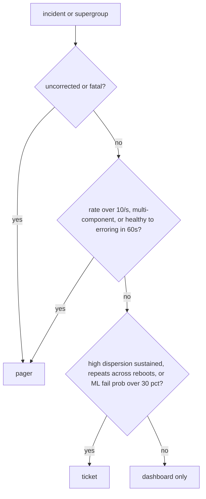

# Turning RAS telemetry into actionable signals

*coalesce, correlate, then alert: turning the kernel firehose into a pager queue you can defend*

RAS stands for Reliability, Availability, and Serviceability: the hardware self-monitoring that lets a machine detect, report, and sometimes recover from physical faults before they take down a workload. A single RAS event from `rasdaemon` (the Linux userspace daemon that logs hardware error reports) looks roughly like this:

```
mce: [Hardware Error]: Machine check events logged
EDAC MC0: 1 CE memory read error on CPU_SrcID#0_MC#0_Chan#2_DIMM#1
  (channel:2 slot:1 page:0x3a124 offset:0x140 grain:32 syndrome:0x0)
```

A quick decoder for the acronyms ahead. ECC (Error-Correcting Code) memory stores extra bits so single-bit flips can be detected and fixed in hardware; a CE (Corrected Error) is that fix happening; EDAC (Error Detection And Correction) is the kernel subsystem that surfaces memory errors; an MCE (Machine Check Exception) is the CPU's mechanism for reporting a detected hardware fault.

Multiply that one event by a few hundred event classes and a few thousand nodes, and you have a firehose. The classes span the whole machine: memory controllers reporting corrected ECC errors; PCIe links logging recoverable AERs (Advanced Error Reporting, the bus-level equivalent of ECC); CPUs emitting MCEs for cache parity hiccups; GPUs surfacing XID events (catch-all GPU error codes) for everything from a tired fan to a dying HBM stack (High Bandwidth Memory). The kernel forwards all of it to userspace through several overlapping channels at once (`/dev/mcelog`, `rasdaemon`, `edac`, `dmesg`, or whatever vendor socket is current this quarter), so a single physical incident can reach you through two or three doors.

Pipe that raw firehose into PagerDuty across a few thousand nodes and the on-call rotation will revolt inside a week; a naive exporter at that scale can generate tens of thousands of alerts in the first hour.

This post is about the layer between the firehose and the pager: the part where you turn "node-1471 emitted 14 corrected ECC events in the last 30 seconds" into either silence, a dashboard tick, a ticket, or "go physically replace this DIMM before the rack catches a real fault." Get this layer right and the fleet stays runnable; get it wrong and the pager owns you.

## What RAS events actually look like

Strip away the vendor packaging and almost every RAS event has the same shape:

```
timestamp     : 2026-06-03T11:42:17.331Z
node_id       : compute-1471
component     : DIMM_A2
severity      : corrected | uncorrected | fatal
class         : memory | cache | pcie | thermal | power | accelerator
event_code    : MEM_ECC_CORR
location      : socket=0 channel=2 dimm=1 rank=0 row=0x3A12 col=0x14
count         : 1
raw           : { ...whatever blob the vendor dumped... }
```

That's it. Everything you care about derives from those eight fields plus the right amount of memory about what came before.

The one transform that takes real work is parsing the vendor location string into this schema: `CPU_SrcID#0_MC#0_Chan#2_DIMM#1` becomes `socket=0 channel=2 dimm=1`, tagged `component=DIMM_A2`. Note the two names for the same part: `DIMM_A2` is the silkscreen label, `dimm=1` is the controller-relative index. Keep both; the label is what a technician reads, the index is what the topology graph keys on.

Two fields mislead first-time builders. Severity and count both look authoritative; both lie. A "corrected" event can be a healthy DIMM doing exactly what ECC was designed to do, or a DIMM about to fail catastrophically. A `count=1` event can repeat 9,000 times in a minute.

The signal is in the shape of the stream over time: a healthy DIMM produces a slow trickle scattered randomly, a dying one a rising, clustered burst. So treat each event as one noisy sample from a hidden process (the health of a physical part), never as an alertable unit. That reframing justifies every downstream stage.

## The pipeline shape

Here's the layout I keep ending up at after building this thing four times. Names are made up.

```
   nodes (10k+)
       |
       v
+------------------+     +------------------+     +------------------+
|  node-collector  | --> |    ras-broker    | --> |    coalescer     |
|    (per-host)    |     | (NATS jetstream  |     |  (sliding wins)  |
|                  |     |     or Kafka)    |     |                  |
+------------------+     +------------------+     +------------------+
                                                           |
                                                           v
                                                  +------------------+
                                                  |    correlator    |
                                                  |   (cross-comp)   |
                                                  +------------------+
                                                           |
                                                           v
                                       +-----------------------------+
                                       |  policy engine + thresholds |
                                       +-----------------------------+
                                          |          |          |
                                          v          v          v
                                      dashboard   ticket      pager
```

The collector is dumb on purpose. It tails the kernel sources, normalizes into the canonical event above, attaches a fleet-wide monotonic sequence number, and pushes. No filtering. If the collector starts being clever it will mask real failures, and you will find out from a customer. Everything interesting happens downstream of the broker, where you have the full history and you're not running on a node whose memory you're trying to diagnose.

## Step one: deduplicate the obvious noise

A lot of RAS sources fire the same logical event more than once for a single physical incident. The reasons matter, because they tell you exactly how much to distrust the raw count.

Start with the kernel's MCE polling. Many hardware errors arrive not as interrupts but via a periodic poll of the per-bank status registers. To stay responsive during a fault, that poller is adaptive: in `mce_timer_fn()` (`arch/x86/kernel/cpu/mce/core.c`) the interval is halved on every poll that finds an error, down to a floor of `HZ/100`, and doubled back when polls come back clean. `HZ` is the timer-tick frequency, so `HZ/100` jiffies is `1/100` second regardless of `CONFIG_HZ`, about 10ms (see also `Documentation/x86/x86_64/machinecheck`).

The faster poll does not re-emit the same bank: `machine_check_poll()` clears each bank's status register right after logging it, so the next poll finds VALID cleared and skips it. The real duplicate sources are concurrency: a CMCI interrupt (Corrected Machine Check Interrupt) can race the poll timer on a bank not yet cleared, and banks shared across a package can be polled by more than one CPU. Some BMCs (Baseboard Management Controllers, the always-on service processor) also mirror the same SEL entry (System Event Log) through both IPMI and Redfish. Same incident, two doors.

First pass is exact dedup on `(node_id, component, event_code, location, timestamp_truncated_to_100ms)`. A TTL-cached hash set with a 30-second window handles this cheaply. The "drops 20-40%" claim you'll hear is workload-dependent (near zero on a clean fleet, past 40% during an incident), so measure your own data before quoting a number. It is only lossless for exact re-emissions: truncating the timestamp to 100ms and keying on a fixed field set deliberately collapses anything differing only in sub-100ms timing or in a field outside the key (severity, counters, message text, trace IDs), so two genuinely separate occurrences in the same 100ms bucket get merged.

```python
def dedup_key(ev):
    return (ev.node_id, ev.component, ev.event_code,
            ev.location, ev.timestamp // 100)  # 100ms buckets

seen = TTLSet(window=30)  # exact membership, no false positives
for ev in stream:
    if dedup_key(ev) in seen:
        metrics.duplicates.inc()
        continue
    seen.add(dedup_key(ev))
    out.publish(ev)
```

Do not reach for a bloom filter here unless you have profiled and the hash set is actually too big. It trades exactness for memory, and for dedup a false positive means a real RAS event silently disappears. If memory truly forces it, pick a false-positive rate explicitly (the standard sizing relations are at `en.wikipedia.org/wiki/Bloom_filter#Probability_of_false_positives`), and emit a "dropped-as-duplicate" counter so the loss is visible.

## Step two: coalesce into incident objects

Raw events are the wrong unit. The unit you want is an **incident**: "DIMM A2 on node-1471 had a burst of N corrected errors over T seconds." You make incidents by coalescing events with a sliding window keyed on the physical thing that's failing.

The natural coalescing key for memory is `(node_id, socket, channel, dimm)`. Key on the part, not on `(node_id, address)`: a degrading DIMM scatters bit flips across many rows, so address-level buckets each stay below threshold and the part-level failure never shows up. The DIMM is the right bucket for the replace decision because it is the field-replaceable unit a technician swaps. This matches standard EDAC/`rasdaemon` practice, which thresholds corrected errors per DIMM or rank precisely because the repair action is at that granularity.

Keep the fine-grained `(page, row, bank, rank)` keys too: they drive cheaper remediations that fix a single bad spot without pulling the whole DIMM, like page-offlining (retiring one memory page) or row sparing.

For PCIe it's `(node_id, segment, bus, device)`. For CPU cache it's `(node_id, socket, core, cache_level)`. The right key is "the thing you would physically replace."

A sliding window implementation that's been reliable for me:

```python
class IncidentWindow:
    def __init__(self, window_sec=300, flush_idle_sec=60):
        self.window = window_sec
        self.flush_idle = flush_idle_sec
        self.incidents = {}  # key -> Incident

    def feed(self, ev):
        key = coalesce_key(ev)
        inc = self.incidents.get(key)
        now = ev.timestamp
        # idle gap: the part went quiet, close this incident
        # and start a fresh one under the same key
        if inc is None or now - inc.last_seen > self.flush_idle:
            if inc is not None:
                yield inc.finalize()
            inc = Incident(key, started=now)
            self.incidents[key] = inc
        inc.add(ev)
        # window cap: an incident has run too long, force it out
        for k, i in list(self.incidents.items()):
            if now - i.last_seen > self.window:
                yield i.finalize()
                del self.incidents[k]
```

The inner sweep is fine for a sketch but it is O(open_incidents) per event, and during a fleet-wide thermal event with tens of thousands of open incidents that loop becomes the pipeline bottleneck. Replace it in production with a separate periodic flush task that sweeps every few seconds (simplest), a delay queue keyed by expiry, or a min-heap with lazy invalidation: since a binary heap has no cheap `decrease-key`, push a fresh `(expiry, key, snapshot)` on every update and on pop discard the entry if the snapshot no longer matches, keeping per-event cost O(1) amortized regardless of how many incidents are open.

Two timeouts matter. `flush_idle_sec` is "how long with no events before we close the incident and ship it"; sixty seconds is a reasonable default for memory. `window_sec` is the hard ceiling: without it, a slowly-degrading part would never alert because the incident object would just keep growing silently.

The incident you ship downstream has a much richer shape:

```
incident_id    : inc-2026-06-03-compute-1471-DIMM_A2-001
key            : node=compute-1471 socket=0 channel=2 dimm=1
started        : 2026-06-03T11:42:17.331Z
ended          : 2026-06-03T11:44:17.812Z
duration_sec   : 120
event_count    : 1500
event_rate     : 12.5 ev/sec
severity_max   : corrected
unique_rows    : 47
unique_cols    : 312
unique_banks   : 8
first_event    : { ... }
last_event     : { ... }
worst_event    : { ... }
```

Notice `unique_rows` and `unique_banks`. These are the difference between "one stuck bit" and a DIMM heading for failure. A stuck bit repeats the same `(row, col, bank)` thousands of times; a degrading DIMM scatters errors across many rows. Coalescing only by count throws this signal away.

## Step three: correlate across components

Half the time the actual failing component is not the one reporting the error. Common cases that look like one bug and are actually another:

- A failing power supply causes voltage ripple on the memory rails, which causes corrected ECC events on every DIMM on that side of the board. If you alert per-DIMM you'll page on six DIMMs simultaneously when the real fix is one PSU.
- A bad PCIe riser causes correctable AERs on the GPU plugged into it, AND correctable errors on the NVMe in the slot below, AND the BMC reports a thermal anomaly because the GPU is throttling. Three alarm sources, one cable.
- A CPU running too hot throws cache parity MCEs that look exactly like silicon defects until you correlate with the thermal sensor history.

The common thread is physical adjacency: parts that share a rail, a slot, or a cooling zone fail together because they share a cause. Model each replaceable part as a graph node, connect parts that share physical infrastructure, and "these two incidents might have the same root cause" becomes a hop count. So after the coalescer, you want a correlator that groups incident objects within a time window by **physical proximity**, using the grouping graph from your node inventory: which DIMMs share a memory controller, which slots share a riser, which components share a power rail, which sensors share a cooling zone.

```
correlator pseudocode:
  for each new incident I:
    related = []
    for each open incident J in last 120s:
      if proximity_distance(I, J) <= 2:
        related.append(J)
    if related:
      merge_into_supergroup(I, related)
    else:
      open new supergroup(I)
```

`proximity_distance` is the depth of the lowest shared ancestor in your hardware topology, not the path length between leaves. Two DIMMs on the same memory controller share that MC as their lowest common ancestor, one level above the DIMMs, so `distance = 1`. Same socket but different MC gives 2; same node but different socket gives 3. Smaller distance means a more specific shared cause, so it directly measures "how confident am I these are one fault." You usually merge at distance <= 2, depending on how aggressive you want the guess.

The containment topology for one node looks like this:

```
                      node:compute-1471          <-- 3
                     /                 \
                socket:0           socket:1      <-- 2
                /     \             /     \
              MC:0   MC:1         MC:0   MC:1    <-- 1
             /  \    /  \         /  \    /  \
           A0  A1  A2  A3       B0  B1  B2  B3   <-- 0 (DIMMs)
```

Illustrative only; real memory controllers carry more channels and DIMMs than four. Same DIMM: 0. Same MC, different DIMM: 1. Same socket, different MC: 2. Same node, different socket: 3.

PSU and cooling-zone relationships do not fit the pure containment tree: a PSU feeds multiple nodes, and two DIMMs on different sockets can share a rail without sharing anything below the node. So the correlator graph is the containment tree plus cross-cutting edges for shared rails and cooling zones, and "distance" is shortest hop count along any edge type to a common node. PSU-driven events end up at 4+ because the shared PSU node sits above the per-node subtrees. The graph is just the inventory you already keep for replacements, reused.

When you ship a supergroup downstream, you ship the constituent incidents plus a guessed root cause based on which physical layer they share. The policy engine uses that to decide how many times to page.

## Step four: thresholds that look at rate, not count

The common mistake is `count > N`. The correct thing is almost always a **rate** plus a **dispersion**.

For corrected memory errors, the rule I've landed on. Rules are evaluated in parallel; the highest-severity match wins, not the topmost row. The order is `page (P1) > ticket (P2) > ticket (P3) > log-to-dashboard > drop`. If two rows produce the same level, the payload carries every matching reason string as evidence.

| Condition | Action |
|---|---|
| incident.event_count < 10 AND incident.unique_rows == 1 | drop (single stuck bit, log to dashboard) |
| incident.event_count < 50 AND incident.duration > 3600s | log to dashboard, no ticket |
| incident.event_rate > 1.0/sec sustained for 60s | ticket, P3 |
| incident.unique_rows > 10 AND incident.event_count > 100 | ticket, P2 (degrading DIMM) |
| incident.event_rate > 10/sec for 30s | page, P1 |
| supergroup spans > 4 DIMMs on same memory controller | page, P1 (controller or PSU) |

The dispersion check (`unique_rows > 10`) catches the slow-burn failures count-based thresholds miss. A DIMM throwing 200 corrected errors all on the same row is a single bit cell ECC will handle indefinitely. A DIMM throwing 200 corrected errors across 47 different rows is going to fail this week. Same count, different physics.

Walking the earlier incident through this table: `inc-2026-06-03-compute-1471-DIMM_A2-001` has `event_rate=12.5/sec` over `120s` and `unique_rows=47`. Row 3 matches (rate > 1.0/sec past 60s, P3). Row 4 also matches (unique_rows=47, event_count=1500, P2). Highest severity wins, so it tickets as a P2 "degrading DIMM" with the row-3 match attached as evidence.

## Rate AND dispersion, not rate alone

Two incidents can have identical rate and wildly different physics. Rate alone cannot tell them apart, so the windowing strategy has to feed both rate and dispersion into the policy engine. Two synthetic streams, both 100 events over 60s, both fed into the same 5s sliding windower:

```
stuck-bit:   100 events, all on (row=0x3A12, col=0x14)
scattered:   100 events, across 100 distinct (row,col) pairs

per-5s window output (rate ev/s, unique_locations):
  t=  0..5    stuck=(1.6, 1)   scattered=(1.6, 8)
  t=  5..10   stuck=(1.8, 1)   scattered=(1.8, 9)
  ...
  t= 55..60   stuck=(1.6, 1)   scattered=(1.6, 8)

over the full 60s:
  stuck-bit:   rate ~1.6/s   dispersion = 1
  scattered:   rate ~1.6/s   dispersion = 100
```

Identical rates, two orders of magnitude difference in dispersion. Rate-only policy treats them the same; `(rate, dispersion)` ships the stuck-bit to the dashboard and ticket-queues the scattered one.

So each window holds two aggregates: events-per-second and unique-physical-locations. Keep multiple window sizes in parallel and emit the worst pair, because a burst of 500 events in 2 seconds inside a 60s window averages to 8.3/sec and trips nothing:

```
windows = [5s, 15s, 60s, 300s]
for w in windows:
    rate       = events_in_window(w) / w
    dispersion = unique_locations_in_window(w)
    if rate > rate_threshold[w] or dispersion > disp_threshold[w]:
        alert(...)
```

For the rate path you want a smoother that reacts to a rising burst faster than a flat average but does not jump at one isolated spike. An EWMA (exponentially weighted moving average) does this: each update blends the newest sample with the running estimate, weighting recent samples more and letting old ones decay. The knob worth reasoning about is the time constant `tau`, the timescale over which past samples still matter:

```
ewma = alpha * current_rate + (1 - alpha) * ewma
# at a 5s sample period, alpha = 0.3 gives an effective time constant
# tau = period / alpha = 5 / 0.3 ~= 17s, i.e. ~3 samples of memory
```

`tau = period / alpha` is the only thing worth memorizing; pick the time constant first, then derive alpha from the sample period. For paging, a `tau` of 15-30s is a sane start: too short and a single noisy spike trips the page, too long and a genuine fast burst takes too many windows to cross threshold while the part degrades.

Flat windows for tickets (the count needs to mean something for a human reading it), EWMA for paging (you want to react fast), dispersion always (the only signal that catches slow-burn DIMM death before it becomes an uncorrected event).

## Backpressure, retries, and what happens when things break

The RAS pipeline itself can fail. The broker can lag. The coalescer can OOM during a fleet-wide thermal event when half your fleet is screaming. The correlator can deadlock on a circular proximity edge in your inventory data.

Collector-to-broker has three honest backpressure choices: drop-oldest (bounded memory, lossy), block-the-producer, and spill-to-disk (durable until disk fills). Blocking just shifts the loss: the producer is the kernel ring buffer, fixed-size and overwriting its oldest entries when not drained fast enough, so a blocked reader loses events at the ring instead of at your queue. Default to spill-to-disk with a bounded in-memory ring on top: events are small, producers are slow on average, and the burst preceding a real failure is exactly what you cannot drop. Cap the spill and export a "bytes spilled" metric so you see strain before it breaks.

Broker delivery is at-least-once with idempotent consumers: it may deliver a message more than once, and the consumer reprocesses a duplicate with no extra effect. Step one already covers this, since a re-delivered event hashes to a key it has already seen and gets dropped: precisely why dedup goes first. Use per-stage retry budgets, not global, so a wedged correlator does not block a healthy ticket sink.

One failure mode hits monitoring pipelines especially hard: a silent pipeline looks identical to a healthy fleet, because it signals only by exception. If a coalescer falls 10 minutes behind and quietly catches up, the on-call sees no events and concludes nothing is wrong, while a row of nodes might be uncorrectable-error-ing into a thermal event nobody knows about. So the rule: when the pipeline degrades you **escalate, not silence**, and the escalation rides on a separate channel from the data you are doubting.

Concretely: every stage emits its own health metric to a separate channel, with its own broker, retention, and pager rule. If the RAS pipeline stops producing health pings, the pager fires from that channel, not from any RAS event. To stop the regress (who watches the watchmen?), make the final layer a dumb, independent external heartbeat the rest of the system cannot silence.

## What to put on the dashboard vs. what to page on

Not everything worth knowing is worth waking someone up for. The routing:



**Dashboard only** is everything that falls through, including single corrected ECC errors. They're not actionable individually, but the **rate of them across the fleet** is a leading indicator of bad batches, bad firmware revs, or environmental issues in a specific row of the datacenter. You want them visible, not paged. (The ML fail-probability input assumes you have such a model, its own post.)

The acid test for whether your RAS pipeline is good: pick a random page from last week and ask the on-call "did you do something different because of this page, or would the outcome have been identical if I'd silenced it?" If the answer is "identical" more than 20% of the time, your thresholds are too aggressive and you're training the team to ignore the pager. Tighten the rules. Move borderline cases down to tickets. Trust the dashboard for the long tail.

RAS data is valuable in aggregate; the on-call only needs the 1% of events that change behavior. Build the pipeline that separates the two.
