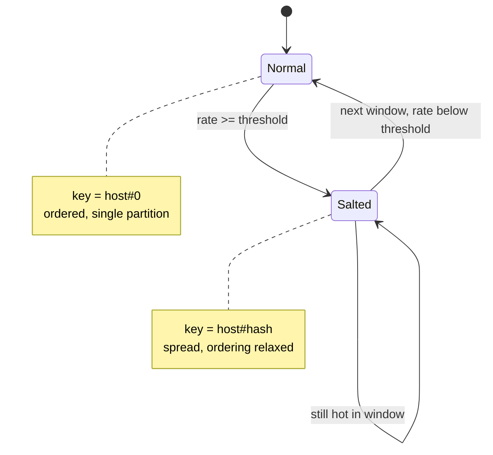
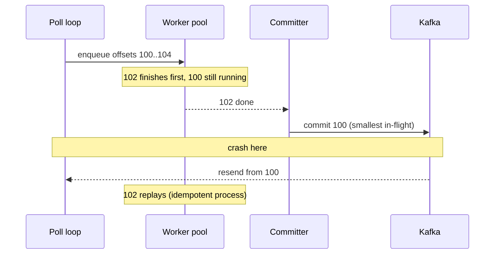

# Hot-shard pitfalls when you key by hostname

*a short tour through the day your evenly-sharded topic stops being evenly sharded*

Last Tuesday at 14:07, `host-prod-a-1471` started emitting 20 times its usual event volume. Nothing else changed: same topic, same producer code, same consumer group. By 14:09 one partition out of 24 carried 70% of the bytes, and the per-host state machine draining it fell three minutes behind and kept falling. Every team eventually ships a pipeline keyed by `hostname` and hits the same skew problem on a quiet Tuesday.

Three terms first. A **partition** is one of the parallel logs a Kafka topic is split into; it is the unit of both storage and parallelism. A message's **key** decides which partition it lands in. A **consumer group** is a set of consumer processes sharing the work of a topic, and the rule that matters: within a group, each partition is read by exactly one consumer. That rule is why keying gives you ordering. Kafka only guarantees order *within* a partition, so to process all of one host's events in order on one thread, you make them all land in one partition. Keying by hostname does that. It also means a single hot partition cannot be split across consumers, which is the trap.

This is how you spot the hot partition, why the first three things you will try make it worse, and what actually fixes it.

## Why hostname-keying is so seductive

The promise of partition-by-key is per-key ordering: every event from `host-prod-a-1471` lands in the same partition, so you process them in produce order with a single consumer thread: per-host state machines, sequence-number dedup, incremental aggregation without cross-consumer coordination. The producer code is one line:

```python
producer.send(
    topic="host-events",
    key=event["hostname"].encode(),
    value=json.dumps(event).encode(),
)
```

How the partition gets chosen: Kafka's `DefaultPartitioner` runs the key bytes through murmur2, a fast non-cryptographic hash (chosen for speed and even spread, not security), then takes that hash modulo the partition count: literally `toPositive(Utils.murmur2(keyBytes)) % numPartitions` (see the [DefaultPartitioner source](https://github.com/apache/kafka/blob/3.2.0/clients/src/main/java/org/apache/kafka/clients/producer/internals/DefaultPartitioner.java); librdkafka uses the same scheme for `partitioner=murmur2_random`). The same key always hashes to the same partition: one ordered stream per key, drained single-threaded.

A good hash spreads keys evenly regardless of what the names look like, so name distribution is not what you worry about. What keeps partitions balanced is the *traffic per host* being roughly even: as long as no host is dramatically chattier than the rest, the per-host streams smooth out across partitions. The keyword is "as long as."

## The day uniformity dies

You have 24 partitions and 4,000 hosts. Each partition gets traffic from ~165 hosts, and the average smooths out. To put a number on "balanced": rank the partitions by throughput and compare the busiest to the median (the middle one). The busiest sits maybe 1.4x the median. A small busiest-to-median ratio means load is even and no single partition is close to falling behind, so nothing pages. That ratio comes back in the simulation as the single number that tells you whether a topic is healthy.

Three plausible scenarios break this:

1. **A regression storm.** Someone merges a firmware change. On any host where it loads, a driver fault loop kicks in and the host emits 5,000 errors per second instead of the normal 5. Twenty hosts are now 1,000x noisier than the rest, spread across maybe twelve partitions, but the four unlucky partitions that got multiple noisy hosts now carry 80% of the topic's bytes.

2. **A long-running batch job.** A pricing team kicks off a 48-hour reindex on a beefy box called `svc-pricing-12`. The job emits an audit event per row processed, and the partition holding `svc-pricing-12` carries one host worth of data at a rate higher than the other 23 partitions combined.

3. **Naming convention drift.** Someone deploys a fleet of identical short-lived workers all named `worker-pool-a`. Thousands of distinct machines now emit under one key, so the hash maps every one to a single partition that serves the entire worker pool. The problem is collapsed cardinality, not an unlucky hash.

In every one of these, the partition count is fine, the hash is fine, the consumer hardware is fine. The data distribution is what broke.

## Spotting the hot partition

Two terms get used interchangeably and should not be. A **hot partition** carries far more than its share of traffic. A **hot key** is a single key carrying far more than its share of one partition's traffic. The fixes diverge: a hot partition from many noisy keys can be relieved by spreading keys, but one caused by a single hot key cannot, because that key is pinned to one partition.

The first sign is almost never "partition X is hot." It is "consumer lag is rising on group Y," and a look at per-partition lag shows it is concentrated. Your dashboard has to have per-partition lag, not just aggregate. Watch only aggregate and you mistake a hot-shard problem for "consumer too slow," which leads to the second mistake: scaling up the consumer.

Useful broker-side metrics, in rough order of usefulness. (Kafka exposes these over JMX; each metric is an MBean, a named object you query by the dotted string below.)

- Per-partition produce rate. The stock JMX MBean `kafka.server:type=BrokerTopicMetrics,name=BytesInPerSec,topic=X` is per-topic, and there is no built-in per-partition variant. To get per-partition `BytesIn` you either compute log-dir size deltas (`kafka.log:type=Log,name=Size,topic=X,partition=Y` sampled over time) or run a custom collector that diffs per-partition end offsets. Most teams hunt for an MBean that does not exist; save yourself the search.
- `MessagesInPerSec` per topic, paired with per-partition end-offset deltas to separate "one giant event" from "a flood of small events."
- Per-partition consumer lag (records, not bytes), via `kafka-consumer-groups.sh --describe` or `kafka.consumer:type=consumer-fetch-manager-metrics,name=records-lag,...`. What actually wakes you up.
- Producer-side key distribution. Sample produced keys for a minute and build a histogram, and you instantly know whether one key is dominating.

Confirming the hot key from the consumer side:

```python
from collections import Counter

counts = Counter()
for msg in consumer.poll(timeout_ms=5000).values():
    for record in msg:
        counts[record.key] += 1

for key, n in counts.most_common(10):
    print(f"{key!r}: {n}")
```

If the top key is doing 60% of the partition's volume, you have a hot key, not a hot partition, and the two need different fixes.

## The three things you will try first, and why they all make it worse

When the page fires, the instinct is to redistribute. Three common moves do nothing or make it worse:

**Add partitions.** Kafka lets you increase partition count on a topic, and this is worse than it sounds. The reason is the modulo: `hash(K) % 24` and `hash(K) % 48` are two unrelated remainders of the same number, so doubling the partition count reshuffles where nearly every key lands. For keyed messages using hash-mod partitioning (the default), Confluent is explicit that increasing partitions does not redistribute existing data and that new writes with the same key may land on a different partition, breaking per-key affinity at the boundary ([Kafka partition determination docs](https://docs.confluent.io/kafka/operations-tools/partition-determination.html)). Concretely:

```
key K = "host-prod-a-1471"
murmur2(K) = 0x9F3A12C7

before alter (24 partitions):   hash(K) % 24 = 5     -> all history on P5
after  alter (48 partitions):   hash(K) % 48 = 19    -> new writes on P19

P5  [...older offsets, now stranded for ordering purposes...]
P19 [new offsets, no idea P5 exists]
```

Old messages stay on partition 5, new ones from that key land on 19, and you have lost per-key ordering at the boundary for every key in the topic. Meanwhile your hot key just picked a new partition to melt. You broke ordering globally and fixed nothing locally.

Even a full repartition (new topic, mirror data over) only helps if your hot keys spread across the new space. If the noise is one host, that host still goes to a single partition. Doubled broker overhead, same problem.

**Add consumers.** A single Kafka partition is consumed by exactly one consumer in a group. You can have 200 consumers and the hot partition is still drained by one of them; the other 199 have no partition to read and sit idle.

**Switch to round-robin keying.** This does flatten the partitions. It also destroys per-host ordering, the entire reason you chose hostname-keying. If your consumer assumes ordered per-host events (it almost certainly does, even if nobody wrote that down), you have introduced a bug class that will not surface until a customer complains about a reordered state transition.

So the trap is real: the naive fixes do nothing, do harm, or trade one problem for a worse one.

## What actually works

Three patterns help, in roughly increasing order of complexity:

### 1. Composite keys

If `hostname` alone is too coarse, key by `(hostname, secondary_dimension)` where the second dimension splits the chatty host's traffic without breaking the ordering you actually need.

The classic example: error events from a single host often cluster around a specific subsystem. If `svc-pricing-12` emits 5,000 events per second spread across 20 subsystems, then `(hostname, subsystem)` keys give you 20 distinct keys instead of 1. Hash collisions will collapse some onto the same partition, but you no longer pin all 5,000 events to a single shard.

```python
key = f"{event['hostname']}|{event['subsystem']}".encode()
producer.send(topic="host-events", key=key, value=...)
```

You have changed your ordering guarantee to per-(host, subsystem), not per-host. Read your consumer carefully. If it does cross-subsystem state transitions per host, this breaks it. If it does not, you are fine.

A concrete failure mode: a consumer that maintains `last_seen[host]` across subsystems. Before composite keying, every event for `host-prod-a-1471` arrived on the same partition in produce order, so the consumer could write `last_seen["host-prod-a-1471"] = max(current, event.ts)` and trust it. After, `(host, subsystemA)` lands on P3 and `(host, subsystemB)` on P11, drained by two different consumer threads. An event from subsystemA at t=100 and one from subsystemB at t=99 now arrive in either order, the `last_seen` writes interleave, and any logic that fires on a transition (alerting when a host goes silent, deduping on previous-state) gets non-deterministic answers. The bug class is "cross-key invariants on what used to be a single-key stream," and it surfaces in incident postmortems, never in tests.

### 2. Salt-then-bucket

When you need per-host ordering most of the time but want a safety valve for the pathological cases, salt the key with a small bounded fan-out.

```python
SALT_BUCKETS = 8

def partition_key(event):
    host = event["hostname"]
    # Most hosts get one bucket: deterministic, ordered.
    # Hot hosts get spread across N buckets.
    if host in HOT_HOSTS:
        bucket = random.randint(0, SALT_BUCKETS - 1)
        return f"{host}#{bucket}".encode()
    return host.encode()
```

The salted key still goes through the same `murmur2 % numPartitions`, so 8 salt buckets do not guarantee 8 distinct partitions; collisions can collapse some. This static version scatters every event from a hot host onto a random bucket, so use it only when consumers tolerate random scatter across `SALT_BUCKETS`. `HOT_HOSTS` is a small set, refreshed from your metrics. The point: 99% of traffic gets clean per-host ordering, and the 1% of pathological hosts get fan-out and temporarily lose their ordering guarantee.

The consumer side has to know about this. Events from a salted host arrive on multiple partitions, so per-host aggregation needs a reconciliation step. Usually acceptable: the alternative is dropping events or melting one consumer.

A variant that works well makes the fan-out *rate-aware*, which is what lets it self-heal. Instead of a static `HOT_HOSTS` list, every event gets `host#bucket(host, time_window)`, where the bucket is `0` for normal hosts and a hashed spread for hosts that crossed a rate threshold in the last minute. No config push needed:

```python
def bucket(host, now):
    window = now // 60  # 60-second rolling window
    rate = rate_counter.get(host, window)  # events/sec from a sliding-window counter
    if rate < HOT_THRESHOLD:
        return f"{host}#0"
    return f"{host}#{hash((host, window)) % SALT_BUCKETS}"
```

The `now // 60` quantizes time into fixed 60-second windows, so every event in the same minute computes the same `window` and the salt is transient. The state diagram carries the rest:



Two caveats. First, this only self-heals if `rate_counter` reflects the host's true fleet-wide rate. A per-process counter sees only one producer instance's events, so a host hot across many producers but quiet on each never trips the threshold; the counter has to be shared across producers for the "no config push" promise to hold. Second, the collapse back to bucket 0 is true only for *new writes*. Data written during the hot minute stays physically spread across `SALT_BUCKETS` until it ages out, so consumers must keep scanning all buckets for that historical window. That is why consumers reconcile on the host key, not the salted key.

### 3. Single partition, multiple consumer threads

Sometimes you cannot change the keying: downstream contracts, the consumer-owning team is unavailable, or the topic is shared with three other services on the current scheme. You can still parallelize the drain. Keep one Kafka consumer reading the hot partition, but hand records off to a thread pool keyed by a sub-dimension you control. Keep the per-sub-key ordering and you recover throughput without changing the topic at all.

The offset-commit dance is the tricky part, and it turns on what delivery guarantee you want. **At-least-once** means a record may be processed more than once but never lost; **exactly-once** means processed precisely once, which is far harder and not what this pattern gives you. A committed offset in Kafka is the *next* offset to read: committing N tells the broker "everything strictly below N is done, resume at N." Commit naively after enqueueing and a crash loses records the workers never finished; commit the highest finished offset and, since workers finish out of order, a crash skips a lower offset still in flight.

The fix is a **watermark commit**: keep a sorted set of in-flight offsets per partition, and on each tick commit the smallest one still in flight. The sequence below shows the crash-replay path that makes this at-least-once, and why `process()` must be idempotent.



```python
import collections, threading, time
from queue import Queue
from sortedcontainers import SortedList  # pip install sortedcontainers; or use heapq with lazy deletion from the stdlib

NUM_WORKERS = 16
queues = [Queue(maxsize=10_000) for _ in range(NUM_WORKERS)]

# Per-partition set of offsets still being processed.
inflight = collections.defaultdict(SortedList)
last_seen = {}                      # highest offset polled per partition
inflight_lock = threading.Lock()

def worker(q):
    while True:
        record = q.get()
        try:
            process(record)
        finally:
            with inflight_lock:
                inflight[record.partition].remove(record.offset)

for q in queues:
    threading.Thread(target=worker, args=(q,), daemon=True).start()

def committer():
    while True:
        time.sleep(1.0)
        commits = {}
        with inflight_lock:
            for p, last in last_seen.items():
                offsets = inflight[p]
                # Commit point = next offset to read.
                # If something is in flight, resume at the lowest in-flight offset.
                # If nothing is in flight, resume just past the last polled offset.
                commits[p] = offsets[0] if offsets else last + 1
        for p, off in commits.items():
            consumer.commit({p: off})

threading.Thread(target=committer, daemon=True).start()

for record in consumer:
    with inflight_lock:
        inflight[record.partition].add(record.offset)
        last_seen[record.partition] = record.offset
    sub_key = record.value["subsystem"]
    idx = hash(sub_key) % NUM_WORKERS
    queues[idx].put(record)
```

The committer commits the smallest in-flight offset, not the highest finished one, which is what gives you at-least-once. When nothing is in flight it commits `last + 1`, so a fully-drained partition does not get re-read from the start. The sorted set is per-partition because Kafka commits are per-partition. The lock is coarse, fine for hundreds of thousands of records per second; past that, shard the in-flight tracking per partition.

The consumer knobs that matter for this pattern, with their defaults from the Java client ([consumer configs reference](https://docs.confluent.io/platform/current/installation/configuration/consumer-configs.html)):

| Setting | Default | Why you change it |
|---|---|---|
| `enable.auto.commit` | `true` | Set to `false`; auto-commit will race the watermark and ack records the workers have not finished. |
| `auto.commit.interval.ms` | `5000` | Irrelevant once auto-commit is off, but worth knowing the silent 5s tick exists. |
| `max.poll.records` | `500` | Cap the per-poll batch so the in-flight set stays bounded and one slow worker cannot pin offsets for minutes. |
| `max.poll.interval.ms` | `300000` | The hard ceiling on how long workers can hold a batch before the broker rebalances you out of the group. Set this with the worst-case `process()` latency in mind, not the median. |

## A tiny simulation

A throughput simulation: one run with hostname keying where one host is 50x noisier, one with `host#bucket` salting on that host. (It uses Python's `hash()` rather than murmur2; any uniform hash illustrates skew.)

```python
import collections, random, statistics

NUM_PARTITIONS = 24
NUM_HOSTS = 4000
NOISY_HOST = "host-prod-a-1471"
NOISY_FACTOR = 50
SALT_BUCKETS = 16

# Probability tuned so the noisy host emits ~50x a normal host's share.
# Each normal host's share is 1/NUM_HOSTS of the non-noisy traffic.
# Solving NOISY_PROB / ((1 - NOISY_PROB) / NUM_HOSTS) = 50 gives ~1.2%.
NOISY_PROB = NOISY_FACTOR / (NUM_HOSTS + NOISY_FACTOR)

def simulate(keyer, n_events=2_000_000):
    counts = collections.Counter()
    for _ in range(n_events):
        if random.random() < NOISY_PROB:
            host = NOISY_HOST
        else:
            host = f"host-prod-a-{random.randint(0, NUM_HOSTS - 1)}"
        partition = hash(keyer(host)) % NUM_PARTITIONS
        counts[partition] += 1
    return counts

plain = simulate(lambda h: h)
salted = simulate(
    lambda h: f"{h}#{random.randint(0, SALT_BUCKETS - 1)}"
              if h == NOISY_HOST else h
)

def report(label, c):
    vals = [c[p] for p in range(NUM_PARTITIONS)]
    print(f"{label}: max={max(vals):>8}  p50={int(statistics.median(vals)):>7}  "
          f"ratio={max(vals)/statistics.median(vals):.1f}x")

report("plain ", plain)
report("salted", salted)
```

On my laptop the plain run at `NOISY_FACTOR=50` gives roughly `max=110,000 p50=82,000 ratio=1.3x`. Set `NOISY_FACTOR=1` and the same code produces `ratio=1.08x`, what 24-partition uniform distribution looks like, so that 1.3x is already mild skew with the noisy host tainting the worst partition. Push `NOISY_FACTOR` higher and the ratio climbs roughly linearly with the noisy host's share; the salted run flattens the worst case back to a small multiple of the median even at the higher factor.

The salted run also moves the median *up*, and that second-order effect is the whole reason this works. An unbalanced topic pins one partition at its drain limit while the other 23 sit half-idle, hardware you are paying for and not using. Spreading the noisy host's traffic means no single partition is starved, so the same hardware does more aggregate work.

## What to keep in the broker-ops drawer

This runbook is for the person with broker shell access at 02:00, not the consumer team. The commands assume Kafka; adapt for your flavor.

- `kafka-consumer-groups.sh --bootstrap-server $B --group $G --describe`: confirm the lag is on one or two partition columns, not spread evenly. If it is even, your problem is downstream.
- `kafka-run-class.sh kafka.tools.GetOffsetShell --topic $T --time -1` against the live offsets minute over minute gives per-partition produce rate without leaving the broker host. Useful when your metrics pipeline is the thing on fire.
- A 30-second consumer dump from the hot partition with `kafka-console-consumer.sh --partition $P --property print.key=true`, piped through `awk '{print $1}' | sort | uniq -c | sort -rn | head`. Top key over 30% of the dump means a hot key, not a hot partition.
- Resist the urge to write a reassignment JSON and run `kafka-reassign-partitions.sh` to fix *this*. The tool reassigns partition replicas across brokers; it does not touch the producer-side `murmur2(key) % N` mapping covered above ([Strimzi reassignment overview](https://strimzi.io/blog/2022/09/16/reassign-partitions/)). So it cannot rebalance load *inside* a single hot partition; that needs more partitions, a different key, or a custom partitioner. Worse, the catch-up replication during a move reads from the source broker that is already melting, so reassigning mid-spike makes the hot broker hotter. It is the right tool for "this broker is overloaded across many partitions," and even then only once the spike has passed.
- If the spike is going to persist past your patience, push the salting fallback for the offending keys at the producer, not the broker. Brokers have no opinions about your keys.
- Once the spike is gone, archive the per-partition rate graph and the top-key dump into the incident doc. The next hot partition will look exactly like this one, and you will not remember the threshold you used.

Hostname keying is not the problem. The implicit assumption of uniform traffic is. Measure your distribution, decide your fallback before the page fires.
