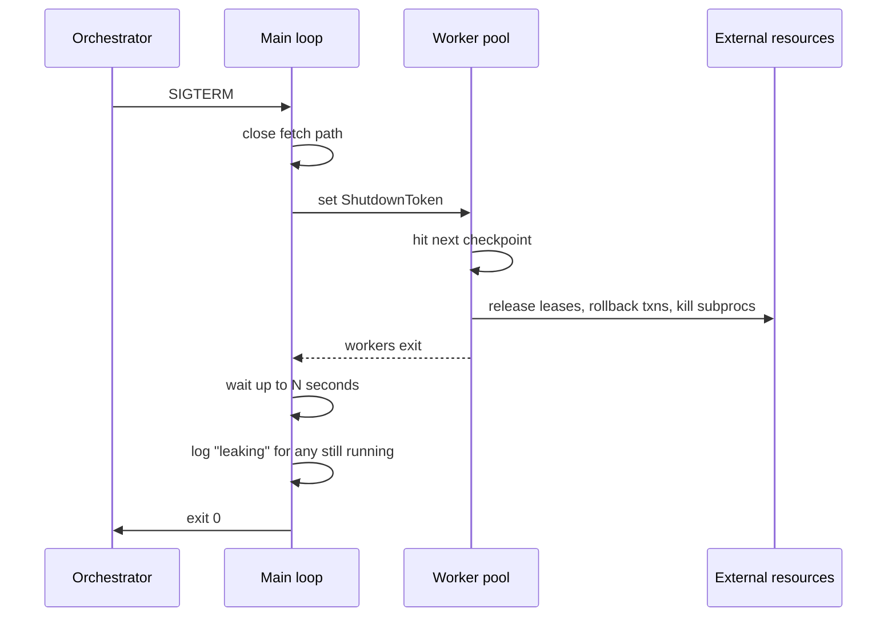
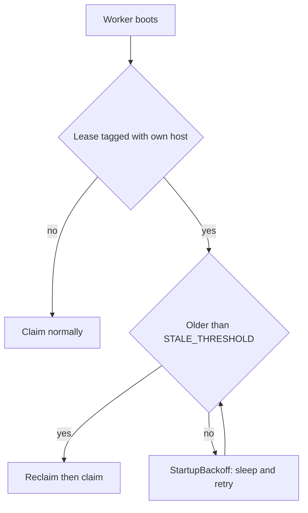

# Cancellation and cleanup in long-running task workers

*where workers leak leases, half-write files, and lose jobs between SIGTERM and exit*

Programs on Unix-family systems can be told to stop by sending them a signal: a small named message the operating system delivers to a process. Two matter for shutdown. SIGTERM is the polite one: it means "please shut down," and your program can catch it, run cleanup code, and exit on its own terms. SIGKILL is the blunt one: it cannot be caught, blocked, or ignored, and it ends the process immediately with no chance to clean up. (It is signal number 9, which is why you see people type `kill -9`.) Most worker bugs live in the gap between those two.

The gap is dangerous because of what the operating system cleans up and what it leaves behind. When your process dies, the kernel (the core of the operating system, which manages processes and hardware) reclaims the state it owns: file descriptors (the small integers the kernel hands you to refer to open files and network connections), memory pages, and per-thread bookkeeping. Reclaiming a finished process's leftover state is called reaping. But the kernel only knows about state it created itself. It will not roll back the database row you wrote, release a resource you claimed, or tell the queue the half-finished job is up for grabs: all of that lives outside the kernel, in a database, a message queue, or another machine. Kernel-owned state is cleaned up for free; externally-owned state is your responsibility.

A worker here means a long-running program that pulls units of work off a queue and runs them; the whole set of those running worker processes is the worker fleet. Shutdown is the least-tested path in most fleets, and its failures are hard to debug: locks nobody released, half-written files, transactions that hang until someone notices, customer-visible jobs that vanish with no log line explaining why.

I will use a generic Python worker that pulls jobs from a queue and writes results somewhere. The queue can be backed by Redis, RabbitMQ, or SQS, which are all message queue systems; the choice does not matter here. The server that hands out and tracks jobs is the broker. The patterns translate cleanly to Go, Rust, Node, whatever you use.

## What "graceful" actually means

The system that starts and stops your worker is the orchestrator, in practice something like Kubernetes or systemd. When it wants your worker gone, it sends SIGTERM, waits a configured grace period (a fixed amount of time it gives you to exit on your own), then sends the uncatchable SIGKILL if you are still alive. The default grace period depends on what is running you:

| Orchestrator | Default grace period | Notes |
|---|---|---|
| Kubernetes | 30s | `terminationGracePeriodSeconds` on the pod spec ([k8s docs](https://kubernetes.io/docs/concepts/workloads/pods/pod-lifecycle/)) |
| systemd | 90s | `DefaultTimeoutStopSec=90s` in `system.conf`, overridable per unit ([systemd docs](https://www.man7.org/linux/man-pages/man5/systemd-system.conf.5.html)) |
| Docker (Linux) | 10s | client default for `docker stop -t`; overridable per call or via container `--stop-timeout` at create time ([docker docs](https://docs.docker.com/reference/cli/docker/container/stop/)) |
| AWS ECS | 30s | `stopTimeout`, max 120s on Fargate platform 1.3+ ([ECS docs](https://docs.aws.amazon.com/AmazonECS/latest/developerguide/task_definition_parameters.html)) |

(A Kubernetes pod is the smallest unit it runs, one or more containers scheduled together, and the pod spec is its config. Fargate is an AWS service that runs containers without you managing the servers under them.)

So "graceful" comes down to one thing: reaching a clean state before SIGKILL.

A clean state means:

1. No in-flight job is half-done: it either finished or went back to the queue for another worker.
2. Every external resource you reserved (database rows marked locked, file locks, device leases, leased compute slots) is released.
3. Every buffered write is flushed: no half-written result files, no log lines lost.

A "lease" is a claim on a resource that you hold for a while and are expected to give back: mark a device as mine, use it, then release it. Leases run all through this post.

A common bad pattern is to install a signal handler that sets a flag, then ignore that flag across most of the codebase. The main loop checks it between jobs, which is fine. But a job that takes 4 minutes ignores the flag for 4 minutes, by which point your grace period has expired.

## Cooperative cancellation is a contract

Cancellation is not something you bolt on at the end. It is a contract between the worker framework and every function it calls, with two clauses:

1. Long-running code checks for cancellation at regular intervals.
2. When cancellation is signaled, code stops at the next checkpoint and unwinds cleanly using normal exception handling.

Python has no built-in cancellation tokens for synchronous code, so we build one:

```python
import signal
import threading

class ShutdownToken:
    def __init__(self):
        self._event = threading.Event()

    def request(self):
        self._event.set()

    def is_requested(self) -> bool:
        return self._event.is_set()

    def wait(self, timeout: float) -> bool:
        # Returns True if shutdown was requested during the wait.
        return self._event.wait(timeout)

    def raise_if_requested(self):
        if self._event.is_set():
            raise ShutdownRequested()

class ShutdownRequested(Exception):
    pass
```

This uses `threading.Event` rather than a plain `bool` for two reasons. `Event` is thread-safe, so the signal handler can set it on one thread while worker threads read it on others, with no torn reads (one thread seeing a half-updated value while another is mid-write). And `Event.wait(timeout)` returns early the moment someone calls `request()`, which makes the sleep trick below work. A bool gives you neither.

Wire it up to signals exactly once, at process startup:

```python
shutdown = ShutdownToken()

def _handle_signal(signum, frame):
    shutdown.request()

signal.signal(signal.SIGTERM, _handle_signal)
signal.signal(signal.SIGINT, _handle_signal)
```

`signal.signal` registers a function to run when a signal arrives. We register the same handler for SIGTERM and for SIGINT, the signal you send by pressing Ctrl-C in a terminal, so Ctrl-C during local development shuts the worker down as cleanly as the orchestrator does.

Two things to notice. First, the handler does almost nothing. It sets an event and returns. Do not log from a signal handler, do not acquire locks, do not call functions that are not async-signal-safe. A function is async-signal-safe only if it stays correct when it runs from a handler that interrupted your program at an arbitrary instruction, possibly while a lock is held or while you were mid-`malloc` (the C library function that allocates memory; if a signal interrupts it and your handler also allocates, you corrupt its internal state). Most functions are not safe there, which is why a handler that does real work can deadlock or corrupt state. This is rarer in Python than in C, but it happens.

Second, use `wait()`. Anywhere you would call `time.sleep(30)`, call `shutdown.wait(30)` instead, so shutdown during the sleep wakes you immediately.

There is one Python-specific thing to know here. Per the [signal module docs](https://docs.python.org/3/library/signal.html), Python signal handlers run only on the main thread of the main interpreter, no matter which thread the signal arrived on. CPython (the standard, reference implementation of Python, the one most people run) does not run your handler the instant the signal lands. It sets a pending flag and checks it between bytecode instructions, the small steps the interpreter executes one at a time. So your handler fires only when the main thread is back in that interpreter loop. If the main thread is inside a long call into C code, the handler waits until that call returns. The GIL (the Global Interpreter Lock, which lets only one thread execute Python bytecode at a time) is one reason that can happen, but not the only one. Even a C extension that releases the GIL with `Py_BEGIN_ALLOW_THREADS` still defers your handler until its C call returns. sqlite, some image and machine-learning libraries, and blocking syscalls in poorly behaved bindings can all delay it. (A syscall, short for system call, is a request your program makes into the kernel to do something for it, like reading from a file or socket; a blocking syscall does not return until the work is done or interrupted.)

When a blocking syscall is interrupted by a signal, the kernel reports the error EINTR. (errno is a variable in C that holds an error number after a failed call; EINTR is the value meaning "interrupted by a signal.") [PEP 475](https://peps.python.org/pep-0475/) (a PEP is a Python Enhancement Proposal, a numbered design document for the language), shipped in Python 3.5, made the standard library's syscall wrappers (read, write, select, poll, socket operations, `time.sleep`) run the pending handler and then retry the call automatically, unless the handler raises, in which case the exception propagates and the call is not retried. The structural fix is the same either way: keep the main thread doing only short-lived Python work, like the fetch-and-dispatch loop, and let job execution happen on worker threads or subprocesses, so the main thread stays responsive and signals get processed promptly.

## Pushing cancellation down the call stack

The token does nothing useful if it never reaches the code that needs it. Pass it explicitly; do not make it a global reachable from anywhere, which makes test code awful.

All subprocess and signal patterns below assume POSIX, the family of standards that Linux, macOS, and other Unix-like systems follow. Windows needs a different cleanup strategy: there, `terminate()` maps to `TerminateProcess`, a Windows API call that kills a process immediately with no SIGTERM-equivalent, and `os.killpg` does not exist.

```python
def run_job(job, shutdown: ShutdownToken):
    for step in job.steps:
        shutdown.raise_if_requested()
        execute_step(step, shutdown)

def execute_step(step, shutdown: ShutdownToken):
    proc = subprocess.Popen(step.cmd, ...)
    while proc.poll() is None:
        if shutdown.wait(0.5):
            proc.terminate()
            try:
                proc.wait(timeout=5)
            except subprocess.TimeoutExpired:
                proc.kill()
            raise ShutdownRequested()
```

The subprocess case needs care. You spawned a child process, but the orchestrator sent SIGTERM to you, not to the child. If you exit without dealing with it, one of two things happens. Either the child keeps running, re-parented to PID 1 as an orphan, eating CPU with nobody watching it. (A PID, process ID, is the number the kernel uses to identify a process. PID 1 is the init process, the first process the kernel starts at boot; one of its jobs is to adopt any process whose parent exits. That adopted process is an orphan.) Or, if the child finished but you never called `wait()` on it, it becomes a zombie: a process that has exited but whose entry in the process table the kernel cannot free until its parent reaps it (calls `wait()` to collect its exit status; this is the parent-collects-a-child sense of reaping, related to but distinct from the kernel reclaiming a dead process's own state). PID 1 reaps the children it adopts, but a poorly behaved PID 1 leaves zombies piling up. Either way, orphaning a child is never a clean handoff: propagate cancellation to children, give them a short grace period, then kill.

Process groups are the part people get wrong. A signal can target one process by its PID, or a whole group of related processes at once. `proc.terminate()` does the former: SIGTERM to the immediate child only. If that child shelled out to ffmpeg, or kicked off a training script that forks its own pool of workers, those grandchildren never get the signal, and orphaned ffmpeg processes burn CPU long after your worker exited. The fix is to put the child in its own process group and signal the whole group:

```python
proc = subprocess.Popen(step.cmd, start_new_session=True)  # new pgid
...
os.killpg(proc.pid, signal.SIGTERM)
try:
    proc.wait(timeout=5)
except subprocess.TimeoutExpired:
    os.killpg(proc.pid, signal.SIGKILL)
```

A process group is a set of related processes the kernel tracks together so you can signal all of them at once; its identifier is the pgid (process group ID). `start_new_session=True` calls `setsid()` in the child, the system call that puts a process into a fresh group of its own, with itself as leader, where the new group's ID equals that process's PID. So `proc.pid` doubles as the new pgid, and `os.killpg(proc.pid, ...)` delivers the signal to the child and every descendant carrying that pgid, ffmpeg grandchildren included.

## Draining in-flight work

The main loop usually looks something like this:

```python
def main_loop(queue, shutdown: ShutdownToken):
    while not shutdown.is_requested():
        job = queue.fetch(timeout=5.0)
        if job is None:
            continue
        try:
            run_job(job, shutdown)
            queue.ack(job)
        except ShutdownRequested:
            queue.nack(job, requeue=True)
            break
        except Exception:
            log.exception("job failed")
            queue.nack(job, requeue=False)
```

`queue.fetch` should have a timeout. If it blocks forever, the shutdown check at the top of the loop never runs and you sit there until SIGKILL. Five seconds is fine; most brokers handle short polls cheaply.

`ack` (short for acknowledge) tells the broker "I finished this job, delete it." `nack` (negative acknowledge) tells it "I did not finish; here is what to do with it." So `nack(job, requeue=True)` is the critical line: the job was partially executed and we cannot guarantee it finished, so we hand it back (requeue it) for another worker. That is only safe if jobs are idempotent (safe to run more than once: running a job twice produces the same end state as once). The [post on idempotency keys](/article/idempotency-keys.html) covers how to get there; here I treat it as a precondition. The `Exception` branch uses `requeue=False`, because a job that failed on its own will probably fail again, and you do not want to spin it forever.

If you have a pool of worker threads pulling jobs at the same time, the shutdown sequence fans out:



The "log leaking with job id" line saves you pain later: when the morning report says job 7c2f-A19 ran for 42 minutes, you can grep your logs and find "worker shutting down while job 7c2f-A19 still in flight."

## Releasing external resources

The job acquired things outside the process, and they outlive you unless you explicitly release them. Common offenders:

- A row in a `device_leases` table marked `claimed_by = 'worker-17', claimed_at = <timestamp>`. If you die, the row stays claimed forever, or until some background cleanup process (a janitor) notices the worker is gone.
- An advisory file lock (`fcntl.flock`). An advisory lock only works if every program agrees to check it before touching the resource; the kernel does not force anyone to honor it, unlike a mandatory lock. The kernel releases an advisory file lock when your process exits, so this one is usually fine. But a lock file you wrote yourself in `/var/run/something.lock` containing your PID stays.
- A long-running database transaction holding row locks. A transaction is a group of database operations that either all take effect (a `COMMIT`) or none do; a row lock is the database holding a row so other transactions cannot change it until yours finishes. The database rolls a transaction back when your connection closes, which happens on process exit if your driver is well-behaved. A connection pooler changes that. A pooler keeps a small set of real database connections open and shares them across many client processes (sharing one connection among many is multiplexing); it does not necessarily close the real server connection when one client dies, so the session outlives your worker. Whether the open transaction also leaks depends on the pool: a good one resets the connection (`ROLLBACK` to undo the transaction, `DISCARD ALL` to clear session state) when a client disconnects, while one that recycles connections without resetting can leave an `idle in transaction` session (a Postgres state where a connection has an open transaction but is doing nothing) holding locks until a server-side timeout fires.
- A reserved compute slot in some scheduler ("worker-17 has 2 GPUs reserved").
- Files in a temp directory you created but never cleaned up.

The pattern I use is a context manager per resource, and a stack of them per job. A context manager is the Python object you use with a `with` block: it runs setup code when the block starts (its `__enter__` method) and teardown code when the block ends (its `__exit__` method), even if an exception is thrown. `ExitStack` is a dynamic stack of context managers whose `__exit__` hooks run last-in-first-out (LIFO: the most recently added one is torn down first), so teardown mirrors setup in reverse. Unlike a fixed `with a, b, c:`, you can push contexts onto it conditionally or in a loop and still unwind correctly.

```python
from contextlib import ExitStack

def run_job(job, shutdown: ShutdownToken):
    with ExitStack() as stack:
        device = stack.enter_context(lease_device(job.device_kind))
        workdir = stack.enter_context(temporary_workdir(job.id))
        txn = stack.enter_context(db.transaction())

        for step in job.steps:
            shutdown.raise_if_requested()
            execute_step(step, device, workdir, shutdown)

        txn.commit()
```

When `ShutdownRequested` propagates out of the `with`, the `ExitStack` runs the cleanup hooks in reverse order: the transaction rolls back, the workdir gets removed, the device lease gets released, all without a single `try/finally` in the job code.

The lease release itself needs to be defensive:

```python
@contextmanager
def lease_device(kind: str):
    device_id = inventory.claim(kind, claimed_by=worker_id())
    try:
        yield device_id
    finally:
        try:
            inventory.release(device_id, claimed_by=worker_id())
        except Exception:
            log.exception("failed to release device %s", device_id)
```

Note the `claimed_by=worker_id()` on release: only release if I am still the claimer. This guards against a slow shutdown overlapping with the inventory janitor reclaiming your lease and reassigning it to another worker, which you would otherwise release the device out from under. It works only if the check and the release happen as a single atomic operation on the server (atomic meaning all-or-nothing and indivisible, so no other operation can slip in partway through): a `DELETE ... WHERE claimed_by = :me`, or a compare-and-swap (update a value only if it still holds the value you expected, in one indivisible step). A read-then-release does not: it reopens a TOCTOU race. TOCTOU stands for time-of-check-to-time-of-use, a race condition (a bug where the outcome depends on the unpredictable timing of two things running at once) where the state you checked changes before you act on it. In the gap between reading "I still own this" and releasing it, the janitor can reclaim and reassign the device. For real robustness you want a fencing token: a per-lease number that only ever increases (monotonic), which the resource uses to reject any operation carrying a stale, lower value. A bare owner-name match breaks when a new worker boots reusing the dead one's name or host; the new worker looks like the old owner, so the name check passes even though the lease has changed hands. A fencing token does not have that problem, because the number moves on with each new lease.

## When the cancellation token never gets read

Everything above assumes the process is alive long enough to honor SIGTERM. Sometimes it is not. An OOM kill (out-of-memory kill: when the machine runs low on memory, the kernel picks a process and kills it outright), a kernel panic (a fatal kernel error that halts the whole system), power loss, or an operator typing `kill -9` (which sends the uncatchable SIGKILL) all end you with no warning. Then the token is irrelevant: your handler never ran, your `ExitStack` never unwound, your leases sit in the database with your name on them and no one to release them.

This is where stale-resource reclaim takes over, as the last line of defense rather than the primary path. Every live worker periodically writes a heartbeat (a row or key stamped with the current time, proving it is still alive), and a sweep called `reap_stale_workers` releases leases whose owner's last heartbeat is older than a stale threshold (the cutoff age past which a worker is assumed dead). The [post on heartbeats and stale-worker reclaim](/article/heartbeats-stale-worker-reclaim.html) covers the pattern; lean on it rather than reimplement it. On startup, a worker should consult that same mechanism for any leases tagged with its own host or identity, and only then begin accepting jobs.

One race is worth calling out, because we hit it before we wrote it down. The reclaim sweep only fires on leases older than the stale threshold (say, 60 seconds). If the previous incarnation of this worker died 5 seconds ago, its leases still look fresh, so a booting worker sees nothing to reclaim and might claim a device still marked as owned by the dead process. The startup logic has to handle that window explicitly:



In code, the backoff branch (backoff meaning: wait a bit, then retry instead of failing outright) looks roughly like this:

```python
def claim_device(kind: str, me: str) -> str:
    # Refuse to grab a device still tagged with our own host identity
    # until the prior lease ages past the stale threshold.
    held_by_us = inventory.list_claims(kind, claimed_by_host=host_of(me))
    if held_by_us:
        oldest = min(c.claimed_at for c in held_by_us)
        age = now() - oldest
        if age < STALE_THRESHOLD:
            raise StartupBackoff(
                f"prior holder on this host still within grace; retry in {STALE_THRESHOLD - age}s"
            )
    return inventory.claim(kind, claimed_by=me)
```

The startup supervisor (the parent process or runtime that launches the worker and restarts it) catches `StartupBackoff`, sleeps, and retries until either the sweep has run or the previous lease has aged out. Pick one strategy and document it. A silent assumption here turns into a page: an alert that wakes the on-call engineer at 3am ("paging" is what automated monitoring does when it sends a human an alert).

## Testing the abort path

The abort path is annoying to exercise, so most teams skip it. The unit test (fire the token, assert the lease is gone) is worth writing, but the property-based version catches more, because cancellation bugs are almost always race conditions, and races do not show up at the timestamps you would have hand-picked. In property-based testing you state an invariant (a property that must hold for every possible input) and let the framework (here, Hypothesis) generate many inputs trying to break it. When it finds a failure it shrinks it down to the smallest input that still triggers the bug, so instead of "failed at cancel_after=3.847291s" you get the smallest value that reproduces it.

Start with the obvious unit test; you need the fake scaffolding anyway.

```python
def test_cancellation_releases_device_lease(fake_inventory, fake_queue):
    shutdown = ShutdownToken()
    fake_queue.push(Job(id="j1", device_kind="rig", steps=[
        Step("setup"),
        Step("run", duration=10.0),
        Step("teardown"),
    ]))

    result = {}
    def run_worker():
        try:
            worker.run_one(fake_queue, shutdown)
        except ShutdownRequested as e:
            result["raised"] = e

    worker_thread = threading.Thread(target=run_worker)
    worker_thread.start()

    # Only request shutdown after the worker has actually claimed the device,
    # so we are exercising mid-run cancellation rather than a pre-fetch abort.
    wait_until(lambda: fake_inventory.is_claimed("rig"))
    shutdown.request()
    worker_thread.join(timeout=10)

    assert "raised" in result
    assert not fake_inventory.is_claimed("rig")
    assert fake_queue.was_nacked("j1", requeued=True)
```

This costs almost nothing in CI time (continuous integration: the automated system that builds and tests your code on every change) if your fake step uses `shutdown.wait()` instead of real sleeps. It catches the obvious regressions a careful diff review would catch anyway.

The property-based version catches the ones you would not:

```python
@hypothesis.given(cancel_after_seconds=st.floats(0.0, 5.0))
def test_cancellation_at_any_point_leaves_clean_state(cancel_after_seconds, env):
    shutdown = ShutdownToken()
    env.queue.push(make_job())
    schedule_cancel(shutdown, after=cancel_after_seconds)
    try:
        worker.run_one(env.queue, shutdown)
    except ShutdownRequested:
        pass
    # Invariants that must hold regardless of when we cancelled:
    assert env.inventory.held_count() == 0
    assert env.tmp.is_empty()
    assert env.db.open_transactions() == 0
```

The bugs it finds are almost always the same shape: cancel fires between `claim` returning and the `try:` starting, or between `txn.commit()` and `inventory.release()` running, or in any other gap where you held a resource without a cleanup hook attached. These windows are invisible to code review and to fixed-timestamp tests.

For integration tests, run the worker in a real subprocess, send it a real SIGTERM, and assert on observable state afterwards. Slow, but worth running once per CI build:

```python
def test_real_sigterm_drains_in_flight_jobs():
    worker = subprocess.Popen([sys.executable, "-m", "worker"], ...)
    wait_until(lambda: queue.in_progress_count() > 0)
    worker.send_signal(signal.SIGTERM)
    worker.wait(timeout=30)
    assert worker.returncode == 0
    assert queue.in_progress_count() == 0
    assert queue.pending_count() > 0  # jobs were requeued
```

## The shutdown timeline

Happy path on the left, the path you get when the token never gets read on the right:

```
  HAPPY PATH                                |  UNHAPPY PATH
                                            |
  t=0.0  SIGTERM arrives                    |  t=0.0   SIGTERM arrives
         handler sets event                 |          handler sets event
  t=0.0  main loop stops fetching           |  t=0.0   main loop stops fetching
  t=0.0  workers in shutdown.wait() wake    |  t=0.0   worker stuck in 4-min blocking call
  t=0.5  ShutdownRequested propagates up    |          (no cancellation checkpoint)
         ExitStack: txn rollback,           |
         lease release, workdir cleanup     |
  t=2.0  all jobs nacked back to queue      |  t=30.0  SIGKILL from orchestrator
  t=2.0  close queue connection             |          process gone, no cleanup ran
  t=2.1  flush logs                         |          device lease orphaned
  t=2.2  exit 0                             |          txn left open on pooled conn
                                            |          half-written file in workdir
                                            |  t=...   janitor reclaims lease eventually
                                            |          next job hits stale workdir,
                                            |          confuses itself, pages on-call
```

The 0.5s number on the left is not a guarantee. It is the worst case assuming each worker checks the token at least every 0.5s, which falls out of `shutdown.wait(0.5)` in the loop. If a step does a 30-second blocking call between checks, your bound is 30 seconds, not 0.5. The bound is the longest gap between cancellation checks; audit those gaps the same way you audit how long you hold a lock.

Total for a well-behaved worker: about 2 seconds, well inside any orchestrator's grace period. The difference between the two columns is one design choice: whether the long-running step bothered to check the token. A token passed down the call stack, a context manager around every external resource, and one property-based test on the abort path keep you in the left column.
