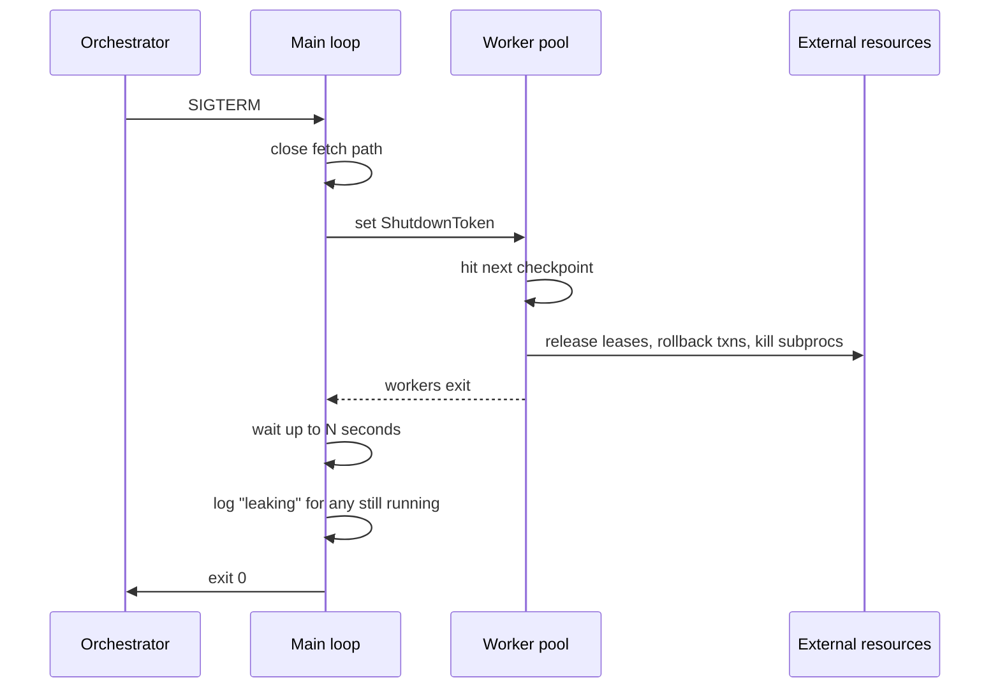

# Cancellation and cleanup in long-running task workers

*where workers leak leases, half-write files, and lose jobs between SIGTERM and exit*

SIGTERM is a request; SIGKILL is not. Most worker bugs live in the gap. The OS will reap your file descriptors and memory pages on the way out, but it will not roll back the row you wrote, release the lease you claimed, or tell the queue that the half-finished job is up for grabs. Shutdown is the most under-tested path in any worker fleet, and the failures are particularly hard to debug: orphaned locks, half-written files, transactions that hang until a DBA notices, and customer-visible jobs that vanish with no log line saying why.

This post is about doing it properly. I am going to use a generic Python worker that pulls jobs from a queue (think Redis, RabbitMQ, SQS, doesn't matter), runs them, and writes results somewhere. The patterns translate cleanly to Go, Rust, Node, whatever you use.

## What "graceful" actually means

When the orchestrator wants your worker gone, it sends SIGTERM. Some time later it sends SIGKILL, and the exact gap depends on what is running you:

| Orchestrator | Default grace period | Notes |
|---|---|---|
| Kubernetes | 30s | `terminationGracePeriodSeconds` on the pod spec ([k8s docs](https://kubernetes.io/docs/concepts/workloads/pods/pod-lifecycle/)) |
| systemd | 90s | `DefaultTimeoutStopSec=90s` in `system.conf`, overridable per unit ([systemd docs](https://www.man7.org/linux/man-pages/man5/systemd-system.conf.5.html)) |
| Docker (Linux) | 10s | client default for `docker stop -t`; overridable per call or via container `--stop-timeout` at create time ([docker docs](https://docs.docker.com/reference/cli/docker/container/stop/)) |
| AWS ECS | 30s | `stopTimeout`, max 120s on Fargate platform 1.3+ ([ECS docs](https://docs.aws.amazon.com/AmazonECS/latest/developerguide/task_definition_parameters.html)) |

SIGKILL is not catchable. Your process is gone the instant it arrives. Anything the OS does not automatically clean up on process death is now your problem and will stay your problem until a human notices.

So graceful reduces to one question: can you reach a clean state before SIGKILL?

A clean state means:

1. No in-flight job is half-done. Either it finished, or it was returned to the queue so another worker can pick it up.
2. Every external resource you reserved (DB rows marked locked, file locks, device leases, leased compute slots) is released.
3. Every buffered write is flushed. No half-written result files, no log lines lost.
4. The next SIGTERM after a normal startup behaves identically. No special "we just restarted" branch.

The bad pattern, which I see constantly, is to install a signal handler that sets a flag and then to forget about it for most of the codebase. The main loop checks the flag between jobs. Great. But a job that takes 4 minutes ignores the flag for 4 minutes and then your termination grace period expires.

## Cooperative cancellation is a contract

Cancellation is not something you bolt on. It is a contract between the worker framework and every function it calls. The contract has two clauses:

1. Long-running code checks for cancellation at regular intervals.
2. When cancellation is signaled, code stops at the next checkpoint and unwinds cleanly via normal exception handling.

Python does not have built-in cancellation tokens for synchronous code, so we build one. The simplest useful version:

```python
import signal
import threading

class ShutdownToken:
    def __init__(self):
        self._event = threading.Event()

    def request(self):
        self._event.set()

    def is_requested(self) -> bool:
        return self._event.is_set()

    def wait(self, timeout: float) -> bool:
        # Returns True if shutdown was requested during the wait.
        return self._event.wait(timeout)

    def raise_if_requested(self):
        if self._event.is_set():
            raise ShutdownRequested()

class ShutdownRequested(Exception):
    pass
```

Wire it up to signals exactly once, at process startup:

```python
shutdown = ShutdownToken()

def _handle_signal(signum, frame):
    shutdown.request()

signal.signal(signal.SIGTERM, _handle_signal)
signal.signal(signal.SIGINT, _handle_signal)
```

Two things to notice. First, the handler does almost nothing. It sets an event and returns. Do not log from a signal handler. Do not acquire locks. Do not call non-async-signal-safe functions. People get this wrong in C all the time and it bites less often in Python but still bites.

Second, `wait()` exists for a reason. Anywhere you would have called `time.sleep(30)`, call `shutdown.wait(30)` instead. If shutdown comes during the sleep, you wake up immediately.

There is a Python-specific trap worth naming. Per the [signal module docs](https://docs.python.org/3/library/signal.html), handlers run only on the main thread of the main interpreter, regardless of which thread the signal arrived on. If your main thread is blocked inside a C extension that holds the GIL (sqlite under some configurations, certain image and ML libraries, blocking syscalls in poorly behaved bindings), the handler is queued until the call returns and the GIL is released. Worth knowing alongside this: [PEP 475](https://peps.python.org/pep-0475/), shipped in Python 3.5, makes stdlib syscall wrappers automatically retry on EINTR after running the Python signal handler, so a SIGTERM no longer pops your blocking `read()` or `select()` out with an exception by default. If you want the old behavior, the handler itself has to raise, or you can use `signal.set_wakeup_fd` to integrate signal delivery with a selector or asyncio loop. The structural fix is the same either way: keep the main thread doing only short-lived Python work, like the fetch-and-dispatch loop, and let actual job execution happen on worker threads or in subprocesses. The main thread stays responsive, signals get processed promptly, and the workers can be as heavy as they need to be.

## Pushing cancellation down the call stack

The token does nothing useful if it never reaches the code that needs it. Pass it explicitly. Resist the urge to make it a global singleton accessible from anywhere, because that makes test code awful.

All subprocess and signal patterns below assume POSIX; Windows needs a different cleanup strategy (`terminate()` there maps to `TerminateProcess`, which is an immediate kill with no SIGTERM-equivalent, and `os.killpg` does not exist).

```python
def run_job(job, shutdown: ShutdownToken):
    for step in job.steps:
        shutdown.raise_if_requested()
        execute_step(step, shutdown)

def execute_step(step, shutdown: ShutdownToken):
    proc = subprocess.Popen(step.cmd, ...)
    while proc.poll() is None:
        if shutdown.wait(0.5):
            proc.terminate()
            try:
                proc.wait(timeout=5)
            except subprocess.TimeoutExpired:
                proc.kill()
            raise ShutdownRequested()
```

The subprocess case is interesting. You spawned a child. The orchestrator only sent SIGTERM to you, not to the child. If you exit without dealing with the child, it either becomes an orphan adopted by PID 1 (which may or may not reap it cleanly) or it sticks around eating CPU. Always propagate cancellation to children, give them a short grace period, then kill.

The footgun hiding inside that advice is process groups. `proc.terminate()` sends SIGTERM to the immediate child only. If the child shelled out to ffmpeg, or kicked off a training script that itself forks a worker pool, those grandchildren do not get the signal and you end up with orphaned ffmpeg processes burning CPU long after your worker exited. The fix is to put the child in its own process group and signal the group:

```python
proc = subprocess.Popen(step.cmd, start_new_session=True)  # new pgid
...
os.killpg(proc.pid, signal.SIGTERM)
try:
    proc.wait(timeout=5)
except subprocess.TimeoutExpired:
    os.killpg(proc.pid, signal.SIGKILL)
```

`start_new_session=True` calls `setsid()` in the child, which makes its PID the new process group ID. `os.killpg` then delivers the signal to every process in that group, ffmpeg grandchildren included.

## Draining in-flight work

The main loop usually looks something like this:

```python
def main_loop(queue, shutdown: ShutdownToken):
    while not shutdown.is_requested():
        job = queue.fetch(timeout=5.0)
        if job is None:
            continue
        try:
            run_job(job, shutdown)
            queue.ack(job)
        except ShutdownRequested:
            queue.nack(job, requeue=True)
            break
        except Exception:
            log.exception("job failed")
            queue.nack(job, requeue=False)
```

A few subtleties.

`queue.fetch` should have a timeout. If it blocks indefinitely, your shutdown check at the top of the loop never runs and you sit there until SIGKILL. Five seconds is fine. Most brokers handle short-poll loops cheaply.

`nack(job, requeue=True)` is the load-bearing line. The job was partially executed and we cannot guarantee it finished. Putting it back on the queue means another worker will pick it up. This assumes jobs are idempotent, which the post on idempotency keys covers in detail; for the rest of this post I am going to treat that as a precondition.

If you have a pool of worker threads pulling concurrently, the shutdown sequence fans out:



The "log leaking with job id" line is your gift to future-you. When the morning report says job 7c2f-A19 has been running for 42 minutes, you want to be able to grep your logs and find the message that says "worker shutting down while job 7c2f-A19 still in flight."

## Releasing external resources

This is the part people forget. The job acquired things outside the process. Those things will outlive you unless you explicitly release them.

Common offenders:

- A row in a `device_leases` table marked `claimed_by = 'worker-17', claimed_at = <timestamp>`. If you die, the row stays claimed forever, or until some janitor process notices the worker is gone.
- An advisory file lock (`fcntl.flock`). The kernel releases this when your process exits, so this one is usually fine. But if you wrote your own lock file in `/var/run/something.lock` containing your PID, that file stays.
- A long-running database transaction holding row locks. The DB will roll it back when your connection closes, which happens on process exit if your driver is well-behaved. With a connection pooler in front (PgBouncer in transaction or statement mode, or any app-level pool that recycles rather than closes on process exit), the server-side connection can outlive your process, and the transaction along with it, until the pool's own idle or recycle policy reclaims the socket.
- A reserved compute slot in some scheduler ("worker-17 has 2 GPUs reserved").
- Files in a temp directory you created but never cleaned up.

The pattern I use is a context manager per resource, and a stack of them per job:

```python
from contextlib import ExitStack

def run_job(job, shutdown: ShutdownToken):
    with ExitStack() as stack:
        device = stack.enter_context(lease_device(job.device_kind))
        workdir = stack.enter_context(temporary_workdir(job.id))
        txn = stack.enter_context(db.transaction())

        for step in job.steps:
            shutdown.raise_if_requested()
            execute_step(step, device, workdir, shutdown)

        txn.commit()
```

When `ShutdownRequested` propagates out of the `with`, the `ExitStack` runs the cleanup hooks in reverse order. The transaction rolls back, the workdir gets removed, the device lease gets released. All without writing a single `try/finally` block in the job code.

The lease release itself needs to be defensive. Something like:

```python
@contextmanager
def lease_device(kind: str):
    device_id = inventory.claim(kind, claimed_by=worker_id())
    try:
        yield device_id
    finally:
        try:
            inventory.release(device_id, claimed_by=worker_id())
        except Exception:
            log.exception("failed to release device %s", device_id)
```

Note the `claimed_by=worker_id()` on release. It is a conditional release: only release if I am still the claimer. This prevents a nasty bug where a slow shutdown overlaps with the inventory janitor reclaiming your lease, which then gets reassigned to another worker, which you then accidentally release out from under.

## When the cancellation token never gets read

Everything above assumes the process is alive long enough to honor SIGTERM. Sometimes it is not. OOM kill, kernel panic, power loss, a runaway `kill -9` from a panicked operator. In those cases the cancellation token is irrelevant: your handler never ran, your `ExitStack` never unwound, your leases are sitting in the database with your name on them and no one to release them.

This is where the broader stale-resource reclaim machinery takes over, not as the primary cleanup path but as the last line of defense. The post on heartbeats and stale-worker reclaim covers the general pattern (`reap_stale_workers` using heartbeat age), and the right move here is to lean on it rather than reimplement it inside the worker. On startup, a worker should consult that same reclaim mechanism for any leases tagged with its own host or identity, and only then begin accepting jobs.

There is one race worth calling out, because it bit us before we wrote it down. The reclaim sweep only fires on leases older than a stale threshold (say, 60 seconds). If the previous incarnation died 5 seconds ago, its leases still look fresh. The new worker boots, sees nothing to reclaim, and might try to claim a device that is still marked owned by the dead process. You have two reasonable options. Either the new worker waits for the reclaim sweep to catch up before accepting work, or it refuses to claim any resource whose holder matches its own host identity until the prior holder's leases time out. Pick one and document it. Silent assumptions here become 3am pages.

Option B, in code, looks roughly like this:

```python
def claim_device(kind: str, me: str) -> str:
    # Refuse to grab a device still tagged with our own host identity
    # until the prior lease ages past the stale threshold.
    held_by_us = inventory.list_claims(kind, claimed_by_host=host_of(me))
    if held_by_us:
        oldest = min(c.claimed_at for c in held_by_us)
        age = now() - oldest
        if age < STALE_THRESHOLD:
            raise StartupBackoff(
                f"prior holder on this host still within grace; retry in {STALE_THRESHOLD - age}s"
            )
    return inventory.claim(kind, claimed_by=me)
```

The startup supervisor catches `StartupBackoff`, sleeps, and retries. By the time the wait clears, either the reclaim sweep has run or the previous lease has aged out and you can `inventory.claim` it directly.

## Testing the abort path

The abort path is annoying to exercise, which is why most teams skip it. The interesting move is not the obvious unit test (fire the token, assert the lease is gone) but the property-based version, because cancellation bugs are almost always race conditions and races do not show up at the timestamps you would have hand-picked.

Start with the obvious unit test, because you need a fake scaffolding anyway.

```python
def test_cancellation_releases_device_lease(fake_inventory, fake_queue):
    shutdown = ShutdownToken()
    fake_queue.push(Job(id="j1", device_kind="rig", steps=[
        Step("setup"),
        Step("run", duration=10.0),
        Step("teardown"),
    ]))

    result = {}
    def run_worker():
        try:
            worker.run_one(fake_queue, shutdown)
        except ShutdownRequested as e:
            result["raised"] = e

    worker_thread = threading.Thread(target=run_worker)
    worker_thread.start()

    # Only request shutdown after the worker has actually claimed the device,
    # so we are exercising mid-run cancellation rather than a pre-fetch abort.
    wait_until(lambda: fake_inventory.is_claimed("rig"))
    shutdown.request()
    worker_thread.join(timeout=10)

    assert "raised" in result
    assert not fake_inventory.is_claimed("rig")
    assert fake_queue.was_nacked("j1", requeued=True)
```

This test costs you nothing in CI time if your fake step uses `shutdown.wait()` instead of real sleeps. It catches the obvious regressions, the ones you would catch by reading the diff carefully.

The version that actually earns its keep is the property-based one:

```python
@hypothesis.given(cancel_after_seconds=st.floats(0.0, 5.0))
def test_cancellation_at_any_point_leaves_clean_state(cancel_after_seconds, env):
    shutdown = ShutdownToken()
    env.queue.push(make_job())
    schedule_cancel(shutdown, after=cancel_after_seconds)
    try:
        worker.run_one(env.queue, shutdown)
    except ShutdownRequested:
        pass
    # Invariants that must hold regardless of when we cancelled:
    assert env.inventory.held_count() == 0
    assert env.tmp.is_empty()
    assert env.db.open_transactions() == 0
```

Hypothesis will spray cancel timings across the interval and shrink failures down to the exact microsecond window where things broke. The bugs it finds are almost always the same shape: cancel fires between `claim` returning and the `try:` starting, or between `txn.commit()` and `inventory.release()` running, or in any other gap where you held a resource without a finalizer attached. These windows are invisible to code review and to fixed-timestamp tests. The property test makes them loud.

For integration tests, run the worker in a subprocess, send it a real SIGTERM, and assert on observable state afterwards. Slow, but worth running once per CI build.

```python
def test_real_sigterm_drains_in_flight_jobs():
    worker = subprocess.Popen([sys.executable, "-m", "worker"], ...)
    wait_until(lambda: queue.in_progress_count() > 0)
    worker.send_signal(signal.SIGTERM)
    worker.wait(timeout=30)
    assert worker.returncode == 0
    assert queue.in_progress_count() == 0
    assert queue.pending_count() > 0  # jobs were requeued
```

## The shutdown timeline

Happy path on the left, the path you get when the token never gets read on the right:

```
  HAPPY PATH                                |  UNHAPPY PATH
                                            |
  t=0.0  SIGTERM arrives                    |  t=0.0   SIGTERM arrives
         handler sets event                 |          handler sets event
  t=0.0  main loop stops fetching           |  t=0.0   main loop stops fetching
  t=0.0  workers in shutdown.wait() wake    |  t=0.0   worker stuck in 4-min blocking call
  t=0.5  ShutdownRequested propagates up    |          (no cancellation checkpoint)
         ExitStack: txn rollback,           |
         lease release, workdir cleanup     |
  t=2.0  all jobs nacked back to queue      |  t=30.0  SIGKILL from orchestrator
  t=2.0  close queue connection             |          process gone, no cleanup ran
  t=2.1  flush logs                         |          device lease orphaned
  t=2.2  exit 0                             |          txn left open on pooled conn
                                            |          half-written file in workdir
                                            |  t=...   janitor reclaims lease eventually
                                            |          next job hits stale workdir,
                                            |          confuses itself, pages on-call
```

The 0.5s number on the left is not a guarantee; it is the worst case assuming each worker checks the token at least every 0.5s (which falls out of `shutdown.wait(0.5)` in the loop). If a step does a 30-second blocking call between checks, your bound is 30 seconds, not 0.5. The bound is whatever the longest gap between cancellation checks is, full stop. Audit those gaps the same way you audit lock-held durations.

Total for a well-behaved worker: about 2 seconds. Well inside any orchestrator's grace period. The divergence point between the two columns is a single design choice: did the long-running step bother to check the token.

The work is a token passed down the call stack, a context manager around every external resource, and one property-based test on the abort path. Then go replace your `time.sleep` calls inside long loops with `shutdown.wait`.
