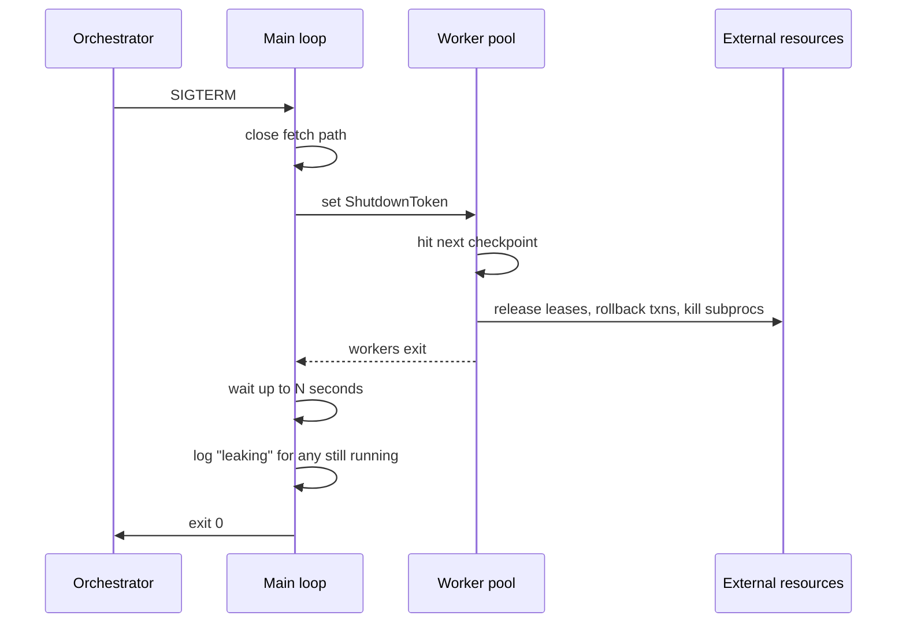
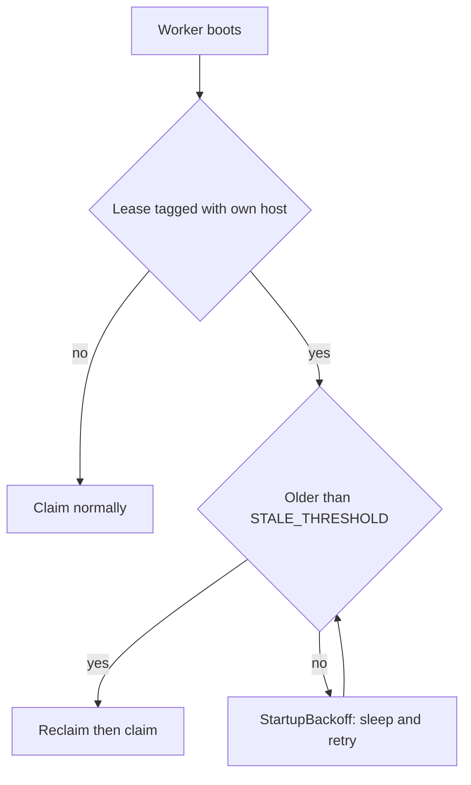

# Cancellation and cleanup in long-running task workers

*where workers leak leases, half-write files, and lose jobs between SIGTERM and exit*

SIGTERM is a request; SIGKILL is not. SIGTERM is catchable: you can install a handler that runs before exit to clean up. SIGKILL cannot be caught, blocked, or ignored, and it kills the process immediately. Most worker bugs live in the gap between the two.

Here is why that gap is dangerous. When your process dies, the kernel reclaims (reaps) the state it owns: file descriptors, memory pages, thread bookkeeping. But it only knows about state it created. It will not roll back the row you wrote, release the lease you claimed, or tell the queue that the half-finished job is up for grabs, because all of that lives outside the kernel, in a database or a broker or another machine. Kernel-owned state is cleaned up for free; externally-owned state is your responsibility. Shutdown is the most under-tested path in any worker fleet, and the failures are hard to debug: orphaned locks, half-written files, transactions that hang until someone notices, and customer-visible jobs that vanish with no log line saying why.

This post is about doing it properly. I am going to use a generic Python worker that pulls jobs from a queue (think Redis, RabbitMQ, SQS, doesn't matter), runs them, and writes results somewhere. The patterns translate cleanly to Go, Rust, Node, whatever you use.

## What "graceful" actually means

When the orchestrator wants your worker gone, it sends SIGTERM, waits a configured grace period, then sends the uncatchable SIGKILL if you are still alive. The default depends on what is running you:

| Orchestrator | Default grace period | Notes |
|---|---|---|
| Kubernetes | 30s | `terminationGracePeriodSeconds` on the pod spec ([k8s docs](https://kubernetes.io/docs/concepts/workloads/pods/pod-lifecycle/)) |
| systemd | 90s | `DefaultTimeoutStopSec=90s` in `system.conf`, overridable per unit ([systemd docs](https://www.man7.org/linux/man-pages/man5/systemd-system.conf.5.html)) |
| Docker (Linux) | 10s | client default for `docker stop -t`; overridable per call or via container `--stop-timeout` at create time ([docker docs](https://docs.docker.com/reference/cli/docker/container/stop/)) |
| AWS ECS | 30s | `stopTimeout`, max 120s on Fargate platform 1.3+ ([ECS docs](https://docs.aws.amazon.com/AmazonECS/latest/developerguide/task_definition_parameters.html)) |

So graceful reduces to one question: can you reach a clean state before SIGKILL?

A clean state means:

1. No in-flight job is half-done. Either it finished, or it was returned to the queue so another worker can pick it up.
2. Every external resource you reserved (DB rows marked locked, file locks, device leases, leased compute slots) is released.
3. Every buffered write is flushed. No half-written result files, no log lines lost.

A common bad pattern is to install a signal handler that sets a flag, then forget about it across most of the codebase. The main loop checks the flag between jobs. Fine. But a job that takes 4 minutes ignores the flag for 4 minutes, and by then your grace period has expired.

## Cooperative cancellation is a contract

Cancellation is not something you bolt on. It is a contract between the worker framework and every function it calls. The contract has two clauses:

1. Long-running code checks for cancellation at regular intervals.
2. When cancellation is signaled, code stops at the next checkpoint and unwinds cleanly via normal exception handling.

Python has no built-in cancellation tokens for synchronous code, so we build one. The simplest useful version:

```python
import signal
import threading

class ShutdownToken:
    def __init__(self):
        self._event = threading.Event()

    def request(self):
        self._event.set()

    def is_requested(self) -> bool:
        return self._event.is_set()

    def wait(self, timeout: float) -> bool:
        # Returns True if shutdown was requested during the wait.
        return self._event.wait(timeout)

    def raise_if_requested(self):
        if self._event.is_set():
            raise ShutdownRequested()

class ShutdownRequested(Exception):
    pass
```

This uses `threading.Event` rather than a plain `bool` for two reasons. `Event` is thread-safe, so the signal handler can set it on one thread while worker threads read it on others, with no torn reads. And `Event.wait(timeout)` returns early the moment someone calls `request()`, which is what makes the sleep trick below work. A bare bool gives you neither.

Wire it up to signals exactly once, at process startup:

```python
shutdown = ShutdownToken()

def _handle_signal(signum, frame):
    shutdown.request()

signal.signal(signal.SIGTERM, _handle_signal)
signal.signal(signal.SIGINT, _handle_signal)
```

Two things to notice. First, the handler does almost nothing. It sets an event and returns. Do not log from a signal handler, do not acquire locks, do not call non-async-signal-safe functions. A function is "async-signal-safe" only if it stays correct when invoked from a handler that interrupted your program at an arbitrary instruction, possibly while a lock is held or mid-`malloc`. Most functions are not, which is why a handler that does real work can deadlock or corrupt state. This bites less often in Python than in C, but it bites.

Second, `wait()` exists for a reason. Anywhere you would call `time.sleep(30)`, call `shutdown.wait(30)` instead, so shutdown during the sleep wakes you immediately.

There is a Python-specific trap, and it is the densest idea here. Per the [signal module docs](https://docs.python.org/3/library/signal.html), Python signal handlers run only on the main thread of the main interpreter, regardless of which thread the signal arrived on. CPython does not run your handler the instant the signal lands; it sets a pending flag and checks it between bytecode instructions in the main evaluation loop, so your handler fires only when the main thread returns to that loop. If the main thread is sitting inside a long C call, the handler is queued until the call returns. The GIL (the Global Interpreter Lock, which lets only one thread execute Python bytecode at a time) is one cause but not the only one: even a C extension that politely releases the GIL with `Py_BEGIN_ALLOW_THREADS` still defers your handler until that C call returns. sqlite under some configurations, certain image and ML libraries, and blocking syscalls in poorly behaved bindings can all delay your handler.

One more thing about what happens once the handler runs. EINTR is the errno a blocking syscall returns when a signal interrupts it. [PEP 475](https://peps.python.org/pep-0475/), shipped in Python 3.5, made stdlib syscall wrappers (read, write, select, poll, socket ops, `time.sleep`) run the pending handler and then retry the call automatically, unless the handler raises, in which case the exception propagates and the call is not retried. The structural fix is the same either way: keep the main thread doing only short-lived Python work, like the fetch-and-dispatch loop, and let actual job execution happen on worker threads or subprocesses. The main thread stays responsive, signals get processed promptly, and the workers can be as heavy as they need to be.

## Pushing cancellation down the call stack

The token does nothing useful if it never reaches the code that needs it. Pass it explicitly. Resist making it a global singleton accessible from anywhere, because that makes test code awful.

All subprocess and signal patterns below assume POSIX; Windows needs a different cleanup strategy (`terminate()` there maps to `TerminateProcess`, an immediate kill with no SIGTERM-equivalent, and `os.killpg` does not exist).

```python
def run_job(job, shutdown: ShutdownToken):
    for step in job.steps:
        shutdown.raise_if_requested()
        execute_step(step, shutdown)

def execute_step(step, shutdown: ShutdownToken):
    proc = subprocess.Popen(step.cmd, ...)
    while proc.poll() is None:
        if shutdown.wait(0.5):
            proc.terminate()
            try:
                proc.wait(timeout=5)
            except subprocess.TimeoutExpired:
                proc.kill()
            raise ShutdownRequested()
```

The subprocess case is interesting. You spawned a child. The orchestrator sent SIGTERM to you, not to the child. If you exit without dealing with it, one of two things happens. The child keeps running, re-parented to PID 1 (the init process) as an orphan, eating CPU unwatched. Or, if it has finished but you never `wait()`ed on it, it becomes a zombie: an exited child whose process-table entry the kernel cannot free until someone reaps it. PID 1 reaps adopted children, but a poorly behaved PID 1 leaves zombies piling up. Either way, orphaning a child is never a clean handoff. Always propagate cancellation to children, give them a short grace period, then kill.

The footgun hiding inside that advice is process groups. A signal can target one process by PID, or an entire group of related processes at once. `proc.terminate()` does the former, sending SIGTERM to the immediate child only. If that child shelled out to ffmpeg, or kicked off a training script that forks a worker pool, those grandchildren never get the signal, and orphaned ffmpeg processes burn CPU long after your worker exited. The fix is to put the child in its own process group and signal the whole group:

```python
proc = subprocess.Popen(step.cmd, start_new_session=True)  # new pgid
...
os.killpg(proc.pid, signal.SIGTERM)
try:
    proc.wait(timeout=5)
except subprocess.TimeoutExpired:
    os.killpg(proc.pid, signal.SIGKILL)
```

`start_new_session=True` calls `setsid()` in the child, making it the leader of a fresh process group whose ID equals its PID. The load-bearing consequence is that `proc.pid` doubles as the new pgid, so `os.killpg(proc.pid, ...)` delivers the signal to the child and every descendant carrying that pgid, ffmpeg grandchildren included.

## Draining in-flight work

The main loop usually looks something like this:

```python
def main_loop(queue, shutdown: ShutdownToken):
    while not shutdown.is_requested():
        job = queue.fetch(timeout=5.0)
        if job is None:
            continue
        try:
            run_job(job, shutdown)
            queue.ack(job)
        except ShutdownRequested:
            queue.nack(job, requeue=True)
            break
        except Exception:
            log.exception("job failed")
            queue.nack(job, requeue=False)
```

A few subtleties. `queue.fetch` should have a timeout. If it blocks indefinitely, your shutdown check at the top of the loop never runs and you sit there until SIGKILL. Five seconds is fine; most brokers handle short polls cheaply.

`ack` tells the broker "I finished this job, delete it." `nack` tells it "I did not finish; here is what to do with it." So `nack(job, requeue=True)` is the load-bearing line: the job was partially executed and we cannot guarantee it finished, so we hand it back for another worker. That is only safe if jobs are idempotent (running one twice produces the same end state as once). The [post on idempotency keys](/article/idempotency-keys.html) covers how to get there; here I treat it as a precondition. The `Exception` branch uses `requeue=False`, because a job that failed on its own will probably fail again, and you do not want to spin it forever.

If you have a pool of worker threads pulling concurrently, the shutdown sequence fans out:



The "log leaking with job id" line is your gift to future-you. When the morning report says job 7c2f-A19 has been running for 42 minutes, you want to grep your logs and find "worker shutting down while job 7c2f-A19 still in flight."

## Releasing external resources

This is the part people forget. The job acquired things outside the process, and they outlive you unless you explicitly release them.

Common offenders:

- A row in a `device_leases` table marked `claimed_by = 'worker-17', claimed_at = <timestamp>`. If you die, the row stays claimed forever, or until some janitor process notices the worker is gone.
- An advisory file lock (`fcntl.flock`). The kernel releases this when your process exits, so this one is usually fine. But if you wrote your own lock file in `/var/run/something.lock` containing your PID, that file stays.
- A long-running database transaction holding row locks. The DB rolls it back when your connection closes, which happens on process exit if your driver is well-behaved. Put a connection pooler in front and the story changes: a pooler multiplexes one server-side connection across many client processes and does not necessarily close that server connection when one client dies, so the server-side session routinely outlives your worker. Whether an open transaction also leaks depends on the pool's discipline: a well-behaved pool resets the connection (`ROLLBACK`, `DISCARD ALL`) on client disconnect, while one that recycles connections without resetting can leave an `idle in transaction` session holding locks until a server-side timeout fires.
- A reserved compute slot in some scheduler ("worker-17 has 2 GPUs reserved").
- Files in a temp directory you created but never cleaned up.

The pattern I use is a context manager per resource, and a stack of them per job. `ExitStack` is a dynamic stack of context managers whose `__exit__` hooks run last-in-first-out, so teardown mirrors setup in reverse. Unlike a fixed `with a, b, c:`, you can push contexts onto it conditionally or in a loop and still get correct unwinding.

```python
from contextlib import ExitStack

def run_job(job, shutdown: ShutdownToken):
    with ExitStack() as stack:
        device = stack.enter_context(lease_device(job.device_kind))
        workdir = stack.enter_context(temporary_workdir(job.id))
        txn = stack.enter_context(db.transaction())

        for step in job.steps:
            shutdown.raise_if_requested()
            execute_step(step, device, workdir, shutdown)

        txn.commit()
```

When `ShutdownRequested` propagates out of the `with`, the `ExitStack` runs the cleanup hooks in reverse order. The transaction rolls back, the workdir gets removed, the device lease gets released. All without a single `try/finally` in the job code.

The lease release itself needs to be defensive:

```python
@contextmanager
def lease_device(kind: str):
    device_id = inventory.claim(kind, claimed_by=worker_id())
    try:
        yield device_id
    finally:
        try:
            inventory.release(device_id, claimed_by=worker_id())
        except Exception:
            log.exception("failed to release device %s", device_id)
```

Note the `claimed_by=worker_id()` on release: only release if I am still the claimer. This guards against a slow shutdown overlapping with the inventory janitor reclaiming your lease, which then gets reassigned to another worker that you accidentally release out from under. This works only if the check and the release happen as a single atomic operation server-side (a `DELETE ... WHERE claimed_by = :me`, or a compare-and-swap); a read-then-release reopens a TOCTOU race where the janitor can reclaim and reassign in the gap. For real robustness you want a fencing token (a per-lease monotonic number that the resource uses to reject any operation carrying a stale value), which survives identity reuse that a bare owner-name match does not.

## When the cancellation token never gets read

Everything above assumes the process is alive long enough to honor SIGTERM. Sometimes it is not: OOM kill, kernel panic, power loss, an operator's `kill -9`. In those cases the token is irrelevant. Your handler never ran, your `ExitStack` never unwound, your leases sit in the database with your name on them and no one to release them.

This is where stale-resource reclaim takes over, not as the primary cleanup path but as the last line of defense. Every live worker periodically writes a heartbeat (a row or key stamped with the current time), and a sweep, `reap_stale_workers`, releases leases whose owner's last heartbeat is older than a stale threshold. The [post on heartbeats and stale-worker reclaim](/article/heartbeats-stale-worker-reclaim.html) covers the general pattern; lean on it rather than reimplement it. On startup, a worker should consult that same mechanism for any leases tagged with its own host or identity, and only then begin accepting jobs.

There is one race worth calling out, because it bit us before we wrote it down. The reclaim sweep only fires on leases older than the stale threshold (say, 60 seconds). If the previous incarnation died 5 seconds ago, its leases still look fresh, so a booting worker sees nothing to reclaim and might claim a device still marked owned by the dead process. The startup logic has to handle that window explicitly:



In code, the backoff branch looks roughly like this:

```python
def claim_device(kind: str, me: str) -> str:
    # Refuse to grab a device still tagged with our own host identity
    # until the prior lease ages past the stale threshold.
    held_by_us = inventory.list_claims(kind, claimed_by_host=host_of(me))
    if held_by_us:
        oldest = min(c.claimed_at for c in held_by_us)
        age = now() - oldest
        if age < STALE_THRESHOLD:
            raise StartupBackoff(
                f"prior holder on this host still within grace; retry in {STALE_THRESHOLD - age}s"
            )
    return inventory.claim(kind, claimed_by=me)
```

The startup supervisor catches `StartupBackoff`, sleeps, and retries until either the sweep has run or the previous lease has aged out. Pick one strategy and document it; silent assumptions here become 3am pages.

## Testing the abort path

The abort path is annoying to exercise, so most teams skip it. The interesting move is not the unit test (fire the token, assert the lease is gone) but the property-based version, because cancellation bugs are almost always race conditions, and races do not show up at the timestamps you would have hand-picked. In property-based testing you assert an invariant that must hold for all inputs, and the framework (here, Hypothesis) generates many inputs trying to break it, then shrinks any failure to a minimal reproducer: instead of "failed at cancel_after=3.847291s" you get the smallest value that still triggers the bug.

Start with the obvious unit test, because you need fake scaffolding anyway.

```python
def test_cancellation_releases_device_lease(fake_inventory, fake_queue):
    shutdown = ShutdownToken()
    fake_queue.push(Job(id="j1", device_kind="rig", steps=[
        Step("setup"),
        Step("run", duration=10.0),
        Step("teardown"),
    ]))

    result = {}
    def run_worker():
        try:
            worker.run_one(fake_queue, shutdown)
        except ShutdownRequested as e:
            result["raised"] = e

    worker_thread = threading.Thread(target=run_worker)
    worker_thread.start()

    # Only request shutdown after the worker has actually claimed the device,
    # so we are exercising mid-run cancellation rather than a pre-fetch abort.
    wait_until(lambda: fake_inventory.is_claimed("rig"))
    shutdown.request()
    worker_thread.join(timeout=10)

    assert "raised" in result
    assert not fake_inventory.is_claimed("rig")
    assert fake_queue.was_nacked("j1", requeued=True)
```

This costs you nothing in CI time if your fake step uses `shutdown.wait()` instead of real sleeps. It catches the obvious regressions, the ones you would catch by reading the diff carefully.

The version that earns its keep is the property-based one:

```python
@hypothesis.given(cancel_after_seconds=st.floats(0.0, 5.0))
def test_cancellation_at_any_point_leaves_clean_state(cancel_after_seconds, env):
    shutdown = ShutdownToken()
    env.queue.push(make_job())
    schedule_cancel(shutdown, after=cancel_after_seconds)
    try:
        worker.run_one(env.queue, shutdown)
    except ShutdownRequested:
        pass
    # Invariants that must hold regardless of when we cancelled:
    assert env.inventory.held_count() == 0
    assert env.tmp.is_empty()
    assert env.db.open_transactions() == 0
```

Hypothesis sprays cancel timings across the interval and shrinks failures to the exact microsecond window where things broke. The bugs it finds are almost always the same shape: cancel fires between `claim` returning and the `try:` starting, or between `txn.commit()` and `inventory.release()` running, or in any other gap where you held a resource without a finalizer attached. These windows are invisible to code review and to fixed-timestamp tests. The property test makes them loud.

For integration tests, run the worker in a subprocess, send it a real SIGTERM, and assert on observable state afterwards. Slow, but worth running once per CI build.

```python
def test_real_sigterm_drains_in_flight_jobs():
    worker = subprocess.Popen([sys.executable, "-m", "worker"], ...)
    wait_until(lambda: queue.in_progress_count() > 0)
    worker.send_signal(signal.SIGTERM)
    worker.wait(timeout=30)
    assert worker.returncode == 0
    assert queue.in_progress_count() == 0
    assert queue.pending_count() > 0  # jobs were requeued
```

## The shutdown timeline

Happy path on the left, the path you get when the token never gets read on the right:

```
  HAPPY PATH                                |  UNHAPPY PATH
                                            |
  t=0.0  SIGTERM arrives                    |  t=0.0   SIGTERM arrives
         handler sets event                 |          handler sets event
  t=0.0  main loop stops fetching           |  t=0.0   main loop stops fetching
  t=0.0  workers in shutdown.wait() wake    |  t=0.0   worker stuck in 4-min blocking call
  t=0.5  ShutdownRequested propagates up    |          (no cancellation checkpoint)
         ExitStack: txn rollback,           |
         lease release, workdir cleanup     |
  t=2.0  all jobs nacked back to queue      |  t=30.0  SIGKILL from orchestrator
  t=2.0  close queue connection             |          process gone, no cleanup ran
  t=2.1  flush logs                         |          device lease orphaned
  t=2.2  exit 0                             |          txn left open on pooled conn
                                            |          half-written file in workdir
                                            |  t=...   janitor reclaims lease eventually
                                            |          next job hits stale workdir,
                                            |          confuses itself, pages on-call
```

The 0.5s number on the left is not a guarantee; it is the worst case assuming each worker checks the token at least every 0.5s (which falls out of `shutdown.wait(0.5)` in the loop). If a step does a 30-second blocking call between checks, your bound is 30 seconds, not 0.5. The bound is whatever the longest gap between cancellation checks is, full stop. Audit those gaps the same way you audit lock-held durations.

Total for a well-behaved worker: about 2 seconds, well inside any orchestrator's grace period. The divergence between the two columns is a single design choice: did the long-running step bother to check the token. A token passed down the call stack, a context manager around every external resource, and one property-based test on the abort path are what put you in the left column.
