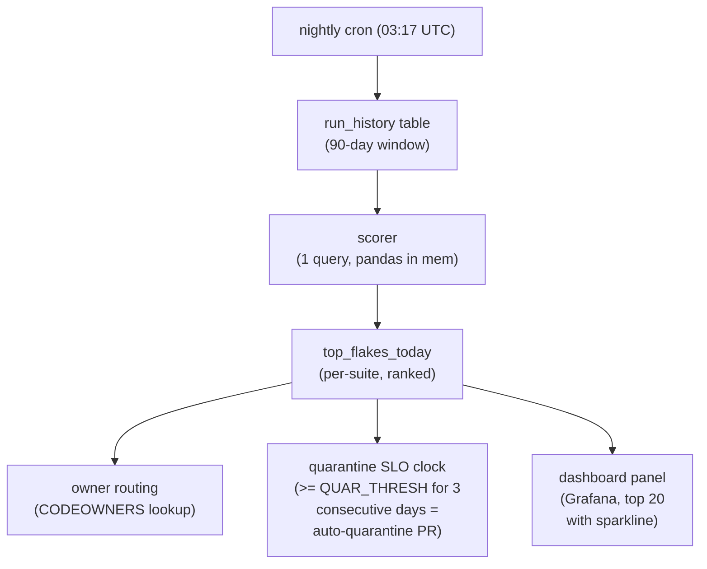

# Bisecting flaky tests across thousands of runs with statistical scoring

*retry budgets buy time. Ranking buys fixes*

The first flake mitigation everyone ships is the same: wrap the test runner in a retry loop, set `--retries 2`, ship it, move on. It works for a quarter. Then the green-on-second-try rate creeps from 3% to 11%, your nightly takes 90 minutes instead of 40, and someone in #ci-pain posts a graph of CPU-hours-per-merge with a question mark.

Retries are a tax. They hide failure cost in the runner budget instead of the engineer's day. At fleet scale (tens of thousands of test executions per day across a dozen suites) the right move is to stop trying to make individual flakes go away in-band and start *ranking* them, the same way you'd rank exceptions in Sentry or slow queries in pg_stat_statements. The output isn't a green build. The output is a sorted list of tests with owners, scores, and a clock ticking on quarantine.

This post walks through the scoring model we ended up with on a build platform called Switchyard (invented name, real lessons), how the recency and branch-context weights shake out, why naive flip-rate is a trap, and one concrete win where a parametric fixture leak got flagged three weeks before any human noticed it on a PR.

## The naive metric, and why it fails

The first thing anyone writes is:

```python
flake_rate = (passes_after_retry) / (total_runs)
```

This is wrong in three different ways and you only notice two of them at first.

**One:** it doesn't distinguish a test that fails on main from a test that fails on a feature branch where someone is actively breaking it. A 30% fail rate on a PR that introduces a new fixture is *the test working*. The same rate on main is an emergency.

**Two:** it weights a flake from eight months ago the same as one from this morning. Half the entries on your top-10 list end up being tests that were already fixed and just have long tails of historical data.

**Three (the one that bites you later):** pass-after-retry is a survivor bias metric. The truly nasty flakes are the ones that fail, fail, fail, and then get marked as "infra error" by a tired engineer who restarted the runner. They never enter your numerator.

You need a scoring function that takes these into account explicitly.

## The scoring function

Here's the shape we landed on. Per-test, per-day, recomputed nightly from the run history table:

```python
import math
from collections import defaultdict
from datetime import datetime, timedelta, timezone

HALF_LIFE_DAYS = 14
MAIN_BRANCH_WEIGHT = 3.0
PR_BRANCH_WEIGHT = 1.0
LAPLACE_ALPHA = 2.0   # smoothing for low-sample tests
QUARANTINE_THRESHOLD = 0.30

def flake_score(runs, now=None):
    """
    runs: list of dicts with keys:
        ts (datetime), branch_kind ('main'|'pr'|'release'),
        outcome ('pass'|'fail'|'error'|'pass_after_retry'),
        commit_changed_test (bool)
    Returns float in [0, 1); larger means flakier. > QUARANTINE_THRESHOLD = quarantine candidate.
    """
    now = now or datetime.now(timezone.utc)
    weighted_fail = 0.0
    weighted_total = 0.0

    for r in runs:
        # If the same commit touched the test file, the failure is
        # probably real intent, not flake. Don't count it either way.
        if r['commit_changed_test']:
            continue

        age_days = (now - r['ts']).total_seconds() / 86400.0
        recency = 0.5 ** (age_days / HALF_LIFE_DAYS)

        branch_w = MAIN_BRANCH_WEIGHT if r['branch_kind'] == 'main' else PR_BRANCH_WEIGHT
        w = recency * branch_w

        is_flake = r['outcome'] in ('fail', 'error', 'pass_after_retry')
        weighted_fail += w * (1.0 if is_flake else 0.0)
        weighted_total += w

    # Smoothing biases low-evidence tests toward 0 (prior of zero flakiness),
    # so a test with 2 runs and 1 fail doesn't score 0.5.
    return weighted_fail / (weighted_total + LAPLACE_ALPHA)
```

Four design choices in there worth defending out loud.

**Exponential recency decay with a 14-day half-life.** A failure today counts twice a failure from two weeks ago and 32x one from ten weeks ago ([half-life math](https://en.wikipedia.org/wiki/Exponential_decay#Half-life)). The exact half-life is tunable; 14 days matched our typical "is this still happening?" intuition. Linear decay was tried first and produced a scoreboard dominated by tests that had been broken once, badly, in March.

**Main weighted 3x over PRs.** A flake on main is observed by every PR rebased on top of it. A flake on a single PR branch is mostly observed by the one author. The 3x came from rough cost accounting (`mean PRs touching main per day`) not first principles. The number isn't sacred; the direction is.

**Skip runs where the commit touched the test file.** This is the cheapest single improvement to the score. Without it, the top of the list is dominated by tests under active development. With it, the list cleanly separates "infra-shaped sadness" from "someone is mid-refactor."

**Laplace smoothing.** Without it, a brand-new test that fails once on PR rank #1 forever. The `alpha=2.0` pulls low-sample tests toward 0 and lets the score earn its way up with evidence. Similar in spirit to Wilson-score lower bounds ([Reddit comment ranking](https://medium.com/hacking-and-gonzo/how-reddit-ranking-algorithms-work-ef111e33d0d9), which uses the lower bound of a binomial confidence interval) and beta-binomial smoothing: both pull low-evidence rates toward a prior so a 1/2 doesn't outrank a 400/1000. The same trick belongs in any alert threshold built on rates.

Notice what's *not* in there: no p-values, no confidence intervals, no Bayesian beta-binomial. You don't need them. The score is a ranking signal, not a hypothesis test. Ordinal correctness beats calibrated probability when the downstream action is "page the owner of test #1."

## The pipeline shape



The 90-day window matters because the recency decay does the right thing inside that window but you don't want to pay storage and scan cost on years of data. A test that hasn't run in 90 days is either dead or in a suite no one runs; either way, the scorer shouldn't think about it.

## Owners, SLOs, and the quarantine bot

A score with no owner is theater. The pipeline does a CODEOWNERS lookup on the test file path, falls back to the suite owner, and finally to a #flake-jail rotation if both lookups miss. The bot opens a single tracking issue per (test, owner) and re-comments daily with the score and a sparkline image. No new issue per day; that path is how you train people to mute the bot.

The quarantine SLO has two thresholds:

| State | Condition | Action |
|---|---|---|
| Watching | score >= 0.15 for 1 day | comment in tracking issue |
| Warning | score >= 0.30 for 3 consecutive days | bot opens quarantine PR, requests review from owner |
| Quarantined | quarantine PR merged or 7 days elapsed | test moved to `@pytest.mark.flaky_quarantine`, excluded from required checks |
| Fix-or-delete | quarantined for 30 days | bot opens a deletion PR; owner can reject by linking a fix PR |

The 30-day fix-or-delete is the part that makes the whole system work. Without it, quarantine is a graveyard with no eviction policy and the suite slowly rots. Every team I've seen run a flake-tracker without an automatic deletion clock has the same outcome: 200 quarantined tests, half of them irrelevant, no one knows which.

## The fixture-leaking parametric: a worked example

A test called `test_billing_rollup[currency-USD-window-7d]` started showing up at score 0.18 in mid-April. It was one of 84 parametrizations of the same test function. The bot put it in the Watching list. Owner glanced, shrugged, no PR.

By early May the parent test (across all 84 params) had a combined weighted-fail share that pushed the *aggregated* score to 0.42. The Warning threshold tripped on May 6. The bot opened a quarantine PR with the score history attached.

What was actually broken: a session-scoped fixture, `_warehouse_seed`, was being mutated by one of the early-running parametrizations (`currency-EUR-window-1h`), which inserted a row that a later parametrization assumed wasn't there. pytest's parametrize ordering was stable within a worker process but the dispatch order across xdist workers was not (under the default `--dist load` scheduler), so a fixture-mutating param could land before or after its dependent param depending on worker timing ([xdist known limitations](https://pytest-xdist.readthedocs.io/en/stable/known-limitations.html)). On a 4-worker run the breakage was a roughly 1-in-N event; on the 16-worker nightly it was several times more frequent.

Three observations from this:

1. **No human had noticed.** It looked like one bad param among 84, and engineers eyeballing CI logs at the function level saw "one red dot among many" and retried. The scorer, by aggregating with recency weight, saw the trend three weeks before it became visible to humans scanning red squares.
2. **The fix took 40 minutes.** It was a one-line change to scope the fixture to `function` instead of `session` and add a missing `db.rollback()`. The expensive part was the three weeks of false-retries before someone looked.
3. **The bisection was free.** Because we kept the per-(test, run, worker_id) outcome history, the owner could pivot the dashboard by worker count and immediately see the failure rate climb with parallelism. No git bisect needed; the data was already there.

That last point is the part most flake-trackers miss. Storing only the test-level pass/fail loses the dimensions that make root-cause obvious. The minimum useful schema:

```sql
CREATE TABLE test_run (
    run_id        UUID NOT NULL,
    test_id       TEXT NOT NULL,        -- nodeid incl. params
    test_file     TEXT NOT NULL,
    suite         TEXT NOT NULL,
    branch_kind   TEXT NOT NULL,        -- 'main' | 'pr' | 'release'
    commit_sha    TEXT NOT NULL,
    commit_changed_test BOOLEAN NOT NULL,
    worker_id     INT NOT NULL,         -- xdist worker, -1 if serial
    worker_count  INT NOT NULL,
    outcome       TEXT NOT NULL,        -- 'pass'|'fail'|'error'|'pass_after_retry'|'skipped'
    duration_ms   INT,
    ts            TIMESTAMPTZ NOT NULL,
    runner_host   TEXT,
    PRIMARY KEY (run_id, test_id, worker_id)
);
CREATE INDEX ON test_run (test_id, ts DESC);
CREATE INDEX ON test_run (suite, ts DESC) WHERE branch_kind = 'main';
```

The partial index on main is worth its weight. The scorer's hot path is "give me main-branch history for the last 90 days, grouped by test," and that query returns in under a second on a few hundred million rows when the planner can ignore PR traffic.

## What the scorer cannot do

It can't tell you *why* a test is flaky. It can rank, route, and put a clock on it. The "why" is still a human bisect, a `pytest --count=50`, a strace if you're unlucky.

It can't catch a flake that fails identically every time but in a way the test framework counts as a pass. (Yes, this happens. Async tests that never await the assertion. Logging-only assertions. Tests that swallow exceptions in a fixture teardown.) The scoring model assumes the test runner correctly distinguishes pass from fail; if that assumption is broken, fix it upstream before tuning weights.

It can't fix the cultural problem where engineers see a red CI and click "rerun" without reading the log. The bot helps (the owner gets pinged whether or not the rerun goes green), but the underlying habit needs the SLO and the auto-deletion to make consequences visible.

## Tuning notes from running this for a year

A few things we changed after the first version:

- **Dropped `error` from the flake numerator briefly, added it back.** OOM kills and runner-vanished events looked like infra noise. They are infra noise. But they correlate strongly with specific test patterns (memory hogs, fixtures that fork subprocesses), and surfacing them to test owners produced more fixes than routing them only to the platform team did.
- **Per-suite thresholds, not global.** The integration suite naturally runs at 5x the flake rate of unit tests because it talks to a real database. A 0.30 threshold there is noise; we use 0.45. Unit tests use 0.20.
- **Sparkline in the daily comment.** A number is forgettable. A 30-day sparkline showing "this used to be 0.05, now it's 0.31" changes how owners read the issue. Cheap to generate, high signal.
- **Exclude the first 7 days of a test's life from quarantine.** New tests are bumpy. The grace period prevents the bot from playing whack-a-mole on tests still in their settling-in phase.

The honest summary is that flake scoring is not glamorous infrastructure. It is closer to a small piece of accounting. But the accounting is what turns "CI is flaky" (which everyone agrees on and no one owns) into "test X is at 0.42 and owner Y has 6 days." That sentence is fixable. The other one is not.
