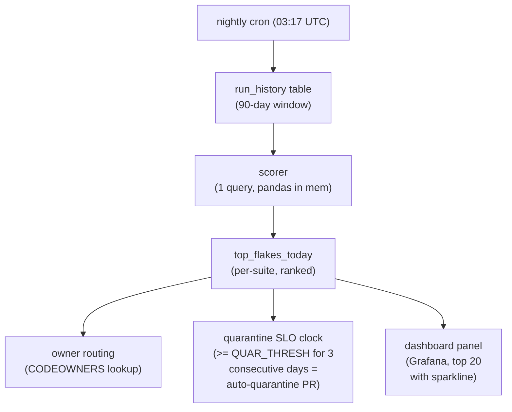
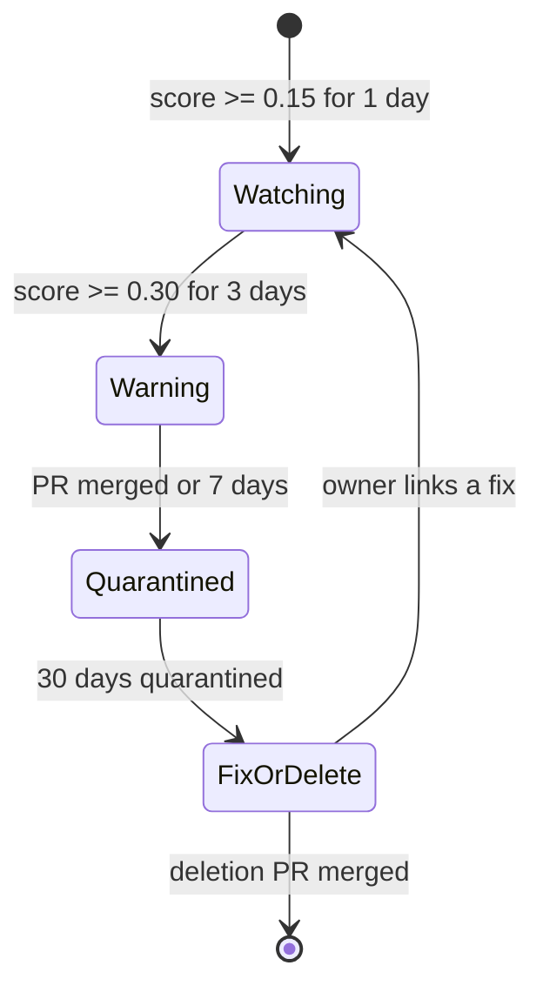
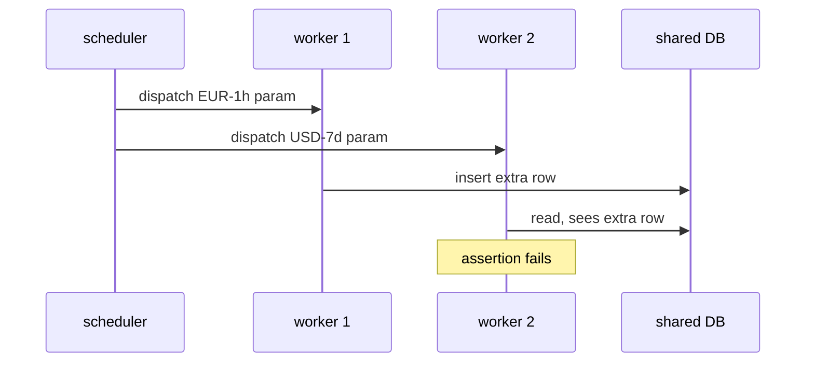

# Bisecting flaky tests across thousands of runs with statistical scoring

*how to rank flaky tests by a recency- and branch-weighted score so the worst ones get owners and a deadline*

A flaky test passes and fails on the same code without anyone changing it. Everyone's first fix is the same: wrap the runner in a retry loop, `--retries 2`. (CI is continuous integration, the system that runs your tests on every change. A nightly is a longer test run scheduled overnight. A suite is a named group of tests.) It works for a quarter. Then the share that fails once and passes on the second try (the flake rate) creeps from 3% to 11%, your nightly takes 90 minutes instead of 40, and the compute cost per merge climbs.

Retries move the cost into compute spend, where it hides. Once you run tens of thousands of test executions per day across a dozen suites, making each flake quietly disappear during the run no longer scales. The better move is to rank the flaky tests, the way you rank slow queries in a database's `pg_stat_statements` view. The output is not a green build but a sorted list of tests, each with an owner, a score, and a deadline by which it leaves the suite if unfixed. (Quarantine means moving a test out of the set that can block a merge, so it stops blocking work while it waits.)

What follows is the scoring model we landed on for a build platform I will call Switchyard: how the recency and branch weights work, why a simple fail rate misleads, and one case where a shared-fixture leak got flagged three weeks before a human noticed it in a pull request (a PR: a change submitted for review).

## The naive metric, and why it fails

The first thing anyone writes is this:

```python
flake_rate = (passes_after_retry) / (total_runs)
```

It is wrong in a few ways. It does not distinguish a test that fails on `main` (the shared branch everyone merges into) from one that fails on a feature branch (a private copy someone is changing) while the author breaks it on purpose. A 30% fail rate on a PR introducing a new fixture means the test is working; the same rate on `main` is a problem.

It also weights a flake from eight months ago the same as one from this morning, so half your top-10 list is already-fixed tests on stale data.

And pass-after-retry only counts the flakes that eventually went green: a survivor-bias metric. The truly nasty ones fail repeatedly, then get marked "infra error" by whoever restarted the runner. Once relabeled, that failure never lands in the numerator (the top of the fraction, the count we divide), so the metric undercounts the worst offenders. We fix this later by pulling `error` outcomes into the numerator.

## The scoring function

Computed per test per day, recomputed nightly from the run-history table:

```python
import math
from collections import defaultdict
from datetime import datetime, timedelta, timezone

HALF_LIFE_DAYS = 14
MAIN_BRANCH_WEIGHT = 3.0
PR_BRANCH_WEIGHT = 1.0
LAPLACE_ALPHA = 2.0   # smoothing for low-sample tests
QUARANTINE_THRESHOLD = 0.30   # overridden per-suite in production

def flake_score(runs, now=None):
    """
    runs: list of dicts with keys:
        ts (datetime), branch_kind ('main'|'pr'|'release'),
        outcome ('pass'|'fail'|'error'|'pass_after_retry'),
        commit_changed_test (bool)
    Returns float in [0, 1); larger means flakier. > QUARANTINE_THRESHOLD = quarantine candidate.
    """
    now = now or datetime.now(timezone.utc)
    weighted_fail = 0.0
    weighted_total = 0.0

    for r in runs:
        # If the same commit touched the test file, the failure is
        # probably real intent, not flake. Don't count it either way.
        if r['commit_changed_test']:
            continue

        age_days = (now - r['ts']).total_seconds() / 86400.0
        recency = 0.5 ** (age_days / HALF_LIFE_DAYS)

        # 'release' falls into the else branch and gets PR weight: a
        # deliberate simplification, since release branches are low-volume.
        branch_w = MAIN_BRANCH_WEIGHT if r['branch_kind'] == 'main' else PR_BRANCH_WEIGHT
        w = recency * branch_w

        is_flake = r['outcome'] in ('fail', 'error', 'pass_after_retry')
        weighted_fail += w * (1.0 if is_flake else 0.0)
        weighted_total += w

    # Smoothing biases low-evidence tests toward 0 (prior of zero flakiness),
    # so a test with 2 runs and 1 fail doesn't score 0.5.
    return weighted_fail / (weighted_total + LAPLACE_ALPHA)
```

The recency weight decays exponentially with a 14-day half-life: the time for a failure's weight to drop by half, so a failure today counts about 32 times as much as one ten weeks ago. The half-life is tunable. Linear decay, tried first, kept surfacing tests broken once and long fixed.

Failures on `main` are weighted 3 times more than failures on a PR: a flake on `main` is seen by every PR built on top of it, one on a PR branch mostly by its author. The 3x came from rough cost accounting; the direction matters, not the number.

We skip runs where the commit changed the test file: the cheapest improvement, a check of which files the change touched. When a commit edits the test itself, a pass-to-fail flip is a real change, not flakiness, and counting it adds false positives.

We apply Laplace smoothing. With few data points a raw rate is too confident: a new test that fails once on a PR would otherwise score 50% and top the list. Smoothing nudges the score toward a starting assumption (a "prior") before evidence piles up; here the prior is zero flakiness, and the `alpha=2.0` added to the denominator does the nudging. The goal is the same as the [Wilson-score lower bound used for Reddit comment ranking](https://medium.com/hacking-and-gonzo/how-reddit-ranking-algorithms-work-ef111e33d0d9): rank each item by the low end of a confidence range, not its raw rate, so a test with few observations cannot outrank one with a long record.

The action is "ping the owner of test #1," so ranking order is what matters, not a number meaningful on its own. So we skip heavier statistics: no p-values, no confidence intervals, no full Bayesian model (all three are ways of expressing how sure you are about a measured rate).

A side effect: the fixed 2.0 caps a low-traffic test below a high-traffic one. That is the price of not over-trusting thin evidence.

## The pipeline shape



A cron is a scheduled job; this one runs nightly in UTC (Coordinated Universal Time, the timezone-neutral clock). The scorer reads the run history with one query and processes it in memory with pandas, a Python data library. The dashboard runs on Grafana, a charts-and-panels tool; each test gets a sparkline, a tiny inline trend chart. SLO stands for service level objective, a target the team commits to: a flaky test above the threshold for three days gets quarantined automatically.

The 90-day window lets recency decay work without storing years of data. A test that has not run in 90 days is dead, and the scorer ignores it.

## Owners, SLOs, and the quarantine bot

A score is useless without someone responsible for it. The pipeline looks up the test path in CODEOWNERS (a repository file mapping paths to people), falls back to the suite owner, then a shared rotation. The bot opens one tracking issue per (test, owner) pair and re-comments daily with the score and a sparkline rather than opening a new one, which keeps people from muting it.

The quarantine SLO walks a test through four states (a state machine: states with defined rules for moving between them, one move per arrow). Two moves do not fit the table cleanly and are in the diagram below.



| State | Action |
|---|---|
| Watching (score >= 0.15 for 1 day) | comment in tracking issue |
| Warning (score >= 0.30 for 3 consecutive days) | bot opens quarantine PR, requests review from owner |
| Quarantined (quarantine PR merged or 7 days elapsed) | test moved to `@pytest.mark.flaky_quarantine`, excluded from required checks |
| Fix-or-delete (quarantined for 30 days) | bot opens a deletion PR; owner can reject by linking a fix PR |

The 30-day fix-or-delete step makes the system work. Every flake-tracker I have seen without an automatic deletion deadline ends with a few hundred quarantined tests, half no longer relevant and no one sure which.

## The fixture-leaking parametric: a worked example

A test called `test_billing_rollup[currency-USD-window-7d]` showed up at score 0.18 in mid-April, one of 84 variants of the same function. (pytest, the Python test framework, lets you run one function against many input sets and treats each as its own test; this is parametrization, each variant a "param.") The bot put it in the Watching list; the owner saw nothing urgent and moved on.

By early May the parent test crossed a combined score of 0.42. Each param is a separate test, and the parent score is `flake_score()` over all 84 params' runs pooled, not a sum or max of per-param scores; pooling surfaces a single defect spread thinly across variants. The Warning threshold tripped on May 6 and the bot opened a quarantine PR.

The bug needs pytest background. The pytest-xdist plugin runs your suite across several worker processes at once. (Concurrency means more than one thing running at the same time; a worker is one of those processes.) A pytest fixture is shared setup-and-cleanup code tests depend on; a session-scoped fixture is built once per worker and reused, a function-scoped fixture fresh for each test. Here, a session-scoped fixture `_warehouse_seed` inserted a row into a shared database during an early param (`currency-EUR-window-1h`) that a later param assumed was not there. The write crossed process boundaries: this is shared mutable state, data more than one test can read and write, the usual root of this kind of bug.

The default xdist scheduler, `--dist load`, hands each test to whichever worker is free next, so the order of two tests across workers is not fixed ([xdist known limitations](https://pytest-xdist.readthedocs.io/en/stable/known-limitations.html)). The failure shows up only when the writing param commits before the reading param checks:



The number of orderings of parallel work grows with the number of workers, so the bad ordering gets likelier the more you run: rare on the 4-worker CI run, several times as frequent on the 16-worker nightly.

No human had noticed it alone: it looked like one bad param among 84, and engineers reading CI logs clicked retry. Pooling all 84 params with recency weight surfaced the trend. The fix was nearly one line and took 40 minutes: scoping the fixture to `function`, plus a missing `db.rollback()`. Three weeks of pointless retries was the expensive part.

The bisection was also nearly free. Because we kept per-(test, run, worker_id) outcome history, the owner could pivot the dashboard by worker count and watch the failure rate climb with parallelism, pointing at a concurrency problem with no `git bisect` (which binary-searches commits to find the one that broke something).

Storing only test-level pass/fail loses the dimensions that make the cause obvious. The worker-count pivot narrows a failure to a condition (high parallelism); `git bisect` narrows a regression (a change that broke something that used to work) to a commit. The pivot gave us a strong hypothesis and let us skip bisect, though we still had to find the leak by hand. The minimum schema:

```sql
CREATE TABLE test_run (
    run_id        UUID NOT NULL,
    test_id       TEXT NOT NULL,        -- nodeid incl. params
    test_file     TEXT NOT NULL,
    suite         TEXT NOT NULL,
    branch_kind   TEXT NOT NULL,        -- 'main' | 'pr' | 'release'
    commit_sha    TEXT NOT NULL,
    commit_changed_test BOOLEAN NOT NULL,
    worker_id     INT NOT NULL,         -- xdist worker, -1 if serial
    worker_count  INT NOT NULL,
    outcome       TEXT NOT NULL,        -- 'pass'|'fail'|'error'|'pass_after_retry'|'skipped'
    duration_ms   INT,
    ts            TIMESTAMPTZ NOT NULL,
    runner_host   TEXT,
    PRIMARY KEY (run_id, test_id, worker_id)
);
CREATE INDEX ON test_run (test_id, ts DESC);
CREATE INDEX ON test_run (suite, ts DESC) WHERE branch_kind = 'main';
```

(`UUID` is a unique identifier type; `TIMESTAMPTZ` is a timestamp with a timezone; `nodeid` is pytest's internal name for a test, including its params.) An index keeps its rows in sorted order, so a lookup on the sorted key columns becomes a range read instead of a scan of the whole table. The scorer's hot-path index `(test_id, ts DESC)` groups each test's runs time-sorted on disk, so the query planner (the part of the database that decides how to fetch data) reads one test's recent runs as a contiguous block and never sorts them. The dashboard's top-N-per-suite query uses the partial `(suite, ts DESC)` index the same way; a partial index stores only the rows matching its `WHERE` condition, so the main-branch index stays as small as main traffic. Together they stay under a second on hundreds of millions of rows.

## What the scorer cannot do

It cannot tell you why a test is flaky; it only ranks, routes, and puts a deadline on it. The "why" is still a human investigation: a `git bisect`, a `pytest --count=50` to run a test 50 times and watch it fail, sometimes an `strace` (a Linux tool recording a program's system calls).

It cannot catch a flake that fails the same way every time but in a way the framework counts as a pass: async tests that never `await` the assertion (in Python, `async`/`await` mark code that can pause and resume), assertions that only log instead of failing, tests that swallow exceptions during cleanup. The model assumes the runner correctly tells pass from fail; if that is broken, fix it first.

It cannot fix the habit where engineers see a red CI and click "rerun" without reading the log. The bot helps, since the owner gets pinged whether or not the rerun goes green, but the habit changes only once the deadline makes the consequences visible.

## Tuning notes from running this for a year

A few things we changed after the first version:

- We dropped `error` from the numerator briefly, then added it back. Out-of-memory kills (the operating system terminating a process for using too much memory) and runner-vanished events look like infrastructure noise, but they correlate strongly with specific test patterns (memory hogs, fixtures that fork subprocesses), and surfacing them to owners produced more fixes than routing them only to the platform team. It also reclaims flakes relabeled "infra error."
- We use per-suite thresholds, not one global one. The integration suite runs at 5 times the flake rate of unit tests because it talks to a real database, so 0.30 there is just noise; we use 0.45 there, 0.20 for unit tests. The `QUARANTINE_THRESHOLD` constant above is the default, overridden per suite.
- We added a sparkline to the daily comment. A bare number is forgettable; a 30-day sparkline showing "this used to be 0.05, now it is 0.31" changes how owners read the issue, and it is cheap.
- We exclude a test's first 7 days from quarantine. New tests are bumpy, and the grace period keeps the bot from chasing ones still settling.

The accounting is what turns "CI is flaky," which everyone agrees on and no one owns, into "test X is at 0.42 and owner Y has 6 days," a sentence you can act on.
