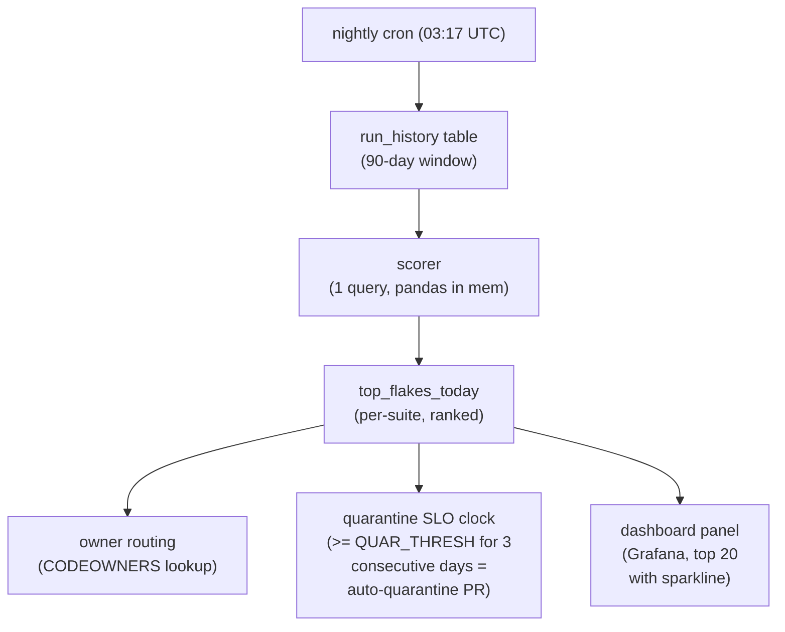
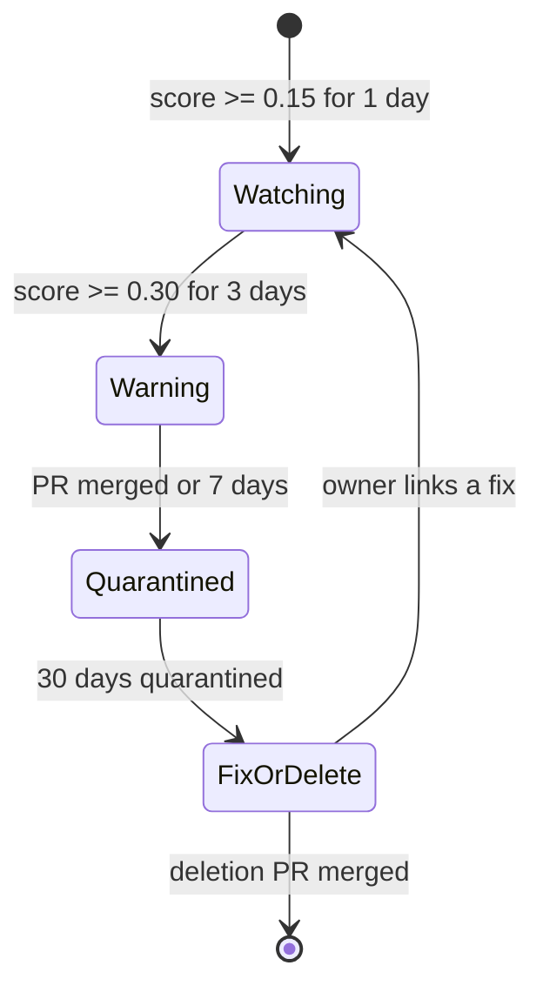
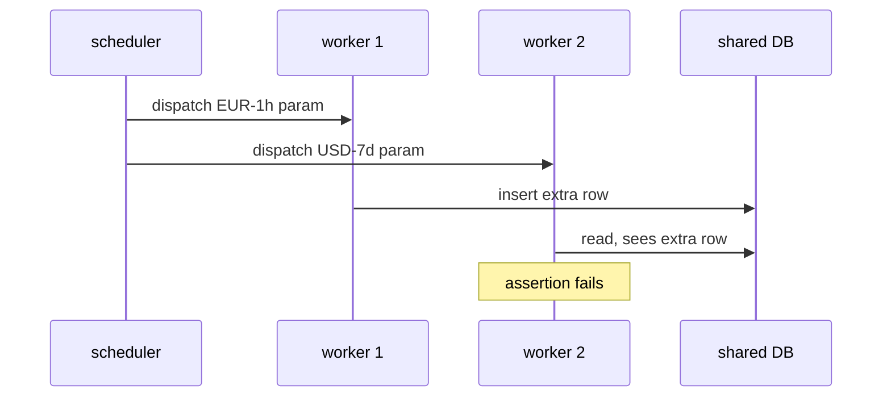

# Bisecting flaky tests across thousands of runs with statistical scoring

*retry budgets buy time. Ranking buys fixes*

The first flake mitigation everyone ships is the same: wrap the test runner in a retry loop, set `--retries 2`, ship it. It works for a quarter. Then the green-on-second-try rate creeps from 3% to 11%, your nightly takes 90 minutes instead of 40, and someone in #ci-pain posts a graph of CPU-hours-per-merge with a question mark.

Retries are a tax: they hide failure cost in the runner budget instead of the engineer's day. At fleet scale (tens of thousands of test executions per day across a dozen suites) the right move is to stop making individual flakes go away in-band and start *ranking* them, the way you'd rank exceptions in Sentry or slow queries in pg_stat_statements. The output isn't a green build. It's a sorted list of tests with owners, scores, and a clock ticking on quarantine.

This post walks through the scoring model we landed on for a build platform called Switchyard (invented name, real lessons): how the recency and branch-context weights shake out, why naive flip-rate is a trap, and one win where a parametric fixture leak got flagged three weeks before any human noticed it on a PR.

## The naive metric, and why it fails

The first thing anyone writes is:

```python
flake_rate = (passes_after_retry) / (total_runs)
```

This is wrong in three ways.

**One:** it doesn't distinguish a test that fails on main from a test that fails on a feature branch where someone is actively breaking it. A 30% fail rate on a PR that introduces a new fixture is *the test working*. The same rate on main is an emergency.

**Two:** it weights a flake from eight months ago the same as one from this morning. Half the entries on your top-10 list end up being tests that were already fixed and just have long tails of historical data.

**Three:** pass-after-retry is a survivor-bias metric. The truly nasty flakes fail, fail, fail, and then get marked "infra error" by a tired engineer who restarted the runner; once relabeled, a failure is no longer a pass-after-retry, so it never lands in your numerator and the metric understates the flakes that did the most damage. (Fixed in the tuning notes, by pulling `error` outcomes into the numerator.)

## The scoring function

Here's the shape we landed on. Per-test, per-day, recomputed nightly from the run history table:

```python
import math
from collections import defaultdict
from datetime import datetime, timedelta, timezone

HALF_LIFE_DAYS = 14
MAIN_BRANCH_WEIGHT = 3.0
PR_BRANCH_WEIGHT = 1.0
LAPLACE_ALPHA = 2.0   # smoothing for low-sample tests
QUARANTINE_THRESHOLD = 0.30   # overridden per-suite in production

def flake_score(runs, now=None):
    """
    runs: list of dicts with keys:
        ts (datetime), branch_kind ('main'|'pr'|'release'),
        outcome ('pass'|'fail'|'error'|'pass_after_retry'),
        commit_changed_test (bool)
    Returns float in [0, 1); larger means flakier. > QUARANTINE_THRESHOLD = quarantine candidate.
    """
    now = now or datetime.now(timezone.utc)
    weighted_fail = 0.0
    weighted_total = 0.0

    for r in runs:
        # If the same commit touched the test file, the failure is
        # probably real intent, not flake. Don't count it either way.
        if r['commit_changed_test']:
            continue

        age_days = (now - r['ts']).total_seconds() / 86400.0
        recency = 0.5 ** (age_days / HALF_LIFE_DAYS)

        # 'release' falls into the else branch and gets PR weight: a
        # deliberate simplification, since release branches are low-volume.
        branch_w = MAIN_BRANCH_WEIGHT if r['branch_kind'] == 'main' else PR_BRANCH_WEIGHT
        w = recency * branch_w

        is_flake = r['outcome'] in ('fail', 'error', 'pass_after_retry')
        weighted_fail += w * (1.0 if is_flake else 0.0)
        weighted_total += w

    # Smoothing biases low-evidence tests toward 0 (prior of zero flakiness),
    # so a test with 2 runs and 1 fail doesn't score 0.5.
    return weighted_fail / (weighted_total + LAPLACE_ALPHA)
```

Four design choices in there worth defending out loud.

**Exponential recency decay with a 14-day half-life.** A failure today counts ~32x one from ten weeks ago. The half-life is tunable; 14 days matched our "is this still happening?" intuition. Linear decay, tried first, produced a scoreboard dominated by tests broken once, badly, in March.

**Main weighted 3x over PRs.** A flake on main is observed by every PR rebased on top of it; a flake on a single PR branch is mostly observed by the one author. The 3x came from rough cost accounting (mean PRs touching main per day), not first principles. The number isn't sacred; the direction is.

**Skip runs where the commit touched the test file.** The single cheapest improvement: a diff check on the test path, no reruns. A flaky test is, by definition, one that both passes and fails on the *same* code. When a commit edits the test file, a pass-to-fail flip is a legitimate change, not flakiness, so counting it only adds false positives. Without this filter the top of the list is dominated by tests under active development; with it, the list cleanly separates "infra-shaped sadness" from "someone is mid-refactor."

**Laplace smoothing.** With few data points a raw rate is wildly overconfident, so we pull it toward a prior of zero flakiness until evidence accumulates; without the pull, a brand-new test that fails once on PR ranks #1 forever. The `alpha=2.0` added to the denominator does the pulling, and it is deliberately one-sided: we add nothing to the numerator, because the prior we want is *zero* flakiness, not the symmetric 0.5 that textbook additive smoothing would give. (Same spirit as Wilson-score lower bounds, used for [Reddit comment ranking](https://medium.com/hacking-and-gonzo/how-reddit-ranking-algorithms-work-ef111e33d0d9).)

The goal is *ordinal correctness* (right ranking order), not a *calibrated probability* (an absolute flake number trustworthy on its own). The downstream action is "page the owner of test #1," so order is what matters, which is why we skip the heavier machinery: no p-values, no confidence intervals, no Bayesian beta-binomial. The one-sided Laplace term already keeps a 1/2 from outranking a 400/1000.

One side effect: the fixed 2.0 in the denominator structurally caps a low-traffic test below a high-traffic one. A test with a recent weighted total of only ~3 to 4 maxes out around 0.6 to 0.7 even at 100% recent failure, while a heavily-run test approaches 1.0. That cap is the price of not trusting thin evidence.

## The pipeline shape



The 90-day window matters because recency decay does the right thing inside it without paying storage and scan cost on years of data. A test that hasn't run in 90 days is either dead or in a suite no one runs; either way, the scorer shouldn't think about it.

## Owners, SLOs, and the quarantine bot

A score with no owner is theater. The pipeline does a CODEOWNERS lookup on the test file path, falls back to the suite owner, then to a #flake-jail rotation if both miss. The bot opens a single tracking issue per (test, owner) and re-comments daily with the score and a sparkline. No new issue per day; that's how you avoid training people to mute the bot.

The quarantine SLO walks a test through four states. Note the two transitions a table can't show: a quarantined test under the fix-or-delete clock loops back to Watching if the owner links a fix, and Warning advances to Quarantined either when the bot's PR merges or after 7 days.



| State | Action |
|---|---|
| Watching (score >= 0.15 for 1 day) | comment in tracking issue |
| Warning (score >= 0.30 for 3 consecutive days) | bot opens quarantine PR, requests review from owner |
| Quarantined (quarantine PR merged or 7 days elapsed) | test moved to `@pytest.mark.flaky_quarantine`, excluded from required checks |
| Fix-or-delete (quarantined for 30 days) | bot opens a deletion PR; owner can reject by linking a fix PR |

The 30-day fix-or-delete is what makes the whole system work. Without it, quarantine is a graveyard with no eviction policy and the suite slowly rots. Every flake-tracker I've seen without an automatic deletion clock ends up the same: 200 quarantined tests, half irrelevant, no one knows which.

## The fixture-leaking parametric: a worked example

A test called `test_billing_rollup[currency-USD-window-7d]` showed up at score 0.18 in mid-April, one of 84 parametrizations of the same test function. The bot put it in the Watching list. Owner glanced, shrugged, no PR.

By early May the parent test crossed an *aggregated* score of 0.42. The rule is simple: the parent score is `flake_score()` run over the union of all 84 params' runs, not a sum or max of per-param scores. Pooling is what surfaces a defect spread thin across many parametrizations. The Warning threshold tripped on May 6 and the bot opened a quarantine PR with score history attached.

What was actually broken needs a little pytest background. pytest-xdist runs your suite across several worker processes in parallel. A *session-scoped* fixture is built once per worker; a *function-scoped* fixture is rebuilt fresh for each test. Here, a session-scoped fixture `_warehouse_seed` was mutated by an early param (`currency-EUR-window-1h`), which inserted a row into a shared database that a later param assumed wasn't there. The mutation went to a real DB, not in-memory fixture state, so it crossed process boundaries; one test could poison another even on a different worker.

The default xdist scheduler, `--dist load`, hands individual test items to whichever worker is free next, so the *relative* order of two tests across workers is not fixed ([xdist known limitations](https://pytest-xdist.readthedocs.io/en/stable/known-limitations.html)). The failure surfaces only when the mutating param commits its write before the dependent param reads:



With more workers picking work in effectively random order, the number of interleavings grows and the bad ordering gets likelier: rare on the 4-worker CI run, several times more frequent on the 16-worker nightly.

Three observations:

1. **No human had noticed.** It looked like one bad param among 84, and engineers eyeballing CI logs at the function level saw "one red dot among many" and retried. Pooling 84 params with recency weight is what surfaced the trend.
2. **The fix took 40 minutes.** A one-line change to scope the fixture to `function` instead of `session`, plus a missing `db.rollback()`. The expensive part was three weeks of false-retries before someone looked.
3. **The bisection was nearly free.** Because we kept per-(test, run, worker_id) outcome history, the owner could pivot the dashboard by worker count and watch the failure rate climb with parallelism, pointing straight at a concurrency or shared-resource problem without a `git bisect`.

That last point is what most flake-trackers miss. Storing only test-level pass/fail loses the dimensions that make root-cause obvious. The worker-count pivot localizes the failure to a *condition* (high parallelism); `git bisect` localizes a regression to a *commit*. Different questions. The pivot gave us a strong hypothesis and let us skip bisect, though we still had to find the specific shared mutable state. The minimum schema:

```sql
CREATE TABLE test_run (
    run_id        UUID NOT NULL,
    test_id       TEXT NOT NULL,        -- nodeid incl. params
    test_file     TEXT NOT NULL,
    suite         TEXT NOT NULL,
    branch_kind   TEXT NOT NULL,        -- 'main' | 'pr' | 'release'
    commit_sha    TEXT NOT NULL,
    commit_changed_test BOOLEAN NOT NULL,
    worker_id     INT NOT NULL,         -- xdist worker, -1 if serial
    worker_count  INT NOT NULL,
    outcome       TEXT NOT NULL,        -- 'pass'|'fail'|'error'|'pass_after_retry'|'skipped'
    duration_ms   INT,
    ts            TIMESTAMPTZ NOT NULL,
    runner_host   TEXT,
    PRIMARY KEY (run_id, test_id, worker_id)
);
CREATE INDEX ON test_run (test_id, ts DESC);
CREATE INDEX ON test_run (suite, ts DESC) WHERE branch_kind = 'main';
```

A partial index physically stores only the rows matching its `WHERE` predicate, so the main-branch index stays as small as main traffic is relative to everything else. The scorer's per-test hot path uses `(test_id, ts DESC)`, whose key order lets the planner read each test's recent runs as a contiguous range and group without a giant sort. The dashboard's top-N-per-suite query uses the partial `(suite, ts DESC)` index: predicate shrinks the working set, leading key columns turn each scan into a range read. Together they get you under a second on a few hundred million rows.

## What the scorer cannot do

It can't tell you *why* a test is flaky; it can rank, route, and put a clock on it. The "why" is still a human bisect, a `pytest --count=50`, a strace if you're unlucky.

It can't catch a flake that fails identically every time but in a way the framework counts as a pass: async tests that never await the assertion, logging-only assertions, tests that swallow exceptions in a fixture teardown. The model assumes the runner correctly distinguishes pass from fail; if that's broken, fix it upstream before tuning weights.

It can't fix the cultural problem where engineers see a red CI and click "rerun" without reading the log. The bot helps (the owner gets pinged whether or not the rerun goes green), but the habit needs the SLO and auto-deletion to make consequences visible.

## Tuning notes from running this for a year

A few things we changed after the first version:

- **Dropped `error` from the flake numerator briefly, added it back.** OOM kills and runner-vanished events looked like infra noise. They are. But they correlate strongly with specific test patterns (memory hogs, fixtures that fork subprocesses), and surfacing them to test owners produced more fixes than routing them only to the platform team did. This also reclaims the flakes relabeled as "infra error": counting `error` in the numerator stops the worst offenders hiding outside the count.
- **Per-suite thresholds, not global.** The integration suite runs at 5x the flake rate of unit tests because it talks to a real database. A 0.30 threshold there is noise; we use 0.45. Unit tests use 0.20. The `QUARANTINE_THRESHOLD` constant above is the default; production overrides it per suite.
- **Sparkline in the daily comment.** A number is forgettable. A 30-day sparkline showing "this used to be 0.05, now it's 0.31" changes how owners read the issue. Cheap to generate, high signal.
- **Exclude the first 7 days of a test's life from quarantine.** New tests are bumpy. The grace period keeps the bot from playing whack-a-mole on tests still settling in.

Flake scoring is not glamorous infrastructure. It is closer to a small piece of accounting, and the accounting is what turns "CI is flaky" (which everyone agrees on and no one owns) into "test X is at 0.42 and owner Y has 6 days." That second sentence is fixable.
