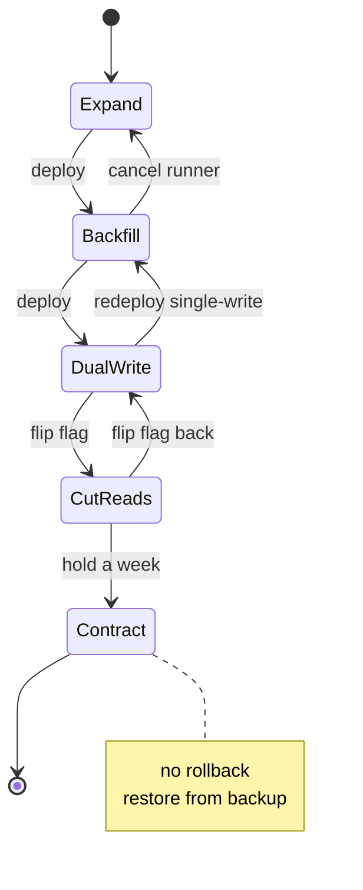

# Expand and contract schema migrations on busy tables

*how to rename a column on a heavily-written table without taking the service down*

Say you want to rename a column. The plan looks simple: add a new column, copy the data over, point reads at the new column, drop the old one. Run that on a `transactions` table taking 4,200 writes per second (writes meaning inserts and updates) with 900 million rows, and each step becomes a multi-day operation, with its own ways to fail, its own locking problems (when one statement holds a lock on the table, others wait), and its own way of stranding you if you stop halfway. (There is a foreign key from `ledger_entries` pointing at `transactions.id` -- a foreign key is a column whose value must match a row in another table -- but it points at `id`, not the column we are changing, so it never enters this migration.)

Doing the rename in one shot, swapping the column out from under a running app, is sometimes called a flag day: a single coordinated cutover where everything switches at once and there is no return. The approach most teams land on after getting burned once is expand and contract. You add the new thing while keeping the old (the additive "expand" steps), then remove the old once nothing depends on it (the subtractive "contract" steps). The key property is that every step is independently deployable: both old and new app code work against the database without breaking, so you never deploy the app and the schema change at the same instant. The phases: expand, backfill, dual-write, cut over reads, contract.

The running example: renaming `transactions.amount_cents` (a `BIGINT`, a 64-bit integer) into a few columns that describe a money amount (`amount_value BIGINT`, `amount_currency CHAR(3)` for a 3-letter currency code, `amount_scale SMALLINT` for the number of decimal places), so the system can handle currencies like JPY and BHD instead of assuming every amount is US dollars. Same table, same row count, same backfill window of about 36 hours.

## The five phases, briefly

```
phase 1  EXPAND       add nullable columns, no app changes
phase 2  BACKFILL     copy old -> new in batches, idempotent
phase 3  DUAL-WRITE   app writes both, reads still old
phase 4  CUT READS    flip readers to new, old still written
phase 5  CONTRACT     stop writing old, drop column
```

Each phase leaves the system in a state you could deploy and run indefinitely. That is what makes it safe. If something goes wrong at phase 3, you roll the app back (redeploy the previous version) to phase 2 and nothing breaks, because the database state phase 2 left behind is one phase 2's app code still understands. Without that property you are back to a flag day.

## Phase 1: add the columns

Adding a column is not always free. It can be metadata-only, meaning the `ALTER` only updates the database's bookkeeping about the table's structure (this lives in the system catalog) and never touches any of the 900 million rows. The expensive alternative is a table rewrite: the database physically writes out every row again on disk to stamp in the new column, turning a one-second statement into an hours-long operation. Whether `ADD COLUMN` is cheap or catastrophic comes down to whether it forces a rewrite.

`ADD COLUMN` with no default value has been metadata-only on Postgres forever. The case to watch is adding a default. Historically, `ADD COLUMN ... DEFAULT 'USD'` wrote `'USD'` into all 900M rows. Since Postgres 11 (PG11), Postgres avoids that when the default is a constant (a fixed value, not something computed fresh each time): it stores the value once in the catalog (in `pg_attribute.attmissingval`) and sets a flag (`pg_attribute.atthasmissing`) meaning "any row older than this column should read back this value." That is a virtual default: the value appears to be there without being physically written. The "constant" part matters. A default like `random()` produces a different value every time, so it cannot be precomputed once; that kind of default (a volatile one) still forces a full rewrite.

Either way, the statement takes an `AccessExclusiveLock` for as long as the catalog update runs. That is the strongest table lock Postgres has: it blocks all access, including plain reads. It is held only briefly, but Postgres processes lock requests first-in-first-out (FIFO): they form a queue, granted in arrival order. Your `ALTER` waits behind every statement already running on the table, and once queued, every statement arriving after it queues behind it too, readers included. So if an analyst is running a 90-second aggregate query when your `ALTER` arrives, your one-millisecond structure change (the structure-change family of SQL is Data Definition Language, or DDL) blocks every write for 90 seconds.

The fix is `lock_timeout` plus retry:

```sql
SET lock_timeout = '150ms';
ALTER TABLE transactions
  ADD COLUMN amount_value    BIGINT,
  ADD COLUMN amount_currency CHAR(3),
  ADD COLUMN amount_scale    SMALLINT;
```

With a 150-millisecond timeout, the `ALTER` gives up rather than sitting at the head of the queue and blocking everyone. If it fails, sleep a few seconds and try again. A small loop that retries for up to an hour, then pages a human, works well; an hour of continuous failure usually means the table has a genuinely stuck statement on it, not just bad luck.

MySQL's online DDL differs in mechanics, not principle. MySQL 8.0.12 introduced `ALGORITHM=INSTANT`, which adds a column with only a catalog change and no rebuild, for both nullable columns and `NOT NULL`-with-default columns. The new column had to be added in the last position until 8.0.29, which allowed instant adds in any position. When `INSTANT` does not apply, MySQL falls back to `INPLACE` or `COPY`, the expensive rewrites you want to avoid. Even `INSTANT` takes a brief exclusive metadata lock. Same rule on both engines: short lock window, retry, never block forever.

Do not add a default value here. Phase 2's backfill keys on `WHERE amount_value IS NULL` to tell rows it has not filled yet apart from rows the app has already written; a default would make every old row non-null and erase that distinction. Keep the columns nullable (the `atthasmissing` behavior is documented on [ALTER TABLE](https://www.postgresql.org/docs/current/sql-altertable.html)). And do not create any index on them yet; that comes in phase 4.

## Phase 2: backfill, slowly and on purpose

Backfill means filling the new columns for every existing row. The naive version is one big update:

```sql
UPDATE transactions
   SET amount_value = amount_cents,
       amount_currency = 'USD',
       amount_scale = 2
 WHERE amount_value IS NULL;
```

On 900M rows this runs as a single transaction (one all-or-nothing unit of work) that takes hours, and a long transaction is expensive in several ways: it holds row locks (locks on the rows it is changing, which block other writers to those rows) the whole time; it forces heavy cleanup afterward (Postgres keeps old row versions around until a background process called vacuum reclaims them, and a giant update leaves a giant mess for vacuum); and if you cancel it partway, the database undoes everything, which takes about as long as the work itself. Do it in batches:

```python
BATCH = 5_000
last_id = 0

while True:
    rows = db.execute("""
        WITH batch AS (
          SELECT id FROM transactions
           WHERE id > %s AND amount_value IS NULL
           ORDER BY id
           LIMIT %s
           FOR UPDATE SKIP LOCKED
        )
        UPDATE transactions t
           SET amount_value = t.amount_cents,
               amount_currency = 'USD',
               amount_scale = 2
          FROM batch
         WHERE t.id = batch.id
        RETURNING t.id
    """, (last_id, BATCH))

    if not rows:
        break
    last_id = max(r.id for r in rows)
    time.sleep(0.05)
```

`FOR UPDATE SKIP LOCKED` controls what happens when the backfill reaches a row the live app is writing at that moment. Plain `FOR UPDATE` would wait until the app's transaction commits; `SKIP LOCKED` instead skips any already-locked row and moves on. Without it, your backfill waits on exactly the rows your users are touching, and you have jammed your own write traffic. The catch: the loop only moves forward (`id > last_id`), so a skipped row sits behind the cursor and is not revisited this run. Reclaim those by rerunning the loop from `last_id = 0` (cheap, since almost everything is already filled), or via the phase 3 audit, which surfaces rows still null.

The `WHERE id > %s` part is keyset pagination, also called seek pagination: you ask for "rows with id greater than the last id I saw." The alternative, `OFFSET`, tells the database to skip the first N rows; to return page 100,000 it scans and throws away every earlier row first. That is O(n) per page, where n is how many rows you have already passed. Keyset pagination asks for `id > last_id`, which an index on `id` answers in a single seek.

The `time.sleep(0.05)` throttles to protect your read replicas. Most production databases run a primary (the one server that accepts writes) plus one or more replicas, also called standbys (copies that stay in sync and serve reads). In streaming (physical) replication, the primary writes every change to its write-ahead log (the WAL, a sequential journal of every byte-level change it makes) and ships that log to the standbys, which replay it. The catch: the primary generates WAL in parallel across all its connections, but a standby replays it serially, in a single process. (Postgres has recovery prefetch and parallel logical apply that help around the edges, but on a streaming-replication follower the core replay is still serial.) A backfill that piles 100,000 extra updates per second onto a primary already doing 4,000 writes per second produces WAL faster than that one process can apply it. The standbys fall behind -- this gap is replication lag -- and can drift hours behind. So you pace the backfill: if lag climbs past a threshold, sleep longer. I have run backfills that auto-tune the sleep by reading `pg_stat_replication.replay_lag` each batch.

This is where the 36-hour window comes from. Five thousand rows every ~80ms (including the sleep) is about 62,000 rows per second; 900M divided by 62k is about four hours of pure work. The realistic figure is roughly 9x that: you pause during business-hours spikes, back off when lag rises, and each batch slows while it competes with live writes.

Idempotent means safe to run more than once without changing the result. Two senses matter here. The first is about end state: re-running the backfill converges to the same result. If the runner dies at row 412,003,118, you restart and `WHERE amount_value IS NULL` picks up exactly the rows that did not get filled. That condition is also what makes a restart safe: it re-runs only the unfilled rows. Without it, a restart could re-run rows it already filled, and on relative updates (an update like "add 100 to the existing value," which gives the wrong answer if applied twice) that would corrupt balances. The `last_id` keyset is purely a speed trick; correctness comes from the predicate, the technical word for the `WHERE` condition that decides which rows qualify. The second sense of idempotent is not processing the same incoming event twice (a UNIQUE constraint plus `ON CONFLICT DO NOTHING`, which makes a duplicate insert a no-op), which belongs in a separate discussion of exactly-once delivery.

## Phase 3: dual-write

Dual-write means: every write the app makes now sets both the old column and the new columns. Reads still come from `amount_cents`. Deploy app code that does this. A few things come up.

First, you find writers you did not know about: the Spark job (a distributed batch-processing job) that recomputes daily rollups (precomputed summary totals), the CSV importer the finance team runs, a scheduled task (a cron job) nobody has touched in years. Every one writes `amount_cents` and not the new columns. Each needs updating, or you need a database trigger (code the database runs automatically on every write) to mirror the writes while you track them down.

Second, the trigger needs care. A `BEFORE INSERT OR UPDATE` trigger (one that runs just before each insert or update and can adjust the row) that does `NEW.amount_value := NEW.amount_cents; NEW.amount_currency := 'USD'; NEW.amount_scale := 2;` works and costs a few microseconds per row (measure it under load tests rather than trusting a number from a blog -- see [postgresql.org/docs/current/plpgsql-trigger.html](https://www.postgresql.org/docs/current/plpgsql-trigger.html)), but breaks the day someone wants to write a non-USD amount, because it always forces USD. So the trigger has to be smarter: if the new columns were set explicitly, keep them; otherwise derive them from the old column. That is a small state machine inside a trigger (logic that branches on what was provided), fine as long as you delete it in phase 5.

Third, a bug the trigger can hide. The app sets `amount_cents = 1500` but forgets the currency, the trigger fills in USD, and you have charged a Japanese customer 1,500 USD instead of 1,500 JPY, a bug that would have surfaced as an error if the write had just failed. I prefer to dual-write in application code and use the trigger only as a backstop that logs a warning when it fires, so you can hunt down stragglers without breaking production.

Fourth, relative updates across the rename. Anything doing `UPDATE transactions SET amount_cents = amount_cents + 100` needs the same arithmetic on `amount_value`. Miss one and the two columns silently drift apart. The end-of-phase audit catches this:

```sql
SELECT count(*) FROM transactions
 WHERE amount_value IS DISTINCT FROM amount_cents
    OR amount_currency != 'USD';
```

Use `IS DISTINCT FROM` rather than `!=` because rows that are mid-backfill or mid-write can have a null `amount_value`, and in SQL `NULL != amount_cents` evaluates to `NULL`, not `true`, so a plain `!=` would silently skip exactly the rows you most want to find. Run it constantly. The count should stay small and bounded (rows being written right now) and drop to zero between bursts. If it climbs steadily, you have missed a writer; stop until you find it.

The audit only catches drift after the fact, and it cannot catch a writer that always sets both columns to values consistent with each other but wrong in meaning (treating a value as cents when it should be in the currency's smallest unit -- minor units, like yen, which has none below 1). So pair the audit with grep: search the codebase for every reference to `amount_cents` and confirm each one either also writes the new columns or is on a list of known-dead code paths. The two checks catch different mistakes.

## Phase 4: cut over reads

Now flip reads to the new columns, behind a feature flag (a runtime switch that turns behavior on or off without redeploying the app), per service, ideally per endpoint, not one global switch. Flip the low-traffic admin read first, watch it for a day, then the dashboard, then the high-traffic API (high QPS, queries per second). If anything looks wrong -- rows missing, wrong currency, or responses suddenly slower because you forgot the index (a performance regression) -- flip the flag back instantly.

Create the index now, after the backfill, on stable data:

```sql
CREATE INDEX CONCURRENTLY transactions_currency_value_idx
    ON transactions (amount_currency, amount_value);
```

`CONCURRENTLY` lets writes continue during the build, but it is slow. A plain `CREATE INDEX` takes a lock that blocks writes and builds in one pass. `CONCURRENTLY` instead scans the table twice (build, then catch rows that changed during the build) and waits for older transactions to finish so it does not miss writes they have in flight. That wait bites you in production: a single long-running query or a forgotten idle connection holding a transaction open stalls the build until it closes. And because `CONCURRENTLY` never takes a strong lock, it can fail at final validation and leave behind an `INVALID` index that does not get used and must be dropped and rebuilt. So check `pg_index.indisvalid` afterward instead of assuming it worked.

Bailing out of phase 4 is the easy case: flip the flag back. The data is still dual-written, so the old column is current. This is the cheapest rollback in the migration. Rehearse it in your staging environment (a non-production copy used for testing) by flipping back and forth a few times to confirm nothing caches the schema version badly.

## Phase 5: contract

Contract is removing the old column: the least dramatic phase, and the most dangerous to rush. The sequence is straightforward.

1. Deploy app code that no longer reads or writes `amount_cents`.
2. Wait at least a full deployment cycle, ideally a week, so no rollback brings back code that needs the column.
3. Drop any triggers that touched it.
4. Drop the column.

| step | lock | duration | rollback story |
|------|------|----------|----------------|
| stop writes | none | instant | redeploy old code, dual-write resumes |
| drop trigger | AccessExclusive briefly | ms | recreate trigger |
| drop column | AccessExclusive | ms (metadata) | irreversible without restore |

`ALTER TABLE ... DROP COLUMN` is a metadata operation: fast, but it takes `AccessExclusiveLock`, so use the same `lock_timeout` trick from phase 1.

One surprise: dropping the column does not free disk space. Postgres only marks the column dropped in the catalog (a marker called a tombstone) and leaves the column's bytes in every existing row; the space comes back only when those rows are physically rewritten. `VACUUM FULL` and `CLUSTER` both rewrite the whole table, but they hold `AccessExclusiveLock` for the entire rewrite, which blocks everything. `pg_repack` does the same rewrite online, without the long lock. On a 900M-row table you usually do not need the space back soon; schedule `pg_repack` for a quiet weekend if table size is making backups painful.

## Bailing out mid-migration

Every phase is a stable place to stop, until the last:



Every backward edge is cheap and instant. Phase 5 is the one boundary with no easy return: once the column is dropped, getting it back means restoring from a backup. (If you abandon at phase 2, leave the columns nullable and unused until you decide; do not jump ahead to phase 5.)

A common way this goes wrong: teams treat phases 3 and 4 as one deploy, turning on dual-write and reading from the new column in the same release. If they roll back, the app reads from the new column whose data is stale by however long that release was live. Recovering means rerunning a small backfill for that window. The rule: each phase should be deployable, holdable, and rollable on its own. Merge two and you have rebuilt the flag day you set out to avoid.

## What this costs

Honest accounting for this example: about a week. One day for phase 1. Two days for phase 2, because the 36-hour backfill needs someone watching it through two business-hours pauses. Two days for phase 3 to chase down the writers and watch the audit settle. A day for phase 4, a day in phase 5 to hold the new state before the drop.

That is not a fast migration. But it does not strand you with a half-renamed column and a stuck app. The slow, reversible path is the safe one.

