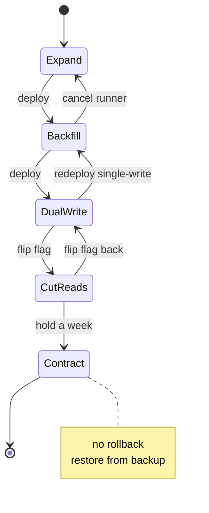

# Expand and contract schema migrations on busy tables

*five phases, each with its own way to wedge production*

The dual-write rename looks fine on a whiteboard. Add a column, copy the data, switch reads, drop the old column. Four arrows, maybe five. Then you try it on `transactions` at 4,200 writes per second with 900 million rows, and you discover that each arrow is actually a multi-day operation with its own failure modes, its own lock contention story, and its own way of leaving you stranded if you bail halfway. (A foreign key from `ledger_entries` targets `transactions.id`, not the column we are touching, so it never enters this migration.)

The pattern most teams converge on after they have hurt themselves at least once has a name: *expand and contract*. You add the new thing and keep the old (the additive *expand* steps), then remove the old once nothing depends on it (the subtractive *contract* steps). Every step is independently deployable: old code and new code both run against the database without breaking, so you never deploy app and schema in lockstep. The phases: expand, backfill, dual-write, cut over reads, contract.

The example throughout is renaming `transactions.amount_cents` (a `BIGINT`) to a typed `amount` struct (`amount_value BIGINT`, `amount_currency CHAR(3)`, `amount_scale SMALLINT`) so the system can finally handle JPY and BHD without the comment `-- assume USD` haunting six services. Same table, same row count, same backfill window of roughly 36 hours.

## The five phases, briefly

```
phase 1  EXPAND       add nullable columns, no app changes
phase 2  BACKFILL     copy old -> new in batches, idempotent
phase 3  DUAL-WRITE   app writes both, reads still old
phase 4  CUT READS    flip readers to new, old still written
phase 5  CONTRACT     stop writing old, drop column
```

Each phase is a deployable state. That property is the whole point. If anything goes sideways at phase 3, you roll the app back to phase 2 and nothing breaks, because phase 2 left the database in a state that phase 2's app code still understands. Skip that property and you have a flag day, not a migration.

## Phase 1: add the columns

This is the phase that looks free and is not. Adding a column can be *metadata-only*: the `ALTER` touches only the system catalog (the database's bookkeeping about table structure) and never visits the 900 million existing rows. The alternative rewrites every row to physically stamp in the new column, turning a one-second statement into an hours-long table rewrite. So whether `ADD COLUMN` is cheap or catastrophic comes down to whether it triggers a rewrite.

`ADD COLUMN` with no default has been metadata-only on Postgres forever. A default value is the case to watch. Historically `ADD COLUMN ... DEFAULT 'USD'` wrote `'USD'` into all 900M rows. Since PG11, Postgres avoids that for a constant (non-volatile) default by storing the default *value* once in the catalog (`pg_attribute.attmissingval`) and setting a flag (`pg_attribute.atthasmissing`) that says "rows older than this column read back this value." That is the *virtual default*. The "constant" caveat is load-bearing: a volatile default like `random()` cannot be precomputed once, so it still forces a full rewrite.

Either way the statement takes an `AccessExclusiveLock`, the strongest table lock Postgres has, for the duration of the catalog update. The lock is held briefly, but Postgres lock requests queue FIFO. Your `ALTER` waits behind every statement currently running on the table, and once queued, every statement that arrives after it queues behind it too, including plain readers. So if an analyst is running a 90-second aggregate, your one-millisecond DDL blocks every write for 90 seconds. That is how a "free" change takes down writes.

The fix is `lock_timeout`, set absurdly low, with retry:

```sql
SET lock_timeout = '150ms';
ALTER TABLE transactions
  ADD COLUMN amount_value    BIGINT,
  ADD COLUMN amount_currency CHAR(3),
  ADD COLUMN amount_scale    SMALLINT;
```

With a 150ms timeout, the `ALTER` gives up rather than sitting at the head of the queue blocking everyone. If it fails, sleep a few seconds and try again. The migration runner I have seen work well is a tiny loop that retries for up to an hour and then pages someone, on the theory that an hour of failure means something is genuinely wedged, not just unlucky.

MySQL's online DDL differs in mechanics, not principle. MySQL 8.0.12 introduced `ALGORITHM=INSTANT`, which adds a column with only a catalog change and no rebuild, for both nullable and `NOT NULL`-with-default columns; the column had to be added last until 8.0.29 allowed instant adds in any position. When `INSTANT` does not apply, MySQL falls back to `INPLACE` or `COPY`, the expensive rewrites you want to avoid. Even `INSTANT` takes a brief exclusive metadata lock. Short lock window, retry, do not block forever, on both engines.

Do not add a default value here. The backfill in phase 2 keys on `WHERE amount_value IS NULL` to tell unwritten rows apart from rows the app has touched; a default would make every row non-null and erase that distinction. Keep the columns nullable (see the `atthasmissing` column on [ALTER TABLE](https://www.postgresql.org/docs/current/sql-altertable.html) for what the virtual default actually stores).

And do not create any index on the new columns yet. The reason is phase 2.

## Phase 2: backfill, slowly and on purpose

The backfill is where everyone learns about long transactions. The naive version:

```sql
UPDATE transactions
   SET amount_value = amount_cents,
       amount_currency = 'USD',
       amount_scale = 2
 WHERE amount_value IS NULL;
```

On 900M rows this is a single transaction that takes hours, holds row locks the whole time, generates a vacuum nightmare, and if you cancel it you wait the same number of hours for the rollback. Do not do this. The batched version:

```python
BATCH = 5_000
last_id = 0

while True:
    rows = db.execute("""
        WITH batch AS (
          SELECT id FROM transactions
           WHERE id > %s AND amount_value IS NULL
           ORDER BY id
           LIMIT %s
           FOR UPDATE SKIP LOCKED
        )
        UPDATE transactions t
           SET amount_value = t.amount_cents,
               amount_currency = 'USD',
               amount_scale = 2
          FROM batch
         WHERE t.id = batch.id
        RETURNING t.id
    """, (last_id, BATCH))

    if not rows:
        break
    last_id = max(r.id for r in rows)
    time.sleep(0.05)  # pace yourself
```

A few things in there are load-bearing.

`FOR UPDATE SKIP LOCKED` changes what happens when the backfill meets a row the live app is currently writing. Plain `FOR UPDATE` would block until the app's transaction commits; `SKIP LOCKED` silently skips any already-locked row and moves on. Without it, your backfill blocks on the very rows your users are touching, a denial-of-service on your own write traffic. The catch: the cursor is forward-only (`id > last_id`), so a skipped low-id row sits behind the cursor and is not revisited this run. Reclaim those by rerunning the loop from `last_id = 0` (cheap, since almost everything is already filled) or via the phase 3 audit, which surfaces any remaining `NULL`s.

The `WHERE id > %s` keyset replaces `OFFSET`, which on a 900M-row table makes each page O(n) because the database scans and discards every skipped row before returning the next batch. Keyset (seek) pagination asks for `id > last_id`, which an index on `id` answers in one seek: index lookup, 5k row update, commit.

The `time.sleep(0.05)` is your throttle. It looks dumb until you watch replication lag during a backfill without it. Streaming (physical) replication ships the primary's write-ahead log (WAL, a sequential journal of byte-level changes) to standbys, which replay it. But a standby replays WAL *serially* in one process while the primary generates it *in parallel* across all connections. Recovery prefetch and parallel logical apply exist, but neither changes that fundamental serial replay on a streaming-replication follower. A backfill that piles another 100k UPDATEs per second onto a primary already doing 4k writes per second generates WAL faster than that single process applies it, and read replicas drift hours behind. So you pace it; if lag exceeds a threshold, sleep longer. I have run backfills that auto-tune by reading `pg_stat_replication.replay_lag` every batch.

This is where the 36-hour window comes from. Five thousand rows every ~80ms (including the sleep) is about 62k rows per second; 900M / 62k is about four hours of pure work. The realistic figure is roughly 9x that: you pause during business-hours bursts, back off when replication lag spikes, and contend with live writes that slow each batch.

Idempotency here matters in two senses worth keeping apart. The first is *schema-state* idempotency: re-running converges to the same end state, which is what this backfill has. If your runner dies at row 412,003,118, you restart and `WHERE amount_value IS NULL` picks up exactly the rows that did not get done; without it, a crash mid-run could corrupt balances on relative updates. The `last_id` keyset is only a performance trick; correctness comes from the predicate. The second sense is *message-dedup* idempotency, not applying the same logical event twice (a UNIQUE constraint plus `ON CONFLICT DO NOTHING`), which belongs in a separate post on exactly-once delivery.

## Phase 3: dual-write

Deploy app code that, on every write, sets both `amount_cents` and the new three-column struct. Reads still use `amount_cents`. This is where you discover four things in roughly this order.

One, you have writers you did not know about. The Spark job that recomputes daily rollups. The CSV importer from the finance team. The cron in `tools/legacy-fixups/` that nobody has touched since 2021. Every one writes `amount_cents` and not the new columns. Each needs updating, or each needs a database-level trigger to mirror writes while you find them.

Two, the trigger has its own trap. A `BEFORE INSERT OR UPDATE` trigger that does `NEW.amount_value := NEW.amount_cents; NEW.amount_currency := 'USD'; NEW.amount_scale := 2;` works fine and costs a few microseconds per row (measure it in load tests rather than trusting a quoted figure ([postgresql.org/docs/current/plpgsql-trigger.html](https://www.postgresql.org/docs/current/plpgsql-trigger.html))), and breaks the day someone wants to write a non-USD value. So the trigger has to be smart: if the new columns are explicitly set, use those; otherwise derive from old. You end up with a small state machine inside a trigger, which is fine but should be deleted in phase 5.

Three, the bug where the app sets `amount_cents = 1500` but forgets the currency, the trigger fills in USD, and now you have charged a Japanese customer 1,500 USD instead of 1,500 JPY. The trigger papers over a coding error you would have caught if the write had simply failed. I prefer application-side dual-write with the trigger only as a safety net that logs a warning whenever it fires, so you can hunt down stragglers without breaking production.

Four, relative updates across the rename. Anything doing `UPDATE transactions SET amount_cents = amount_cents + 100` needs the same arithmetic on `amount_value`. Miss one and you get silent drift between the two columns. The end-of-phase audit catches this:

```sql
SELECT count(*) FROM transactions
 WHERE amount_value IS DISTINCT FROM amount_cents
    OR amount_currency != 'USD';
```

`IS DISTINCT FROM` rather than `!=` because rows mid-backfill or mid-write can have a `NULL` `amount_value`, and `NULL != amount_cents` returns `NULL`, not `true`, so a plain `!=` would silently miss exactly the rows you most want to see. Run this constantly. The number should be small and bounded (rows currently being written) and should drop to zero between bursts. If it grows monotonically, you have a writer you missed; stop progressing until you find it.

The audit catches drift only after a writer has drifted, and it cannot catch a writer that always sets both columns to internally consistent but semantically wrong values (cents vs minor units). Combine it with grep: search the codebase for every reference to `amount_cents` and confirm each one either also writes the new columns or is on a list of known-dead paths. The audit and the grep cover different failure modes.

## Phase 4: cut over reads

The reads flip behind a feature flag, per-service, ideally per-endpoint. Not a global flag. Flip the low-traffic admin read first, watch it for a day, then the customer dashboard, then the high-QPS API. If anything looks wrong (rows missing, wrong currency, a performance regression because you forgot the index), flip back instantly.

This is where you finally create the index, after the backfill so the build is on stable data:

```sql
CREATE INDEX CONCURRENTLY transactions_currency_value_idx
    ON transactions (amount_currency, amount_value);
```

`CONCURRENTLY` is non-blocking but slow. A plain `CREATE INDEX` holds a write-blocking lock and builds in one pass; to let writes continue, `CONCURRENTLY` instead scans the table twice (build, then catch rows that changed during the build) and waits for old transactions to finish so it does not miss their writes. That wait is the production trap: a single long-running query or forgotten idle session stalls the build until it closes. Because it never holds a strong lock, `CONCURRENTLY` can also fail at final validation, leaving an `INVALID` index that must be dropped and rebuilt, so check `pg_index.indisvalid` after rather than assuming success.

The bail-out in phase 4 is simple: flip the flag back. The data is still dual-written, so the old column is current. This is the cheapest rollback in the migration, and you should rehearse it on staging by flipping back and forth a few times to make sure nothing caches the schema version weirdly.

## Phase 5: contract

This is the phase that feels anticlimactic and is the riskiest to do quickly. Steps:

1. Deploy app code that no longer reads or writes `amount_cents`.
2. Wait at least a full deployment cycle, ideally a week, so no rollback brings back code that needs the column.
3. Drop any triggers that touched it.
4. Drop the column.

| step | lock | duration | rollback story |
|------|------|----------|----------------|
| stop writes | none | instant | redeploy old code, dual-write resumes |
| drop trigger | AccessExclusive briefly | ms | recreate trigger |
| drop column | AccessExclusive | ms (metadata) | irreversible without restore |

`ALTER TABLE ... DROP COLUMN` on Postgres is a metadata operation: fast, but it takes `AccessExclusiveLock`, so use the same `lock_timeout` trick as phase 1.

The counterintuitive part: dropping the column does not free disk space. Postgres only marks the column dropped in the catalog (a tombstone) and leaves the bytes in every existing row. Storage is reclaimed only when those rows are physically rewritten. `VACUUM FULL` and `CLUSTER` both rewrite the table but hold `AccessExclusiveLock` for the whole rewrite; `pg_repack` does the same rewrite online without the long lock. On a 900M-row table you do not need to reclaim immediately; schedule `pg_repack` for a quiet weekend if table size is hurting backups.

## Bailing out mid-migration

The point of expand and contract is that every phase is a stable resting state with a cheap path back, until the very last one:



Every backward edge is cheap and instant; phase 5 is the one boundary with no easy return, because once the column is dropped, getting it back means restoring from backup. (If you abandon at phase 2, do not jump to phase 5; leave the columns nullable and unused until you decide.)

The pattern I have seen wedge teams: they treat phases 3 and 4 as a single deploy, dual-write and read-from-new in the same release. Now a rollback puts the app in a state that reads from a column whose data is stale by however long the release has been live. The fix is annoying (rerun a small backfill for the affected window) but the principle matters more: every phase should be deployable, holdable, and rollable independently. Combine phases and you are doing a flag day with extra steps.

## What this costs

Honest accounting for the running example: about a week of calendar time. One day for phase 1. Two days for phase 2, because the 36-hour backfill needs a babysitter through two business-hours pauses. Two days for phase 3 to chase down all the writers and watch the audit settle. A day for phase 4 to flip reads incrementally. A day in phase 5 to hold the new state before the drop.

That is not a fast migration. It is also not the kind that leaves you with a half-renamed column and a stuck application. The slowness is the feature.
