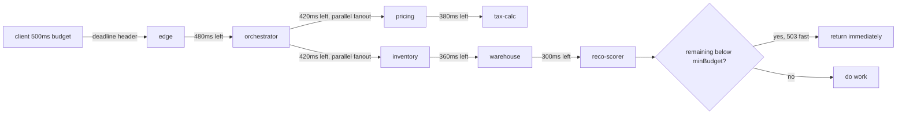

# Deadline propagation across service hops without losing context

*a 500ms budget is not 500ms by the sixth service unless each one knows what has already been spent*

First, the distinction the whole piece rests on. A timeout is a local limit: "give up after 500ms." A deadline is a shared budget: "give up at 12:00:00.500." A user request is one pool of time, not a setting you pick fresh on every call. The moment it leaves the browser a clock starts. Each service the request passes through spends from that one pool: a little on the network, a little on its own work, then it hands what is left to the next service. (Each service-to-service network call is a hop.) A service that sets a fresh timeout bounds only its own slice, and slices add up instead of capping.

The checkout team paged me on a Tuesday with a familiar complaint. The 99th percentile response time, the time all but the slowest 1 percent of requests stay under (written p99), was fine. The problem was further out, at the 99.9th percentile (p99.9): some requests took 12 seconds and returned data the user had stopped caring about. The frontend had given up at 800ms. The backend kept computing. Six services deep, a recommendation engine was still scoring carts for a user who had closed the tab.

The fix was not bigger machines or faster code: tell every service how long it had left, and keep that number correct at every hop.

## The shape of the problem

A call graph is the tree of who calls whom for a single request. Here is this one.

```
        client (500ms)
           |
           v
    edge-gateway
           |
           v
    checkout-orchestrator
       /      |       \
      v       v        v
   cart-svc  pricing  inventory
                |          \
                v           v
            tax-calc    warehouse-router
                            |
                            v
                       reco-scorer
```

The deepest branch runs edge-gateway, orchestrator, inventory, warehouse-router, reco-scorer: five hops from the edge to the deepest node, and `reco-scorer` is six services down if you count the client and the leaf (the bottom node of the graph). The browser sent an 800ms client timeout. The edge gateway had its own 5 second default. The orchestrator had a 30 second default copied from an old answer online. By the time the request reached `reco-scorer`, nobody knew the original budget, every service knew only its own timeout, and all were working on requests already failed upstream.

## What a deadline actually is

Work through the arithmetic. Service A sets a 500ms timeout, spends 200ms doing work, then calls service B with a fresh 500ms timeout. On the user's wall clock, B can run until 200 + 500 = 700ms after A began, while the browser gave up at 800ms. B is using time the user no longer has.

A deadline removes the addition. It says "finish before T+0.500s, where T is the moment the user pressed the button." When A calls B, A passes the deadline, not a timeout. B subtracts the current time from it, and that subtraction is its remaining budget. If the result is negative or absurdly small, B refuses to start. Because every hop subtracts from the same fixed instant, the budget only ever shrinks (it shrinks monotonically) instead of resetting at each service.

gRPC, a framework for calling functions on a remote server as if they were local (it stands for a remote procedure call system), has carried deadlines since the early days. It encodes the deadline as the `grpc-timeout` header in a compact duration format: a number plus a single-letter unit, case-sensitive. Lowercase `m` is milliseconds, uppercase `S` seconds, `H` hours, so `100m` is 100 milliseconds, not minutes. When a gRPC server receives the call, its request context arrives with the deadline already installed; in Go and Java you only have to not turn it off. The usual accident is calling the downstream with a fresh `context.Background()`: an empty context with no deadline attached, so deriving from it instead of from the incoming request context throws away the propagated deadline.

HTTP has no standard for this. There is no deadline header blessed by the IETF (the Internet Engineering Task Force, the body that standardizes internet protocols), so you invent one. Most shops pick `X-Request-Deadline` carrying one of two encodings, a real tradeoff:

- **Epoch milliseconds**, an absolute timestamp counted as milliseconds since midnight on 1 January 1970 (the "epoch" the industry agreed to count from). Simplest, but it requires every machine to agree on the current time. Every hop computes its budget as `deadline - its own now`, so if two machines disagree about the time, that disagreement (the clock skew) is subtracted straight out of the budget. Keeping clocks in sync across the whole set of your machines (your fleet) is the job of the Network Time Protocol, NTP, discussed below.
- **Remaining milliseconds**, a relative count. Each hop measures only its own elapsed time and never compares clocks, so it is immune to skew. The cost is a small per-hop bias: each forwarder subtracts its own elapsed time before forwarding, and any imprecision in that local subtraction stacks up hop by hop.

Pick epoch if you trust your clocks, remaining-ms if not.

## Threading the deadline through code

The code in Go, with a homegrown HTTP header for the non-gRPC parts. Go's `context` is an object that travels with a single request down the call tree, carrying cancellation and deadline signals; it is request-scoped, living for exactly one request and no longer. `context.WithTimeout` builds a deadline as a duration from now (the fallback when none arrived); `context.WithDeadline` builds one from an absolute instant (the propagated case). The `DeadlineMiddleware` below is middleware: a wrapper that runs on every incoming request before your handler does, so you read the deadline header in one place instead of in every endpoint.

```go
const DeadlineHeader = "X-Request-Deadline"

// Server side: extract deadline from incoming request and install
// it on the request context. Refuse fast if there is not enough
// budget left to be worth starting.
func DeadlineMiddleware(minBudget time.Duration) func(http.Handler) http.Handler {
    return func(next http.Handler) http.Handler {
        return http.HandlerFunc(func(w http.ResponseWriter, r *http.Request) {
            deadlineMs := r.Header.Get(DeadlineHeader)
            if deadlineMs == "" {
                // No deadline propagated. Use a sane default,
                // but log it loudly. This is almost always a bug.
                ctx, cancel := context.WithTimeout(r.Context(), 2*time.Second)
                defer cancel()
                deadlineFallbackCounter.Inc()
                next.ServeHTTP(w, r.WithContext(ctx))
                return
            }

            ms, err := strconv.ParseInt(deadlineMs, 10, 64)
            if err != nil {
                http.Error(w, "bad deadline header", 400)
                return
            }
            // Epoch-ms variant. For remaining-ms, instead do:
            //   deadline := time.Now().Add(time.Duration(ms) * time.Millisecond)
            deadline := time.UnixMilli(ms)
            remaining := time.Until(deadline)

            if remaining < minBudget {
                // Deadline-too-short fast fail. Do not even start.
                // We return 503 with Retry-After: 0 to tell the caller
                // it may retry immediately, ideally on a different replica.
                // See RFC 9110 Section 15.6.4 for 503 semantics and
                // Section 10.2.3 for Retry-After.
                // must set headers before http.Error writes the status
                w.Header().Set("Retry-After", "0")
                http.Error(w, "deadline exceeded before start", 503)
                deadlineTooShortCounter.Inc()
                return
            }

            ctx, cancel := context.WithDeadline(r.Context(), deadline)
            defer cancel()
            next.ServeHTTP(w, r.WithContext(ctx))
        })
    }
}

// Client side: forward the deadline to the next hop. Subtract a
// small slush to account for network and our own teardown time.
func ForwardDeadline(ctx context.Context, req *http.Request, slush time.Duration) error {
    deadline, ok := ctx.Deadline()
    if !ok {
        return errors.New("no deadline on outgoing request")
    }
    forwardDeadline := deadline.Add(-slush)
    if time.Until(forwardDeadline) <= 0 {
        return errors.New("no budget left to forward")
    }
    req.Header.Set(DeadlineHeader, strconv.FormatInt(forwardDeadline.UnixMilli(), 10))
    return nil
}
```

Three details are worth pulling out. The `minBudget` argument is the deadline-too-short check. If a service has never returned a useful response in under 30ms, accepting work with 12ms left is pure waste: you spend processor time, hold a connection, and fail at the end. HTTP servers signal outcomes with three-digit status codes; 503 is one. Returning it frees the worker and the connection and hands the decision back to a caller who still has budget, to spend on another identical instance of the service (a replica), a cached answer, or an error shown to the user. Pick `minBudget` from observed latency, roughly your median (p50, the time half your requests stay under).

**503 Service Unavailable** means "I cannot take this work right now"; pairing it with `Retry-After` tells the caller when to come back. **504 Gateway Timeout**, per RFC 9110 Section 15.6.5 (RFCs are the numbered documents that define internet standards; RFC 9110 is the one for HTTP), means a gateway or proxy did not get a timely response from upstream. So 503 is the more defensible framing for "I declined before starting." RFC 9110 Section 10.2.3 pairs `Retry-After` with 503 (https://httpwg.org/specs/rfc9110.html#field.retry-after). Some shops use 504 to group it with other timeout metrics; either works if you are consistent.

The `slush` parameter is the gap you reserve before forwarding the deadline downstream. Forward the full deadline and the downstream may run right up to it, leaving you no time to turn your response into bytes for the wire (to serialize it), log, and tear down; you then time out even though the downstream answered in time. A few milliseconds, typically 5 to 10ms, is enough. It is a per-hop reservation, so it compounds: across five hops you have removed 25 to 50ms on top of real work. Acceptable against a 500ms pool, but one reason deep graphs feel tighter than the numbers suggest.

## The gRPC and HTTP mismatch

Real graphs mix protocols. The edge gateway is HTTP. The orchestrator talks gRPC to most internal services. Inventory calls a vendor endpoint over SOAP, an older XML-based protocol for calling remote services (Simple Object Access Protocol). Each has its own deadline convention, and translating between them is the part to write carefully.

| Protocol | Carrier | Format | Default behavior |
|---|---|---|---|
| gRPC | `grpc-timeout` header | duration suffix (`500m` = 500 ms, `2S` = 2 s, `1H` = 1 h) | Server-side context has deadline pre-set |
| HTTP (homegrown) | custom header | epoch ms or remaining ms | Whatever middleware you wrote |
| Kafka/queue | message header | epoch ms | Consumer must check before processing |
| SOAP (vendor) | nothing | nothing | You set a client-side timeout and hope |

(Kafka is a message queue: a service drops a message into it now, and another service picks it up later, so the two are decoupled in time.)

When a gRPC server calls an HTTP downstream, a thin shim does the translation. A shim here is a small piece of adapter code that converts one protocol's deadline format into another's: it reads the gRPC context deadline and writes it into your custom HTTP header. Reverse it when an HTTP service calls a gRPC downstream: read your header into a context with a deadline, then let the gRPC client forward it as `grpc-timeout`.

For queues, the producer stamps the deadline into a header when it enqueues, and the consumer checks it before any work, dropping the message if it sat too long. The table lists epoch-ms here despite the clock-skew warning for one reason: a message may sit for hours, far longer than typical fleet skew, so an absolute instant is the only encoding that survives an unknown queue delay. It avoids the failure where a backlog clears and a three-hour-old job runs anyway, charging a card for an abandoned order.

## The 200ms tail

Tail latency means the slow end of the distribution: the small fraction of requests that take much longer than the rest, the ones p99 and p99.9 measure. Back to checkout. Once we threaded deadlines end to end, a 200ms tail appeared. `reco-scorer` had a defensive 30 second timeout to its model serving sidecar (a helper process that runs alongside the main service and handles one job for it, here scoring with the model). The sidecar was hitting a stale cached model that took 180ms to evaluate on a path meant to take 5ms. Nobody had noticed, because the 30 second timeout was loose enough that even the worst evaluations finished inside it.

Once deadlines propagated, `reco-scorer` got requests with 80ms left and refused them as deadline-too-short. Recommendation quality dropped slightly; latency dropped a lot. With the slow path finally visible, we fixed the bug.

Loose timeouts hide problems; tight propagated deadlines surface them. Deep services now fail fast whenever the remaining budget is too small, so the deadline-too-short rejection rate becomes a real signal: a rising rate means some service above you is getting slower (a latency regression). Plot the fraction of requests where this service got less than 50ms of budget and you have a warning before users feel it.



Read the shrinking numbers as one budget spent down: each edge label is what the downstream sees on arrival, the same 500ms pool ticking down because every hop subtracts from one fixed deadline. The pricing-to-tax-calc branch (380ms) never reaches `reco-scorer`; it is there only to show the budget shrinking on every branch. The fork is the subtle part. Pricing and inventory both get 420ms because they run at the same time off the same parent (this is a fanout, one service calling several downstreams at once). Parallel siblings share the same deadline rather than dividing the budget; only sequential hops spend it down.

## Sharp edges to watch for

A few cases break the simple model.

**Clock skew.** Encode the deadline as an epoch timestamp and let clocks drift by 100ms: slow-clock services think they have more budget than they do and fast-clock services reject valid work. Keeping clocks in sync is non-negotiable for epoch encoding. A note on NTP (RFC 5905, the standard for NTP, https://datatracker.ietf.org/doc/html/rfc5905): the stratum number counts how many hops a server is from an authoritative clock, but it is not an accuracy guarantee. The bounds RFC 5905 actually specifies are root delay and root dispersion, which together give a synchronization distance, an upper bound on how far off your clock might be. A stratum-3 server on a fast link can beat a stratum-2 server reached over a poor wide area network (a WAN). Pair good time sources with monitoring on that bound. If you cannot trust clocks, use remaining-ms.

**Retries that ignore deadlines.** Any retry policy on the path must check the remaining budget before each attempt. The safe-retry mechanics, idempotency keys and at-least-once handling, are covered in the idempotency-keys post (/article/idempotency-keys.html). In short: at-least-once handling means a message may be delivered more than once, so the receiver must cope with duplicates, and an idempotency key lets it treat the second delivery as a no-op, safe to run more than once without changing the outcome.

**Streaming responses.** A long-poll endpoint (the client holds one request open and the server replies only when it has data) or a server-sent-events endpoint (SSE, where the server pushes a stream of updates down one long-lived connection) has a connection lifetime, not a single deadline. Apply request-level propagation to it and you cut the stream off at the deadline. You want the deadline to govern the time-to-first-byte instead: arm it on the context only until the first chunk flushes, then detach and switch to a connection-lifetime timeout. Handle this per endpoint.

**Background work spawned from a request.** A request returns to the user, then asynchronously kicks off a "send confirmation email" task. That task must not inherit the request deadline; it needs its own, longer one rooted at the moment it was scheduled. Forget this and the background work cancels itself the instant the user's response goes out.

**Cancellation does not fan out to siblings on its own.** When your context deadline fires, the cancel signal flows down into your in-flight downstream calls, and each returns deadline-exceeded. That part is fine. The gap is sideways. If you launched several downstream calls in parallel off the same context, cancelling it should stop all of them, but hand-rolled fanout often notices only the first failure and leaves the siblings running. Good client libraries cancel siblings when the shared context is cancelled; custom code frequently does not. Audit those paths.

## The minimum viable rollout

Starting from a fleet with no deadline propagation, the cheapest sequence:

1. Pick a header name. Write it down. Get every team to agree before you write any code.
2. Add the middleware to one service. Make it permissive: if no deadline arrives, use the existing default. Log "no deadline received" as a counter.
3. Add client-side forwarding to that same service for one downstream call.
4. Watch the "no deadline received" counter on the downstream. It should drop to zero from that one upstream.
5. Walk the graph, service by service. Each addition makes the deadline-too-short counter climb at the receiving service: the signal you are uncovering real problems.
6. Once the graph is covered, ratchet the upstream defaults down to realistic values. Now the deadlines arriving at the leaves are the real user budget minus real elapsed work.

You will get pushback from teams who say their service genuinely needs 30 seconds for some workloads. Sometimes that is true. The answer is not to skip propagation; it is to admit those workloads do not belong on the synchronous user request path. Move them to a job queue with its own deadline semantics, return a job ID, and let the frontend poll. Then the synchronous path gets tight deadlines, and a 30 second p99 stops being acceptable for a button click.

The checkout team's p99.9 dropped from 12 seconds to under 900ms within two weeks. The code was the easy part; getting six teams to agree on one header name took longer.
