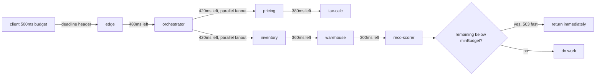

# Deadline propagation across service hops without losing context

*a 500ms budget is not 500ms at hop six unless every hop knows what it already spent*

The checkout team paged me on a Tuesday with a complaint that sounded familiar. P99 was fine. P99.9 was a horror movie. Some requests took 12 seconds and returned data the user had long since stopped caring about. The frontend had given up at 800ms. The backend kept computing. Six services deep, a recommendation engine was still scoring carts for a user who had closed the tab and gone to lunch.

The fix was not bigger machines or faster code. The fix was telling every service how long it had left to live, and getting every service to believe it.

## The shape of the problem

Here is a representative call graph for the failure mode.

```
        client (500ms)
           |
           v
    edge-gateway
           |
           v
    checkout-orchestrator
       /      |       \
      v       v        v
   cart-svc  pricing  inventory
                |          \
                v           v
            tax-calc    warehouse-router
                            |
                            v
                       reco-scorer
```

Five hops from the edge to the deepest leaf. The user's browser sent a request with an 800ms client timeout. The edge gateway had its own 5 second default. The orchestrator had a 30 second default copied from a stack overflow answer in 2019. By the time you reached `reco-scorer`, nobody had any idea what the original budget was. Every service was happily working on requests that had already failed upstream.

This is the canonical deadline propagation problem. Each service knows its own timeout. None of them know the *remaining* budget.

## What a deadline actually is

A timeout is a duration. A deadline is a wall-clock instant. The distinction matters.

If service A sets a 500ms timeout and then spends 200ms doing work before calling service B with a 500ms timeout, service B now has up to 700ms of total budget from the user's perspective. The user's browser gave up at 800ms. Service B is computing into the void.

A deadline is absolute. "Finish before T+0.500s, where T is the moment the user pressed the button." When A calls B, A does not pass a timeout. A passes a deadline. B looks at the deadline, subtracts the current time, and that is its actual budget. If the result is negative or absurdly small, B should refuse to start the work.

gRPC has had this baked in since the early days. It encodes the deadline as the `grpc-timeout` header, in a wire-friendly format like `100m` (100 milliseconds) or `2S` (2 seconds). The deadline travels with the call. When the gRPC server receives it, the server-side context has the deadline pre-installed. You do not even have to think about it for Go and Java services. You just have to not turn it off.

HTTP has no standard. There is no IETF blessed deadline header. You invent your own. Most shops settle on something like `X-Request-Deadline` carrying either an epoch milliseconds value or a remaining-millis integer. Either works. Epoch is simpler conceptually but requires NTP discipline across the fleet, because every hop's view of "now" is what gets subtracted from the deadline. Remaining-ms is more forgiving of clock skew because each hop only needs to measure elapsed time locally, at the cost of a small bias accumulated per hop and the need to remember the subtraction before forwarding.

## Threading the deadline through code

The shape of the code, in Go, with a homegrown HTTP header for the non-gRPC parts:

```go
const DeadlineHeader = "X-Request-Deadline-Ms"

// Server side: extract deadline from incoming request and install
// it on the request context. Refuse fast if there is not enough
// budget left to be worth starting.
func DeadlineMiddleware(minBudget time.Duration) func(http.Handler) http.Handler {
    return func(next http.Handler) http.Handler {
        return http.HandlerFunc(func(w http.ResponseWriter, r *http.Request) {
            deadlineMs := r.Header.Get(DeadlineHeader)
            if deadlineMs == "" {
                // No deadline propagated. Use a sane default,
                // but log it loudly. This is almost always a bug.
                ctx, cancel := context.WithTimeout(r.Context(), 2*time.Second)
                defer cancel()
                deadlineFallbackCounter.Inc()
                next.ServeHTTP(w, r.WithContext(ctx))
                return
            }

            ms, err := strconv.ParseInt(deadlineMs, 10, 64)
            if err != nil {
                http.Error(w, "bad deadline header", 400)
                return
            }
            deadline := time.UnixMilli(ms)
            remaining := time.Until(deadline)

            if remaining < minBudget {
                // Deadline-too-short fast fail. Do not even start.
                // We return 503 with Retry-After: 0 to tell the caller
                // it may retry immediately, ideally on a different replica.
                // See RFC 9110 Section 15.6.4 for 503 semantics and
                // Section 10.2.3 for Retry-After.
                // must set headers before http.Error writes the status
                w.Header().Set("Retry-After", "0")
                http.Error(w, "deadline exceeded before start", 503)
                deadlineTooShortCounter.Inc()
                return
            }

            ctx, cancel := context.WithDeadline(r.Context(), deadline)
            defer cancel()
            next.ServeHTTP(w, r.WithContext(ctx))
        })
    }
}

// Client side: forward the deadline to the next hop. Subtract a
// small slush to account for network and our own teardown time.
func ForwardDeadline(ctx context.Context, req *http.Request, slush time.Duration) error {
    deadline, ok := ctx.Deadline()
    if !ok {
        return errors.New("no deadline on outgoing request")
    }
    forwardDeadline := deadline.Add(-slush)
    if time.Until(forwardDeadline) <= 0 {
        return errors.New("no budget left to forward")
    }
    req.Header.Set(DeadlineHeader, strconv.FormatInt(forwardDeadline.UnixMilli(), 10))
    return nil
}
```

A few things worth pulling out.

The `minBudget` argument to the middleware is the deadline-too-short check. If a service knows it has never returned a useful response in under 30ms, accepting work with 12ms left is pure waste. You spend CPU, you allocate memory, you hold a connection, and you fail with a deadline exceeded right at the end. Better to fail at the front door. The client gets a quick 503 and can decide whether to retry against a different replica, fall back to a cached answer, or surface the failure to the user. Anything is better than burning a worker for nothing.

A note on the status code. RFC 9110 Section 15.6.5 defines 504 (Gateway Timeout) narrowly as the case where a gateway or proxy did not receive a timely response from an *upstream* server. A leaf service that runs out of budget on its own is not strictly a gateway, so 504 is a bit of a stretch of the spec. 503 Service Unavailable with `Retry-After: 0` is the more defensible framing, and `Retry-After` is canonically paired with 503 and 429 rather than 504 (RFC 9110 Section 10.2.3, https://httpwg.org/specs/rfc9110.html#field.retry-after). Some shops reach for 504 anyway because the failure is morally a deadline-driven one and they want it bucketed with their other timeout metrics. Either is workable as long as you are consistent across the fleet.

The `slush` parameter on the client side is the gap you reserve for yourself. If the downstream call returns at exactly the deadline, you still need a few millis to write the response, log it, and tear down the connection. There is no spec-blessed number here; in our experience a few millis, typically 5 to 10ms, is usually enough, but you should calibrate against your own teardown costs. Get this wrong in either direction and you will see strange behavior. Too little slush and your service returns a deadline-exceeded to its caller because the upstream deadline fired while you were unwinding. Too much slush and you waste budget the downstream could have spent.

## The gRPC and HTTP impedance mismatch

The annoying part is that real graphs mix protocols. The edge gateway is HTTP. The orchestrator talks gRPC to most internal services. Inventory calls a vendor SOAP endpoint because of course it does. Each protocol has its own deadline convention. Translating between them is the part you have to write carefully.

| Protocol | Carrier | Format | Default behavior |
|---|---|---|---|
| gRPC | `grpc-timeout` header | duration suffix (`500m`, `2S`, `1H`) | Server-side context has deadline pre-set |
| HTTP (homegrown) | custom header | epoch ms or remaining ms | Whatever middleware you wrote |
| Kafka/queue | message header | epoch ms | Consumer must check before processing |
| SOAP (vendor) | nothing | nothing | You set a client-side timeout and pray |

When a gRPC server calls an HTTP downstream, you need a thin shim that reads the gRPC context deadline and writes it into your custom HTTP header. When an HTTP service calls a gRPC downstream, you do the reverse: read your custom header into a context with deadline, then let the gRPC client library forward it as `grpc-timeout` automatically.

For the queue case, the message producer stamps the deadline into a header at enqueue time. The consumer checks the deadline before doing any work, and if the message has been sitting in the queue too long, drops it on the floor. This is how you avoid the classic "Black Friday flood pushes a job to the front of the queue three hours later and we charge someone's card for a sweater they no longer want" failure mode.

## The 200ms tail nobody could see

Back to the checkout incident. Once we threaded deadlines end to end, the 200ms tail showed up immediately. `reco-scorer` had a defensive 30 second client timeout to its model serving sidecar. The sidecar was hitting a stale cached model that took 180ms to evaluate on a hot path that was supposed to take 5ms. Nobody had noticed because the 30 second timeout was so loose that even pathological evaluations always finished inside it. The user had given up, but the backend was still chewing.

Once deadlines were propagated, `reco-scorer` started getting requests with 80ms of budget left and refusing them with deadline-too-short. Recommendation quality dropped slightly. Latency dropped enormously. We then went and fixed the actual bug in the sidecar, because we could finally see it.

This is the underrated benefit of deadline propagation. Loose timeouts hide problems. Tight, propagated deadlines surface them. The deadline-too-short rejection rate at deeper services becomes a real signal. You can plot "fraction of requests where this service received less than 50ms of budget" and you have a beautiful early warning for upstream regressions.



Each edge label is the budget the downstream sees on arrival; gaps between hops are network plus the caller's own processing time.

## Things that bite you

A few sharp edges worth mentioning.

**Clock skew.** If you encode the deadline as an epoch timestamp and your fleet's clocks drift by 100ms, services with slow clocks will think they have more budget than they do, and services with fast clocks will reject perfectly valid work. NTP with a low stratum number (stratum 2 or better, where stratum-1 servers are directly attached to a stratum-0 reference clock such as a GPS or atomic source per RFC 5905, https://datatracker.ietf.org/doc/html/rfc5905) and active monitoring on drift is non-negotiable. If you cannot trust clocks, use remaining-millis encoding and accept the small bias from each hop's clock during the subtract step.

**Retries that ignore deadlines.** Any retry policy on the call path must check remaining budget before each attempt; the safe-retry mechanics themselves (idempotency keys, at-least-once handling) are out of scope here and covered separately in the idempotency-keys post.

**Streaming responses.** A long-poll or server-sent events endpoint does not have a single deadline. It has a connection lifetime. Trying to apply request-level deadline propagation to a streaming endpoint will cut the stream off at the deadline. You probably want the deadline to apply to time-to-first-byte, not total stream duration. This needs to be handled explicitly per endpoint.

**Background work spawned from a request.** A request comes in, does its main work, returns to the user, and asynchronously kicks off a "send confirmation email" task. That async task should *not* inherit the request deadline. It needs a separate, longer deadline rooted at the moment the async work was scheduled. Forgetting this means your async work cancels itself the moment the user's response goes out.

**Cancellation does not propagate up the call chain automatically.** When your context deadline fires, your in-flight downstream calls will return a deadline-exceeded error. Good. But if you were doing fan-out work, you need to actively cancel the sibling calls too. Most well-behaved client libraries do this when you cancel the context, but custom code often does not. Audit your fan-out code paths.

## The minimum viable rollout

If you are starting from a fleet with no deadline propagation, the cheapest sequence I have seen work:

1. Pick a header name. Write it down. Get every team to agree before you write any code.
2. Add the middleware to one service. Make it permissive: if no deadline arrives, use the existing timeout default. Log "no deadline received" as a counter.
3. Add the client-side forwarding to that same service for one downstream call.
4. Watch the "no deadline received" counter on the downstream. It should drop to zero from that one upstream.
5. Walk the graph. Add middleware and forwarding service by service. Each addition causes the deadline-too-short counter to climb at the receiving service. That is the signal you are uncovering actual problems.
6. Once the graph is covered, ratchet the upstream defaults down to realistic values. Now the deadlines that arrive at the leaves are the real user budget minus real elapsed work, not some random 30 second placeholder.

You will get pushback from teams who say "but my service genuinely needs 30 seconds for some workloads." Sometimes that is true. The answer is not to skip deadline propagation, it is to admit that those workloads should not be on the synchronous user request path. Move them to a job queue with its own deadline semantics, return a job ID to the user, and let the frontend poll. Then the synchronous path can get tight deadlines and you stop pretending a 30 second p99 is acceptable for an interactive button click.

The checkout team's p99.9 dropped from 12 seconds to under 900ms within two weeks of full propagation. The work was almost entirely plumbing. The hard part was getting six teams to agree on a header name.
