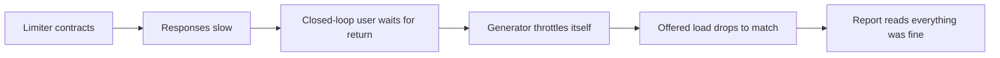

# Adaptive concurrency limits with gradient and Little's law

*why a fixed thread-pool size is a measurement you stopped taking, and what to measure instead*

A fixed concurrency limit is a number someone picked based on a load test that has not been rerun since the last major version of the downstream service. It worked then. It probably still works on a calm day. The interesting question is what it does when the downstream payment service is mid slow garbage-collection pause and your p99 is climbing toward the dashboard threshold that wakes someone up.

The honest answer is that any static number is wrong almost all the time, just by varying amounts. A fixed limit correct under one downstream service time becomes wrong the moment that service time shifts, and it has no way to notice. The useful question is whether you can pick a number that floats with conditions without making the system unstable. Two families of algorithms are worth knowing. Gradient-based limiters use "gradient" not in the calculus sense but as how far current latency has drifted from a remembered baseline, computed as a ratio of two windowed latency averages; when recent latency runs hotter than the baseline, the limiter reads that as congestion and backs off. Little's-law limiters instead calculate the optimal in-flight count from throughput and service time. The two look similar from the outside but behave quite differently when a downstream degrades.

## The fixed-pool failure mode

Imagine a service called `checkout-svc` calling a downstream payment provider, `payclient`, through a fixed semaphore of 200 permits. On a normal day, payclient is fast and `checkout-svc` runs well below the ceiling. Most permits sit idle, and that idleness is invisible.

Now payclient has a noisy neighbor on its shared infrastructure. Latency drifts upward. Your in-flight count climbs because requests arrive at the same rate but each one holds a permit longer. Eventually you hit 200 in-flight, the semaphore starts blocking, and the latency you observe (which now includes queue wait time) climbs steeply. The pager fires.

The 200-permit limit is doing exactly what it was designed to do, which is the problem. It does not know the downstream service changed its service time. It cannot tell the difference between "we have capacity to spare" and "we are about to make everything worse by piling on more concurrent requests."

```
fixed pool, downstream latency step:

latency (ms)        |                    ___________
                    |                   /
                    |                  /
                    |                 /
                    |                /
                    |    __________/
                    |___/
                    +-------------------- time
                       t0: latency step  t1: queue saturates
                       (downstream slows) (in-flight hits the
                                          pool ceiling, observed
                                          p99 climbs)
```

## Little's law, briefly

Little's law says that for any stable queueing system, the average number of items in the system equals the average arrival rate times the average time each item spends there. Written as `L = λW`, it holds regardless of any distribution: it is true the way conservation of mass is true.

One narrowing to flag, because it trips up anyone who learned the textbook form: classically `λ` is the arrival rate and `W` is total time in the system, queue wait included. For a limiter, in steady state what arrives also completes, so we use the completion rate (the one we can see) for `λ` and the observed round-trip time per request for `W`. The law still holds and now maps onto what a limiter can measure.

So if you observe throughput (`λ`, requests per second completing) and round-trip time (`W`, time per request), the concurrency the system is sustaining is `L = λW`. Set your limit at or near that and you match the offered load. Set it much higher and you invite queueing inside the downstream. Set it much lower and you cap `λ` below what the system could complete: requests that would have run wait for a permit instead, so completed throughput falls. That suppression is the cost of an over-tight limit.

The version that shows up in real code adds variance terms. Kingman's G/G/1 approximation does this for general arrival and service-time distributions; "G/G/1" is Kendall notation for a single-server queue (the trailing 1) with General, that is arbitrary, distributions for arrivals (first G) and service (second G). Its rough form is `Wq ≈ (ρ / (1 - ρ)) * ((c_a² + c_s²) / 2) * τ`, where `Wq` is mean queue wait, `τ` is mean service time, and `c_a`, `c_s` are the coefficients of variation of inter-arrival and service times. Two takeaways: the `ρ / (1 - ρ)` factor blows up as you approach saturation, and burstier traffic (larger `c_a²`, `c_s²`) makes the wait worse at the same utilization. The simplest case, M/M/1 (Markovian, that is memoryless exponential, arrivals and service at a single server), drops the variance terms: both the mean number in system and the total time a request spends scale as `1 / (1 - ρ)`, where `ρ` (rho) is utilization. At ρ=0.8 that is `1/(1-0.8) = 5` service units, 4 of them queue wait, and it gets worse the closer you push to 1. Keep utilization in the 70-80% range depending on how tail-sensitive your service is; the last 20% of capacity costs you more in p99 than the first 80% did.

## Gradient limiters: ratio against a baseline

The Netflix `concurrency-limits` library popularized a different approach. Rather than computing `L = λW` directly, gradient limiters compare a short-term moving average of latency against a long-term one. If the short term is significantly higher, you are running into queueing, so you back off. Lower or equal, you increase the limit.

A simplified Gradient-style limiter looks roughly like this (the exponential smoothing on the short-term RTT and the `4 * sqrt(limit)` queue allowance are teaching choices, not the Netflix Gradient2 defaults; see the discussion after the code):

```python
class GradientLimiter:
    def __init__(self, initial_limit=10, max_limit=200, smoothing=0.2):
        self.limit = initial_limit
        self.max_limit = max_limit
        self.smoothing = smoothing
        self.long_rtt = None   # exponentially smoothed baseline
        self.short_rtt = None  # recent sample window

    def update(self, sample_rtt_ms, in_flight):
        # initialize on first sample
        if self.long_rtt is None:
            self.long_rtt = sample_rtt_ms
            self.short_rtt = sample_rtt_ms
            return self.limit

        # don't learn from idle-period samples: they bias the long-term
        # baseline downward and make the limiter over-eager to shrink
        # the next time real load returns. Skip both the RTT updates
        # and the limit adjustment when we're nowhere near the limit.
        if in_flight * 2 < self.limit:
            return self.limit

        # long-term tracks slowly, recovers from transient spikes
        self.long_rtt = (1 - 0.01) * self.long_rtt + 0.01 * sample_rtt_ms
        # short-term tracks quickly, reflects current conditions
        self.short_rtt = (1 - self.smoothing) * self.short_rtt \
                         + self.smoothing * sample_rtt_ms

        # gradient: <1 means we're slower than baseline (congested)
        gradient = max(0.5, min(1.0, self.long_rtt / self.short_rtt))

        # adjustment: grow by a Gradient-style queue allowance when
        # healthy, shrink proportionally when congested. The original
        # Gradient algorithm scaled this as 4*sqrt(limit); Gradient2
        # defaults to a flat constant (4) that you can override with
        # a function of the current limit.
        queue_size = int(4 * (self.limit ** 0.5))
        new_limit = gradient * self.limit + queue_size

        self.limit = max(1, min(self.max_limit, int(new_limit)))
        return self.limit
```

A few details. The ratio is `long_rtt / short_rtt`, baseline over recent: when the downstream slows, `short_rtt` rises faster than the slow-moving `long_rtt`, so a bigger denominator drives the ratio below 1, which is why "<1 means congested." The clamp to `[0.5, 1.0]` caps damage: it never shrinks the limit by more than half in one step, and never lets the ratio exceed 1 and inflate the limit through the multiplier. So in `new_limit = gradient * self.limit + queue_size`, when healthy the gradient is pinned to 1.0 and all growth comes from the additive `queue_size`; only when congested does the `<1` multiplier shrink the base. The `4 * sqrt(limit)` headroom grows sublinearly, so a larger limit gets proportionally more probing room but cannot overshoot by a big chunk each cycle. The idle guard means we only trust samples taken at least roughly half-loaded; lighter samples carry no congestion signal.

The toy and the real Gradient2 differ only in where the smoothing sits. Gradient2 compares the most recent raw RTT against a long-term exponentially-weighted baseline (default window ~600 samples) and applies its smoothing factor (default 0.2) to the **limit update itself**, not to the RTT (sources: [Gradient2Limit.java](https://github.com/Netflix/concurrency-limits/blob/main/concurrency-limits-core/src/main/java/com/netflix/concurrency/limits/limit/Gradient2Limit.java), [PR #88](https://github.com/Netflix/concurrency-limits/pull/88)). The toy smooths the *RTT* in two windows (0.2 short, 0.01 long) and feeds their ratio in, which is easier to reason about on paper. The directional behavior is identical; the dials that matter in production are the long-window length, the `queueSize` function, and the limit-update smoothing. The 0.2 / 0.01 numbers here are illustrative, not production defaults.

Whichever scheme you use, the dial behaves the same. Set it too high and you react to single-sample noise; too low and you miss real degradations. At very low traffic, scale the smoothing up (or require a minimum sample count) so you are not deciding from three samples.

## Little's law in practice: VegasLimit and the BDP analogy

The other family takes Little's law literally. TCP Vegas does this for network congestion: it estimates the bandwidth-delay product (BDP, the data that can be "in the pipe" at once, equal to bandwidth times round-trip delay) from observed RTT and throughput, and keeps in-flight bytes close to BDP. Below BDP you underutilize. Above BDP the excess packets sit in a queue buffer along the path, adding delay without adding capacity, so RTT inflates while throughput does not.

A Little's-law concurrency limiter does the same for requests. It observes the no-load RTT (the minimum service time it has ever seen) and the current RTT, then computes how many extra requests are queued. Of the current `in_flight`, the fraction doing real work rather than waiting is `rtt_noload / sample_rtt`: if no-load is 10ms and you observe 40ms, a quarter of in-flight is genuine service and three-quarters is queueing. So `in_flight * (rtt_noload / sample_rtt)` is the BDP-equivalent "real" concurrency, and the excess collapses to `in_flight * (1 - rtt_noload / sample_rtt)`:

```python
class VegasLimiter:
    # Note: constant alpha=3, beta=6 keeps the example readable.
    # Netflix's VegasLimit actually scales both as functions of the
    # current limit: alpha = 3 * log10(limit) and beta = 6 * log10(limit)
    # (https://github.com/Netflix/concurrency-limits/blob/main/concurrency-limits-core/src/main/java/com/netflix/concurrency/limits/limit/VegasLimit.java).
    # The original Brakmo/Peterson TCP Vegas paper used alpha=1, beta=3
    # extra in-flight segments (https://en.wikipedia.org/wiki/TCP_Vegas).
    def __init__(self, initial_limit=10, alpha=3, beta=6):
        self.limit = initial_limit
        self.alpha = alpha  # underflow threshold
        self.beta = beta    # overflow threshold
        self.rtt_noload = float('inf')

    def update(self, sample_rtt_ms, in_flight):
        # track the best (lowest) RTT we've ever observed
        self.rtt_noload = min(self.rtt_noload, sample_rtt_ms)

        # how many in-flight requests are "extra" beyond
        # what the no-load latency would account for?
        # = in_flight - in_flight * (rtt_noload / sample_rtt);
        # the second term is the BDP (Little's-law in-flight count)
        # at the current observed throughput.
        queue_size = in_flight * (1 - self.rtt_noload / sample_rtt_ms)

        if queue_size < self.alpha:
            # underutilized: grow
            self.limit += 1
        elif queue_size > self.beta:
            # queueing detected: shrink
            self.limit -= 1
        # else: hold steady

        self.limit = max(1, self.limit)
        return self.limit
```

(The canonical TCP Vegas estimator scales by the current limit rather than the measured `in_flight` inside that term; using `in_flight` directly is a small simplification that yields the same structural quantity.) The `alpha` and `beta` thresholds are in the same units as `queue_size`, counts of excess queued requests, so the dead zone is "between 3 and 6 extra requests sitting in queue": inside it you hold the limit and prevent oscillation, outside it you take a small step. The tradeoff versus the gradient limiter: VegasLimit reacts to absolute queue size rather than rate of change, so it is more stable but slower on step changes.

## Comparison

| Property | Fixed pool | Gradient (Gradient2) | Little's law (Vegas) |
|---|---|---|---|
| Reacts to latency steps | No | Yes, within smoothing window | Yes, but slower |
| Oscillation risk | None | Medium (smoothing-dependent) | Low (dead zone) |
| Needs no-load RTT estimate | No | No | Yes (uses observed min) |
| Tuning surface | One number | Smoothing + queue size formula | Alpha, beta thresholds |
| Behavior on cold start | Whatever you set | Grows from initial limit | Grows from initial limit |
| Behavior under sustained overload | Saturates, queues internally | Contracts | Contracts |
| What it optimizes for | Nothing; it is a guess | Keeping latency near baseline | Keeping queue depth bounded |

In production both work. With typical tunings the gradient version is more aggressive and finds a higher steady-state limit, more throughput on a good day; the Vegas version holds a tighter limit, better p99 on a bad day. That is a default-tuning tendency, not a law: a low gradient tolerance can hold tight, and larger Vegas alpha/beta can raise throughput. Pick based on which day you fear more.

## The payment-client incident (illustrative)

Back to the `checkout-svc` / `payclient` sketch. Imagine replacing the fixed 200-permit pool with a Gradient2 limiter, keyed per downstream endpoint so a degradation in `payclient.charges` does not cause `payclient.refunds` to shrink.

You would expect the steady-state limit to settle near the actual in-flight count, say around 50 permits, rather than parking at the unused 200. The old pool had been advertising more capacity than the system ever consumed, and most of that headroom only ever got used as queue depth when something went wrong.

Under a sustained downstream latency step, the limiter's short-term RTT diverges from its long-term baseline, the gradient ratio drops below 1.0, and the limit contracts over the next tens of seconds. The semaphore starts refusing admission at the edge (what the caller does with that refusal is a separate concern; see the standard load-shedding writeups). Tail latency stays close to baseline because the limiter throttles arrivals before the downstream queues internally. The damage is bounded rather than runaway, where the fixed pool would have become the queue itself and taken minutes, not seconds, to drain after recovery.

A corollary on how you test this: open-loop versus closed-loop load generation. In a closed-loop test each virtual user sends its next request only after the previous one returns, so arrivals are coupled to completions. In an open-loop test, arrivals follow a schedule (constant rate or Poisson) independent of when prior requests finish. The closed-loop coupling is the same dynamic the limiter introduces, which is why it hides the limiter's behavior:



The dropped load is a form of coordinated omission (see Schroeder, Wierman and Harchol-Balter, "Open Versus Closed: A Cautionary Tale," NSDI 2006). Prefer open-loop, or a constant-arrival-rate executor (k6, Vegeta, wrk2), to see how the limiter behaves under sustained overload.

```
gradient limiter, same downstream latency step:

limit (permits)
                  |  ----  (fixed pool ceiling, unused)
                  |
                  |  ___
                  |     \_____           _______
                  |           \         /
                  |            \_______/
                  +------------------------------- time
                                t0: step    t1: recovery
                                            (limit grows back)

observed p99
                  |
                  |        __
                  |       /  \____
                  |      /        \___
                  |  ___/             \___
                  |                       \___
                  +------------------------------- time
                       t0          t1
```

## Where the gradient approach falls down

The gradient approach is not free. Three failure modes are worth knowing.

First, if your downstream is consistently slow, the long-term RTT catches up to the short-term RTT and the gradient ratio drifts back to 1.0. The limiter forgets it was ever supposed to be cautious. That is fine if the new slow latency is the new normal you should be sized for; it is a problem if you want the old baseline as your aspiration. The fix is usually to clamp the long-term RTT or use a slowly-decaying minimum rather than an exponentially-weighted average.

Second, the limiter assumes the latency it observes is mostly downstream. If it includes time waiting for the limiter's own semaphore, you have a positive feedback loop: more queue wait inflates measured RTT, the gradient drops, the limit shrinks, queue wait gets worse. The fix is to measure only the downstream call time, not the time from when the request entered the limiter.

Third, very low traffic breaks both gradient and Vegas. At 2 requests per second, your "short-term" window is dominated by the variance of individual samples. The library implementations usually special-case this with a minimum sample count before adjusting; if you write your own, do too.

## What to actually do

If you are running a fixed thread pool or semaphore against a remote service with any latency variance, replace it. Either family will be better than what you have. Start with whichever your platform's standard library supports, tune the smoothing or thresholds against a load test that includes a synthetic latency step, and add metrics on the current limit value so you can see it move.

The number stops being the interesting part once it is adaptive. What matters is that the system now has a feedback loop where there used to be a guess, and the guess can retire.
