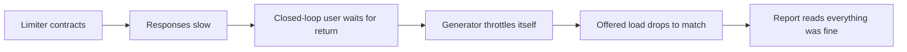

# Adaptive concurrency limits with gradient and Little's law

*how to replace a fixed thread-pool size with a limit that adjusts to current conditions*

A concurrency limit is a cap on how many requests your service is allowed to have running at the same time. ("In-flight" means started but not yet finished, so the limit caps the in-flight count.) A fixed limit is usually a number someone picked from a load test that has not been rerun since the last major version of the service you call. It probably still works on a quiet day. The harder question is what it does when that downstream service (the service your service calls) is mid slow garbage-collection pause (the runtime briefly stopping to reclaim memory) and your p99 is climbing.

By p99 I mean the 99th percentile of response time: the response time that all but the slowest 1 percent of requests stay under. It tells you how bad the slow requests are, not just the typical one.

A static number has no way to notice when the downstream changes: a limit that is correct when the downstream takes 10ms per request becomes wrong the moment that per-request time shifts. (I will call that per-request time the service time: the time the downstream takes to handle one request, not counting any time it spent waiting in line first.) What you want is a limit that floats with conditions without going unstable. Two families of algorithms are worth knowing.

Gradient-based limiters use "gradient" not in the calculus sense but as a measure of how far current latency has drifted from a remembered baseline. When recent latency runs hotter than the baseline, the limiter reads that as congestion and backs off. Little's-law limiters instead calculate a target in-flight count from throughput and service time. (Throughput is the rate of requests completing per second.) The two behave differently when a downstream degrades.

## The fixed-pool failure mode

Imagine a service called `checkout-svc` calling a downstream payment provider, `payclient`, through a fixed semaphore of 200 permits. A semaphore is a counter that admits up to N callers at once and blocks the rest until one leaves; each admission slot is a permit, so here there are 200. On a normal day, payclient is fast and `checkout-svc` runs well below the ceiling, so most permits sit idle.

Now another tenant sharing payclient's hardware starts consuming resources. This is the noisy-neighbor effect: someone else on the same machine slows you down even though your own code did not change. Latency drifts upward, and your in-flight count climbs, because requests arrive at the same rate but each holds its permit longer. Eventually you hit 200 in-flight, the semaphore starts blocking, and observed latency climbs steeply. That latency now includes queue wait, the time a request spends waiting for a free permit before it even gets to run. The alert pages whoever is on call.

The 200-permit limit is behaving as designed: it does not know the downstream service time changed, so it cannot tell "we have capacity to spare" from "we are about to make things worse by piling on more concurrent requests."

```
fixed pool, downstream latency step:

latency (ms)        |                    ___________
                    |                   /
                    |                  /
                    |                 /
                    |                /
                    |    __________/
                    |___/
                    +-------------------- time
                       t0: latency step  t1: queue saturates
                       (downstream slows) (in-flight hits the
                                          pool ceiling, observed
                                          p99 climbs)
```

## Little's law, briefly

Little's law says that for any stable queueing system, the average number of items in the system equals the average arrival rate times the average time each item spends there. "Stable" means the arrival rate does not exceed the rate the system can serve, so the queue does not grow without bound. Written as `L = λW`, it holds regardless of the distribution of arrival and service times. It is an accounting identity, not a model you fit to your traffic.

One narrowing trips up anyone who learned the textbook form. Classically `λ` is the arrival rate and `W` is total time in the system, queue wait included. For a limiter in steady state (requests arriving and completing at the same rate), what arrives also completes, so we use the completion rate (the one we can measure) for `λ`, and the observed round-trip time per request for `W`. Round-trip time, written RTT, is the full request-to-response time for one call.

So if you observe throughput (`λ`) and round-trip time (`W`), the concurrency the system is sustaining is `L = λW`. Set your limit at or near that and you match the offered load, the rate of requests the system is being asked to handle. Set it much higher and you invite queueing inside the downstream. Set it much lower and you cap `λ` below what the system could complete, so completed throughput falls.

The version that shows up in real code adds variance terms. Kingman's G/G/1 approximation does this for general arrival and service-time distributions. "G/G/1" is Kendall notation: the trailing 1 is a single server, the first G a General (arbitrary) distribution of arrivals, the second a General distribution of service times. Its rough form is `Wq ≈ (ρ / (1 - ρ)) * ((c_a² + c_s²) / 2) * τ`, where `Wq` is mean queue wait, `ρ` (rho) is utilization, the fraction of the server's capacity currently in use, `τ` is mean service time, and `c_a`, `c_s` are the coefficients of variation of inter-arrival and service times. Inter-arrival time is the gap between one arrival and the next. A coefficient of variation is the standard deviation divided by the mean, a unitless measure of how bursty the values are.

Two takeaways. The `ρ / (1 - ρ)` factor blows up as you approach saturation, the point where the system is fully busy and the queue grows. And burstier traffic (larger `c_a²`, `c_s²`) makes the wait worse at the same busyness. The simplest case, M/M/1 (Markovian, that is memoryless exponential, arrivals and service at a single server), drops the variance terms. Memoryless means the time you have already waited tells you nothing about how much longer you will wait. In M/M/1 both the mean number in the system and the total time a request spends scale as `1 / (1 - ρ)`. At ρ=0.8 that is `1/(1-0.8) = 5` time units, of which 1 is service and 4 are queue wait. Keep utilization in the 70-80% range depending on how sensitive your service is to slow requests. The slow end of the latency distribution is the tail, and a service that cares about its p99 is tail-sensitive.

## Gradient limiters: ratio against a baseline

The Netflix `concurrency-limits` library popularized a different approach. Rather than computing `L = λW` directly, gradient limiters compare a short-term moving average of latency against a long-term one. A moving average is a running average that keeps updating as new samples arrive. If the short-term average is much higher than the long-term one, you back off; lower or equal, you increase the limit.

A simplified Gradient-style limiter looks roughly like this. The exponential smoothing on the short-term RTT and the `4 * sqrt(limit)` queue allowance are teaching choices, not the Gradient2 defaults; see the discussion after the code. (Exponential smoothing means each new sample nudges the running average by a fixed fraction, so recent samples count more and old ones fade out.)

```python
class GradientLimiter:
    def __init__(self, initial_limit=10, max_limit=200, smoothing=0.2):
        self.limit = initial_limit
        self.max_limit = max_limit
        self.smoothing = smoothing
        self.long_rtt = None   # exponentially smoothed baseline
        self.short_rtt = None  # recent sample window

    def update(self, sample_rtt_ms, in_flight):
        # initialize on first sample
        if self.long_rtt is None:
            self.long_rtt = sample_rtt_ms
            self.short_rtt = sample_rtt_ms
            return self.limit

        # don't learn from idle-period samples: they bias the long-term
        # baseline downward and make the limiter over-eager to shrink
        # the next time real load returns. Skip both the RTT updates
        # and the limit adjustment when we're nowhere near the limit.
        if in_flight * 2 < self.limit:
            return self.limit

        # long-term tracks slowly, recovers from transient spikes
        self.long_rtt = (1 - 0.01) * self.long_rtt + 0.01 * sample_rtt_ms
        # short-term tracks quickly, reflects current conditions
        self.short_rtt = (1 - self.smoothing) * self.short_rtt \
                         + self.smoothing * sample_rtt_ms

        # gradient: <1 means we're slower than baseline (congested)
        gradient = max(0.5, min(1.0, self.long_rtt / self.short_rtt))

        # adjustment: grow by a Gradient-style queue allowance when
        # healthy, shrink proportionally when congested. The original
        # Gradient algorithm scaled this as 4*sqrt(limit); Gradient2
        # defaults to a flat constant (4) that you can override with
        # a function of the current limit.
        queue_size = int(4 * (self.limit ** 0.5))
        new_limit = gradient * self.limit + queue_size

        self.limit = max(1, min(self.max_limit, int(new_limit)))
        return self.limit
```

The ratio is `long_rtt / short_rtt`, baseline over recent: when the downstream slows, `short_rtt` rises faster than the slow-moving `long_rtt`, so a bigger denominator drives the ratio below 1. The clamp to `[0.5, 1.0]` caps the damage: it never shrinks the limit by more than half in one step, and never lets the ratio exceed 1 and inflate the limit. So when healthy the gradient is pinned to 1.0 and growth comes from the additive `queue_size`; only when congested does the `<1` multiplier shrink the base. The `4 * sqrt(limit)` headroom grows sublinearly, so a larger limit gets more probing room without overshooting. The idle guard means we only trust samples taken at least roughly half-loaded.

The toy and the real Gradient2 differ only in where the smoothing sits. Gradient2 compares the most recent raw RTT against a long-term exponentially-weighted baseline (default window about 600 samples) and applies its smoothing factor (default 0.2) to the **limit update itself**, not to the RTT (sources: [Gradient2Limit.java](https://github.com/Netflix/concurrency-limits/blob/main/concurrency-limits-core/src/main/java/com/netflix/concurrency/limits/limit/Gradient2Limit.java), [PR #88](https://github.com/Netflix/concurrency-limits/pull/88)). The toy instead smooths the *RTT* in two windows (0.2 short, 0.01 long). The directional behavior is identical; the dials that matter are the long-window length, the `queueSize` function, and the limit smoothing.

## Little's law in practice: VegasLimit and the BDP analogy

The other family takes Little's law literally. TCP Vegas does this for network congestion: it estimates the bandwidth-delay product (BDP, the data that can be "in the pipe" at once, equal to bandwidth times round-trip delay) from observed RTT and throughput, and keeps in-flight bytes close to BDP. Below BDP you underutilize. Above it the excess packets sit in a queue buffer along the path, adding delay without capacity, so RTT inflates while throughput does not.

A Little's-law concurrency limiter does the same for requests. It observes the no-load RTT (the minimum service time it has ever seen) and the current RTT. Of the current `in_flight`, the fraction doing real work rather than waiting is `rtt_noload / sample_rtt`: if no-load is 10ms and you observe 40ms, a quarter of in-flight is genuine service and three-quarters is queueing. So `in_flight * (rtt_noload / sample_rtt)` is the BDP-equivalent "real" concurrency, and the excess is `in_flight * (1 - rtt_noload / sample_rtt)`:

```python
class VegasLimiter:
    # Note: constant alpha=3, beta=6 keeps the example readable.
    # Netflix's VegasLimit actually scales both as functions of the
    # current limit: alpha = 3 * log10(limit) and beta = 6 * log10(limit)
    # (https://github.com/Netflix/concurrency-limits/blob/main/concurrency-limits-core/src/main/java/com/netflix/concurrency/limits/limit/VegasLimit.java).
    # The original Brakmo/Peterson TCP Vegas paper used alpha=1, beta=3
    # extra in-flight segments (https://en.wikipedia.org/wiki/TCP_Vegas).
    def __init__(self, initial_limit=10, alpha=3, beta=6):
        self.limit = initial_limit
        self.alpha = alpha  # underflow threshold
        self.beta = beta    # overflow threshold
        self.rtt_noload = float('inf')

    def update(self, sample_rtt_ms, in_flight):
        # track the best (lowest) RTT we've ever observed
        self.rtt_noload = min(self.rtt_noload, sample_rtt_ms)

        # how many in-flight requests are "extra" beyond
        # what the no-load latency would account for?
        # = in_flight * (1 - rtt_noload / sample_rtt);
        # in_flight * (rtt_noload / sample_rtt) is the BDP
        # (Little's-law in-flight count) at the current throughput.
        queue_size = in_flight * (1 - self.rtt_noload / sample_rtt_ms)

        if queue_size < self.alpha:
            # underutilized: grow
            self.limit += 1
        elif queue_size > self.beta:
            # queueing detected: shrink
            self.limit -= 1
        # else: hold steady

        self.limit = max(1, self.limit)
        return self.limit
```

(The canonical TCP Vegas estimator scales by the current limit rather than the measured `in_flight`, a small simplification that yields the same quantity.) The `alpha` and `beta` thresholds are in the same units as `queue_size`, counts of excess queued requests, so the dead zone is "between 3 and 6 extra requests sitting in queue": inside it you hold the limit, outside it you take a small step. The tradeoff versus the gradient limiter: VegasLimit reacts to absolute queue size rather than rate of change, so it is more stable but slower to react to a step change.

## Comparison

| Property | Fixed pool | Gradient (Gradient2) | Little's law (Vegas) |
|---|---|---|---|
| Reacts to latency steps | No | Yes, within smoothing window | Yes, but slower |
| Oscillation risk | None | Medium (smoothing-dependent) | Low (dead zone) |
| Needs no-load RTT estimate | No | No | Yes (uses observed min) |
| Tuning surface | One number | Smoothing + queue size formula | Alpha, beta thresholds |
| Behavior on cold start | Whatever you set | Grows from initial limit | Grows from initial limit |
| Behavior under sustained overload | Saturates, queues internally | Contracts | Contracts |
| What it optimizes for | Nothing; it is a guess | Keeping latency near baseline | Keeping queue depth bounded |

Cold start, in the table, means the behavior right after the service starts up, before it has any traffic history to learn from. With typical tunings the gradient version is more aggressive and settles at a higher steady-state limit, so more throughput on a good day; the Vegas version holds a tighter limit, so better p99 on a bad day. That is a tuning tendency, not a law. Choose based on which failure you care about more, throughput loss or tail latency.

## The payment-client incident (illustrative)

Back to the `checkout-svc` / `payclient` sketch. Imagine replacing the fixed 200-permit pool with a Gradient2 limiter, keyed per downstream endpoint so a degradation in `payclient.charges` does not shrink `payclient.refunds`. You would expect the steady-state limit to settle near the actual in-flight count, say around 50 permits, rather than parking at the unused 200, where the extra headroom only turned into queue depth when something went wrong.

Under a sustained downstream latency step, the limiter's short-term RTT diverges from its long-term baseline, the gradient ratio drops below 1.0, and the limit contracts over the next tens of seconds. The semaphore starts refusing admission at the edge. Refusing requests on purpose to protect the system is load-shedding. Tail latency stays close to baseline because the limiter throttles arrivals before the downstream queues internally. The damage is bounded, where the fixed pool would have become the queue itself and taken minutes to drain.

A note on testing this: open-loop versus closed-loop load generation. In a closed-loop test each virtual user sends its next request only after the previous one returns, so arrivals are coupled to completions. In an open-loop test, arrivals follow a schedule (a constant rate, or Poisson, meaning random independent arrivals at a given average rate) regardless of when prior requests finish. That closed-loop coupling is the same dynamic the limiter introduces, which is why it hides the limiter's behavior:



The dropped load is a form of coordinated omission: the test stops sending new requests while it waits for slow ones to return, so it never records how slow the system really got (see Schroeder, Wierman and Harchol-Balter, "Open Versus Closed: A Cautionary Tale," NSDI 2006). Prefer open-loop, or a constant-arrival-rate executor (k6, Vegeta, wrk2), to see how the limiter behaves under sustained overload.

```
gradient limiter, same downstream latency step:

limit (permits)
                  |  ----  (fixed pool ceiling, unused)
                  |
                  |  ___
                  |     \_____           _______
                  |           \         /
                  |            \_______/
                  +------------------------------- time
                                t0: step    t1: recovery
                                            (limit grows back)

observed p99
                  |
                  |        __
                  |       /  \____
                  |      /        \___
                  |  ___/             \___
                  |                       \___
                  +------------------------------- time
                       t0          t1
```

## Where the gradient approach falls down

Three failure modes are worth knowing.

First, if your downstream is consistently slow, the long-term RTT catches up to the short-term RTT and the gradient ratio drifts back to 1.0, so the limiter stops treating the slow latency as a problem. That is fine if the new slow latency is the normal you should be sized for; it is a problem if you want the old baseline as your aspiration. The fix is usually to clamp the long-term RTT or use a slowly-decaying minimum rather than an exponentially-weighted average.

Second, the limiter assumes the latency it observes is mostly downstream. If it includes time waiting for the limiter's own semaphore, you have a positive feedback loop: more queue wait inflates measured RTT, the gradient drops, the limit shrinks, queue wait gets worse. The fix is to measure only the downstream call time, not the time from when the request entered the limiter.

Third, very low traffic breaks both gradient and Vegas. At 2 requests per second, your short-term window is dominated by the variance of individual samples: set the smoothing too high and you react to single-sample noise, too low and you miss real degradations. The library implementations usually special-case this with a minimum sample count before adjusting; if you write your own, do too.

## What to actually do

If you are running a fixed thread pool or semaphore against a remote service with any latency variance, replace it. Either family will be better than what you have. Start with whichever your platform's standard library supports, tune the smoothing or thresholds against a load test that includes a synthetic latency step, and add a metric on the current limit so you can see it move.

Once the limit is adaptive, the exact number matters less; the system corrects itself when conditions change rather than waiting for someone to rerun the load test.
