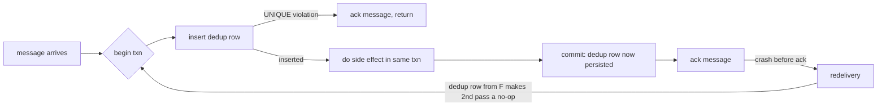

# The exactly-once myth and what idempotency actually buys you

*why message queues cannot deliver a message exactly once, and how your database makes that not matter*

> Prerequisite: this post assumes you know how an idempotency key works at the HTTP boundary. An idempotency key is a unique string the caller attaches to a request so the server can recognize a retry and avoid doing the work twice. (Idempotent means safe to run more than once without changing the outcome.) The companion post "Idempotency keys for deploy and provisioning endpoints" covers that ground.

Some vocabulary. A *broker* is the queue or messaging server in the middle: a *producer* puts a message in (`enqueue`), the broker stores it, a *consumer* reads it out (`dequeue`). A *consumer group* is a set of consumers that split one queue's work, so each message goes to one member. When a consumer finishes a message it sends an *ack* (acknowledge): a "done, don't send it again" signal. Until the broker gets the ack, it assumes the message was not processed and sends it again.

A *side effect* is any change a consumer makes to the outside world: a row written to a database, a card charged, an email sent. Three delivery guarantees the post turns on. *At-least-once*: every message arrives one or more times, duplicates possible, never lost. *At-most-once*: zero or one times, no duplicates but a message can be lost. *Exactly-once*: precisely one time. The first two are achievable; the third, as a property of the network, is not.

Every few months somebody links a blog post titled "exactly-once delivery with $BROKER" and asks whether we should switch. The property is real, but it stops at the broker's own edge. When a broker calls itself exactly-once, it usually means it will not deliver the same message twice to the same consumer group within one session, as long as no consumer crashes, the network never drops, no rebalance happens, and nothing restarts. A *rebalance* is the reshuffle the broker does when a consumer joins the group, leaves it, or stops *heartbeating* (sending its periodic "still alive" message); miss enough and the broker assumes it died. Crashes, deploys, and slow workers all trigger rebalances, so those conditions are routine in production. The real guarantee is the weak one: the consumer sees each message at least once, possibly several times, and your job is to make seeing it more than once identical to seeing it once.

That property has a name: *effectively-once*, the user-visible effect happening once no matter how many times the message arrives. I hit this on a billing pipeline I'll call `chargehook`.

## Where the broker's contract ends

Here is the path a webhook takes from a payment processor to the ledger. A *webhook* is an HTTP callback: instead of you polling, the processor sends a request when something happens. A *ledger* is the financial record of money movements, one row per charge.

```
[processor] -> HTTPS -> [edge LB] -> [http handler] -> [queue] -> [worker] -> [postgres]
              (1)                   (2)              (3)         (4)         (5)
```

The `edge LB` is the load balancer at the front of your system, spreading incoming requests across your handler processes. The `worker` is the consumer process that reads the queue.

Every arrow is a chance for a duplicate. The processor retries (1) when your handler takes 4.9 seconds to answer something it had already queued. The load balancer retries (2) to a sibling pod when the first pod is slow (a pod is one running copy of your service under Kubernetes). That slowness is often a garbage-collection pause that freezes the whole program, so a frozen pod and a dead pod look identical from outside. The handler enqueues (3) and acks. The queue redelivers (4) when the worker crashed between the side effect and the ack. Or the worker writes (5) to Postgres and commits, but its connection to the broker drops before the ack arrives, and the broker redelivers finished work.

The broker's "exactly-once" only covers arrow (4). It does nothing for (1), (2), (3), or (5), so the system as a whole is at-least-once. (The one exception is enrolling your own work in the broker's transaction, below.)

## The bug, and what it taught me

`chargehook` receives payment-success events and inserts a row into a `ledger` table for each charge. The early version, simplified:

```python
def handle(event):
    if seen_event(event.id):              # check dedup table
        return 200

    insert_ledger(event)                  # side effect
    mark_seen(event.id)                   # write dedup row
    return 200
```

It ran fine for six months. Then we had a Postgres failover, and during the window the processor retried a batch of in-flight events. Some customers got charged twice, a few three.

A database failover is when the primary database dies and a standby (a copy kept in sync) is promoted in its place. It cuts every open connection to the old primary at once, so an in-flight handler drops, and the retry re-enters `handle()` for an event whose first attempt had committed the ledger insert but not yet written the dedup mark.

A *transaction* is a group of database writes the database treats as all-or-nothing: you *commit* to make them all permanent, or *roll back* to undo them all, with nothing in between ever visible. Here `insert_ledger` and `mark_seen` ran in two separate transactions, each on its own *pooled connection* (one borrowed from a pool of pre-opened connections the app reuses instead of opening a new one per request). The sequence that fired:

```
T1: handle(evt-42) -> seen? no -> insert_ledger(evt-42) [committed]
T1: ... primary fails over, connection dies before mark_seen runs ...
T2: handle(evt-42) retry -> seen? no -> insert_ledger(evt-42) [committed again]
T2: mark_seen(evt-42) [committed]
```

Two ledger rows. One dedup row. The dedup table gave the wrong answer because it was not written inside the same transaction as the thing it guards. The fix: when the side effect is itself a database write, the dedup row goes in the same transaction, against the same database, with a uniqueness constraint that rejects the second attempt outright.

```python
def handle(event):
    with conn.transaction():
        cur = conn.execute(
            "INSERT INTO processed_events (event_id, processed_at) "
            "VALUES (%s, now()) ON CONFLICT (event_id) DO NOTHING",
            (event.id,),
        )
        if cur.rowcount == 0:
            return 200  # already processed, ack and move on

        conn.execute(
            "INSERT INTO ledger (event_id, account, cents) "
            "VALUES (%s, %s, %s)",
            (event.id, event.account, event.cents),
        )
    return 200
```

A `UNIQUE` constraint (sometimes built as a `UNIQUE` index) tells the database no two rows may share the same value in a column. Here it is `event_id`, so the database refuses to store the same event twice. `ON CONFLICT (event_id) DO NOTHING` is a Postgres clause: if this insert would collide with an existing row on that unique value, skip it quietly instead of failing, and `rowcount` comes back as 0, telling the code the event was already handled.

Catching the duplicate as an error instead is slower on the hot path. Any error aborts the entire Postgres transaction, so catching a duplicate and keeping the work already done means wrapping each insert in a `SAVEPOINT` (a nested, separately-undoable section inside a transaction), and past 64 subtransactions per backend that gets expensive. `ON CONFLICT DO NOTHING` avoids that: the server notices the conflict internally, never raises the duplicate-key error (error 23505), and sets `rowcount` to 0.

Either way, the two writes commit or roll back together as one *atomic* unit: all of it happens or none of it does. Crash after the commit but before the ack, and the retry hits the conflict and returns 200 without double-charging. The `UNIQUE` index is the *serialization point*: the single place concurrent attempts are forced into an order. Two competing inserts reach for the same index key, the database takes a short *index lock* and lets exactly one win, and because both writes live in one transaction, that lock gates the ledger row too.

## The rule, stated plainly

The dedup key has to live next to the side effect, inside the same all-or-nothing unit. What that means depends on the side effect itself.

A Postgres insert: the dedup row goes in Postgres, in the same transaction, as above.

An external API call: you cannot put the dedup row inside the call's transaction, because it is not your database, so the dedup record has to be something that endpoint respects. Stripe's `Idempotency-Key` is exactly this: you send a unique key with the charge request, and Stripe remembers it for 24 hours and refuses to run the same charge twice ([docs.stripe.com/api/idempotent_requests](https://docs.stripe.com/api/idempotent_requests)). Stripe holds the key, not you.

Sending an email: you cannot get exactly-once at all, because SMTP (Simple Mail Transfer Protocol, which moves email between servers) is itself at-least-once and Gmail gives you no way to flag a duplicate. The best you can do is record "sent" in your own database so you don't re-enqueue it.

Per side effect, where the key lives and what enforces it:

| Side effect | Where the dedup key lives | What enforces it |
|---|---|---|
| Postgres row insert | Same Postgres txn, `UNIQUE` index | The `UNIQUE` index |
| Stripe charge | `Idempotency-Key` header (Stripe holds it 24h) | Stripe server |
| S3 object write | Conditional PUT with `If-None-Match: *` | S3 server (rejects second PUT) |
| Kafka produce | `enable.idempotence=true` | Broker, per-partition |
| Outbound email | "Sent" flag in your DB, before SMTP call | You, optimistically |
| Push notification | Same as email, plus client dedup by msg-id | You + client SDK |

`enable.idempotence=true` makes the broker reject duplicate writes from a producer's retries, per *partition*: a Kafka topic is split into partitions, each an ordered log of messages, and the dedup is within one partition, not across the whole topic.

A plain S3 (Amazon's object storage) PUT is *last-writer-wins*: if two uploads of the same key race, both succeed and whichever finishes last silently overwrites the other. To stop that, use the conditional write S3 added in 2024: `If-None-Match: *` tells S3 to perform the PUT only if no object with that key exists yet. The second PUT then fails with `412 Precondition Failed`. This is atomic create-if-not-exists, not content-based dedup: two keys holding identical bytes still produce two objects.

The email and push rows have no end-to-end guarantee, only "we tried not to send twice." Treat such flows as at-least-once and design the template so a duplicate does no harm. "Your receipt for order #1234" repeats fine; "You have been charged $500" does not.

## Why brokers cannot give you the guarantee

No broker can give you end-to-end exactly-once, because of the two generals problem: two parties coordinating over a channel that may drop messages can never become certain they agree, since the last confirming message might be the one lost. The consumer is in that bind: it has to (a) perform the side effect and (b) tell the broker the message was processed, two operations against two systems, either order leaving a gap.

- Ack first, then side effect: crash in the middle and the side effect never happens. Message lost.
- Side effect first, then ack: crash in the middle and the broker redelivers, so the side effect happens again. Duplicate.

You could try to collapse the two into one with a *distributed transaction* spanning both systems. The standard machinery is two-phase commit (XA): a *coordinator* asks every system to *prepare* (promise it can commit if asked), then tells them all to commit. If the coordinator dies after the prepare phase, every system is left with an *in-doubt* transaction holding locks until the coordinator returns. That, plus the coordinator being a single point of failure, is why almost nobody runs XA across a broker and a database. So: side effect first, then ack, and make the side effect idempotent. That gives you at-least-once delivery with effectively-once results.



The loop terminates because the dedup row committed at `F` already exists when the message is redelivered, so the second pass takes the `D` branch and acks without redoing the work.

## Replay storms

Idempotent consumers give you replay almost for free: re-feed a range of messages and the dedup table absorbs the ones already landed. The cost is that a million-event replay where 99% are duplicates still costs a million round trips and a WAL write each time, since even an insert that does nothing writes to it. WAL is the write-ahead log Postgres records changes to before touching a data file, so a crash can be recovered by replaying it.

So rate-limit the replay tool so it does not starve live traffic, and for a high-volume stream put a *negative cache* in front of Postgres so most lookups skip the database. A Bloom filter works: a compact structure whose errors only go one way, so it may say "maybe seen" for something new but never "not seen" for something it has. A "maybe seen" answer falls through to Postgres, where `ON CONFLICT` is still the real guard. The cache is only an optimization, never the authority; depend on it for correctness and you have rebuilt the original bug.

## What about Kafka's "exactly-once semantics"?

Kafka's exactly-once semantics (EOS) is real, but narrower than the name suggests. An *offset* is a consumer's bookmark: the position of the last record it processed in a partition. Committing it tells Kafka "do not redeliver anything before this point."

EOS gives you exactly-once for one shape of work: consume from Kafka, transform, and produce back to Kafka, with the input offsets committed inside the same transaction via `sendOffsetsToTransaction`. This closes the gap because offsets are themselves stored in a Kafka topic (`__consumer_offsets`): the offset commit and the output write are both changes to the same cluster, committed together, so a crash never leaves the offset moved but the output missing.

So the whole loop must stay inside Kafka, and downstream consumers must set `isolation.level=read_committed` to skip records from aborted transactions. The all-or-nothing unit is "Kafka offsets plus Kafka output records," and only changes Kafka owns can join it. The moment your consumer writes to Postgres, calls an external API, or sends an email, that write is outside the Kafka transaction, so a crash can leave it committed while the offset rolls back, back to at-least-once for that hop.

One way to bridge Kafka to your own database is the *transactional-outbox* pattern. Instead of writing to the database and publishing to the broker as two steps (the same gap), you write the outbound message into an `outbox` table in the same transaction as your business write. A separate *relay* process reads new outbox rows and publishes them at-least-once. The write and the intent-to-publish share one commit, so they can never disagree, and downstream consumers dedup on the message id.

So EOS is useful for stream-processing setups: tools like Kafka Streams or Flink reading from a Kafka source and writing to a Kafka *sink* (the output destination). It is mostly useless for "consume from Kafka and update my database without duplicates."

## The short version

Stop arguing about which broker gives you exactly-once. Pick one for other reasons (throughput, retention, operational familiarity) and assume at-least-once delivery. Then, for every consumer:

1. Identify the side effect.
2. Identify the database that owns it.
3. Put a dedup row in that database, in the same transaction as the side effect, with a unique constraint that rejects duplicates.
4. Ack the broker after the transaction commits.
5. Tolerate replay; keep the dedup table cheap to query at scale.

A Postgres failover, a redelivery storm, or a load balancer retrying a timed-out request will eventually arrive, and a dedup table in the wrong place will not protect you. The duplicate slips through the gap between two systems that each did their part but could not coordinate the handoff. Put both writes under one commit and there is no gap.
