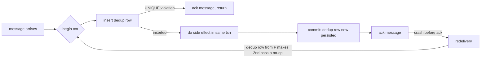

# The exactly-once myth and what idempotency actually buys you

*why message queues cannot deliver a message exactly once, and how your database makes that not matter*

> Prerequisite: this post assumes you know how an idempotency key works at the HTTP boundary. An idempotency key is a unique string the caller attaches to a request so the server can recognize a retry and avoid doing the work twice. (Idempotent means safe to run more than once without changing the outcome.) The companion post "Idempotency keys for deploy and provisioning endpoints" covers that ground. Here we are downstream of the API, in the asynchronous world: queues, the workers that read from them, the queue server itself, and what happens when the same message gets delivered more than once.

First, some vocabulary. A *broker* is the queue or messaging server in the middle: producers hand it messages, it stores them, consumers read them out. A *producer* puts a message in (`enqueue` means add one); a *consumer* reads one out (`dequeue` means take one off). A *consumer group* is a set of consumer processes that split one queue's work, so each message goes to one member. When a consumer finishes a message it sends an *ack* (short for acknowledge): a "done with this one, don't send it again" signal. Until the broker gets the ack, it assumes the message might not have been processed and is free to send it again.

A *side effect* is any change a consumer makes to the outside world: a row written to a database, a card charged, an email sent. Side effects are what we care about not duplicating. Running the same code twice is harmless on its own; the problem is when it charges someone twice.

Three delivery guarantees the post turns on. *At-least-once*: every message arrives one or more times, duplicates possible, never lost. *At-most-once*: zero or one times, no duplicates but a message can be lost. *Exactly-once*: precisely one time. The first two are achievable; the third, as a property of the network itself, is not.

Every few months somebody links a blog post titled "exactly-once delivery with $BROKER" and asks whether we should switch. The property the broker advertises is real, but it stops at the broker's own edge. The moment your consumer pulls a message off the queue and acts on it, you are back to at-least-once, and the only way to make duplicates harmless is to make the side effect itself replay-safe.

When a broker calls itself exactly-once, it usually means it will not deliver the same message twice to the same consumer group within one session, as long as no consumer crashes, no part of the network drops out, no rebalance happens, and no operator restarts anything. A *rebalance* is the reshuffle the broker does when a consumer joins the group, leaves it, or stops sending its keep-alive signal (each consumer is expected to keep *heartbeating*, sending a periodic "still alive" message; miss enough and the broker assumes it died). Those conditions are exactly the ones that happen in production, because crashes, deploys, and slow workers all trigger rebalances. So the real end-to-end guarantee is the weak one: the consumer sees each message at least once, possibly several times, and your job is to make the effect of seeing it more than once identical to seeing it once.

That property has a name: *effectively-once*. Not a standard term, but useful: the user-visible effect happens once no matter how many times the message arrives. It is a property of your consumer plus the database it writes to, not of the broker or network. I hit this on a billing pipeline I will call `chargehook`.

## Where the broker's contract ends

Here is the path a webhook takes from a payment processor to the ledger. A *webhook* is an HTTP callback: instead of you polling for updates, the processor sends you an HTTP request when something happens. A *ledger* is the financial record of money movements, one row per charge.

```
[processor] -> HTTPS -> [edge LB] -> [http handler] -> [queue] -> [worker] -> [postgres]
              (1)                   (2)              (3)         (4)         (5)
```

The `edge LB` is the edge load balancer (LB): the server at the front of your system that spreads incoming requests across your handler processes. The `worker` is the consumer process that reads the queue. Postgres (PostgreSQL) is an open-source relational database.

The processor will retry (1) until it gets a response in the 200 range. (HTTP groups its numeric status codes into families: 2xx means success, 4xx means the caller did something wrong, 5xx means the server failed; a plain 200 is the usual success.) The load balancer might retry (2) if the handler is slow. The handler enqueues (3) and acks the webhook. The queue delivers (4) to a worker. The worker writes (5) to Postgres.

Every arrow is a chance for a duplicate. The processor retries because your handler took 4.9 seconds to answer even though it had already queued the message. The load balancer retries to a sibling pod (a pod is one running copy of your service under Kubernetes; sibling pods are the other copies alongside it) because the first pod is paused. The pause is a garbage-collection stop-the-world pause: a moment when the runtime freezes the whole program to reclaim unused memory, and from outside a frozen pod and a dead pod look identical. The queue redelivers because the worker crashed between doing the side effect and sending the ack. Or Postgres commits the write, but the worker's TCP connection (the network connection it talks to the broker over) drops before the ack gets through, so the broker redelivers and the worker redoes finished work.

The broker's "exactly-once" only covers arrow (4), and only under those conditions. It does nothing for (1), (2), (3), or (5), so the system as a whole is at-least-once. No broker setting fixes this, because the duplication is not happening inside the broker. (The one exception is enrolling your own work in the broker's own transaction, covered below.)

## The bug, and what it taught me

`chargehook` is a webhook handler that receives payment-success events and inserts a row into a `ledger` table for each charge. The early version, simplified:

```python
def handle(event):
    if seen_event(event.id):              # check dedup table
        return 200

    insert_ledger(event)                  # side effect
    mark_seen(event.id)                   # write dedup row
    return 200
```

It passed code review and unit tests and ran fine for six months. Then we had a Postgres failover, and during the failover window the processor retried a batch of in-flight events. Some customers got charged twice; a few three times. About forty hours of customer support followed before we understood what idempotent means.

A database failover is when the primary database dies and a standby is promoted in its place. The *primary* takes all the writes; a *standby* is a copy kept in sync, ready to take over. A failover cuts every open connection to the old primary at once, so an in-flight handler sees its connection drop. To the upstream processor that looks like a timeout, so it retries.

The retry re-enters `handle()` for an event whose first attempt had already committed the ledger insert but had not yet written the dedup mark. A *transaction* is a group of database writes the database treats as all-or-nothing: you *commit* to make them all permanent, or *roll back* to undo them all, with nothing in between ever visible. The trouble: `insert_ledger` and `mark_seen` ran in two separate transactions, each on its own *pooled connection* (a connection borrowed from a connection pool, a set of pre-opened database connections the app reuses to avoid opening a new one per request). The connection died in the gap between those two commits. The sequence that fired:

```
T1: handle(evt-42) -> seen? no -> insert_ledger(evt-42) [committed]
T1: ... primary fails over, connection dies before mark_seen runs ...
T2: handle(evt-42) retry -> seen? no -> insert_ledger(evt-42) [committed again]
T2: mark_seen(evt-42) [committed]
```

Two ledger rows. One dedup row. The dedup table thought the event was processed once; the customer's bank statement showed twice. The dedup table gave the wrong answer because it was not written inside the same transaction as the thing it was supposed to guard.

When the side effect is itself a write to the database, the dedup row has to be written in the same transaction as that side effect, against the same database, with a uniqueness constraint that rejects the second attempt outright. (Side effects that are not database writes, like charging a card or sending an email, cannot be put inside a database transaction at all; they need the mechanisms covered next.)

```python
def handle(event):
    with conn.transaction():
        cur = conn.execute(
            "INSERT INTO processed_events (event_id, processed_at) "
            "VALUES (%s, now()) ON CONFLICT (event_id) DO NOTHING",
            (event.id,),
        )
        if cur.rowcount == 0:
            return 200  # already processed, ack and move on

        conn.execute(
            "INSERT INTO ledger (event_id, account, cents) "
            "VALUES (%s, %s, %s)",
            (event.id, event.account, event.cents),
        )
    return 200
```

A `UNIQUE` constraint (sometimes built as a `UNIQUE` index) tells the database no two rows may share the same value in a column. Here that column is `event_id`, so the database refuses to store the same event twice. `ON CONFLICT (event_id) DO NOTHING` is a Postgres clause: if this insert would collide with an existing row on that unique value, skip it quietly instead of failing, and `rowcount` comes back as 0, which is how the code knows the event was already handled.

Catching the duplicate as an error instead is slower on the hot path (the common, high-frequency code path most requests take). In Postgres any error aborts the entire transaction, so to catch a duplicate and keep the work already done you would wrap each insert in a `SAVEPOINT` (which starts a subtransaction: a nested, separately-undoable section inside a transaction) on every attempt, and past 64 subtransactions per backend that gets expensive. `ON CONFLICT DO NOTHING` avoids that: the server notices the conflict internally, never raises the duplicate-key error (Postgres calls it error 23505), and just sets `rowcount` to 0.

Either way, the two writes commit or roll back together, as one all-or-nothing unit (this is what *atomic* means: all of it happens or none of it does). Crash before the commit and neither write lands; the retry succeeds. Crash after the commit but before the ack and the retry hits the conflict and returns 200 without double-charging. The dedup table is now the authority, not a hint, because the `UNIQUE` index is the *serialization point*: the single place concurrent attempts are forced into an order. Two competing inserts reach for the same index key, the database takes a short *index lock* on it and lets exactly one win, and because both writes live in one transaction, that lock gates the ledger row too.

## The rule, stated plainly

The dedup key has to live next to the side effect, inside the same all-or-nothing unit. What "same unit" means depends on the side effect.

A Postgres insert: the dedup row goes in Postgres, in the same transaction, as above.

An external API call: you cannot put the dedup row inside the call's transaction, because it is not your database, so the dedup record has to be something that endpoint itself respects. Stripe's `Idempotency-Key` is exactly this: you send a unique key with the charge request, and Stripe remembers it for 24 hours and refuses to run the same charge twice ([docs.stripe.com/api/idempotent_requests](https://docs.stripe.com/api/idempotent_requests)). Stripe, not you, holds the key.

Sending an email: you cannot get exactly-once at all, because SMTP (Simple Mail Transfer Protocol, which moves email between servers) is itself at-least-once and Gmail gives you no way to flag a duplicate. The best you can do is record "sent" in your own database so you do not re-enqueue it.

The table below lists, per side effect, where the dedup key lives and what enforces it. For the Postgres row that mechanism is the shared `UNIQUE` index: two concurrent inserts of the same key reach for the same index key and only one can win.

| Side effect | Where the dedup key lives | What enforces it |
|---|---|---|
| Postgres row insert | Same Postgres txn, `UNIQUE` index | The `UNIQUE` index |
| Stripe charge | `Idempotency-Key` header (Stripe holds it 24h) | Stripe server |
| S3 object write | Conditional PUT with `If-None-Match: *` | S3 server (rejects second PUT) |
| Kafka produce | `enable.idempotence=true` | Broker, per-partition |
| Outbound email | "Sent" flag in your DB, before SMTP call | You, optimistically |
| Push notification | Same as email, plus client-side dedup by msg-id | You + client SDK |

On the Kafka row: `enable.idempotence=true` makes the broker reject duplicate writes from a producer's retries. This works per *partition*: a Kafka topic is split into partitions, each an ordered log of messages, and the dedup is within one partition, not across the whole topic.

On S3 (Amazon's object storage service): a plain PUT (an HTTP upload of an object) is *last-writer-wins*, so if two uploads of the same key race, both succeed and whichever finishes last silently overwrites the other. To stop that, use the conditional write S3 added in 2024: `If-None-Match: *`, a header that tells S3 to perform the PUT only if no object with that key exists yet. The second PUT then fails with `412 Precondition Failed` (412 is the HTTP status for "a condition you required was not met"). This gives an atomic create-if-not-exists, not content-based dedup: two different keys holding identical bytes still produce two objects.

The email and push rows have no end-to-end guarantee, only "we tried not to send twice." If a flow sends email, treat it as at-least-once and design the template so a duplicate does no harm. "Your receipt for order #1234" repeats fine; "You have been charged $500" does not.

## Why brokers cannot give you the guarantee

No broker can give you end-to-end exactly-once, because of the two generals problem: two parties who can only coordinate over a channel that may drop messages can never become certain they agree, since the last confirming message might be the one that was lost, and neither side can tell. The consumer and broker are in that bind. The consumer has to (a) perform the side effect and (b) tell the broker the message was processed: two operations against two systems, and whichever order you pick, a crash leaves a gap:

- Ack first, then side effect: crash in the middle and the side effect never happens. Message lost.
- Side effect first, then ack: crash in the middle and the broker redelivers, so the side effect happens again. Duplicate.

You could try to collapse the two into one with a *distributed transaction*, a transaction spanning two separate systems. The standard machinery is two-phase commit (also called XA): a *coordinator* first asks every system to *prepare* (promise it can commit if asked), then once all have promised, tells them to commit. The problem is when the coordinator dies after the prepare phase: every system is left with an *in-doubt* transaction, holding locks and unable to decide whether to commit or roll back until the coordinator returns. That, plus the coordinator being a single point of failure, is why almost nobody runs XA across a broker and a database in production. The practical answer is the one we have been building toward: side effect first, then ack, and make the side effect idempotent. That gives you at-least-once delivery with effectively-once results.



The loop terminates because the dedup row committed at `F` already exists when the message is redelivered, so the second pass takes the `D` branch and acks without redoing the work. Redelivery is fine here: the system tolerates any number of crashes between commit and ack without the customer ever seeing a duplicate.

## Replay storms

Idempotent consumers give you replay almost for free: re-feed a range of messages and the dedup table absorbs the ones that already landed. The cost is that a million-event replay where 99% are duplicates still costs a million round trips (a round trip is one request across the network plus the response back) and a WAL write each time. WAL is the write-ahead log: before Postgres changes a data file it records the change in a sequential log, so a crash can be recovered by replaying it. Even an insert that does nothing writes to it.

So rate-limit the replay tool so it does not starve live traffic, and for a high-volume stream put a *negative cache* in front of Postgres: a small fast store that remembers "this one is definitely new" so most lookups skip the database. A Bloom filter works: a compact structure whose errors only go one way, so it may say "maybe seen" for something new but never "not seen" for something it has. A "maybe seen" answer falls through to Postgres, where `ON CONFLICT` is still the real guard. The cache is only an optimization, never the authority. The moment correctness depends on it, you have rebuilt the original bug.

## What about Kafka's "exactly-once semantics"?

Kafka's exactly-once semantics (EOS) is real, but covers a narrower case than the name suggests. An *offset* is a consumer's bookmark: the position of the last record it processed in a partition. Committing an offset tells Kafka "do not redeliver anything before this point."

EOS gives you exactly-once for one shape of work: consume from Kafka, transform, and produce back to Kafka, with the input offsets committed inside the same transaction via the `sendOffsetsToTransaction` call (it records the consumed offsets as part of the producing transaction). This closes the gap because offsets are themselves stored in a Kafka topic (`__consumer_offsets`): the offset commit and the output write are both changes to the same cluster, run through the same *transaction coordinator* (the Kafka component that drives the commit), so Kafka commits them together and a crash never leaves the offset moved but the output missing. Downstream consumers of the output topic must set `isolation.level=read_committed`, which tells them to skip records from transactions that were aborted (started but rolled back). That setting is required for EOS.

This is why the whole loop has to stay inside Kafka: the all-or-nothing unit is "Kafka offsets plus Kafka output records," and only changes Kafka owns can join it. The moment your consumer writes to Postgres, calls an external API, or sends an email, that write is outside the Kafka transaction, so a crash can leave it committed while the offset rolls back, and you are back to at-least-once for that hop. The fix is to make the external destination idempotent, as before.

One way to bridge Kafka to your own database is the *transactional-outbox* pattern. Instead of writing to the database and publishing to the broker as two steps (the same two-systems gap), you write the outbound message into an `outbox` table in the same transaction as your business write. A separate process, the *relay*, reads new outbox rows and publishes them at-least-once. The business write and the intent-to-publish can never disagree, because they share one commit, and downstream consumers dedup on the message id.

So EOS is useful for stream-processing setups: tools like Kafka Streams or Flink (stream-processing frameworks) reading from a Kafka source and writing to a Kafka *sink* (the destination a stream writes its output to). It is mostly useless for "consume from Kafka and update my application database without duplicates." For that you still need an idempotent consumer with a dedup table in Postgres, exactly as above.

## The short version

Stop arguing about which broker gives you exactly-once. Pick the broker for other reasons (throughput, which is how many messages it handles per second; retention, which is how long it keeps messages before deleting them; operational familiarity) and assume at-least-once delivery. Then, for every consumer:

1. Identify the side effect.
2. Identify the database that owns the side effect.
3. Put a dedup row in that same database, in the same transaction as the side effect, with a unique constraint that rejects duplicates.
4. Ack the broker after the transaction commits.
5. Tolerate replay; design the dedup table to be cheap to query at scale.

Do this and you will not have to explain to a customer why you charged them twice. Skip it, and a Postgres failover, a redelivery storm, or a load balancer retrying a timed-out request will eventually arrive, and a dedup table in the wrong place will not protect you. The duplicate slips through the gap between two systems that each did their part but could not coordinate the handoff. Put both writes under one commit and there is no gap.
