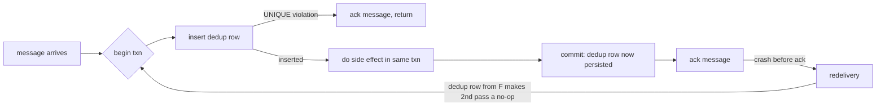

# The exactly-once myth and what idempotency actually buys you

*brokers promise once; networks deliver many; your database decides what counts*

> Prerequisite: this post assumes you know how an idempotency key works at the HTTP boundary (UNIQUE constraint, stored response, rejecting the same key reused with a different request body). The companion post "Idempotency keys for deploy and provisioning endpoints" covers that ground. Here we are downstream of the API: queues, consumers, brokers, redelivery, and what "exactly-once" means once a message has crossed into asynchronous territory.

Three terms first, because the essay turns on them. *At-least-once*: every message arrives one or more times, duplicates possible, loss never. *At-most-once*: zero or one times, no duplicates but loss possible. *Exactly-once*: precisely one time. The first two are achievable; the third, as a property of the wire, is not.

Every few months somebody links a blog post titled "exactly-once delivery with $BROKER" and asks whether we should switch. The broker is not lying, exactly, but it is selling a property that ends at its own boundary. The moment your consumer pulls a message off the queue and tries to do something with it, you are back in at-least-once land, and the only way out is to make the side effect itself replay-safe.

Exactly-once-as-a-feature usually means "the broker will not deliver the same message twice to the same consumer group within a session, assuming no consumer crashes, no network partitions, no rebalances, and no operator restarts." A *rebalance* is the reshuffle the broker does when a member joins, leaves, or stops heartbeating, and those four conditions are precisely the ones that break in production, because crashes, deploys, and slow workers all trigger rebalances. The real end-to-end guarantee: the consumer sees each message *at least* once, possibly many times, and your job is to make the *effect* of seeing it more than once identical to seeing it exactly once.

What you actually want is *effectively-once*: a non-standard but useful name for the property that the user-visible effect happens once, however many times the message arrives. It is a property of the *consumer plus the destination database*, not of the transport. We learned this the hard way on a billing pipeline I will call `chargehook`.

## Where the broker's contract ends

Picture the path a webhook takes from a payment processor to the ledger:

```
[processor] -> HTTPS -> [edge LB] -> [http handler] -> [queue] -> [worker] -> [postgres]
              (1)                   (2)              (3)         (4)         (5)
```

The processor will retry (1) until it gets a 2xx. The load balancer might retry (2) on a timeout. Your HTTP handler enqueues (3) the message and acks the webhook. The queue delivers (4) to a worker. The worker writes (5) to Postgres.

Every arrow is a duplication opportunity. The processor retries because your handler timed out at 4.9 seconds even though the message was already enqueued. The LB retries to a sibling pod because the first one is in a garbage-collection stop-the-world pause that looks identical to a dead pod. The queue redelivers because the worker crashed between the side effect and the ack. Or Postgres commits, but the worker's TCP connection drops before the ack flushes, so the broker thinks the message was never acknowledged, redelivers, and the worker re-runs work it already finished.

The broker's "exactly-once" only addresses arrow (4), under specific conditions. It does not address (1), (2), (3), or (5), so the system as a whole is at-least-once. No broker setting fixes this on its own, because the duplication is not in the broker. (The one exception is enrolling your application in the broker's own transaction, covered below.)

## The bug that taught us this

`chargehook` is a webhook handler that receives payment-success events and inserts a row into a `ledger` table for the charge. Early version, simplified:

```python
def handle(event):
    if seen_event(event.id):              # check dedup table
        return 200

    insert_ledger(event)                  # side effect
    mark_seen(event.id)                   # write dedup row
    return 200
```

It passed code review. It passed unit tests. It ran fine for six months. Then we had a Postgres failover, and during the failover window the processor retried a batch of mid-flight events. Some customers got charged twice; a few got charged three times. Roughly forty hours of customer support followed before we understood what "idempotent" means where it matters.

A failover severs every open connection to the old primary, so an in-flight handler sees a dropped connection that to the upstream processor looks exactly like a timeout, and it retries. The retry re-enters `handle()` for an event whose first attempt had already committed the ledger insert but not yet the dedup mark, because `insert_ledger` and `mark_seen` ran in different transactions, each on its own pooled connection, and the connection died in the gap between those two commits. The sequence that fired:

```
T1: handle(evt-42) -> seen? no -> insert_ledger(evt-42) [committed]
T1: ... primary fails over, connection dies before mark_seen runs ...
T2: handle(evt-42) retry -> seen? no -> insert_ledger(evt-42) [committed again]
T2: mark_seen(evt-42) [committed]
```

Two ledger rows. One dedup row. From the dedup table's perspective the event was processed once; from the customer's bank statement, twice. The dedup table was lying because it was not party to the same transaction as the thing it claimed to be deduplicating.

The fix follows from the principle. When the side effect *is itself a write to the database*, the dedup row has to be written in the *same transaction* as that side effect, against the *same database*, with a uniqueness constraint that rejects the second attempt outright. (Side effects that are not database writes, like charging a card or sending an email, cannot be enrolled in a database transaction at all; they need the mechanisms covered next.)

```python
def handle(event):
    with conn.transaction():
        cur = conn.execute(
            "INSERT INTO processed_events (event_id, processed_at) "
            "VALUES (%s, now()) ON CONFLICT (event_id) DO NOTHING",
            (event.id,),
        )
        if cur.rowcount == 0:
            return 200  # already processed, ack and move on

        conn.execute(
            "INSERT INTO ledger (event_id, account, cents) "
            "VALUES (%s, %s, %s)",
            (event.id, event.account, event.cents),
        )
    return 200
```

A try/except on `UniqueViolation` is semantically equivalent but slower on the hot path: in Postgres any error aborts the *entire* transaction, so to catch a duplicate and keep work already done you must wrap the insert in a `SAVEPOINT` (a named subtransaction) on *every* attempt, and once a backend exceeds the 64-entry subtransaction cache, lookups spill to `pg_subtrans` and hit a sharp performance cliff. `ON CONFLICT DO NOTHING` sidesteps it: the server detects the conflict internally, never raises error 23505, and just sets `rowcount` to 0. Either way, the two writes commit or roll back together. Crash between the insert and the commit, and neither happens; the retry succeeds. Crash after the commit but before acking, and the retry hits the conflict and returns 200 without double-charging. The dedup table is no longer a hint, it is the authority, because the `UNIQUE` index *is* the serialization point: two competing inserts reach for the same index key, Postgres lets exactly one win, and that index lock gates the ledger row too, since both live in one transaction.

## The rule, stated plainly

The dedup key has to live next to the side effect, in the same atomic unit. "Same atomic unit" is doing all the work in that sentence. A Postgres insert: the dedup row goes in Postgres, in the same transaction. An external API call: you cannot enroll the dedup row in the call's transaction, so the dedup record has to be something *that endpoint* respects (Stripe's `Idempotency-Key`, retained 24 hours per [docs.stripe.com/api/idempotent_requests](https://docs.stripe.com/api/idempotent_requests): Stripe, not you, remembers the key). Sending an email: you cannot achieve exactly-once no matter what, because SMTP is at-least-once and Gmail exposes no dedup primitive. The best you get is "marked sent in our DB so we won't re-enqueue."

The "what enforces it" column names the mechanism that makes the dedup decision atomic; for the Postgres row it is MVCC (multi-version concurrency control), where write conflicts resolve on the shared index so two concurrent inserts of the same key cannot both succeed.

| Side effect | Where the dedup key lives | What enforces it |
|---|---|---|
| Postgres row insert | Same Postgres txn, `UNIQUE` index | Postgres MVCC |
| Stripe charge | `Idempotency-Key` header (Stripe holds it 24h) | Stripe server |
| S3 object write | Conditional PUT with `If-None-Match: *` | S3 server (rejects second PUT) |
| Kafka produce | `enable.idempotence=true` + producer epoch | Broker, per-partition |
| Outbound email | "Sent" flag in your DB, before SMTP call | You, optimistically |
| Push notification | Same as email, plus client-side dedup by msg-id | You + client SDK |

On the Kafka row: `enable.idempotence=true` turns on the *producer epoch*, a monotonic number Kafka assigns each producer session. When a producer reconnects it gets a higher epoch and the broker fences off writes from the stale one, deduplicating retries *per-partition*, not across the whole topic.

On S3: a plain PUT is last-writer-wins, so two concurrent puts of the same key with different bodies both succeed and the second silently wins. To stop the second writer from clobbering the first, use the conditional write S3 added in 2024, `If-None-Match: *`, which fails the second PUT with `412 Precondition Failed`. This buys atomic create-if-not-exists, not content-based dedup: two *different* keys holding identical bytes still produce two objects.

The email and push rows are the embarrassing ones: no end-to-end guarantee, only "we tried not to send twice." If a customer-facing flow sends email, write it down as at-least-once and design the template so a duplicate is harmless ("Your receipt for order #1234" repeats fine; "You have been charged $500" does not).

## Why brokers cannot give you the guarantee

No broker can offer end-to-end exactly-once because of the two generals problem: two parties talking only over a channel that can drop messages can never become *certain* they agree, since the last acknowledgment might be the one that was lost. The consumer has to (a) perform a side effect and (b) tell the broker the message was processed: two operations against two systems. Whichever order you choose, a crash leaves a window:

- Ack first, then side effect: crash in the middle, the side effect never happens. Message lost.
- Side effect first, then ack: crash in the middle, side effect happens, broker redelivers, side effect happens again. Duplicate.

You could collapse the two into one with a *distributed transaction* (XA, two-phase commit), but it is operationally painful (single point of failure, locks held across the network, *in-doubt* transactions stuck if the coordinator dies after "prepare"), so almost nobody runs XA across a broker and a database in production. The textbook answer is the one we have been building toward: side effect first, then ack, and make the side effect idempotent. That gives you at-least-once delivery and effectively-once semantics, which is what you wanted.



The back-edge terminates because the dedup row committed at `F` already exists on redelivery, so the second pass takes the `D` branch. Redelivery is *fine*: the system tolerates any number of crashes between commit and ack without user-visible duplication.

## Replay storms (sidebar)

Idempotent consumers give you replay for free: re-feed a message range and the dedup table absorbs the ones that already landed. The catch is that a million-event replay with a 99% dupe rate still costs a million round trips and a lot of WAL (write-ahead log). Rate-limit the replay tool so it does not starve live traffic, partition the dedup table by month so old slices can be detached, and if your stream is genuinely hot, front Postgres with a Bloom filter or Redis `SET` as a *negative cache*. A Bloom filter fits because its errors only go one way: a "definitely-not-seen" answer is trustworthy, a "maybe-seen" answer just falls through to Postgres, where `ON CONFLICT` remains the real guard. The cache is an optimization, never the authority; the moment correctness depends on Redis you have rebuilt the original bug.

## What about Kafka's "exactly-once semantics"?

Kafka EOS is real, but narrower than the marketing suggests. An *offset* is a consumer's bookmark, the position of the last record it processed in a partition; committing one tells Kafka "do not redeliver before this point." EOS gives you exactly-once for one pattern: consume from Kafka, transform, produce back to Kafka, with the input offsets committed *inside the same transaction* via `sendOffsetsToTransaction`. That closes the gap, because offsets are themselves stored in a Kafka topic (`__consumer_offsets`): the offset commit and the output write are both effects on the same cluster, through the same transaction coordinator, so Kafka commits them atomically and a crash leaves no window where the offset moved but the output is missing. `isolation.level=read_committed` on *downstream* consumers of the output topic tells them to skip records from aborted transactions; it is not optional for EOS.

The reason the whole loop must stay inside Kafka is now plain: the atomic unit is "Kafka offsets plus Kafka output records," and only effects Kafka owns can join. The moment your consumer writes to Postgres, hits an external API, or sends an email, that write is outside the Kafka transaction, so a crash can leave it committed while the offset rolls back, and you are back to at-least-once for that hop. The fix is to make the external sink idempotent.

One way to bridge it is the *transactional-outbox* pattern: instead of writing to the database and publishing to the broker as two steps, you write the outbound message into an `outbox` table in the *same* transaction as your business write. A separate relay reads the outbox and publishes at-least-once. The business write and the intent-to-publish can never diverge because they share one commit, and downstream consumers dedup on the message id.

So EOS is useful for stream-processing topologies (Kafka Streams, Flink with Kafka source and sink) and mostly useless for "consume from Kafka and update my application database without duplicates." For that you still need an idempotent consumer with a dedup table in Postgres, exactly as above.

## The short version

Stop arguing about which broker gives you exactly-once. Pick the broker for other reasons (throughput, retention, operational familiarity) and assume at-least-once delivery. Then, for every consumer:

1. Identify the side effect.
2. Identify the database that owns the side effect.
3. Put a dedup row in that same database, in the same transaction as the side effect, with a unique constraint that rejects duplicates.
4. Ack the broker after the transaction commits.
5. Tolerate replay; design the dedup table to be cheap to query at scale.

Do this and you will not have to explain to a customer why you charged them twice. Skip it, and a Postgres failover, a redelivery storm, or a load balancer retrying a timed-out request will eventually arrive, and the dedup table that lived in the wrong place will fail to save you. The bug always lives in the gap between two systems pretending to coordinate. Put both writes under one commit and the gap disappears.
