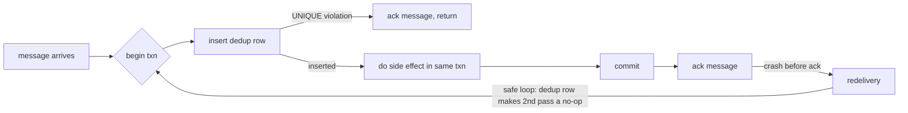

# The exactly-once myth and what idempotency actually buys you

*brokers promise once; networks deliver many; your database decides what counts*

> Prerequisite: this post assumes you already know how an idempotency key works at the HTTP boundary (UNIQUE constraint, stored response, key-plus-fingerprint rejection on reuse). The companion post "Idempotency keys for deploy and provisioning endpoints" covers that ground. Here we are downstream of the API: queues, consumers, brokers, redelivery, and what "exactly-once" means once a message has crossed into asynchronous territory.

Every few months somebody on the team links a blog post titled "exactly-once delivery with $BROKER" and asks whether we should switch. The answer is always the same, and it always disappoints them: the broker is not lying, exactly, but it is selling you a property that ends at its own boundary. The moment your consumer pulls a message off the queue and tries to do something with it, you are back in at-least-once land, and the only way out is to make the side effect itself replay-safe.

This is the part nobody puts in the marketing copy. Exactly-once-as-a-feature usually means "the broker will not deliver the same message twice to the same consumer group within a session, assuming no consumer crashes, no network partitions, no rebalances, and no operator restarts." That is a narrow assumption set. The actual guarantee you get end to end is: the consumer will see each message *at least* once, possibly many times, and your job is to make sure the *effect* of seeing it more than once is the same as seeing it exactly once.

We learned this the hard way on a billing pipeline I will call `chargehook`. It took roughly forty hours of customer support, an angry Slack channel, and three duplicate refunds before we understood what "idempotent" actually means in the place it matters.

## Where the broker's contract ends

Picture the path a webhook takes from a payment processor to your ledger:

```
[processor] -> HTTPS -> [edge LB] -> [http handler] -> [queue] -> [worker] -> [postgres]
              (1)                   (2)              (3)         (4)         (5)
```

The processor will retry (1) until it gets a 2xx. The load balancer might retry (2) on a timeout. Your HTTP handler enqueues (3) the message and acks the webhook. The queue delivers (4) to a worker. The worker writes (5) to Postgres.

Every arrow is a duplication opportunity. The processor retries because your handler timed out at 4.9 seconds even though the message was already enqueued. The LB retries to a sibling pod because the first one is GC-pausing. The queue redelivers because the worker crashed between the side effect and the ack. Postgres commits, the worker's connection drops before the ack flushes, the queue redelivers, the worker re-runs.

The broker's "exactly-once" only addresses arrow (4) and even then only under specific conditions. It does not address (1), (2), (3), or (5). So the system as a whole is at-least-once. There is no broker setting that fixes this, because the duplication is not in the broker.

What you actually want is *effectively-once*: the user-visible effect happens once, regardless of how many times the message arrives. That is a property of the *consumer plus the destination database together*, not of the transport.

## The bug that taught us this

`chargehook` is a webhook handler that receives payment-success events from an upstream processor and inserts a row into a `ledger` table representing the charge. Early version, simplified:

```python
def handle(event):
    if seen_event(event.id):              # check dedup table
        return 200

    insert_ledger(event)                  # side effect
    mark_seen(event.id)                   # write dedup row
    return 200
```

This passed code review. It passed unit tests. It ran fine for six months. Then we had a Postgres failover, and during the failover window the processor retried a bunch of events that were mid-flight. Some customers got charged twice. A few got charged three times.

The bug is sitting right there, and once you see it you cannot unsee it. The dedup check and the side effect are in different transactions (in fact, `insert_ledger` and `mark_seen` were also in separate transactions, because each function opened its own connection from the pool). The sequence that fired:

```
T1: handle(evt-42) -> seen? no -> insert_ledger(evt-42) [committed]
T1: ... primary fails over, connection dies before mark_seen runs ...
T2: handle(evt-42) retry -> seen? no -> insert_ledger(evt-42) [committed again]
T2: mark_seen(evt-42) [committed]
```

Two ledger rows. One dedup row. From the dedup table's perspective the event was processed exactly once. From the customer's bank statement it was processed twice. The dedup table was lying because it was not party to the same transaction as the thing it claimed to be deduplicating.

The fix is mechanical once you understand the principle. The dedup row has to be written in the *same transaction* as the side effect, against the *same database* as the side effect, with a uniqueness constraint that will reject the second attempt outright.

```python
def handle(event):
    with conn.transaction():
        cur = conn.execute(
            "INSERT INTO processed_events (event_id, processed_at) "
            "VALUES (%s, now()) ON CONFLICT (event_id) DO NOTHING",
            (event.id,),
        )
        if cur.rowcount == 0:
            return 200  # already processed, ack and move on

        conn.execute(
            "INSERT INTO ledger (event_id, account, cents) "
            "VALUES (%s, %s, %s)",
            (event.id, event.account, event.cents),
        )
    return 200
```

A try/except on `UniqueViolation` is semantically equivalent but slower: it forces Postgres to raise, aborts the implicit savepoint, and costs you a round trip on the hot dedup path. `ON CONFLICT DO NOTHING` lets the server make the decision and tell you via `rowcount`. Either way, the two writes commit or roll back together. If the worker crashes between the insert and the commit, neither happens, and the retry will succeed. If the worker crashes after the commit but before acking the queue, the retry will hit the unique violation and return 200 without double-charging. The dedup table is no longer a hint, it is the authority, because Postgres is enforcing it under the same lock that gates the ledger row.

## The rule, stated plainly

The dedup key has to live next to the side effect, in the same atomic unit. "Same atomic unit" is doing all the work in that sentence. If your side effect is a Postgres insert, the dedup row goes in Postgres, in the same transaction. If the side effect is an external API call, the dedup record has to be something that endpoint respects (Stripe's `Idempotency-Key`, with a 24-hour retention window per their docs at [docs.stripe.com/api/idempotent_requests](https://docs.stripe.com/api/idempotent_requests), is the canonical example). If the side effect is sending an email, you cannot achieve exactly-once delivery to the inbox no matter what you do, because SMTP itself is at-least-once and Gmail does not expose a dedup primitive. The best you get is "marked sent in our DB so we won't re-enqueue."

This is the actual taxonomy:

| Side effect | Where the dedup key lives | What enforces it |
|---|---|---|
| Postgres row insert | Same Postgres txn, `UNIQUE` index | Postgres MVCC |
| Stripe charge | `Idempotency-Key` header (Stripe holds it 24h) | Stripe server |
| S3 object write | Conditional PUT with `If-None-Match: *` | S3 server (rejects second PUT) |
| Kafka produce | `enable.idempotence=true` + producer epoch | Broker, per-partition |
| Outbound email | "Sent" flag in your DB, before SMTP call | You, optimistically |
| Push notification | Same as email, plus client-side dedup by msg-id | You + client SDK |

One footnote on the S3 row: a plain PUT is last-writer-wins, so two concurrent puts of the same key with different bodies both succeed and the second silently wins. That is idempotent only when the content is byte-identical. For real dedup, use the conditional write S3 added in 2024, `If-None-Match: *`, which fails the second PUT with `412 Precondition Failed`. Key-from-hash alone is not enough.

Notice that the email and push rows are the embarrassing ones. There is no actual end-to-end guarantee, only "we tried not to send twice." That is the honest description. If you have a customer-facing flow that sends email, write it down in the design doc as at-least-once and design the email template so a duplicate is not a disaster ("Your receipt for order #1234" is fine to repeat; "You have been charged $500" is not).

## Why brokers cannot give you the guarantee

The reason no broker can offer end-to-end exactly-once is the two generals problem dressed up in a hoodie. The consumer has to (a) perform a side effect and (b) tell the broker the message was processed. Those are two separate operations against two separate systems. Whichever order you do them in, there is a window where a crash leaves the system inconsistent:

- Ack first, then side effect: crash in the middle means the side effect never happens. Message lost.
- Side effect first, then ack: crash in the middle means side effect happens, broker redelivers, side effect happens again. Duplicate.

There is no third option that does not involve a distributed transaction (XA, two-phase commit), and distributed transactions across a broker and a database are operationally horrible and almost nobody runs them in production. The pragmatic answer is "side effect first, then ack, and make the side effect idempotent." That gives you at-least-once delivery and effectively-once semantics, which is what you actually wanted.



The back-edge terminates because the UNIQUE constraint turns the second pass into the `D` branch: ack and return. Redelivery is *fine*; the system tolerates an arbitrary number of crashes between commit and ack without any user-visible duplication.

## Replay storms (sidebar)

Idempotent consumers give you replay for free: re-feed a message range and the dedup table absorbs the ones that already landed. The operational catch is that a million-event replay with a 99% dupe rate still costs a million round trips and a lot of WAL. Rate-limit the replay tool so it does not starve live traffic, partition the dedup table by month so old slices can be detached, and if your stream is genuinely hot, front Postgres with a Bloom filter or Redis SET as a negative cache. The cache is an optimization, never the authority; the moment correctness depends on Redis you have rebuilt the original bug in a new color.

## What about Kafka's "exactly-once semantics"?

Kafka EOS is real, but it is narrower than the marketing suggests. It gives you exactly-once for a specific pattern: consume from Kafka, transform, produce back to Kafka, with the input offsets committed *inside the same transaction* via `sendOffsetsToTransaction`. That last bit is what makes it work: the offset advance and the output write commit atomically, so a crash either rolls back both or commits both. `isolation.level=read_committed` is the setting on *downstream* consumers that read the output topic; it tells them to skip records from aborted transactions. The whole loop has to stay inside Kafka. The moment your consumer writes to Postgres, or hits an external API, or sends an email, you are outside the EOS envelope and back to at-least-once.

This is a useful guarantee for stream processing topologies (Kafka Streams, Flink with Kafka source and sink) and a mostly useless one for "I want to consume from Kafka and update my application database without duplicates." For that second case you still need an idempotent consumer with a dedup table in Postgres, exactly as described above.

## The short version

Stop arguing about which broker gives you exactly-once. Pick the broker for other reasons (throughput, retention, operational familiarity) and assume at-least-once delivery in your design. Then, for every consumer:

1. Identify the side effect.
2. Identify the database that owns the side effect.
3. Put a dedup row in that same database, in the same transaction as the side effect, with a unique constraint that will reject duplicates.
4. Ack the broker after the transaction commits.
5. Tolerate replay; design the dedup table to be cheap to query at scale.

Do this and you will never again have to explain to a customer why we charged them twice. Skip it, and you will eventually have a Postgres failover, a queue redelivery storm, or a load balancer retrying a timed-out request, and the dedup table that lived in the wrong place will fail to save you. The bug always lives in the gap between two systems pretending to coordinate. Close the gap by putting both writes under the same commit, and the gap disappears.
