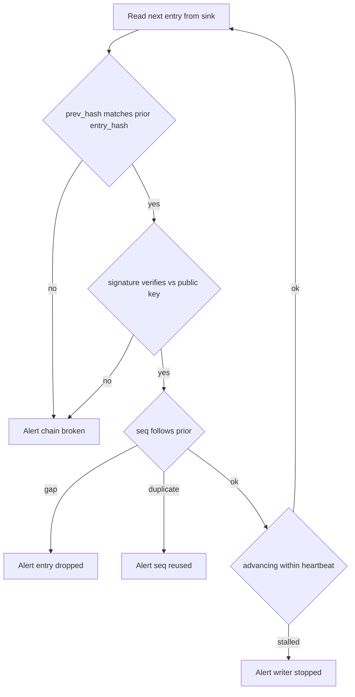

# Designing audit logs that survive a hostile insider review

*how to build audit logs that still hold up when the person under suspicion is on your own team*

Two properties get confused. Append-only is a property of the writing interface: the only thing the code can do is add a record at the end. Tamper-evident is stronger: if someone goes around that interface and edits a stored record directly, the change can be detected afterward. An append-only log is still just bytes on a disk that anyone reaching around the interface can rewrite; it protects the records from your own code, not from someone with full administrative control of the machine.

That control has a name on most systems: root, the all-powerful administrator account that can read, write, or delete any file on a box (a server). Writing `event_type=permission.grant` to a file named `audit.log` is not evidence; it is a string that anyone with root, write access to the storage bucket, or a cooperative database administrator (the DBA) can edit, truncate, or quietly delete a line out of. When the question nine months later is "did Priya change production (prod, the live system real customers use) at 03:14 on a Saturday, or did someone else do it from her login session," a plain text log answers neither half.

A threat model is the explicit list of who you are defending against and what they can do. Here it is an insider with broad production access who wants to alter the record after the fact: a senior engineer with legitimate access, a deadline, and a reason to make something they did look like the system did it.

## What an audit log actually has to answer

The auditor has four questions:

1. **Who did this.** Not which automated account. Which human, through which login session, from which device.
2. **What changed, exactly.** The value before and the value after, not just the name of the action.
3. **What else happened in the same chain of cause and effect.** If `role.assigned` fires, what API call triggered it, what session opened the call, what login opened the session.
4. **Can I trust these records.** If the answer is "we have backups," you have already lost the audit.

Many systems answer question 1 with a service principal and question 3 with nothing, because there is no shared identifier tying related events together. A principal is the identity attached to an action; a service account (or service principal) is the identity a running program uses, naming the program rather than the human behind it. You can deploy a full SIEM (Security Information and Event Management system, the central tool that collects and searches security logs) and still miss all four.

## Actor versus subject: stop conflating them

The single most common schema mistake is one `user_id` field. Consider a permission change in a multi-tenant system, where one running system serves many customers; each is a tenant, and a tenant's data stays walled off from the others. A platform engineer named Marcus, logged in through a single sign-on session `sess_8af2` (single sign-on, SSO, means one login to a central identity provider grants access to many internal tools), grants the `billing.read` role to user `u_991` in tenant `t_acme`, acting on a ticket `u_991` filed themselves. That one event has four distinct identities:

| Field | Value | Meaning |
|-------|-------|---------|
| `actor.principal` | `marcus@example.com` | The human who initiated |
| `actor.session_id` | `sess_8af2` | The auth context they used |
| `actor.on_behalf_of` | `u_991` | Delegated authority, if any |
| `subject.principal` | `u_991` | The entity changed |
| `subject.tenant` | `t_acme` | Scope of the change |

The auth context above is the login session that established who Marcus was and what he was allowed to do. Six months later he claims his account was compromised, and a single `user_id` cannot tell "Marcus did it" from "something acting as Marcus did it." With `actor.session_id` you join to the login log and see the source IP address, the device fingerprint, the multi-factor method, and whether the session predates the alleged compromise. A device fingerprint is a set of signals from the device (browser version, screen size, and the like) that identify one machine fairly reliably; multi-factor, MFA, means the login required more than a password. If the session opened before the window Marcus claims, the attacker could not have been driving it, though a stolen long-lived token can be replayed, so force re-auth (a fresh login) for privileged actions.

The same separation matters when one program calls another: the actor is the service account doing the work, the `on_behalf_of` is the end user whose request started the chain.

## The hash chain, done correctly

Append-only buys you nothing if your insider has shell access, meaning a command-line login on the machine. The standard fix is a hash chain. A hash (also called a digest) is a fixed-size fingerprint of a chunk of bytes, where changing one byte flips it completely. Each entry carries the hash of the entry before it, so deleting or modifying any record breaks every record after it. The idea goes back to Bellare-Yee (1997) and Schneier-Kelsey (1999), which established forward-secure logging: an attacker who breaks in at time T still cannot forge or alter any entry written before T, because the keys for older entries are already gone. Two decades on, implementations still get it wrong (https://www.schneier.com/wp-content/uploads/2016/02/paper-auditlogs.pdf).

A minimal entry:

```python
import hashlib
import json
from datetime import datetime, timezone

def make_entry(prev_hash: str, payload: dict, signing_key) -> dict:
    entry = {
        "seq": payload["seq"],
        "ts": datetime.now(timezone.utc).isoformat(),
        "prev_hash": prev_hash,
        "payload": payload,
    }
    # Canonical serialization is the whole game; use a JCS library
    # (RFC 8785) for cross-language verifiers, not bare json.dumps.
    canonical = json.dumps(entry, sort_keys=True, separators=(",", ":"))
    digest = hashlib.sha256(canonical.encode()).digest()
    entry_hash = digest.hex()
    entry["entry_hash"] = entry_hash
    # Sign the raw hash bytes, not the hex string, so verifiers in other
    # languages do not have to know about the encoding dance.
    entry["signature"] = signing_key.sign(digest).hex()
    return entry
```

The ordering matters. The hash and signature are computed over the entry *without* `entry_hash` and `signature` present, then added afterward; a verifier strips those two fields out before recomputing the digest, so including them before hashing makes every check fail. Three details matter:

**Canonical serialization.** Serialization means turning an in-memory object into bytes; canonical means there is exactly one allowed way to do it, so the same logical object always produces the same bytes. If one writer emits `{"a":1,"b":2}` and another `{"b": 2, "a": 1}`, their hashes differ. JCS (the JSON Canonicalization Scheme, RFC 8785) pins down how a JSON value becomes bytes, down to float formatting and Unicode escaping, so writers in different languages compute the identical hash (https://www.rfc-editor.org/rfc/rfc8785.html). Pick canonical JSON or CBOR (Concise Binary Object Representation, a compact binary alternative to JSON) and enforce it in one shared library.

**Sign the hash, not the payload.** Signing means producing a signature with a private key that anyone holding the matching public key can check; it gives authenticity, proving this exact entry came from the holder of the signing key. The chain links give ordering and immutability (immutable means it cannot be changed without it being obvious): each entry's `prev_hash` commits to the one before it, so nothing earlier can be reordered, edited, or removed undetected, and a verifier needs only the hashes to walk it.

**The signing key does not live on the machine that writes logs.** If the host that calls `make_entry` also holds the private key, an attacker with root there can forge entries forever. Send the hash to a dedicated signer instead: an HSM (Hardware Security Module, a tamper-resistant device that holds keys and signs without exposing them), a managed KMS (Key Management Service, a cloud service doing the same in software), or a small isolated service whose only job is "sign this hash." This adds latency (extra time per request) you accept for security-sensitive events. For high-volume events, batch them and sign one Merkle tree root: a Merkle tree hashes entries in pairs, then those hashes in pairs, up to a single root that commits to every entry beneath it. You sign once per batch and keep, per entry, an inclusion proof: the sibling hashes needed to recompute the root from that entry, proving it sits under it.

## Write-only sinks

The chain proves tampering after the fact; it does not prevent it. For prevention you need a sink the writer cannot delete from. A sink is a destination data flows into; a write-only one you can add to but cannot remove from. Ranked by how much your insider has to defeat:

```
weakest                                                strongest
   |                                                        |
   v                                                        v
[ local file ] -> [ central log host ] -> [ object store    ] -> [ append-only
   root can       compromise the         with object lock      log service in
   sed -i         central host           and bucket policy     a second AWS
                                         denying delete         account ]
```

Running the audit store in a separate cloud account is worth the trouble. Identity and access management, written IAM, is the set of rules controlling who can do what in a cloud account. If your infrastructure runs in account `prod-12345`, create a second account, `audit-99887`, with its own IAM and a one-way pipe: prod can write but cannot read or delete, and only two people from the security team acting together can touch the bucket, through a break-glass path (a deliberately rare, heavily logged way to get extra access when something has gone badly wrong, named for breaking the glass on a fire alarm). Requiring two people is a quorum: the minimum number of approvers who must act before something is allowed. Make that approval out-of-band, through a separate channel from the request (a phone call, not the same login session). An insider with full root on prod then cannot edit yesterday's entries, and the public verification keys live here too, so the signing host cannot rotate the key that verifies.

S3 is Amazon's object storage service (S3 stands for Simple Storage Service); an object is a stored file, and S3 keeps versioned copies of each. S3 Object Lock in compliance mode gives the storage-level half: it marks an object version immutable until a retention date you set. In governance mode a privileged user can override the lock; in compliance mode neither the bucket owner nor even the account's root user can delete a locked version before it expires. Cross-account isolation handles the IAM half.

## Correlation IDs

The running example: six months ago, customer `t_acme` claims an internal user saw their billing data without permission. Three services are involved (`gateway`, `identity`, `billing-api`), each keeping its own hash chain with its own sequence counter. The gateway is the single entry point all outside requests pass through first (an API gateway). Total volume for the window: 4.2 billion entries.

Without a shared identifier, you are searching across three log stores for events involving `t_acme` and hoping the timestamps line up well enough to reconstruct cause and effect. They will not. There is no single clock across many machines: NTP (Network Time Protocol, how machines sync clocks over the network) only corrects host clocks approximately, and writes are often delayed by batching. A wall-clock timestamp is the ordinary date-and-time off the machine's own clock, as opposed to a logical counter that only ever increases; ordering by it gives a sequence that looks out of order, and two days of join queries produce a report that says "probably."

A correlation ID (also called a request ID or trace ID) is a single identifier created at the gateway and passed through every downstream call: the pattern behind W3C Trace Context (a web standard for the header that carries the ID between services), OpenTelemetry (an open-source toolkit for it), and Dapper (Google's original system for it). The query is then one line, `correlation_id = "req_4f8a2c"`, returning something like:

```
seq=4471  ts=2025-11-14T03:14:02Z  svc=gateway
  event=auth.session.resumed  actor.session=sess_8af2
  correlation_id=req_4f8a2c

seq=4473  ts=2025-11-14T03:14:02Z  svc=gateway
  event=http.request  method=POST path=/admin/roles
  actor.principal=marcus@example.com correlation_id=req_4f8a2c

seq=90218  ts=2025-11-14T03:14:02Z  svc=identity
  event=role.assigned  subject.principal=u_991
  subject.tenant=t_acme role=billing.read
  actor.principal=marcus@example.com correlation_id=req_4f8a2c
  prev_hash=9c81...  entry_hash=b40e...

seq=33107  ts=2025-11-14T03:14:18Z  svc=billing-api
  event=invoice.viewed  actor.principal=u_991
  subject.tenant=t_acme correlation_id=req_4f8a2c
```

The sequence numbers are per-service, not global, so each service writes its own chain at its own rate. The query takes 200ms (its latency, the time it takes to run), ordering a few dozen related events instead of joining 4.2 billion by bad clocks. A flat correlation ID groups the events of one request but does not record which call was the parent of which; for a true parent-child breakdown (a waterfall, the indented tree view of one call nested under another) you need span IDs from a tracing system, where a span is one timed unit of work and the system collects spans across services.

The `prev_hash` on that `role.assigned` entry verifies against the previous entry in the identity service's chain. So if Marcus claims "that role grant never happened, your logs are wrong," you hand the auditor the seventeen later entries that link back through that one and ask which he would also dispute. The correlation ID links; the chain proves.

## Fields auditors actually ask for

A minimum schema, on top of the actor/subject split:

| Field | Why it matters | Common mistake |
|-------|---------------|----------------|
| `correlation_id` | Group all events of one request across services | Generated per-service instead of propagated |
| `request_id` | Distinct from correlation; one per HTTP call | Conflated with correlation_id |
| `actor.auth_method` | "Was this a password, MFA, API key, or SSO?" | Logged as boolean `authenticated=true` |
| `actor.source_ip` | Geo and ASN, when account is later disputed | NAT'd to the load balancer IP |
| `actor.device_fingerprint` | Distinguishes "same user, same laptop" vs "same user, new device" | Not collected at all |
| `change.before` / `change.after` | What the record is for | Only `event_type` is stored |
| `change.reason` | Free-text justification, required at write time | Optional, therefore empty |
| `policy_version` | Which version of the rules was evaluated | Implicit, therefore unknowable later |

Two rows need a warning. A load balancer sits in front of your servers and spreads requests across them. It rewrites the source address to its own (this rewriting is NAT, Network Address Translation), so `actor.source_ip` looks internal for everyone; the real client address survives in the `X-Forwarded-For` HTTP header, which the balancer adds to carry the original caller's IP, useful for the rough location and the ASN (Autonomous System Number, the identifier of the network operator that owns the address block) when an account is disputed. For `change.before`/`change.after` on large objects, the full before-and-after gets expensive, so store a structured diff plus a content hash of each version; the hash proves the diff applied to the version you claim.

`change.reason` always gets debated. Engineers hate justifying a change while putting out a fire; auditors value it because it turns "this looks suspicious" into "this looks suspicious, and the reason says 'fixing prod' with no ticket link." Require it for privileged actions, and let skipping it be its own event.

`policy_version` looks academic until someone asks "was this allowed under the rules in force at the time?" If the policy engine is updated weekly and you log only the decision, you cannot answer. Log the version, the input, and the output.

## The verifier that often goes unwritten

Who actually verifies the chain? If the answer is "we would run a script if there were an incident," it has never been verified. The verifier runs continuously, on a host that is not the one writing logs, as an approved reader inside the isolated audit account (the "prod cannot read" rule binds prod, not the verifier role), reading from the sink and alerting on anything wrong:



The `seq` and `prev_hash` checks are not redundant: `prev_hash` proves the entries you *have* are ordered and unaltered, while the sequence counter catches a writer that drops entries entirely (4471 then 4473 with no 4472: the links verify, but one is missing). A heartbeat is a regular signal that something is still alive; an attacker who cannot edit history can still stop writing, which the stalled-chain alert catches.

## What to leave out

A few additions that look like security but are not, given this threat model:

- **Encrypting audit logs at rest with a key the same insider can read.** This protects against a stolen laptop, not the privileged insider you actually fear.
- **PII in audit events.** PII is personally identifiable information: data that identifies a specific person, such as a name or email. You will be legally obligated to delete entries customers request, which breaks your chain: removing an entry's bytes changes its hash, and every downstream `prev_hash` then reads as tampered. Reference PII by stable opaque IDs and keep the data in a separately governed store that supports per-record deletion. The usual reconciliation with right-to-erasure (the legal right to have your data deleted, set out in GDPR Article 17 of the EU's data-protection law) is crypto-shredding: encrypt the subject references with a per-subject key and, on an erasure request, delete the key, so the ciphertext stays in the chain (links still verify) but becomes unrecoverable. Whether that counts as "erasure" under GDPR Article 17 is debated; treat it as a widely accepted mitigation, not guaranteed deletion.
- **Audit logs as the primary analytics source.** Once people run dashboards off audit data, every schema change becomes a six-team negotiation and someone proposes denormalizing a field (denormalize means copying a value into several places to make reads faster, which audit data should not tolerate because it creates copies that can disagree). Audit logs are evidence, not telemetry. Telemetry is the routine operational data you collect to watch a system run; it can be lossy and reshaped freely, and evidence cannot. Keep them separate.

## What it comes down to

Most of what makes an audit log survive a hostile review is discipline, not cryptography: separate actor from subject, propagate one ID end to end, and write signed entries where the writer can neither reach nor delete. You are designing for a stranger nine months from now, across a table from your CISO (Chief Information Security Officer, the executive accountable for security), holding a printout of one event and asking how you know it is real.
