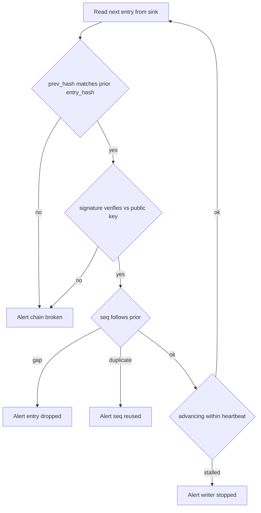

# Designing audit logs that survive a hostile insider review

*how to build audit logs that still hold up when the person under suspicion is on your own team*

Two properties get confused. Append-only is a property of the writing interface: the only thing the code can do is add a record at the end. Tamper-evident is stronger: if someone goes around that interface and edits a stored record directly, the change can be detected afterward. The first protects records from your own code, not from someone with full control of the box.

That control has a name on most systems: root, the administrator account that can read, write, or delete any file on a box (a server). Writing `event_type=permission.grant` to a file named `audit.log` is not evidence; it is a string that anyone with root, write access to the storage bucket, or a cooperative database administrator (the DBA) can edit, truncate, or delete from. When the question nine months later is "did Priya change production (prod, the live system real customers use) at 03:14 on a Saturday, or did someone do it from her login," a plain text log answers neither.

A threat model is the explicit list of who you are defending against and what they can do. Here it is an insider with broad production access who wants to alter the record after the fact: a senior engineer with a deadline and a reason to make their own action look automated.

## What an audit log actually has to answer

The auditor asks four questions:

1. **Who did this.** Not which automated account. Which human, through which session, from which device.
2. **What changed, exactly.** The value before and the value after, not just the name of the action.
3. **What else happened in the same chain of cause and effect.** If `role.assigned` fires, what call triggered it, what session opened the call, what login opened the session.
4. **Can I trust these records.** If the answer is "we have backups," you have lost the audit.

Many systems answer question 1 with a service principal and question 3 with nothing. A principal is the identity attached to an action; a service account (or service principal) is the identity a running program uses, naming the program rather than the human behind it. A SIEM (Security Information and Event Management system, the central tool that collects and searches security logs) does not fix this: deploy a full one and still miss all four.

## Actor versus subject: stop conflating them

The single most common schema mistake is one `user_id` field. Consider a permission change in a multi-tenant system, where one system serves many customers; each is a tenant whose data is walled off from the others. A platform engineer named Marcus, logged in through a single sign-on session `sess_8af2` (single sign-on, SSO, means one login to a central identity provider grants access to many internal tools), grants the `billing.read` role to user `u_991` in tenant `t_acme`, on a ticket `u_991` filed themselves. That event has four distinct identities plus their scope:

| Field | Value | Meaning |
|-------|-------|---------|
| `actor.principal` | `marcus@example.com` | The human who initiated |
| `actor.session_id` | `sess_8af2` | The auth context they used |
| `actor.on_behalf_of` | `u_991` | Delegated authority, if any |
| `subject.principal` | `u_991` | The entity changed |
| `subject.tenant` | `t_acme` | Scope of the change |

Six months later Marcus claims his account was compromised, and a single `user_id` cannot tell "Marcus did it" from "something acting as Marcus did it." With `actor.session_id` you join to the login log and see the source IP, the device fingerprint, the multi-factor method, and whether the session predates the claim. A device fingerprint is a set of signals from the device (browser version, screen size, and the like) that identify one machine fairly reliably; multi-factor, MFA, means the login required more than a password. A token is the credential a service hands back after login so later requests prove who you are without resending the password; a stolen one can be replayed, so force re-auth (a fresh login) for privileged actions.

When one program calls another, the on-call team cares about the actor and the auditor about the end user, so store both.

## The hash chain, done correctly

Append-only buys you nothing if your insider has shell access, a command-line login on the machine. The fix is a hash chain. A hash (also called a digest) is a fixed-size fingerprint of a chunk of bytes, where changing one byte flips it completely. Each entry carries the hash of the one before it, so deleting or modifying any record breaks every record after. The idea goes back to Bellare-Yee (1997) and Schneier-Kelsey (1999), which established forward-secure logging: an attacker who breaks in at time T cannot forge or alter any entry written before T, because the keys for older entries are already gone. Implementations still get it wrong (https://www.schneier.com/wp-content/uploads/2016/02/paper-auditlogs.pdf).

A minimal entry:

```python
import hashlib
import json
from datetime import datetime, timezone

def make_entry(prev_hash: str, payload: dict, signing_key) -> dict:
    entry = {
        "seq": payload["seq"],
        "ts": datetime.now(timezone.utc).isoformat(),
        "prev_hash": prev_hash,
        "payload": payload,
    }
    # Get serialization wrong and every hash check fails; use a JCS
    # library (RFC 8785) for cross-language verifiers, not bare json.dumps.
    canonical = json.dumps(entry, sort_keys=True, separators=(",", ":"))
    digest = hashlib.sha256(canonical.encode()).digest()
    entry_hash = digest.hex()
    entry["entry_hash"] = entry_hash
    # Sign the raw hash bytes, not the hex string, so verifiers in other
    # languages do not have to match your hex encoding.
    entry["signature"] = signing_key.sign(digest).hex()
    return entry
```

The hash and signature are computed over the entry *without* `entry_hash` and `signature` present, then added afterward; a verifier strips both before recomputing the digest. Three details matter:

**Canonical serialization.** Serialization means turning an in-memory object into bytes; canonical means there is exactly one allowed way to do it, so the same logical object always produces the same bytes. If one writer emits `{"a":1,"b":2}` and another `{"b": 2, "a": 1}`, their hashes differ and every check fails. JCS (the JSON Canonicalization Scheme, RFC 8785) pins this down to float formatting and Unicode escaping (https://www.rfc-editor.org/rfc/rfc8785.html). Pick canonical JSON or CBOR (Concise Binary Object Representation, a compact binary alternative to JSON) and enforce it in one shared library.

**Sign the hash, not the payload.** Signing means producing a signature with a private key that anyone holding the matching public key can check; it proves this exact entry came from the holder of the signing key. The chain links give ordering and immutability (immutable means it cannot be changed without it being obvious): each entry's `prev_hash` is the previous entry's `entry_hash`, so nothing earlier can be reordered, edited, or removed undetected.

**The signing key does not live on the machine that writes logs.** If the host that calls `make_entry` also holds the private key, an attacker with root there can forge entries. Send the hash to a dedicated signer: an HSM (Hardware Security Module, a tamper-resistant device that holds keys and signs without exposing them), a managed KMS (Key Management Service, a cloud service doing the same in software), or a small isolated service whose only job is "sign this hash." This adds latency you accept for security-sensitive events. For high-volume events, batch them and sign one Merkle tree root: a Merkle tree hashes entries in pairs, then those hashes in pairs, up to a single root that commits to every entry beneath. You sign once per batch and keep, per entry, an inclusion proof: the sibling hashes (the adjacent hash at each tree level you combine to climb toward the root) needed to recompute the root from that entry.

## Write-only sinks

The chain proves tampering after the fact; it does not prevent it. For prevention you need a sink the writer cannot delete from. A sink is a destination data flows into; a write-only one you add to but cannot remove from, ranked by how much your insider must defeat:

```
weakest                                                strongest
   |                                                        |
   v                                                        v
[ local file ] -> [ central log host ] -> [ object store    ] -> [ append-only
   root can       compromise the         with object lock      log service in
   sed -i         central host           and bucket policy     a second cloud
                                         denying delete         account ]
```

Run the audit store in a separate cloud account. Identity and access management, written IAM, is the set of rules controlling who can do what there. If your infrastructure runs in account `prod-12345`, create a second account, `audit-99887`, with its own IAM and a one-way pipe: prod can write but cannot read or delete, and only two people from the security team acting together can touch the bucket, through a break-glass path (a deliberately rare, heavily logged way to get extra access when something has gone wrong). Two people is a quorum: the minimum number of approvers who must act before something is allowed. Enforce it with MFA-delete (the object-store feature that requires an MFA token to delete a versioned object) plus out-of-band approval, through a separate channel from the request (a phone call, not the same login). An insider with full root on prod then cannot edit yesterday's entries. The public verification keys live here too, so the signing host cannot rotate the verifying key.

Object storage keeps versioned copies of each stored file. Object Lock in compliance mode marks an object version immutable until a retention date you set. In governance mode a privileged user can override the lock; in compliance mode neither the bucket owner nor even the account's root user can delete a locked version before it expires.

## Correlation IDs

The running example: six months ago, customer `t_acme` claims an internal user saw their billing data without permission. Three services are involved, each keeping its own hash chain with its own sequence counter, 4.2 billion entries in total: the `gateway` (an API gateway, the single entry point all outside requests pass through), `identity`, and `billing-api`.

Without a shared identifier, you search three log stores for events involving `t_acme` and hope the timestamps line up. They will not: there is no single clock across many machines. NTP (Network Time Protocol, how machines sync clocks over the network) only corrects host clocks approximately, and a wall-clock timestamp, the ordinary date-and-time off the machine's own clock rather than a logical counter that only increases, gives an ordering that looks out of order, so the joins produce a report that says "probably."

A correlation ID (also called a request ID or trace ID) is a single identifier created at the gateway and passed through every downstream call: the pattern behind W3C Trace Context (a web standard for the header that carries the ID between services), OpenTelemetry (an open-source toolkit for it), and Dapper (Google's original system). The query becomes one line, `correlation_id = "req_4f8a2c"`:

```
seq=4471  ts=2025-11-14T03:14:02Z  svc=gateway
  event=auth.session.resumed  actor.session=sess_8af2
  correlation_id=req_4f8a2c

seq=4473  ts=2025-11-14T03:14:02Z  svc=gateway
  event=http.request  method=POST path=/admin/roles
  actor.principal=marcus@example.com correlation_id=req_4f8a2c

seq=90218  ts=2025-11-14T03:14:02Z  svc=identity
  event=role.assigned  subject.principal=u_991
  subject.tenant=t_acme role=billing.read
  actor.principal=marcus@example.com correlation_id=req_4f8a2c
  prev_hash=9c81...  entry_hash=b40e...

seq=33107  ts=2025-11-14T03:14:18Z  svc=billing-api
  event=invoice.viewed  actor.principal=u_991
  subject.tenant=t_acme correlation_id=req_4f8a2c
```

A flat correlation ID groups the events of one request but does not record which call was the parent of which; for a true parent-child breakdown (a waterfall, the indented tree view of one call nested under another) you need span IDs from a tracing system, where a span is a timed unit of work.

The `prev_hash` on that `role.assigned` entry verifies against the previous entry in the identity service's chain. If Marcus claims "that role grant never happened, your logs are wrong," you hand the auditor the seventeen later entries that link back through it and ask which he would also dispute.

## Fields auditors actually ask for

A minimum schema beyond the actor/subject split:

| Field | Why it matters | Common mistake |
|-------|---------------|----------------|
| `correlation_id` | Group all events of one request across services | Generated per-service instead of propagated |
| `request_id` | Distinct from correlation; one per HTTP call | Conflated with correlation_id |
| `actor.auth_method` | "Was this a password, MFA, API key, or SSO?" | Logged as boolean `authenticated=true` |
| `actor.source_ip` | Geo and ASN, when account is later disputed | NAT'd to the load balancer IP |
| `actor.device_fingerprint` | Distinguishes "same user, same laptop" vs "same user, new device" | Not collected at all |
| `change.before` / `change.after` | What the record is for | Only `event_type` is stored |
| `change.reason` | Free-text justification, required at write time | Optional, therefore empty |
| `policy_version` | Which version of the rules was evaluated | Implicit, therefore unknowable later |

Two rows need a warning. A load balancer sits in front of your servers and spreads requests across them, rewriting the source address to its own (this rewriting is NAT, Network Address Translation), so `actor.source_ip` looks internal for everyone; the real client address survives in the `X-Forwarded-For` HTTP header the balancer adds, giving you the rough location and the ASN (Autonomous System Number, the identifier of the network operator that owns the address block). For `change.before`/`change.after` on large objects, the full diff gets expensive, so store a structured diff plus a content hash of each version; the hash proves the diff applies to the version you claim.

Require `change.reason` for privileged actions, and let skipping it be its own event: it turns "this looks suspicious" into "this looks suspicious, and the reason says 'fixing prod' with no ticket."

Log `policy_version` so you can answer "was this allowed under the rules in force at the time?" If the policy engine is revved weekly and you log only the decision, you cannot.

## The verifier that often goes unwritten

A chain is only worth as much as the process that checks it: a script you would only run during an incident has never been verified. The verifier runs continuously on a host that is not the one writing logs, as an approved reader inside the isolated audit account, where the "prod cannot read" rule binds prod, not this role. It alerts on anything wrong:



The `seq` and `prev_hash` checks are not redundant: `prev_hash` proves the entries you *have* are ordered and unaltered, while the sequence counter catches a writer that drops entries entirely: 4471 then 4473 with no 4472, where the links verify but one is missing. A heartbeat is a regular signal that something is alive; an attacker who cannot edit history can still stop writing, and the stalled check catches that.

## What to leave out

A few additions that look like security but are not, under this threat model:

- **Encrypting audit logs at rest with a key the same insider can read.** This protects against a stolen laptop, not the privileged insider you fear.
- **PII in audit events.** PII is personally identifiable information: data that identifies a specific person, such as a name or email. You will be legally obligated to delete entries customers request, which breaks your chain: removing an entry's bytes changes its hash, and every downstream `prev_hash` then reads as tampered. Reference PII by stable opaque IDs and keep the data in a separately governed store that allows per-record deletion. The usual reconciliation with right-to-erasure (the legal right to have your data deleted, set out in GDPR Article 17 of the EU's data-protection law) is crypto-shredding: encrypt the subject references with a per-subject key and, on an erasure request, delete the key, so the ciphertext (the encrypted bytes) stays in the chain but becomes unrecoverable, as long as no copy of the key survives in backups. Whether that counts as "erasure" under Article 17 is debated; treat it as a mitigation, not guaranteed deletion.
- **Audit logs as the primary analytics source.** Once people run dashboards off audit data, every schema change becomes a multi-team negotiation and someone proposes denormalizing a field (denormalize means copying a value into several places to make reads faster, which audit data should not tolerate because the copies can disagree). Audit logs are evidence, not telemetry. Telemetry is the routine operational data you collect to watch a system run; it can be lossy and reshaped freely, evidence cannot.

## What it comes down to

Most of what makes an audit log survive a hostile review is discipline, not cryptography: separate actor from subject, propagate one ID end to end, write signed entries the writer can neither reach nor delete. You are designing for a stranger nine months from now, sitting with your CISO (Chief Information Security Officer, the executive accountable for security) and a printout of one event, asking how you know it is real.
