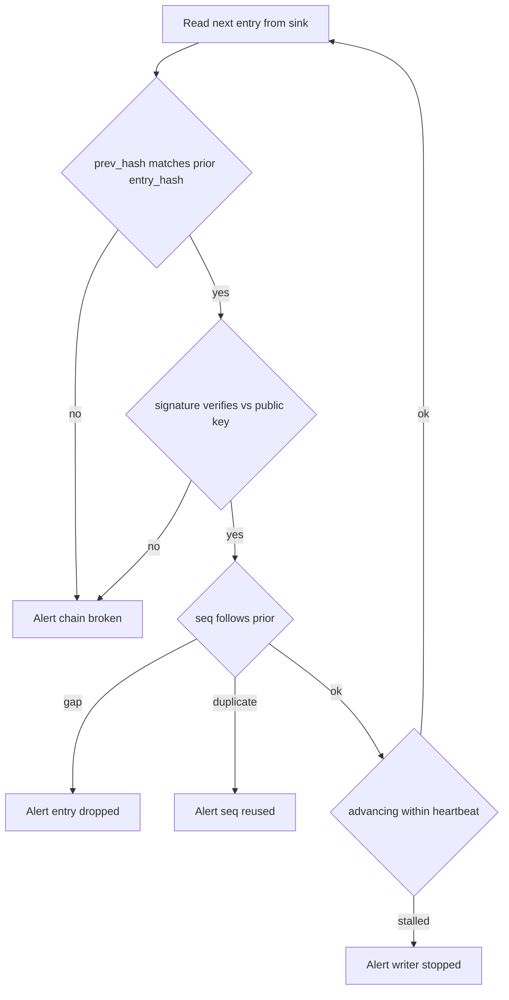

# Designing audit logs that survive a hostile insider review

*append-only is not the same as tamper-evident, and your SRE knows where the log volume is mounted*

Append-only is a property of the API: the only operation is "add a record at the end." Tamper-evident is the stronger property that if someone bypasses the API and edits a record directly, the change is *detectable* afterward. An append-only log is still bytes on a disk that anyone reaching around the API can rewrite: append-only protects the line against your own code, not against the person with root. So writing `event_type=permission.grant` to a file called `audit.log` is not evidence. It is a string that anyone with root, write access to the log bucket, or a cooperative DBA can edit, truncate, or quietly `sed -i` a line out of. When the question nine months later is "did Priya actually grant herself prod-write at 03:14 on a Saturday, or did someone else do it from her session," a plain text log answers neither half.

This post is about audit logs that hold up when the threat model includes someone on your own team: not a cartoon villain in a hoodie, but the common case of a senior engineer with legitimate prod access, a deadline, and a reason to make a thing they did look like a thing the system did. The defenses are not exotic. They are mostly about removing the assumption of trust from where it snuck in.

## What an audit log actually has to answer

The auditor nine months after the incident has four questions:

1. **Who did this.** Not which service account. Which human, via which session, from which device.
2. **What changed, exactly.** Before-value and after-value, not a verb.
3. **What else happened in the same causal chain.** If `role.assigned` fires, what API call triggered it, what session opened that call, what auth event opened that session.
4. **Can I trust these records.** If the answer is "well, we have backups," you have already lost the audit.

A surprising number of "audit systems" answer (1) with a service principal (the machine credential a process runs as, which names the program, not the person) and (3) with nothing, because there is no correlation ID. You can ship a SIEM and miss all four.

## Actor versus subject: stop conflating them

The single most common schema mistake is one `user_id` field. Consider a permission change in a multi-tenant system: a platform engineer named Marcus, logged into the admin console via SSO session `sess_8af2`, calls an endpoint granting the `billing.read` role to user `u_991` in tenant `t_acme`, acting on a support ticket filed by `u_991` themselves. That one event has four distinct identities:

| Field | Value | Meaning |
|-------|-------|---------|
| `actor.principal` | `marcus@example.com` | The human who initiated |
| `actor.session_id` | `sess_8af2` | The auth context they used |
| `actor.on_behalf_of` | `u_991` | Delegated authority, if any |
| `subject.principal` | `u_991` | The entity changed |
| `subject.tenant` | `t_acme` | Scope of the change |

Six months later Marcus claims his account was compromised. With a single `user_id` you cannot distinguish "Marcus did it" from "something acting as Marcus did it." With `actor.session_id` you join to the auth log and see the IP, the device fingerprint, the MFA method, and whether the session predates the alleged compromise. If it opened *before* the window he claims he was taken over, the attacker could not have been driving it. That is not airtight, since a long-lived token can be stolen and replayed, which is why you also bind sessions to a device fingerprint and force re-auth for privileged actions. Without the session ID you cannot run that comparison at all.

The same separation matters for service-to-service calls: the actor is the service account, the `on_behalf_of` is the end user whose request triggered the chain. Auditors care about the latter, ops about the former, so store both.

## The hash chain, done correctly

Append-only buys you nothing if your insider has shell access. The standard fix is a hash chain: each entry carries a hash (a fixed-size fingerprint of bytes, where one changed byte flips the whole fingerprint) of the previous entry, so deleting or modifying any record breaks every record after it. The concept goes back to Bellare-Yee (1997) and Schneier-Kelsey (1999), which established forward-secure logging: an attacker who compromises the system at time T still cannot forge or alter entries written before T. Two decades old, and implementations are still routinely wrong (https://www.schneier.com/wp-content/uploads/2016/02/paper-auditlogs.pdf).

A minimal entry:

```python
import hashlib
import json
from datetime import datetime, timezone

def make_entry(prev_hash: str, payload: dict, signing_key) -> dict:
    entry = {
        "seq": payload["seq"],
        "ts": datetime.now(timezone.utc).isoformat(),
        "prev_hash": prev_hash,
        "payload": payload,
    }
    # Canonical serialization is the whole game; use a JCS library
    # (RFC 8785) for cross-language verifiers, not bare json.dumps.
    canonical = json.dumps(entry, sort_keys=True, separators=(",", ":"))
    digest = hashlib.sha256(canonical.encode()).digest()
    entry_hash = digest.hex()
    entry["entry_hash"] = entry_hash
    # Sign the raw hash bytes, not the hex string, so verifiers in other
    # languages do not have to know about the encoding dance.
    entry["signature"] = signing_key.sign(digest).hex()
    return entry
```

The ordering is load-bearing: the hash and signature are computed over the entry *without* `entry_hash` and `signature` present, then added as metadata; a verifier strips those two fields back out to recompute the digest, so inserting them before hashing breaks every check. Three more things that look like nitpicks but are not:

**Canonical serialization.** If two writers produce the same logical entry but one serializes `{"a":1,"b":2}` and the other `{"b": 2, "a": 1}`, their hashes differ, because the hash is over bytes, not the abstract object. JCS (the JSON Canonicalization Scheme, RFC 8785) pins down exactly how a JSON value becomes bytes, down to float formatting and Unicode escaping, so writers in different languages compute the identical hash (https://www.rfc-editor.org/rfc/rfc8785.html). Pick canonical JSON or CBOR, enforce it in one shared library, and do not let each service hand-roll its own.

**Sign the hash, not the payload.** Two guarantees are at play. The signature gives *authenticity*: it proves this exact entry came from the holder of the signing key, so nobody can fabricate one from nothing. The chain links give *ordering and immutability*: each entry's `prev_hash` commits to the one before it, so nothing ahead of a given entry can be reordered, edited, or removed undetected. The next entry's `prev_hash` is this entry's `entry_hash`, so a verifier needs only the hashes to walk the chain.

**The signing key does not live on the box that writes logs.** If the host that calls `make_entry` also holds the private key, an attacker with root there can forge entries indefinitely. The write path should send to a dedicated signer: an HSM, a managed KMS, or a small isolated service whose only job is "sign this hash." This adds latency you accept for security-sensitive events. For high-volume non-security events, batch and sign a Merkle tree root instead: a tree that hashes entries pairwise up to one root committing to every entry beneath it, so you sign once per batch and keep a per-entry inclusion proof to show any entry sits under that root.

## Write-only sinks: the unsexy half

The chain proves tampering; it does not prevent it. For prevention you need a sink the writer cannot delete from, ranked here by how much your insider has to defeat:

```
weakest                                                strongest
   |                                                        |
   v                                                        v
[ local file ] -> [ central log host ] -> [ object store    ] -> [ append-only
   root can       compromise the         with object lock      log service in
   sed -i         central host           and bucket policy     a second AWS
                                         denying delete         account ]
```

The "second account" pattern is underrated. If your primary infra runs in account `prod-12345`, create `audit-99887` with its own IAM, its own break-glass, and a one-way pipe: prod can write, prod cannot read or delete, and only a two-person security-team quorum can touch the bucket (MFA-delete plus out-of-band approval by two distinct principals). An insider with full root on prod cannot edit yesterday's entries. Keep the public verification keys here too, so the prod host that signs cannot rotate the key that verifies.

S3 Object Lock in compliance mode gives you the bucket-level half: it marks an object version immutable until a retention date, and unlike governance mode (which a privileged user can override) neither the bucket owner nor the AWS root user can delete a locked version before expiry, exactly the property you want against a privileged insider. Cross-account isolation gives you the IAM half.

## Correlation IDs, or: how to find the one useful event

The running example: six months ago, customer `t_acme` claims an internal user saw their billing data without permission. Three services are involved (`gateway`, `identity`, `billing-api`), each maintaining its own hash chain with its own per-service sequence counter. Total event volume for the window: 4.2 billion entries.

Without a correlation ID, you are searching across three log stores for events involving `t_acme` and hoping the timestamps line up close enough to reconstruct a causal chain. They won't. There is no single clock in a distributed system: NTP corrects host clocks only approximately, and batch flushes delay when an entry is written. Ordering by wall-clock timestamp gives you a sequence that looks out of order, and two days of join queries produce a report that says "probably."

A correlation ID (also called a request or trace ID) is a single identifier minted at the gateway and propagated through every downstream call, the pattern behind W3C Trace Context, OpenTelemetry, and Dapper. With it, the query is one line: `correlation_id = "req_4f8a2c"`, returning something like:

```
seq=4471  ts=2025-11-14T03:14:02Z  svc=gateway
  event=auth.session.resumed  actor.session=sess_8af2
  correlation_id=req_4f8a2c

seq=4473  ts=2025-11-14T03:14:02Z  svc=gateway
  event=http.request  method=POST path=/admin/roles
  actor.principal=marcus@example.com correlation_id=req_4f8a2c

seq=90218  ts=2025-11-14T03:14:02Z  svc=identity
  event=role.assigned  subject.principal=u_991
  subject.tenant=t_acme role=billing.read
  actor.principal=marcus@example.com correlation_id=req_4f8a2c
  prev_hash=9c81...  entry_hash=b40e...

seq=33107  ts=2025-11-14T03:14:18Z  svc=billing-api
  event=invoice.viewed  actor.principal=u_991
  subject.tenant=t_acme correlation_id=req_4f8a2c
```

The sequence numbers are per-service, not global: there is no central sequencer, which lets each service write its own chain at its own rate. The query takes 200ms, ordering a few dozen related events instead of joining 4.2 billion by unreliable clocks. (A flat correlation ID *groups* events of a request but does not encode parent/child causality; for a true waterfall you still need span IDs from a tracing system.)

The `prev_hash` on that `role.assigned` entry verifies against the previous entry in the identity service's chain. So if Marcus claims "that role grant never happened, your logs are wrong," you hand the auditor the seventeen subsequent entries that all link back through that one and ask which of those eighteen records he would also dispute.

The correlation ID does the linking. The chain does the proving. You need both.

## Fields auditors actually ask for

The same fields are always the missing ones. A pragmatic minimum schema beyond the actor/subject split:

| Field | Why it matters | Common mistake |
|-------|---------------|----------------|
| `correlation_id` | Group all events of one request across services | Generated per-service instead of propagated |
| `request_id` | Distinct from correlation; one per HTTP call | Conflated with correlation_id |
| `actor.auth_method` | "Was this a password, MFA, API key, or SSO?" | Logged as boolean `authenticated=true` |
| `actor.source_ip` | Geo and ASN, when account is later disputed | NAT'd to the load balancer IP |
| `actor.device_fingerprint` | Distinguishes "same user, same laptop" vs "same user, new device" | Not collected at all |
| `change.before` / `change.after` | The whole point of an audit log | Only `event_type` is stored |
| `change.reason` | Free-text justification, required at write time | Optional, therefore empty |
| `policy_version` | Which version of the rules was evaluated | Implicit, therefore unknowable later |

Two rows hide a trap. Requests through a load balancer have their source rewritten to the balancer's IP, so `actor.source_ip` looks internal for everyone; the real client lives in `X-Forwarded-For`. And for `change.before` / `change.after` on large objects, full before-and-after gets expensive, so store a structured diff plus a content hash of each version; the hash proves the diff applied to the version you claim.

`change.reason` always gets debated. Engineers hate justifying a change while firefighting; auditors love it because it converts "this looks suspicious" into "this looks suspicious AND the reason says 'fixing prod' with no ticket link." Make it required for any privileged action, and let the bypass be its own logged event ("reason skipped, break-glass invoked").

`policy_version` looks academic until someone asks "was this action allowed under the policy in force at the time?" If the policy engine is rev'd weekly and you log only the decision, you cannot answer. Log the version, the input, and the output. Storage is cheap.

## The verifier nobody writes

You have a chain. Who actually verifies it? If the answer is "we'd run a script if there was an incident," it has never been verified, so you do not know whether it is intact. The verification job should run continuously, on a host that is not the one writing logs, as a sanctioned reader inside the isolated audit account (the "prod cannot read" rule binds prod, not the dedicated verifier role). It reads from the write-only sink and alerts loudly:



The `seq` and `prev_hash` checks are not redundant: `prev_hash` proves the entries you *have* are ordered and unaltered, while the sequence counter catches a writer that drops entries entirely (4471 then 4473 with no 4472: the links verify, but you know one is missing). The heartbeat check is the subtle one: an attacker who cannot edit history can still stop writing while they work, which the stalled-chain alert catches.

## What to leave out

A few common additions that look like security and are not:

- **Encrypting audit logs at rest with a key the same insider can read.** This protects against the laptop-in-a-bar threat, not the privileged insider. Useful for compliance checkboxes, useless for your actual threat model.
- **PII in audit events.** You will end up legally obligated to delete entries customers request, which breaks your chain: removing an entry's bytes changes its hash, and every downstream `prev_hash` then reads as tampered. Reference PII by stable opaque IDs and keep it in a separately governed store that supports per-record deletion. The usual reconciliation with right-to-erasure is crypto-shredding: encrypt subject references with per-subject keys and, on an erasure request, delete the key, so the ciphertext stays in the chain (links still verify) but becomes unrecoverable, provided no key copy survives in backups. Whether that counts as "erasure" under GDPR Article 17 is debated; treat it as a widely accepted mitigation, not guaranteed deletion.
- **Audit logs as the primary analytics source.** Once people run dashboards off audit data, every schema change becomes a six-team negotiation and someone proposes "let's just denormalize this field." Audit logs are evidence, not telemetry. Keep them boring.

## The smaller point

Most of what makes an audit log survive hostile review is not cryptography. It is the discipline of separating the actor from the subject, propagating one ID end-to-end, signing entries somewhere the writer cannot reach, and writing them somewhere the writer cannot delete from. The hash chain is the bow on top: it converts a suspicion of tampering into a mathematical claim.

The design audience is not your future self debugging something. It is a stranger nine months from now, across a table from your CISO, holding a printout of one event and asking "how do you know this is real." Build for that conversation.
