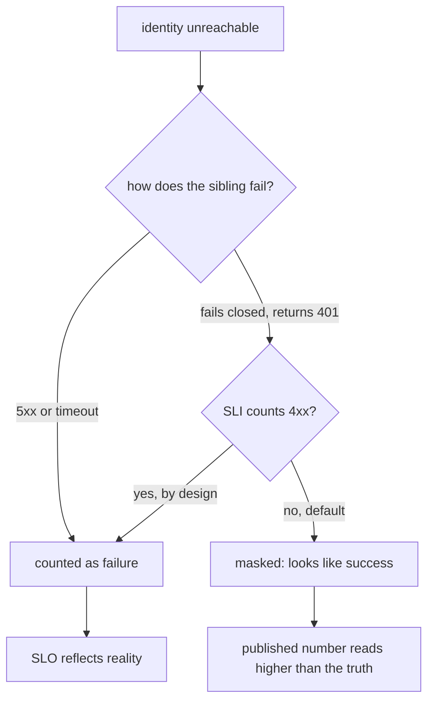

# Error budget math when your SLO has correlated dependencies

*why multiplying service availability numbers gives the wrong answer when those services share a dependency*

A few terms first, because the rest of the article leans on them. An **SLI** (service level indicator) is a measured number, for example the fraction of requests that succeeded over the last 28 days. An **SLO** (service level objective) is the target you commit to, for example "99.9 percent of requests succeed." The **error budget** is the slack the SLO gives you: a 99.9 SLO permits 0.1 percent failure, about 43 minutes of allowed downtime over a 30-day month. The on-call alert fires when that budget runs dry. One more, since it shows up everywhere below: a **postmortem** is the written review a team produces after an outage, explaining what broke and why.

The first time someone showed me the math for composing service availability, I nodded along. Service A is 99.9, service B is 99.9, your endpoint calls both, so it is 0.999 times 0.999, about 99.8.

That formula is true only when the failure events are independent, and almost nothing in a real system is independent. The moment two services share a database, a login service, a control plane (the central system that configures and coordinates the other services, as opposed to the ones that handle user traffic), a region, or a deployment pipeline, one underlying failure can knock them both out at the same instant.

Two more words for the call tree. A *sibling* is a service at the same level as its peers; here, three services your endpoint calls. A *shared ancestor* is a dependency all of them call (here, an identity service that validates login tokens). If each sibling's published availability already includes the ancestor's downtime, multiplying the siblings counts that ancestor outage two or three times over and reports a number lower than reality. If instead each sibling's SLI quietly drops ancestor-caused failures, the product reports a number higher than reality.

This post works through that gap with a running example: a search endpoint `/v1/search/items` that depends on three services, all leaning on the same identity service. The textbook calculation says 99.9 where the honest ceiling is closer to 99.5.

## The textbook formula and its hidden assumption

For an endpoint that requires `n` independent dependencies to succeed, the combined availability is the product of the individual availabilities. If each dependency is `A_i`, the endpoint sees:

```
A_endpoint = A_1 * A_2 * A_3 * ... * A_n
```

Three dependencies at 99.95 each gives `0.9995^3` which is roughly 99.85. That is comfortable enough to commit to a 99.9 user-facing SLO, as long as you have a little client-side retry headroom: room to retry a failed request from the caller's side and turn it into a success before the budget records a failure. Retries only help for brief, independent failures where a second attempt lands on a healthy copy; against the shared-dependency outage this article is about, every retry hits the same dead dependency.

The hidden assumption is that "service 1 is down" and "service 2 is down" are statistically independent: one event's outcome carries zero information about the other. But knowing service 1 is down often tells you a lot about service 2, because a single shared outage takes both out together.

A more honest formula for two services with a shared failure mode is:

```
P(both up) = P(both up | shared healthy) * P(shared healthy)
           + P(both up | shared down)    * P(shared down)
```

This is the law of total probability: split the world by the state of the shared dependency, find the odds in each state (the `|` is read "given"), and weight each by how often that state occurs. If a shared dependency being down forces both downstream services to fail (no fallback), then `P(both up | shared down)` is zero, the second term disappears, and joint availability cannot exceed `P(shared healthy)`, the shared dependency's own availability.

Two relational words there. A *downstream* service is one your service calls; an *upstream* service is one that calls yours. A *fallback* is a backup path that lets a service keep working when a dependency is down.

## The running example

Endpoint: `/v1/search/items`. It hits three services in sequence:

- `query-planner`: parses the query, decides which indices to hit. Calls `identity` on every request to validate the caller's token.
- `index-shard-router`: spreads the work across the right shards (it *fans out*, meaning one incoming request turns into several outgoing calls). Calls `identity` to authorize lookups across tenants. A *tenant* is one customer or account in a system that serves many; *cross-tenant* means a request that touches more than one, which needs an extra permission check.
- `result-ranker`: scores and orders the candidate set. Calls `identity` to pull the caller's preference vector (the stored numbers that describe what this user tends to favor, used to tune the ranking).

Each of the three sibling services has a published 99.95 availability over the trailing 28 days (a window covering the most recent 28 days, sliding forward each day). Identity has a published 99.9. The naive multiplication says:

```
0.9995 * 0.9995 * 0.9995 = 0.9985  -> 99.85% endpoint availability
```

This is the number someone put in the SLO doc. It is wrong.

```
                    +-----------------+
                    |    identity     |  99.90
                    +--------+--------+
                             |
        +--------------------+--------------------+
        |                    |                    |
        v                    v                    v
+---------------+   +-----------------+   +-----------------+
| query-planner |   | index-shard-rtr |   |  result-ranker  |
|     99.95     |   |      99.95      |   |      99.95      |
+-------+-------+   +--------+--------+   +--------+--------+
        |                    |                     |
        +--------------------+---------------------+
                             |
                             v
                  /v1/search/items endpoint
```

The 99.95 numbers already include downtime caused by identity outages, because each sibling's availability is measured at its own ingress: the entry point where requests first arrive at that service. When identity goes down, all three siblings go down with it, and that single shared outage gets counted three times in the multiplication.

## Decomposing the failure modes

Separate each sibling's downtime into two buckets: the shared dependency (identity), and anything else (its own bugs, host failures, deploys).

Let `D_shared` be the fraction of time identity is down, and `D_i_own` the fraction of time sibling `i` is down for its own reasons. Assume the "own" failures are roughly independent across siblings. This is a much weaker assumption than full independence: it only requires that one sibling's bugs and deploys do not coincide with another's.

Each sibling's measured availability is roughly:

```
A_i = 1 - (D_shared + D_i_own)
```

If identity is 99.9, then `D_shared` is 0.001. If the sibling reports 99.95, then its total downtime `D_shared + D_i_own` is 0.0005. That is impossible: a service cannot be down less often than a dependency it needs on every request. Either the sibling has a fallback that survives identity outages, or the measurement excludes them, or one of the numbers is wrong.

In practice the answer is often "the measurement excludes them," and the mechanism depends on how the SLI was defined. The sibling's SLI is typically computed against requests the sibling itself processed. When identity is unreachable, a well-behaved sibling returns a 5xx (an HTTP status code in the 500-599 range, meaning the server itself failed) or times out, which any reasonable SLI counts as failure. But the auth middleware (the code that runs in the request path to check the caller's login before the real work begins) commonly *fails closed*: on any error it denies access rather than allowing it. A thrown auth error then surfaces as a 401 (the HTTP status for "unauthorized"). The common convention is to attribute 4xx codes (the 400-499 range, meaning the client made a bad request) to the client and leave them out of the error budget, so those identity-driven 401s get counted as clean responses.



An SLI explicitly defined to count 401 spikes, or timeouts and 5xx during dependency outages, would catch it. The masking is a property of the SLI definition; it makes your published availability read higher than the truth.

Assume for the example that the siblings are honest and report end-to-end availability including identity-caused failures. Then the joint endpoint availability we want is:

```
A_endpoint = P(all three siblings up at the same time)
           = P(identity up) * P(all three "own" components up | identity up)
           = (1 - D_shared) * (1 - D_1_own) * (1 - D_2_own) * (1 - D_3_own)
```

With `D_shared = 0.001` and each total downtime 0.0005, each `D_i_own` works out to `-0.0005`, and you cannot be down a negative fraction of the month. That proves the published 99.95 was over-counted or hides identity-caused failures.

Discard the impossible 99.95 and carry forward two consistent inputs: identity at a genuine 99.9, and each sibling at a plausible 99.99 "own" availability (down for its own reasons one part in ten thousand). Combining those gives each sibling's realistic end-to-end availability:

```
A_i = (1 - 0.001) * (1 - 0.0001) = 0.999 * 0.9999 = 0.9989
```

From here on we use the realistic 99.89 percent rather than the published 99.95 percent.

## The actual joint availability

With the corrected sibling availability of 99.89, the naive product is:

```
0.9989^3 = 0.9967  ->  99.67%
```

Already lower than the 99.85 we started with. But the joint availability with a shared failure mode is not the product:

```
P(all three up) = P(identity up) * P(all three own components up)
                = 0.999 * (0.9999)^3
                = 0.999 * (0.9999 * 0.9999 * 0.9999)
                = 0.999 * 0.99970003
                = 0.99870
```

The honest endpoint availability is 99.87, not 99.85 and not 99.9. The correct number comes out *higher* than the naive 99.67 because the naive product triple-charges identity's outage; the shared-dependency math counts it once.

Now flip one variable. Say identity is closer to 99.5 because it had a noisy quarter and a regional event ate two hours of budget. (We still treat identity as one shared node, so that event just lowers identity's single number. A region shared across several dependencies would instead be its own shared ancestor, modeled the same way as identity.) Recompute:

```
P(all three up) = 0.995 * (0.9999)^3
                = 0.995 * 0.99970003
                = 0.99471
```

You are at 99.47. Your SLO says 99.9. The number leadership will ask about is the *burn rate*: how fast you are using up the error budget, often stated as a multiple of the budget. At 99.47 you are down 0.0053 of a month against an allowed 0.001, so you burn about 5.3x your monthly budget every month for as long as identity stays at 99.5. The naive product, by contrast, would have said:

```
A_i = 0.995 * 0.9999 = 0.99490
0.99490^3 = 0.9848  ->  98.48%
```

That naive number means you are down 0.0152 of the month, about 15x the budget. The shared-dependency math says 5.3x, and that is the real one. Either way the published 99.9 SLO is unattainable.

## A working calculator

This is the kind of script I keep in a `tools/` directory and run before every quarterly SLO review. It takes a tree of dependencies with shared ancestors and prints the ceiling. The `Dep` field `own_availability` means different things by role: for a sibling it is availability ignoring shared deps, the "own reasons only" number; for the shared ancestor (`identity`), nothing sits above it in this model, so it is simply the full total availability.

```python
from dataclasses import dataclass, field

@dataclass
class Dep:
    name: str
    own_availability: float          # availability ignoring shared deps
    shared: list = field(default_factory=list)  # list[Dep]

def joint_availability(siblings):
    """
    Compute P(all siblings up) accounting for shared ancestors.
    Assumes 'own' failures are independent across siblings, and
    assumes every shared ancestor is needed by EVERY sibling (as
    identity is here), so each is multiplied in exactly once. An
    ancestor used by only some siblings would be over-counted,
    applying its downtime to the whole product; that case needs a
    per-sibling grouping not done here.
    """
    # Collect all unique shared ancestors.
    # Assumes all references to a given shared dep use the same object;
    # if two siblings declare the same name with different own_availability,
    # the last write wins. Add an assertion in production.
    shared_set = {}
    for s in siblings:
        for dep in s.shared:
            if dep.name in shared_set:
                assert shared_set[dep.name] is dep, (
                    f"conflicting definitions for shared dep {dep.name!r}"
                )
            shared_set[dep.name] = dep
    shared = list(shared_set.values())

    # P(all shared up) = product of shared availabilities
    p_shared_all_up = 1.0
    for d in shared:
        p_shared_all_up *= d.own_availability

    # P(all siblings' own components up)
    p_own = 1.0
    for s in siblings:
        p_own *= s.own_availability

    return p_shared_all_up * p_own

# identity is a shared ancestor: own_availability here is its FULL
# availability, since it has no ancestor of its own in this model.
identity = Dep("identity", own_availability=0.999)
planner = Dep("query-planner",     own_availability=0.9999, shared=[identity])
router  = Dep("index-shard-router", own_availability=0.9999, shared=[identity])
ranker  = Dep("result-ranker",     own_availability=0.9999, shared=[identity])

a = joint_availability([planner, router, ranker])
# Using a 30-day month; align with your SLO window
# (28-day rolling is also common).
budget_minutes_per_month = (1 - a) * 30 * 24 * 60
print(f"endpoint availability: {a:.5f}")
print(f"monthly downtime: {budget_minutes_per_month:.1f} min")
```

For the 99.9 identity case this prints 99.87 and about 56 minutes a month of actual downtime. (Not the 43 minutes from the glossary: 43 is the budget allowed at a 99.9 target, 56 is what you actually incur at the 99.87 ceiling, which is why you cannot honestly promise 99.9 here.) For the 99.5 identity case it prints 99.47 and about 230 minutes a month. Run this against your real numbers before you commit to the SLO.

## What to do about it

In rough order of effort.

**Set the SLO at the honest ceiling, not the aspirational one.** If your shared ancestor is 99.9, you cannot promise 99.95 to callers without a fallback that survives the ancestor being down. Promise it anyway and you will keep explaining the same shortfall every month.

**Track the ancestor's availability as a leading indicator.** When identity's trailing-7 (the rolling 7-day window) starts to slip, your endpoint's trailing-28 (the rolling 28-day window) will slip a few weeks later. Put the ancestor on the same dashboard as your endpoint, with the same color coding, so engineers do not click through three tiers to find out why their budget is bleeding. The routing problem this creates, where a single ancestor outage fires every downstream SLO alert at once, is a separate concern.

**Build a fallback path for the ancestor where you can.** For identity, this often means caching successful token checks for a short window, so a 30-second identity blip does not become 30 seconds of universal 401s. A *JWT* (JSON Web Token: a signed, self-contained token that carries the user's claims inside it) sidesteps the problem entirely. The service receiving it can check the signature locally against cached *signing keys* (the public keys that prove the token came from the identity service and was not tampered with), so it never has to call identity per request. An *opaque token*, by contrast, carries no readable claims; it is just an identifier, so you must ask identity what it means. That ask is called *token introspection*, and caching its result is the equivalent move. The standard that defines it (RFC 7662, where RFC means Request for Comments, the series that defines internet standards) calls out the tradeoff: a revoked token stays valid until its cache entry expires, so faster revocation costs you availability and vice versa. The tradeoff is usually worth it for read paths. Do not cache for write paths or anything that grants new access, where a stale "still valid" answer is most dangerous.

**Compute and publish a "minus shared" availability number.** Alongside your headline SLO, publish your endpoint's availability with shared-ancestor downtime removed. This separates "we are slow because identity is having a quarter" from "we are slow because we shipped a bad deploy." Without the split, every postmortem becomes a fight about fault.

**Stop letting downstream SLIs hide upstream failures.** If your sibling service measures availability only against requests it actually saw, identity outages can disappear from its dashboard. Add a synthetic, a fake test request sent on a schedule, that hits the sibling through the full request path including auth, and use that for the SLI. The numbers will be uglier but true.

## Why teams pick the optimistic number

The arithmetic above is not hard, so the reason published SLOs come out too optimistic is not the math. It is that nobody wants to be the person who writes "99.5" in the cell where leadership expected "99.9." The naive multiplication is convenient, and it lets everyone go back to their roadmap.

The cost shows up later, in 3 AM pages and quarterly explanations of why the burn rate alert went off. Do the honest math up front and you choose between investing in fault tolerance, lowering the published number, or accepting the burn, on a calm afternoon rather than during an outage.
