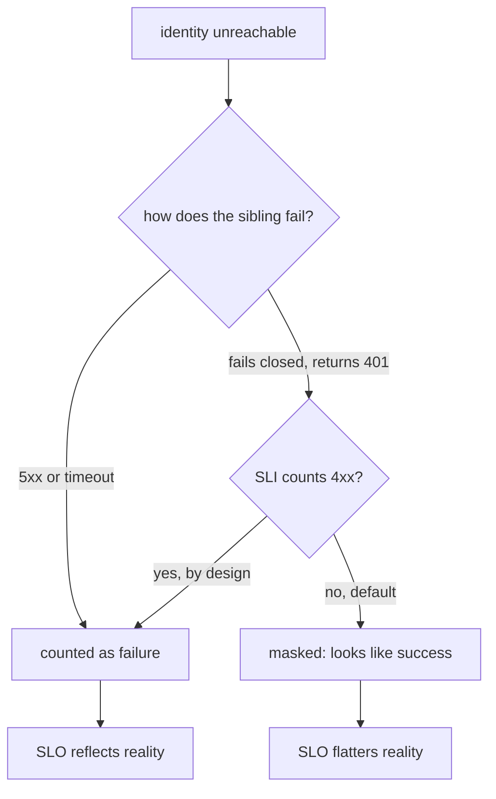

# Error budget math when your SLO has correlated dependencies

*multiplying availability numbers across services assumes failures are independent. They are not, and the gap is where your pager lives*

Three terms first. An **SLI** (service level indicator) is a measured number, for example the fraction of requests that succeeded over the last 28 days. An **SLO** (service level objective) is the target you commit to, for example "99.9 percent of requests succeed." The **error budget** is the slack the SLO gives you: a 99.9 SLO permits 0.1 percent failure, about 43 minutes of allowed downtime over a 30-day month. The pager fires when that budget runs dry.

The first time someone showed me the math for composing service availability, I nodded along because it looked like statistics I half-remembered from school. Service A is 99.9, service B is 99.9, your endpoint calls both, so your endpoint is 0.999 times 0.999 which rounds to 99.8. Cute. Everyone nods and goes back to fighting fires.

The formula is true only when the failure events are independent, and almost nothing in a real system is independent. Independence is an assumption about the math; shared fate is the physical thing that violates it. The moment two services share a database, an auth provider, a control plane, a region, a deployment pipeline, or a single overworked SRE, one underlying failure can knock them both out at the same instant. A *sibling* is a service at the same level of the call tree as its peers; a *shared ancestor* is a dependency they all call (here, an identity service). If each sibling's published availability folds in the ancestor's downtime, multiplying the siblings counts that ancestor outage two or three times over and reports a number lower than reality. If instead each sibling's SLI quietly drops ancestor-caused failures, the product flatters reality. Either way the arithmetic is fiction; the only question is which sign of fiction you are buying.

This post works through that gap with a running example: a search endpoint `/v1/search/items` that depends on three services, all leaning on the same identity service for token validation. I will show why the textbook calculation says 99.9, why the honest ceiling is closer to 99.5, and what to do about it before someone hands you a postmortem.

## The textbook formula and where it lies

For an endpoint that requires `n` independent dependencies to succeed, the combined availability is the product of the individual availabilities. If each dependency is `A_i`, the endpoint sees:

```
A_endpoint = A_1 * A_2 * A_3 * ... * A_n
```

Three dependencies at 99.95 each gives `0.9995^3` which is roughly 99.85. Comfortable enough to commit to a 99.9 user-facing SLO if you have a little client-side retry headroom.

The hidden assumption is that "service 1 is down" and "service 2 is down" are statistically independent. Independence has a precise meaning: one event's outcome carries zero information about the other, and only then is the joint probability of both being down the product of the individuals. Knowing service 1 is down often tells you a great deal about service 2, because a single shared outage takes both out together.

A more honest formula for two services with a shared failure mode is:

```
P(both up) = P(both up | shared healthy) * P(shared healthy)
           + P(both up | shared down)    * P(shared down)
```

This is the law of total probability: split the world by the state of the shared dependency, find the odds in each state (the `|` is read "given"), and weight each by how often that state occurs. Conditioning on the shared dependency lets the correlation show up explicitly instead of being smuggled in by a false independence assumption. If a shared dependency being down forces both downstreams to fail (no fallback), then `P(both up | shared down)` is zero, the second term collapses, and joint availability cannot exceed `P(shared healthy)`, the shared dependency's own availability. Without a fallback, you cannot be more available than your weakest common ancestor. (Fallbacks exist; we get to them below.)

## The running example

Endpoint: `/v1/search/items`. Hits three services in sequence:

- `query-planner`: parses the query, decides which indices to hit. Calls `identity` on every request to validate the caller's token.
- `index-shard-router`: fans out to the right shards. Calls `identity` to authorize cross-tenant lookups.
- `result-ranker`: scores and orders the candidate set. Calls `identity` to pull the caller's preference vector.

Each of the three sibling services has a published 99.95 availability over the trailing 28 days. The identity service has a published 99.9. The naive multiplication says:

```
0.9995 * 0.9995 * 0.9995 = 0.9985  -> 99.85% endpoint availability
```

This is the number someone put in the SLO doc. It is wrong, because none of those three 99.95 numbers are actually independent of the 99.9 identity number.

```
                    +-----------------+
                    |    identity     |  99.90
                    +--------+--------+
                             |
        +--------------------+--------------------+
        |                    |                    |
        v                    v                    v
+---------------+   +-----------------+   +-----------------+
| query-planner |   | index-shard-rtr |   |  result-ranker  |
|     99.95     |   |      99.95      |   |      99.95      |
+-------+-------+   +--------+--------+   +--------+--------+
        |                    |                     |
        +--------------------+---------------------+
                             |
                             v
                  /v1/search/items endpoint
```

The 99.95 numbers already include downtime caused by identity outages, because each sibling's availability is measured at its own ingress. When identity goes down, all three siblings go down with it, and that joint downtime is counted three separate times in the multiplication.

## Decomposing the failure modes

Separate each sibling's downtime into two buckets: downtime caused by the shared dependency (identity), and downtime caused by anything else (its own bugs, host failures, deploys).

Let `D_shared` be the fraction of time identity is down, and `D_i_own` the fraction of time sibling `i` is down for its own reasons. Assume the "own" failures are roughly independent across siblings, a much weaker assumption than full independence: it only requires that one sibling's bugs and deploys do not coincide with another's, not that they survive a shared outage together.

Each sibling's measured availability is roughly:

```
A_i = 1 - (D_shared + D_i_own)
```

If identity is 99.9, then `D_shared` is 0.001. If the sibling reports 99.95, then its total downtime `D_shared + D_i_own` is 0.0005. That is impossible: total downtime (0.0005) is smaller than the shared dependency's downtime alone (0.001), and a service cannot be down less often than a dependency it requires on every request. Either the sibling has a fallback that survives identity outages, or the measurement excludes them, or one of the numbers is wrong.

In practice the answer is often "the measurement excludes them," and the mechanism depends on how the SLI was defined. The sibling's SLI is typically computed against requests the sibling itself processed. When identity is unreachable, a well-behaved sibling surfaces a 5xx or times out, which any reasonable SLI counts as failure. But auth middleware commonly fails closed: a thrown auth exception surfaces as a 401, indistinguishable from a genuinely unauthenticated caller. Standard SRE practice attributes 4xx to the client and excludes it from the error budget, so those identity-driven 401s get counted as clean responses. The customer sees failures; the dashboard sees success.



An SLI explicitly defined to count 401 spikes, or timeouts and 5xx during dependency outages, would catch it. The masking is a property of the SLI definition, and it means your published SLOs are often more flattering than reality.

Assume for the example that the siblings are honest and report end-to-end availability including identity-caused failures. Then the joint endpoint availability we want is:

```
A_endpoint = P(all three siblings up at the same time)
           = P(identity up) * P(all three "own" components up | identity up)
           = (1 - D_shared) * (1 - D_1_own) * (1 - D_2_own) * (1 - D_3_own)
```

With `D_shared = 0.001` and each total downtime 0.0005, each `D_i_own` works out to `-0.0005`, and you cannot be down a negative fraction of the month. That negative number is proof the published 99.95 was wrong, over-counted, or measured in a way that hides identity-caused failures.

We need a coherent set of numbers to carry forward. Discard the impossible 99.95 and work with two consistent inputs: identity at a genuine 99.9, and each sibling at a plausible 99.99 "own" availability (down for its own reasons one part in ten thousand). Combining those gives each sibling's realistic end-to-end availability:

```
A_i = (1 - 0.001) * (1 - 0.0001) = 0.999 * 0.9999 = 0.9989
```

From here on we use the realistic 99.89 percent rather than the published 99.95 percent.

## The actual joint availability

With the corrected sibling availability of 99.89, the naive product is:

```
0.9989^3 = 0.9967  ->  99.67%
```

Already lower than the 99.85 we started with. But the joint availability with a shared failure mode is not the product:

```
P(all three up) = P(identity up) * P(all three own components up)
                = 0.999 * (0.9999)^3
                = 0.999 * 0.99970003
                = 0.99870
```

The honest endpoint availability is 99.87, not 99.85 and not 99.9. The correct number comes out *higher* than the naive 99.67 because the naive product triple-charges identity's outage: `0.9989^3` bakes the shared outage into each of the three siblings and then multiplies. The shared-dependency math counts that outage once.

Now flip one variable. Say identity is closer to 99.5 because it had a noisy quarter and a regional event ate two hours of budget. Recompute:

```
P(all three up) = 0.995 * (0.9999)^3
                = 0.995 * 0.99970003
                = 0.99471
```

You are at 99.47. Your SLO says 99.9. The burn multiple leadership will ask about: 99.47 means you are down 0.0053 of a month against an allowed 0.001, so you burn about 5.3x your monthly budget every month for as long as identity stays at 99.5. The naive product, by contrast, would have said:

```
A_i = 0.995 * 0.9999 = 0.99490
0.99490^3 = 0.9848  ->  98.48%
```

That naive number means you are down 0.0152 of the month, about 15x the budget. The naive number screams "you are toast." The shared-dependency number says "you are bad but not that bad." In both cases the published 99.9 SLO is fiction; the gap is whether the budget hole is 5x or 15x.

## A working calculator

Here is the kind of script I keep in a `tools/` directory and run before every quarterly SLO review. It takes a tree of dependencies with shared ancestors and prints the realistic ceiling. The `Dep` field `own_availability` carries two meanings by role: for a sibling it is availability ignoring shared deps, the "own reasons only" number, while for the shared ancestor (`identity`), nothing sits above it in this model, so its `own_availability` is simply its full total availability.

```python
from dataclasses import dataclass, field

@dataclass
class Dep:
    name: str
    own_availability: float          # availability ignoring shared deps
    shared: list = field(default_factory=list)  # list[Dep]

def joint_availability(siblings):
    """
    Compute P(all siblings up) accounting for shared ancestors.
    Assumes 'own' failures are independent across siblings.
    """
    # Collect all unique shared ancestors.
    # Assumes all references to a given shared dep use the same object;
    # if two siblings declare the same name with different own_availability,
    # the last write wins. Add an assertion in production.
    shared_set = {}
    for s in siblings:
        for dep in s.shared:
            if dep.name in shared_set:
                assert shared_set[dep.name] is dep, (
                    f"conflicting definitions for shared dep {dep.name!r}"
                )
            shared_set[dep.name] = dep
    shared = list(shared_set.values())

    # P(all shared up) = product of shared availabilities
    p_shared_all_up = 1.0
    for d in shared:
        p_shared_all_up *= d.own_availability

    # P(all siblings' own components up)
    p_own = 1.0
    for s in siblings:
        p_own *= s.own_availability

    return p_shared_all_up * p_own

# identity is a shared ancestor: own_availability here is its FULL
# availability, since it has no ancestor of its own in this model.
identity = Dep("identity", own_availability=0.999)
planner = Dep("query-planner",     own_availability=0.9999, shared=[identity])
router  = Dep("index-shard-router", own_availability=0.9999, shared=[identity])
ranker  = Dep("result-ranker",     own_availability=0.9999, shared=[identity])

a = joint_availability([planner, router, ranker])
# Using a 30-day month; align with your SLO window
# (28-day rolling is also common).
budget_minutes_per_month = (1 - a) * 30 * 24 * 60
print(f"endpoint availability: {a:.5f}")
print(f"monthly downtime: {budget_minutes_per_month:.1f} min")
```

For the 99.9 identity case this prints 99.87 and about 56 minutes a month of actual downtime. (Not the 43 minutes from the glossary: 43 is the budget allowed at a 99.9 target, 56 is what you incur at the 99.87 ceiling, which is why you cannot honestly promise 99.9 here.) For the 99.5 identity case it prints 99.47 and about 230 minutes a month. Run this against your real numbers before you commit to the SLO, not after the first month of burn.

## What to do about it

In rough order of effort.

**Set the SLO at the honest ceiling, not the aspirational one.** If your shared ancestor is 99.9, you cannot promise 99.95 to your callers without a fallback that survives the ancestor being down. Promising it anyway just means you spend every all-hands explaining a hole that is structurally impossible to close.

**Track the ancestor's availability as a leading indicator.** When identity's trailing-7 starts to slip, your endpoint's trailing-28 will slip a few weeks later. Put the ancestor on the same dashboard as your endpoint, same color coding, so engineers do not click through three tiers to figure out why their budget is bleeding. The routing problem this creates (a single ancestor outage firing every downstream SLO alert at once) is a separate concern; this post focuses on the math.

**Build a fallback path for the ancestor where possible.** For identity, this often means caching positive token validations for a short window so a 30-second identity blip does not turn into 30 seconds of universal 401s. Self-contained signed JWTs sidestep it entirely: the resource server validates them locally against cached signing keys and never calls identity per request. For opaque tokens you do have to call identity (token introspection), and caching that result is the equivalent move. RFC 7662's security considerations call out the tension: a revoked token stays valid until its cache entry expires, so revocation freshness is the price of the availability. The tradeoff is usually worth it for read paths. Do not cache for write paths or anything that grants new access, where stale "still valid" answers are most dangerous.

**Compute and publish a "minus shared" availability number.** Alongside your headline SLO, publish your endpoint's availability excluding shared-ancestor downtime. This separates "we are slow because identity is having a quarter" from "we are slow because we shipped a bad deploy." Without the split, every postmortem turns into a fight about whose fault it was.

**Stop letting downstream SLIs hide upstream failures.** If your sibling service measures availability against requests it actually saw, identity outages can disappear from its dashboard. Add a synthetic that hits the sibling through the full request path including auth, and use that for the SLI. The numbers will be uglier, but they will be true.

## The thing nobody puts in the doc

The arithmetic above is not hard. Every team's published SLO is too optimistic not because the math is too advanced, but because nobody wants to be the person who writes "99.5" in the cell where leadership expected "99.9." The naive multiplication is a polite fiction that lets everyone go back to their roadmap.

The cost of that fiction is paid in 3 AM pages and quarterly explanations of why the burn rate alert went off. Do the honest math up front and you get to choose between investing in fault tolerance, lowering the published number, or eating the burn, and you make that choice on a calm afternoon instead of in a postmortem with three vice presidents on the call. It is not glamorous work, but neither is explaining for the fourth time why your endpoint cannot be more available than the auth service it depends on.
