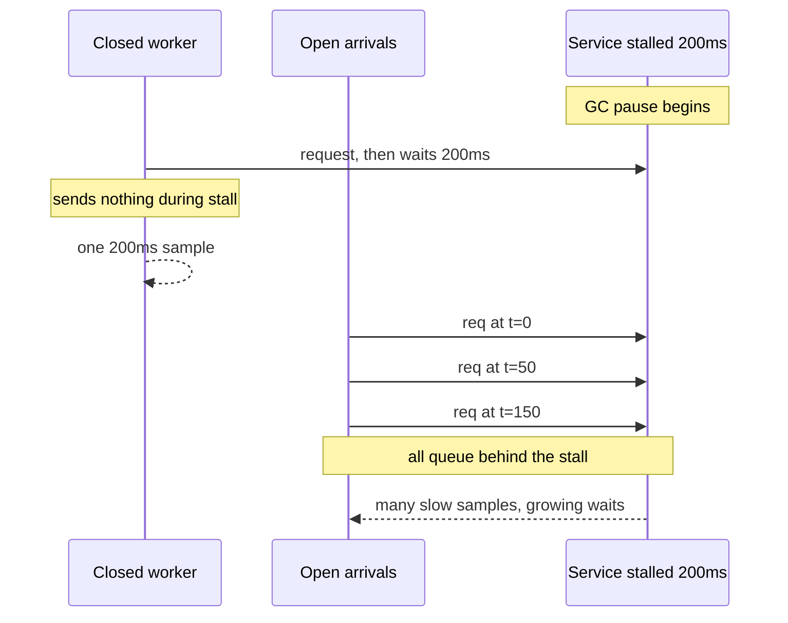

# Why your load test lies: open versus closed workload models

*a 12ms p99 that turns into 340ms the moment you stop politely waiting*

There is a particular flavor of performance regression that only shows up in production. The load test was green. The dashboards were green. The team shipped, and within twenty minutes of real traffic the latency graphs went vertical. Nobody had introduced a bug. The load test was just answering a different question than the one everyone thought it was.

One note on units, since the whole essay turns on them: p99 is the 99th percentile latency, the value below which 99% of requests fall, so it describes the slow tail; p50, the median, is the typical request. What follows is how a test can report a healthy tail while the real tail is on fire.

The question the test answered: "how fast does this service respond when I send a request, wait politely for the response, and only then send the next one?" The question everyone thought it answered: "how does this service behave when real users keep arriving regardless of how slow it is?"

These are not the same. The first is a closed-loop model: a fixed set of workers that each wait for a reply before sending again, so the worker count is the dial. The second is an open-loop model: requests arrive on a clock that does not care how slow the service is. The gap between them is where p99 numbers go to die.

## The setup

Picture a recommendation service called `dovetail` that serves personalized product cards. The team runs a nightly benchmark with a tool I will call `loadwhip` (any closed-loop tool with concurrency knobs works the same way). The script looks roughly like this:

```python
# nightly_bench.py - the seductive lie
import asyncio, httpx, time

CONCURRENCY = 200
DURATION_S = 60
URL = "http://dovetail.internal/cards?user=42"

async def worker(client, results):
    end = time.monotonic() + DURATION_S
    while time.monotonic() < end:
        t0 = time.monotonic()
        r = await client.get(URL)
        results.append((time.monotonic() - t0) * 1000)

async def main():
    results = []
    async with httpx.AsyncClient(timeout=10) as client:
        await asyncio.gather(*[worker(client, results) for _ in range(CONCURRENCY)])
    results.sort()
    p50 = results[len(results) // 2]
    p99 = results[int(len(results) * 0.99)]
    print(f"requests={len(results)} p50={p50:.1f}ms p99={p99:.1f}ms")

asyncio.run(main())
```

This reports something like:

```
requests=482103  p50=4.2ms  p99=12.1ms
```

A 12ms p99 at 200 concurrent workers. Ship it.

The next morning real traffic arrives. It is not 200 polite workers but an arrival process: a stream of requests whose timing is set by external demand, not by how fast the server happens to be. A request shows up roughly every N microseconds, whether or not the previous one has finished. The same service, under the same total request rate, suddenly reports a p99 of 340ms. The benchmark hasn't changed. The service hasn't changed. Only the model has.

## Closed loop versus open loop

The terminology comes from queueing theory, where it has been understood for roughly sixty years and ignored for most of them:

```
CLOSED LOOP (what most load testers do by default)
+---------+   request    +---------+
| worker  | -----------> | service |
| (waits) | <----------- |         |
+---------+   response   +---------+
   |  ^
   |  | "I will not send the next one
   v  |  until I see the response"

OPEN LOOP (what real users do)
+---------+   request    +---------+
| arrival | -----------> | service |
| process |              |         |
+---------+              +---------+
   |
   | new request fires on a schedule,
   v independent of any response
```

In the closed model, the load generator has a fixed number of "virtual users", each a strict request/response loop. If the service slows down, the workers slow with it and the offered load drops automatically. The system can never overload itself because the test is implicitly back-pressured: a slow response makes a worker wait, and a waiting worker issues fewer requests. The thing being measured throttles the thing doing the measuring.

In the open model, arrivals are independent of completions. If the service slows down, requests pile up and queue depth grows; latency for the request at the back of the queue includes the wait for everything in front of it. This is what real users do: when you load a product page, your browser fires the request whether or not the previous user's request has finished.

The closed model measures service time (how long the server takes once it starts your request). The open model measures response time: service time plus queue wait (how long your request sits waiting for its turn). Response time is what a user feels. For an idle system queue wait is zero and the two coincide; for a loaded system they diverge by orders of magnitude, because queue wait is exactly the term the closed test refuses to grow.

## Why p99 looks healthy in closed mode

Here is the mechanism in one sentence: closed-loop testers self-throttle on slow responses, so the slow responses never get to interact with each other.

Imagine `dovetail` has a GC pause (a garbage-collector stop-the-world freeze, where the runtime halts request work to reclaim memory) every few seconds that adds 200ms to about 0.5% of responses. The two models handle that stall in opposite ways:



The closed worker that hits the stall just waits: one bad sample, and the 99th percentile barely moves. That stability is a measurement artifact. The p99 holds steady only because the generator silently drops the requests it would otherwise have sent during the stall, so it under-reports the tail. That is a bug in the test, not a healthy service. In open mode at the same average rate, every request arriving during those 200ms inherits a wait that grows as the queue lengthens, so one 200ms event becomes many bad responses and the p99 craters. (The runtime mitigation, adaptive concurrency limits, is a separate story; see [blog #14](/article/adaptive-concurrency-limits.html). The point here is that the test never surfaced the problem at all.)

This is what Gil Tene named "coordinated omission" in his 2013 talk: the generator and the service have implicitly coordinated to omit the consequences of slow events. The bad samples that should exist were never generated, because the very workers that would have generated them were stuck waiting on the stall.

## What the corrected number looks like

When we rerun the `dovetail` benchmark with an open-model generator, we read the achieved throughput off the closed test, then fire at exactly that rate. The numbers below are illustrative for this fictional service, though the order-of-magnitude shape is consistent with published coordinated-omission demonstrations by Gil Tene and ScyllaDB:

| Metric | Closed loop (200 workers) | Open loop (matching rate) |
|---|---|---|
| Throughput | 8,035 rps | 8,035 rps |
| p50 | 4.2 ms | 5.1 ms |
| p90 | 6.9 ms | 18 ms |
| p99 | 12.1 ms | 340 ms |
| p99.9 | 18.4 ms | 1,820 ms |
| Max | 220 ms | 4,100 ms |

Throughput matched because `dovetail` had enough capacity at 8,035 rps; had the open-loop test targeted higher than the service could sustain, achieved throughput would fall below target and the queue would grow for the whole run rather than converging. p50 is barely different. p99 is 28x worse, p99.9 roughly 100x worse. The tail diverges far more than the median because a median request almost never lands during a stall, while a tail request arrived behind one and inherited the full queue; the deeper into the tail, the longer the queue it landed behind. The closed test hid those exact requests.

The shape of the divergence is the diagnostic: if open and closed numbers differ a lot at the tail and little at the median, you have a queueing problem hiding behind a closed-loop test. If they differ at both, you also have a throughput ceiling problem.

## How to actually configure an open-loop test

The major modern load testers all support open-loop generation. You just have to ask for it explicitly, because the defaults are almost always closed-loop. A few that I have used:

- `wrk2`, Gil Tene's fork of Will Glozer's `wrk`, written specifically to address coordinated omission. Pass `-R <rate>` and it will fire at that rate regardless of response time, measuring latency from the time the transmission should have occurred rather than from when it actually went out.
- `k6` has `constant-arrival-rate` and `ramping-arrival-rate` executors. The default `constant-vus` executor models a fixed pool of looping virtual users, which is closed-loop in effect for single-request scenarios. The arrival-rate executors are open-loop.
- `vegeta` is open-loop by default. `vegeta attack -rate=8000/s -duration=60s` does the right thing without ceremony.
- `Gatling` has `constantUsersPerSec` and `rampUsersPerSec`. Its `constantConcurrentUsers` and `rampConcurrentUsers` are closed-loop (the `injectClosed` model); the open-model injection steps include `atOnceUsers`, `rampUsers`, `constantUsersPerSec`, and `rampUsersPerSec` ([docs.gatling.io/concepts/injection/](https://docs.gatling.io/concepts/injection/)).

Here is the same benchmark rewritten in `k6` as an open-loop test:

```javascript
// nightly_bench_open.js
import http from 'k6/http';

export const options = {
  scenarios: {
    real_traffic: {
      executor: 'constant-arrival-rate',
      rate: 8000,           // 8000 requests/sec, regardless of latency
      timeUnit: '1s',
      duration: '60s',
      preAllocatedVUs: 500,  // pool to draw from
      maxVUs: 4000,          // ceiling if service gets slow
    },
  },
  thresholds: {
    http_req_duration: ['p(99)<50'], // this is what we actually care about
  },
};

export default function () {
  http.get('http://dovetail.internal/cards?user=42');
}
```

Three things to notice. First, `rate` is in requests per second, not virtual users. Second, `preAllocatedVUs` and `maxVUs` are a pool the executor draws from when the service slows down. Set `maxVUs` high enough that the generator never becomes the bottleneck: at least `rate * worst_acceptable_latency_seconds * 4`. That is Little's law with a safety factor. Little's law says the average number of items in flight equals arrival rate times average time in the system (L = rate * latency), so you need that many VUs just to keep up on average. But the average is a floor: a 3x latency spike triples the VUs needed at fixed rate, and the 4x cap covers that with room to spare. Third, the threshold is on response time, which now includes queue wait.

If you must stay in a closed-loop tool, `wrk2` will at least correct the recorded latencies. When a response takes longer than the planned inter-arrival interval, it back-fills synthetic samples for the requests that should have been sent during the stall, timing each from its scheduled send time rather than its actual one. If requests are scheduled every 1ms and a 200ms stall hits, the request scheduled for t=50ms but not sent until t=200ms is recorded as 150ms of wait plus service, not service alone. wrk2 tracks both a corrected and an "uncorrected" histogram ([github.com/giltene/wrk2](https://github.com/giltene/wrk2)). Not as good as a real open-loop test, but dramatically better than a naive closed-loop one.

## The diagnostic checklist

If you inherit a load test and want to know whether it is lying to you, here is what to check, roughly in order of how much time it saves:

1. Look at the tool invocation. Is it `vus`, `concurrency`, `threads`, or `clients`? Closed loop. Is it `rate`, `rps`, `arrival-rate`, or `qps`? Open loop.
2. Check whether the test reports a target rate or an achieved rate. Closed-loop tools usually report only achieved rate, because the rate is whatever the service let them have. Open-loop tools report both, and the gap between target and achieved is the first thing to look at.
3. Plot p50 against p99 over time. If they move together, you are measuring service time. If p99 spikes while p50 stays flat, you are measuring queue wait, which is the real signal.
4. A closed-loop worker is serial: at most one outstanding slow request at a time, so its worst recorded response is bounded by its share of wall-clock time. Compare the observed max to `test_duration / concurrency` (a 60s run at 200 workers gives 300ms). A max suspiciously near that ceiling means the test was concurrency-bound, not service-bound: the workers set the worst case, not the service.

## When closed loop is actually correct

Closed-loop modeling is the right answer when your real workload is also closed-loop. Internal RPC chains where a calling service has a strict connection pool and applies its own backpressure are genuinely closed-loop. Batch pipelines processing fixed-size chunks are closed-loop. A queue worker with `prefetch=N` is closed-loop with N, because prefetch caps how many unacknowledged messages a consumer holds at once, so it self-limits exactly the way N looping workers do.

For these systems, a closed-loop test with `concurrency = real production concurrency` is the right model, and an open-loop test would overstate tail latency by simulating queue conditions that physically cannot occur.

The mistake is using closed-loop tests for inherently open-loop workloads: anything user-facing, anything triggered by external events, anything fronting a CDN or a mobile app. If your service is on the receiving end of an arrival process, you have to test it with one.

## What the `dovetail` team actually did

In our illustrative scenario, after the open-loop rerun produced the 340ms p99, the investigation was short. The GC log showed periodic ~200ms pauses. The fix was prosaic: switched the JVM flags, tuned the heap, and the open-loop p99 dropped by roughly an order of magnitude. The closed-loop p99 barely moved, which the old benchmark would have read as an unremarkable tuning win. The improvement at the tail was only visible because the test was finally honest.

The team also added a CI guard. The nightly benchmark now runs both models and fails if the open-loop p99 exceeds 50ms or if the gap between closed and open p99 exceeds 3x. The second check is the more interesting one: it catches new queueing pathologies before they hurt anybody, even if the absolute number still looks fine.

Run your load test both ways at least once. If the numbers agree, there is no queue hiding in the tail. If they disagree, the open-loop number is the one your users will live with.
