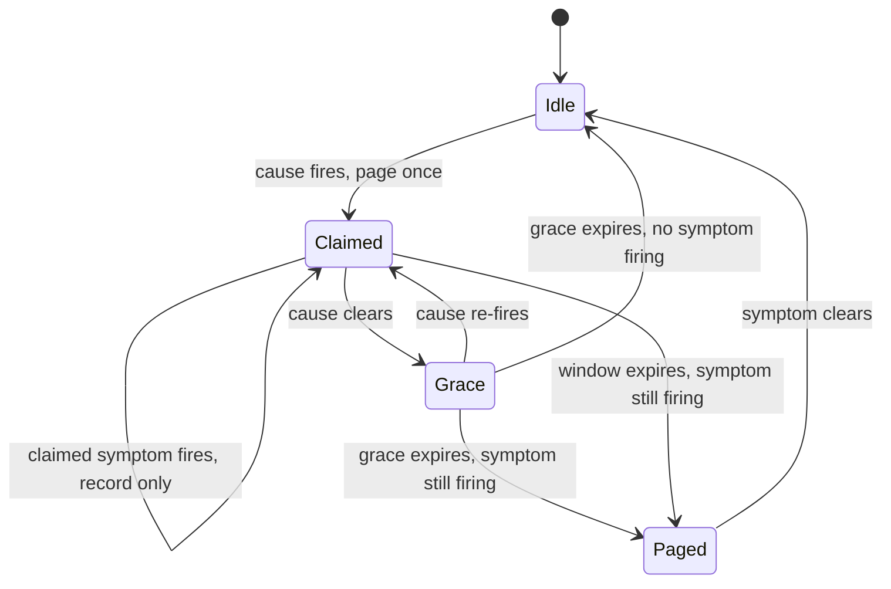

# Paging on symptoms versus causes without doubling oncall load

*the textbook says page on symptoms. The textbook has never carried your pager*

The SRE canon is clear: page on user-visible symptoms, not on internal causes. (SRE is Site Reliability Engineering, the operational discipline Google formalized; the "canon" is its written doctrine.) One symptom alert covers many causes at once, including failure modes nobody anticipated, and it stays stable across refactors while a cause-based alert library rots into a graveyard of stale rules nobody trusts. Cause-based alerts do the opposite: they miss real problems and fire on conditions users never feel. So you write four SLO burn alerts on the four things users care about.

A quick gloss, because these terms carry the whole post. An SLO (Service Level Objective) is the target you commit to for a user-facing metric, for example "checkout p99 under 2 seconds 99.9% of the time," where p99 is the 99th-percentile latency: the slowest 1% of requests are above it. That 99.9% leaves an error budget you may spend before breaching. A burn-rate alert watches how fast you are spending that budget and fires when, at the current rate, you would exhaust the month early. The budget tracks real user pain, not alert state, a fact that becomes load-bearing later. So the four alerts cover login latency, checkout success rate, search p99, and report freshness, and you sleep well.

For about three weeks.

Then the upstream message queue backs up one Tuesday morning, all four symptoms degrade at once, and your phone fires four times in ninety seconds. You acknowledge them all, you find the queue, you fix the queue, and at the retro someone politely asks why we paged the human four times for one incident. You mumble that they ARE four separate user-visible problems, and everyone nods and nobody is happy.

This is the symptom-paging tax. The textbook answer is correct but incomplete. The missing piece is a routing layer that knows which symptoms sit downstream of which causes, suppresses the duplicate noise, and still keeps the symptom alert as the authoritative answer to "is the user actually unhappy." This post walks through how we built that for a backend with one obvious bottleneck (a job queue named `dispatcher-prime`) and four consumers that all degrade when it does. The math for why a single upstream produces correlated downstream burns lives in the correlated-dependency post in this series; this post is about what the pager does once they fire.

## What "page on symptoms" actually buys you

Before throwing it out, the reason for the rule is worth restating; the fix has to preserve it.

A cause-based alert ("redis memory > 80%") fires whether or not anyone cares. Most of the time nobody does, because the system has slack, the cache is warm, or that redis isn't on the hot path anymore after last quarter's refactor. You get woken up, you look, you go back to sleep. Repeat that twice a week and you stop looking; now when it matters, the page is noise to you.

A symptom alert ("checkout p99 > 2s for 10 minutes") fires only when users are being hurt. You always look, and you always find something. The signal-to-noise ratio stays clean across years of code churn because users' tolerance for slow checkouts does not depend on whether we still use redis.

The trap is that one user-visible symptom is rarely independent of the others. A backend with shared infrastructure has fan-out: one shared dependency (a DNS resolver, a database primary, a queue, a TLS-cert renewer) feeds many consumers, so its failure radiates to all of them at once, unless those consumers have isolation or fallback to absorb it (replicas, caching, circuit breakers, graceful degradation). Where that protection is missing, symptom paging without coordination means N pages for one incident. The failure fan-out is inherent to sharing a dependency; the page fan-out is a property of how you configured alerting. The first is physics, the second is the fixable part.

## The four-page Tuesday

Here is the system; names are made up but the shape is common.

```
                     +------------------+
                     |  dispatcher-prime |  (job queue)
                     +---------+--------+
                               |
              +----------------+----------------+
              |        |       |       |       |
              v        v       v       v       v
          checkout  search  upload  notif  reports
           (SLO)    (SLO)   (SLO)  (none)  (SLO)
```

Four of the five consumers have user-facing SLOs and a burn-rate alert. The queue itself has internal metrics (depth, oldest-message age, consumer lag) but no SLO; nobody contracts on queue depth.

When `dispatcher-prime` backs up past roughly 50k messages, the four SLO alerts fire in this order, separated by each alert's evaluation window. The evaluation window (also called the lookback window) is how much recent history a burn-rate alert averages over before deciding to fire; it is distinct from a `for:` hold-down and from the two-window pair in MWMBR below. A shorter lookback reacts sooner; a longer one needs the problem to persist before it trips. That is why the pages arrive staggered rather than together.

1. `checkout_burn_fast` (2-minute window, fires first because checkout is latency-sensitive)
2. `search_burn_fast` (3-minute window)
3. `upload_throughput_low` (5-minute window)
4. `reports_burn_slow` (10-minute window)

The oncall gets four pages spread over eight minutes. By page two they've opened the queue dashboard and figured it out; pages three and four arrive while they're typing in the incident channel. The work was one investigation.

Over a quarter, the team measured that 60% of weekly pages were duplicates of this shape: one upstream issue fanning out to multiple SLO alerts that all needed to fire (the SLOs are real and users were being hurt) but only needed to wake one human. Read that 60% as a property of the input: the share of the incoming page stream that is duplicate, not a claim about how much you can remove. The achieved reduction is a separate number, measured after the fix, below.

## What does NOT work

The instinct is to disable the noisier symptom alerts and "just page on the queue." This rebuilds the cause-alert graveyard, slowly. Two refactors from now, the queue isn't on the critical path for `reports` anymore, but the queue alert still fires and wakes someone for nothing.

The other instinct is "compound" alerts ("checkout burning AND queue deep -> page; checkout burning AND queue fine -> different page"). This explodes combinatorially: with 4 symptoms and 6 plausible causes you write 24 alerts, each with its own bugs, and you still don't catch the cause you didn't think of.

The third instinct, popular in Prometheus shops, is `inhibit_rules` in Alertmanager. An inhibit rule names a source alert (typically a cause) and a target (typically a symptom): while the source fires, the target's notifications are muted. The canonical example is a "datacenter down" alert inhibiting all the per-service alerts under it. That is closer, but the default ergonomics point the wrong way: they suppress the symptom (the thing you trust) to favor the cause (the thing you don't). The symptom alert stays firing inside Alertmanager, visible in the API as `suppressed`, but the responder's pager goes quiet on the thing that measures user pain, and the muted symptoms drop out of the post-incident timeline.

## Cause-claims-symptoms routing

The pattern we landed on has three pieces, deliberately separated:

1. **Symptom alerts stay as is.** They remain the authoritative answer to "is the user unhappy." They fire, get recorded, appear on SLO dashboards, and are never disabled or muted by routing logic.
2. **Cause alerts can claim symptoms.** A cause alert (e.g. `dispatcher_prime_backlog_high`) declares which symptoms it expects to cause, and when it fires it grabs ownership of them for a suppression window.
3. **Routing pages once per claimed group.** If a symptom fires and is currently claimed by an active cause, the symptom is recorded but not paged. The cause page is the one that wakes the human, and it carries a list of the claimed symptoms so the responder knows what they're dealing with.

The critical inversion: while a claim is active the cause alert pages, but the symptom alerts are still the source of truth. If no cause has claimed a symptom when it fires, the symptom pages normally. A cause alert that claims no symptoms is just a plain alert; the claim list is what ties a cause to real user impact, which keeps this inside the textbook rule rather than abandoning it.

Two timers govern a claim. The `window` is how long the claim lasts once the cause fires (the suppression budget); the `grace_after_clear` is extra time the claim stays open after the cause clears, to ride out symptoms that resolve slowly. Here's the routing rule shape as we deploy it (simplified, but structurally what we run):

```yaml
# claim rules: cause alerts that suppress downstream symptoms
claims:
  - cause: dispatcher_prime_backlog_high
    claims_symptoms:
      - checkout_burn_fast
      - checkout_burn_slow
      - search_burn_fast
      - upload_throughput_low
      - reports_burn_slow
    window: 15m
    grace_after_clear: 5m
    notify:
      page: oncall-platform
      include_claimed: true   # symptom list appears in page body

  - cause: primary_db_replication_lag_high
    claims_symptoms:
      - reports_burn_slow         # reports reads from replicas
      - search_burn_fast          # search index refresh reads replicas
    window: 20m
    grace_after_clear: 10m
    notify:
      page: oncall-data
      include_claimed: true
```

The claim moves through a small state machine:



The path to `Paged` is the safety net: if the cause is gone but the symptom isn't, that's a separate problem worth waking someone for. Everything else stays quiet, and a claimed symptom that fires during the window is logged with a note ("suppressed by active cause: dispatcher_prime_backlog_high") rather than paged.

Budget burns regardless of suppression. Error budget is consumed by the actual bad requests measured against the SLO, not by whether an alert fires or is muted, so suppression can never hide an ongoing problem from the budget. A sustained issue that outlasts the grace window pages on the lingering symptom anyway; the human still finds out about a real outage, they just don't get notified four times in the first minute.

The same symptom can be claimed by multiple causes. `search_burn_fast` appears under both `dispatcher_prime_backlog_high` and `primary_db_replication_lag_high` because search depends on both the index-update queue and the replica it reads from. Whichever cause fires first owns the claim. If the second cause fires while the first's claim is active, it does NOT produce a second page for that shared symptom; it is noted in the active cause's body so the responder sees the relationship from one wake-up. The second cause still pages once for any symptoms it claims that the first did not.

## What the responder sees

Before:

```
03:14 PAGE: checkout_burn_fast (p99 = 2.4s, threshold 2.0s)
03:15 PAGE: search_burn_fast (p99 = 1.8s, threshold 1.5s)
03:16 ACK checkout_burn_fast
03:16 ACK search_burn_fast
03:18 PAGE: upload_throughput_low
03:19 ACK upload_throughput_low
03:22 PAGE: reports_burn_slow
03:22 ACK reports_burn_slow
```

After:

```
03:14 [recorded, suppressed] checkout_burn_fast
03:15 [recorded, suppressed] search_burn_fast
03:16 PAGE: dispatcher_prime_backlog_high (depth = 62k, oldest = 4m)
              suppressed symptoms: checkout_burn_fast, search_burn_fast
              expected symptoms (claimed, not yet firing): upload_throughput_low, reports_burn_slow
03:16 ACK dispatcher_prime_backlog_high
03:18 [recorded, suppressed] upload_throughput_low
03:22 [recorded, suppressed] reports_burn_slow
```

One ack with the same information. The incident timeline still has all four symptom firings, but the human got one notification instead of four.

The "expected but not yet firing" line is not a prediction; the router computes it by subtracting the alerts currently firing from the static `claims_symptoms` list for the active cause. If only two of the four expected symptoms ever fire, that's data: maybe `reports` decoupled from the queue and we didn't update the claim list. Stale claim rules become visible instead of silent.

## Mechanics: where the routing lives

This can sit in a few places. We put it in the alert router (a small custom Alertmanager fork), but the same logic fits PagerDuty event rules with some pain, or a thin sidecar between Prometheus and your pager.

The cause alerts are written and stored like any other alert. The claim relationships live in a separate file reviewed alongside SLO changes, so adding or removing claims is a deliberate act. The router does three things per incoming alert:

1. Record the firing in the timeline DB regardless of routing decision.
2. Update SLO budget burn based on symptom firings (suppression does not stop the budget from burning, because the user impact is real).
3. Decide whether to page. If it's a cause, page (the single notification for the group). If it's a symptom, check active claims and page only if uncovered.

Persistence matters. If the router restarts mid-incident, it needs to know which claims are still open. We keep claim state in a small SQLite file on the router host, written on every claim open/close, and recover on startup; a claim that started before a restart is honoured for its remaining window. A process restart is fine, but a host loss restarts claim state from empty. For HA, replicate the file or move state to a shared store, or accept that during the failover window you fall back to raw symptom paging. The blast radius if you accept it: only incidents spanning the failover double-page, and double-paging is the failure mode, never lost coverage.

## Tuning the windows

The `window` and `grace_after_clear` numbers are the levers, landed on from incident histories:

| Cause                              | Median time-to-symptom | Median time-to-clear-after-fix | Window | Grace |
|------------------------------------|------------------------|--------------------------------|--------|-------|
| dispatcher_prime_backlog_high      | 2m                     | 3m                             | 15m    | 5m    |
| primary_db_replication_lag_high    | 5m                     | 8m                             | 20m    | 10m   |
| edge_dns_resolver_errors_high      | 30s                    | 1m                             | 10m    | 3m    |

The window has to outlast the longest symptom evaluation window plus the typical time-to-symptom, so the claim is still open when the slowest symptom finally trips. Check it against the queue row: the longest claimed symptom window is `reports_burn_slow` at 10m, time-to-symptom is 2m, so the claim must cover at least 12m; window=15m clears it. The grace has to outlast the typical time for burn-rate alerts to stop firing after the underlying issue clears, and that depends on which alert shape you use.

These four example symptom alerts are single-window burn-rate alerts: recovery is governed by the lookback window and takes roughly that long to clear, because the bad time has to age out of the average. The now-standard alternative is multi-window multi-burn-rate (MWMBR), recommended by the SRE Workbook ([sre.google/workbook/alerting-on-slos](https://sre.google/workbook/alerting-on-slos/)). It fires only when two windows agree: a long window confirms the problem is real and a short window confirms it is still happening now. Because it needs both, it clears the moment the short window drops, so it recovers fast rather than over the full long window. Either way, set grace longer than the recovery time.

Set the grace too short and you double-page on the tail: cause clears, claim expires, the symptom is still in its smoothing window, it pages. Set it too long and a genuinely separate failure during the grace window gets swallowed. We err generous and revisit when the data says so.

## What this is NOT

This is not "alert correlation" in the AIOps sense (AIOps applies machine learning to operations data, including auto-grouping alerts by learned similarity). Those systems are real and some are good, but they're opaque, expensive to maintain, and hard to argue with at 4am when you suspect they suppressed something they shouldn't have. Claim rules are deliberately dumb: a human wrote down "this cause produces these symptoms" and the router enforces it. When it's wrong, the fix is one diff to one yaml file, and you can read the rule that did it.

It's also not a way to avoid having symptom alerts. The symptom alerts still exist and still burn SLO budget; the router only affects whether the human's phone rings. Anyone evaluating "are users being hurt right now" should look at symptoms, not at whether a cause page fired.

## The 60% number, honestly

The duplicate ratio in the page stream was 60% before claim rules; after deploying them, actual page volume dropped by roughly 60% over the following quarter. The two 60s are not the same measurement. The first counts redundancy in the raw input: of the pages arriving, 60% were redundant copies of a fan-out. The second counts how much the output shrank. They line up only if the rules removed nearly all the duplicates and left genuine incidents alone, in which case the amount removed equals the amount that was duplicate. That convergence is evidence the rules cut the right things rather than over-suppressing.

That number is specific to a backend where the job queue and the primary database between them account for a large share of incidents. A more fanned-out architecture would see a smaller win, because fewer symptoms cluster under fewer causes. If your incidents are all weird one-offs, claim rules give you nothing. The pattern pays off when you have a small number of high-fan-out shared resources whose failure modes recur.

The other honest caveat: claim rules add a thing that can be wrong. A claim list that doesn't match reality (because a service got refactored) will either over-suppress (real incidents get hidden) or under-suppress (you're back to four pages). The "expected but not firing" diagnostic is the only thing that keeps the claims honest over time, and even that depends on a human noticing. We review claim files quarterly; anything that hasn't claimed in 90 days gets an "is this still real?" comment in the PR.

## What you keep

The textbook rule survives, lightly amended. Page on symptoms, because symptoms are what matter. But route the pages through a layer that knows which symptoms are children of which causes, and let the cause alert fire the single page for the group while the symptoms remain the source of truth for user impact. The symptoms still happen, still get recorded, still burn the budget, still appear in the postmortem. The human just gets to find out about the incident once.
