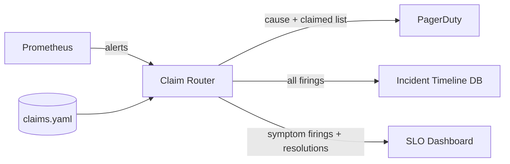

# Paging on symptoms versus causes without doubling oncall load

*the textbook says page on symptoms. The textbook has never carried your pager*

The SRE canon is clear: page on user-visible symptoms, not on internal causes. Symptoms are stable, causes drift with every refactor, and a cause-based alert library decays into a graveyard of stale rules nobody trusts. So you write four SLO burn alerts on the four things users actually care about (login latency, checkout success rate, search p99, image upload throughput), and you sleep well.

For about three weeks.

Then the upstream message queue backs up one Tuesday morning, all four of those symptoms degrade simultaneously, and your phone fires four times in ninety seconds. You acknowledge them all, you find the queue, you fix the queue, and at the retro someone politely asks why we paged the human four times for one incident. You mumble something about "well, they ARE four separate user-visible problems" and everyone nods and nobody is happy.

This is the symptom-paging tax. The textbook answer is correct but incomplete. The missing piece is a routing layer that knows which symptoms are downstream of which causes, suppresses the duplicate noise, and still keeps the symptom alert as the system of record for "is the user actually unhappy." This post walks through how we built that for a backend with one obvious bottleneck (a job queue named `dispatcher-prime`) and four consumers that all degrade when it does. The math for why a single upstream produces correlated downstream burns lives in the correlated-dependency post in this series; this one is about what the pager should do once they fire.

## What "page on symptoms" actually buys you

Before throwing it out, the reason for the rule is worth restating, because the fix has to preserve it.

A cause-based alert ("redis memory > 80%") fires whether or not anyone cares. Most of the time nobody does, because the system has slack, the cache is warm, or that particular redis isn't on the hot path anymore after last quarter's refactor. You get woken up, you look, you go back to sleep. Repeat that twice a week and you stop looking. Now when it matters, the page is noise to you.

A symptom alert ("checkout p99 > 2s for 10 minutes") fires only when users are actually being hurt. You always look. You always find something. The signal-to-noise ratio stays clean across years of code churn because users' tolerance for slow checkouts does not depend on whether we still use redis.

The trap is that one user-visible symptom is rarely independent of the others. A backend platform with shared infrastructure has fan-out: one DNS resolver, one database primary, one queue, one TLS-cert renewer. When the shared thing breaks, every downstream SLO burns at once. Symptom paging without coordination means N pages for one human-actionable incident.

## The four-page Tuesday

Here is the system. Names are made up but the shape is common.

```
                     +------------------+
                     |  dispatcher-prime |  (job queue)
                     +---------+--------+
                               |
              +----------------+----------------+
              |        |       |       |       |
              v        v       v       v       v
          checkout  search  upload  notif  reports
           (SLO)    (SLO)   (SLO)  (none)  (SLO)
```

Four of the five consumers have user-facing SLOs and a burn-rate alert. The queue itself has internal metrics (depth, oldest-message age, consumer lag) but no SLO; nobody contracts on queue depth.

When `dispatcher-prime` backs up past roughly 50k messages, the four SLO alerts fire in this order, separated by whatever each alert's evaluation window resolves to:

1. `checkout_burn_fast` (2-minute window, fires first because checkout is latency-sensitive)
2. `search_burn_fast` (3-minute window)
3. `upload_throughput_low` (5-minute window)
4. `reports_burn_slow` (10-minute window)

The oncall gets four pages spread over eight minutes. By page two they've already opened the queue dashboard and figured it out. Pages three and four arrive while they're typing in the incident channel. The actual work was one investigation. The pager fired four times.

Over a quarter, the team measured that 60% of weekly pages were duplicates of this shape: one upstream issue fanning out to multiple SLO alerts that all needed to fire (because the SLOs are real and users were being hurt) but only needed to wake one human. That 60% is the duplicate ratio in the page stream, not yet a claim about what's achievable; the achieved reduction number comes later.

## What does NOT work

The instinct is to disable the noisier symptom alerts and "just page on the queue." This rebuilds the cause-alert graveyard, slowly. Two refactors from now, the queue isn't on the critical path for `reports` anymore, but the queue alert still fires and wakes someone for nothing.

The other instinct is to write "compound" alerts ("checkout burning AND queue deep -> page; checkout burning AND queue fine -> different page"). This explodes combinatorially. With 4 symptoms and 6 plausible causes you write 24 alerts, each of which has its own bugs, and you still don't catch the cause you didn't think of.

The third instinct, popular in Prometheus shops, is `inhibit_rules` in Alertmanager: if alert X is firing, suppress alert Y. This is closer, but the default ergonomics suppress the symptom (the thing you want) in favor of the cause (the thing you don't trust). And it doesn't help the post-incident review, because the suppressed symptoms vanish from the timeline.

## Cause-claims-symptoms routing

The pattern we landed on has three pieces, deliberately separated:

1. **Symptom alerts stay as is.** They remain the system of record for "is the user unhappy." They fire into the alerting system, they get recorded, they appear on SLO dashboards, they are never disabled or muted by routing logic.
2. **Cause alerts can claim symptoms.** A cause alert (e.g. `dispatcher_prime_backlog_high`) declares which symptoms it expects to cause. When the cause fires, it grabs ownership of those symptoms for a suppression window.
3. **Routing pages once per claimed group.** If a symptom alert fires and is currently claimed by an active cause, the symptom is recorded but not paged. The cause page is the one that wakes the human, and it carries a list of the claimed symptoms in its body so the responder knows what they're really dealing with.

The critical inversion: the cause alert is the one that pages, but the symptom alerts are still the source of truth. If no cause has claimed a symptom when it fires, the symptom pages normally. Cause alerts are an optimisation on top of symptom paging, not a replacement for it.

Here's the routing rule shape, as we deploy it (this is a simplified version of our real config, but the structure is what we actually use):

```yaml
# claim rules: cause alerts that suppress downstream symptoms
claims:
  - cause: dispatcher_prime_backlog_high
    claims_symptoms:
      - checkout_burn_fast
      - checkout_burn_slow
      - search_burn_fast
      - upload_throughput_low
      - reports_burn_slow
    window: 15m
    grace_after_clear: 5m
    notify:
      page: oncall-platform
      include_claimed: true   # symptom list appears in page body

  - cause: primary_db_replication_lag_high
    claims_symptoms:
      - reports_burn_slow         # reports reads from replicas
      - search_burn_fast          # search index refresh reads replicas
    window: 20m
    grace_after_clear: 10m
    notify:
      page: oncall-data
      include_claimed: true
```

The semantics:

- When `dispatcher_prime_backlog_high` fires, it opens a 15-minute claim on the five listed symptoms.
- During the claim window, if any claimed symptom fires, it is recorded in the incident timeline but does NOT page. A note is attached: "suppressed by active cause: dispatcher_prime_backlog_high."
- When the cause clears, the claim stays open for `grace_after_clear` (5 minutes) to ride out delayed symptom resolution. After that, symptoms page normally again.
- If a claimed symptom is still firing past the grace window, it pages then, because at that point the cause is gone but the symptom isn't, and that's a separate problem worth waking someone for.

Budget burns regardless of suppression. A sustained issue that exceeds the grace window will eventually page on the lingering symptom anyway, so the human still finds out about a real ongoing outage; they just don't get notified four times in the first minute.

The same symptom can be claimed by multiple causes. `search_burn_fast` shows up under both `dispatcher_prime_backlog_high` and `primary_db_replication_lag_high` because search depends on both the index-update queue and the replica it reads from. Whichever cause fires first owns the claim. If both fire, the page bodies list each other so the responder doesn't need to chase the relationship.

## What the responder sees

Before:

```
03:14 PAGE: checkout_burn_fast (p99 = 2.4s, threshold 2.0s)
03:15 PAGE: search_burn_fast (p99 = 1.8s, threshold 1.5s)
03:16 ACK checkout_burn_fast
03:16 ACK search_burn_fast
03:18 PAGE: upload_throughput_low
03:19 ACK upload_throughput_low
03:22 PAGE: reports_burn_slow
03:22 ACK reports_burn_slow
```

After:

```
03:14 [recorded, suppressed] checkout_burn_fast
03:15 [recorded, suppressed] search_burn_fast
03:16 PAGE: dispatcher_prime_backlog_high (depth = 62k, oldest = 4m)
              suppressed symptoms: checkout_burn_fast, search_burn_fast
              expected symptoms (claimed, not yet firing): upload_throughput_low, reports_burn_slow
03:16 ACK dispatcher_prime_backlog_high
03:18 [recorded, suppressed] upload_throughput_low
03:22 [recorded, suppressed] reports_burn_slow
```

One ack. Same information. The incident timeline still has all four symptom firings (the SLO dashboards still see them, the postmortem still has the user-impact data), but the human got one notification instead of four.

The key UX point is that "expected but not yet firing" line. The router computes it by cross-referencing the `claims_symptoms` list for the active cause against the set of currently firing alerts; anything in the list that isn't firing right now gets annotated as expected. If only two of the four expected symptoms ever fire, that's data: maybe `reports` decoupled from the queue at some point and we didn't update the claim list. Stale claim rules become visible instead of silent.

## Mechanics: where the routing lives

A few places this can sit. We put it in the alert router (we use a small custom Alertmanager fork, but you could implement the same logic in PagerDuty event rules with some pain or in a thin sidecar between Prometheus and your pager).

The cause alerts are written and stored like any other alert. The claim relationships live in a separate file that's reviewed alongside SLO changes, so adding or removing claims is a deliberate act. Schema looks roughly like this in our case:



The router does three things per incoming alert:

1. Record the firing in the timeline DB regardless of routing decision.
2. Update SLO budget burn based on symptom firings (suppression does not stop the budget from burning, because the user impact is real).
3. Decide whether to page: if it's a cause, always page. If it's a symptom, check active claims and page only if uncovered.

The persistence detail matters. If the router restarts mid-incident, it needs to know which claims are still open. We keep claim state in a small SQLite file on the router host, written on every claim open/close, and recover on startup. A claim that started before a restart is honoured for its remaining window. The SQLite file lives on that one host, so a process restart is fine but a host loss restarts claim state from empty; for HA, replicate the file or move state to a shared store, or accept that during the failover window you fall back to raw symptom paging.

## Tuning the windows

The `window` and `grace_after_clear` numbers are the levers. We landed on these by looking at incident histories:

| Cause                              | Median time-to-symptom | Median time-to-clear-after-fix | Window | Grace |
|------------------------------------|------------------------|--------------------------------|--------|-------|
| dispatcher_prime_backlog_high      | 2m                     | 3m                             | 15m    | 5m    |
| primary_db_replication_lag_high    | 5m                     | 8m                             | 20m    | 10m   |
| edge_dns_resolver_errors_high      | 30s                    | 1m                             | 10m    | 3m    |

The window has to be longer than the longest symptom evaluation window plus typical time-to-symptom. The grace has to be longer than the typical time for SLO burn-rate alerts to stop firing after the underlying issue clears, and that time depends on which alert shape you use. In a single-window burn-rate alert, recovery is governed by the lookback window and takes roughly that long to clear. In the now-standard multi-window multi-burn-rate (MWMBR) setup recommended by the SRE Workbook ([sre.google/workbook/alerting-on-slos](https://sre.google/workbook/alerting-on-slos/)), the short window is typically 1/12 of the long (the canonical fast-burn pair is 1h/5m), so recovery is governed by that 5-minute short window. Either way, grace has to be set longer than the recovery time.

Set the grace too short and you double-page on the tail: cause clears, claim expires, symptom is still in its smoothing window, symptom pages, human is annoyed. Set it too long and a genuinely separate failure during the grace window gets swallowed. We err generous and revisit when the data says we should.

## What this is NOT

This is not "alert correlation" in the AIOps sense, where a machine learning model groups alerts by hidden similarity. Those systems are real and some are good, but they're opaque, expensive to maintain, and hard to argue with at 4am when you think it suppressed something it shouldn't have. Claim rules are deliberately dumb: a human wrote down "this cause produces these symptoms" and that's what the router enforces. When it's wrong, the fix is one diff to one yaml file.

It's also not a way to avoid having symptom alerts. The symptom alerts still exist, still record, still burn SLO budget, still appear on dashboards. The router only affects whether the human's phone rings. Anyone evaluating "are users being hurt right now" should look at symptoms, not at whether a cause page fired.

## The 60% number, honestly

The duplicate ratio in the page stream was 60% before claim rules; after deploying them the actual page volume dropped by roughly 60% over the following quarter, which is what you'd expect if claims caught most of the duplicates and did not over-suppress real incidents. The two 60s line up because they're measuring the same population from opposite sides. That number is worth contextualising: it's specific to a backend where the job queue and the primary database between them account for a large share of incidents. A more fanned-out architecture would see a smaller win because fewer symptoms cluster under fewer causes. If your incidents are all weird one-offs, claim rules give you nothing because there's nothing to claim. The pattern pays off when you have a small number of high-fan-out shared resources whose failure modes are recurring.

The other honest caveat: claim rules add a thing that can be wrong. A claim list that doesn't match reality (because a service got refactored) will either over-suppress (real incidents get hidden) or under-suppress (you're back to four pages). The "expected but not firing" diagnostic in the page body is the only thing that keeps the claims honest over time, and even then it depends on a human noticing. We review claim files quarterly. Anything that hasn't claimed anything in 90 days gets a "is this still real?" comment in the PR.

## What you keep

The textbook rule survives, lightly amended. Page on symptoms, because symptoms are what matter. But route the pages through a layer that knows which symptoms are children of which causes, and let the cause alert be the one that fires the pager when it can. The symptoms still happen, still get recorded, still burn the budget, still appear in the postmortem. The human just gets to find out about the incident once.
