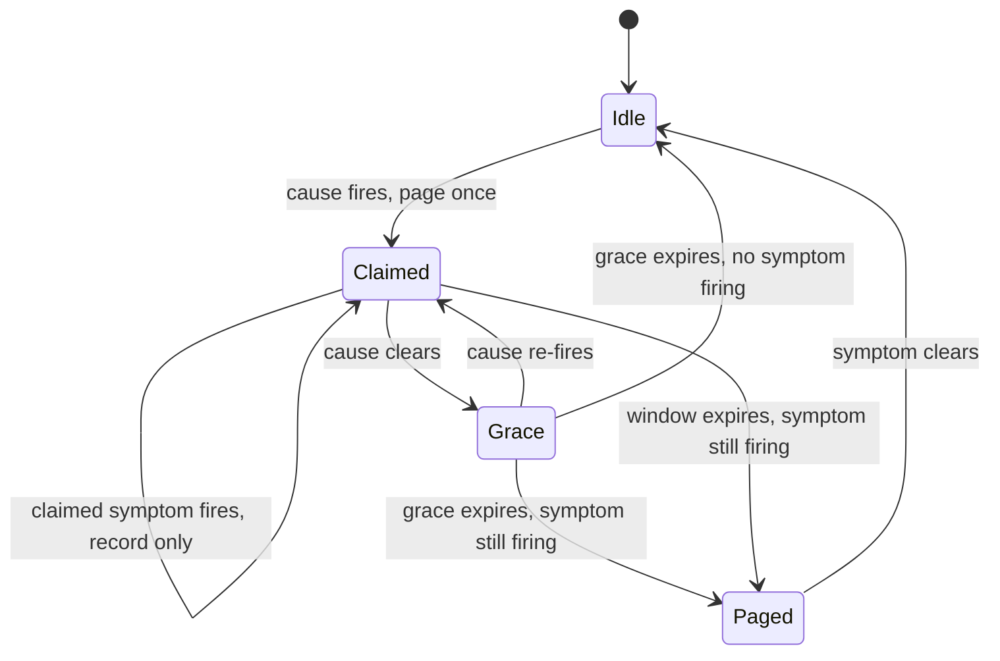

# Paging on symptoms versus causes without doubling oncall load

*how to keep symptom-based alerts but stop one upstream failure from waking the on-call person several times*

Two terms first. A page is the notification that wakes the person responsible for a service when something is wrong: a phone alarm at 3am, not an email. The on-call person is whoever is currently in the rotation that responds to those pages; the team takes turns.

The standard advice for production services is clear: page on user-visible symptoms, not on internal causes. One symptom alert covers many causes at once, including failure modes nobody anticipated, and it stays stable across refactors. A library of cause-based alerts does the opposite: it rots into a pile of stale rules nobody trusts, misses real problems, and fires on conditions users never feel. So you write alerts on the things users care about.

A quick gloss, because these terms carry the post. An SLO (Service Level Objective) is the target you commit to for a user-facing metric, for example "checkout p99 under 2 seconds 99.9% of the time." The p99 is the 99th percentile latency: the response time that all but the slowest 1 percent of requests stay under. That 99.9% leaves an error budget, the small amount of failure you are allowed before you breach the target. A burn-rate alert watches how fast you are spending that budget and fires when, at the current rate, you would run out before the month ends. The four alerts cover login latency, checkout success rate, search p99, and report freshness, and the rotation is quiet.

That lasts about three weeks. Then the upstream message queue (a list of jobs waiting to be processed) backs up one Tuesday morning, all four symptoms degrade at once, and the on-call phone fires four times in ninety seconds. You acknowledge them all, find the queue, fix the queue, and at the retrospective (the short meeting after an incident where the team reviews what happened) someone politely asks why we woke one person four times for one incident. You explain that these are four separate user-visible problems, which is true and satisfies no one.

The textbook advice is correct but incomplete. The missing piece is a routing layer: a small component between your alerts and the pager that knows which symptoms sit downstream of which causes, suppresses the duplicate notifications, and still keeps the symptom alert as the authoritative answer to "is the user actually unhappy." This post walks through how we built that for a backend with one obvious bottleneck (a job queue named `dispatcher-prime`) and four consumers that all degrade when it does. The math for why a single upstream produces correlated downstream burns lives in the correlated-dependency post in this series (/article/17-error-budget-math-correlated-dependencies.html); this post is about what the pager does once those alerts fire.

## What "page on symptoms" actually buys you

A cause-based alert ("redis memory > 80%") fires whether or not anyone cares. Redis is an in-memory data store, often used as a cache, and its memory filling up may mean nothing: the system has slack, the cache is warm, or redis stopped being on the hot path (the code that runs on almost every request) after last quarter's refactor. Repeat that false page twice a week and you stop looking, so when it matters the page reads as noise.

A symptom alert ("checkout p99 > 2s for 10 minutes") fires only when users are being hurt, so you always look and you always find something. The ratio of real signals to false alarms stays clean across years of code changes, because how much users tolerate slow checkouts does not depend on whether we still run redis.

The catch is that one user-visible symptom is rarely independent of the others. A backend with shared infrastructure has fan-out: one shared dependency feeds many consumers, so its failure radiates to all of them at once. Examples: a DNS resolver (the service that turns a hostname like `db.internal` into an IP address), a database primary, a queue, or a TLS-cert renewer. The certificates that prove a server's identity expire and are renewed automatically, and the thing that renews them is shared. A database primary is the one copy that takes writes; read-only copies called replicas follow behind it.

Each consumer is hit unless it has something to absorb the failure: replicas to read from, caching, circuit breakers (which stop sending requests to a dependency that is already failing, so the failure does not pile up), or graceful degradation (serving a reduced version of the feature instead of failing outright). Where that protection is missing, symptom paging without coordination means N pages for one incident. The failure fan-out is inherent to sharing a dependency; the page fan-out is just how you configured alerting, the fixable part.

## The four-page Tuesday

The system below uses made-up names, but the shape is common.

```
                     +------------------+
                     |  dispatcher-prime |  (job queue)
                     +---------+--------+
                               |
              +----------------+----------------+
              |        |       |       |       |
              v        v       v       v       v
          checkout  search  upload  notif  reports
           (SLO)    (SLO)   (SLO)  (none)  (SLO)
```

Four of the five consumers have user-facing SLOs and a burn-rate alert. The queue itself has internal metrics: depth (how many jobs are waiting), oldest-message age, and consumer lag (how far behind the workers are). But the queue has no SLO, because nobody promises users anything about queue depth.

When `dispatcher-prime` backs up past roughly 50k messages, the four SLO alerts fire in this order, separated by each alert's evaluation window. The evaluation window (also called the lookback window) is how much recent history a burn-rate alert averages over before deciding to fire. A shorter lookback reacts sooner; a longer one needs the problem to persist first. That is why the pages arrive staggered rather than together.

1. `checkout_burn_fast` (2-minute window, fires first because checkout reacts quickly to slowness)
2. `search_burn_fast` (3-minute window)
3. `upload_throughput_low` (5-minute window)
4. `reports_burn_slow` (10-minute window)

Throughput here means the amount of work completed per unit time: uploads finished per minute, which drops when the queue backs up. The on-call person gets four pages over eight minutes for one investigation. By the second page they have opened the queue dashboard and figured it out; pages three and four arrive while they are typing in the incident channel.

Over a quarter, the team measured that 60% of weekly pages were duplicates of this shape: one upstream issue fanning out to multiple SLO alerts that all needed to fire (the SLOs are real and users were being hurt) but only needed to wake one person.

## What does not work

The first instinct is to disable the noisier symptom alerts and "just page on the queue." This rebuilds the stale-cause-alert pile: two refactors from now, the queue is no longer on the critical path for `reports` (the chain of steps a request must pass through), but the queue alert still wakes someone for nothing.

The second instinct is "compound" alerts ("checkout burning AND queue deep -> page; checkout burning AND queue fine -> different page"). These grow too fast: 4 symptoms and 6 plausible causes is 24 alerts, each with its own bugs, and you still miss the cause you did not think of.

The third instinct, popular with teams using Prometheus (a widely used monitoring system that collects metrics and evaluates alert rules), is `inhibit_rules` in Alertmanager (the Prometheus component that takes firing alerts and decides what to notify). An inhibit rule names a source alert (typically a cause) and a target (typically a symptom): while the source fires, the target's notifications are muted. The standard example is a "datacenter down" alert muting all the per-service alerts under it.

That is closer, but the defaults point the wrong way: they mute the symptom (the thing you trust) to favor the cause (the thing you do not). The symptom keeps firing inside Alertmanager and shows as `suppressed` in the API, but the responder's pager goes quiet on the thing that measures user pain, and the muted symptoms drop out of the post-incident timeline.

## Cause-claims-symptoms routing

The pattern we landed on has three pieces, deliberately kept separate.

1. **Symptom alerts stay as is.** They remain the authoritative answer to "is the user unhappy." They fire, get recorded, appear on SLO dashboards, and are never disabled or muted by the routing logic.
2. **Cause alerts can claim symptoms.** A cause alert (for example `dispatcher_prime_backlog_high`) declares which symptoms it expects to cause, and when it fires it grabs ownership of them for a suppression window: a stretch of time during which those symptoms will be recorded but not paged.
3. **Routing pages once per claimed group.** If a symptom fires and is currently claimed by an active cause, it is recorded but not paged. The cause page is the one that wakes the person, and it carries a list of the claimed symptoms.

The important part is the direction: the cause alert pages, but the symptom alerts are still the source of truth. If no cause has claimed a symptom when it fires, it pages normally. A cause alert that claims no symptoms is just a plain alert; the claim list is what ties a cause to real user impact, which keeps this inside the textbook rule rather than abandoning it.

Two timers govern a claim. The `window` is how long the claim lasts once the cause fires (the total time it is allowed to suppress). The `grace_after_clear` is extra time the claim stays open after the cause clears, to ride out symptoms that resolve slowly. Here is the rule shape as we deploy it (simplified, but structurally what we run):

```yaml
# claim rules: cause alerts that suppress downstream symptoms
claims:
  - cause: dispatcher_prime_backlog_high
    claims_symptoms:
      - checkout_burn_fast
      - checkout_burn_slow
      - search_burn_fast
      - upload_throughput_low
      - reports_burn_slow
    window: 15m
    grace_after_clear: 5m
    notify:
      page: oncall-platform
      include_claimed: true   # symptom list appears in page body

  - cause: primary_db_replication_lag_high
    claims_symptoms:
      - reports_burn_slow         # reports reads from replicas
      - search_burn_fast          # search index refresh reads replicas
    window: 20m
    grace_after_clear: 10m
    notify:
      page: oncall-data
      include_claimed: true
```

The claim moves through a small state machine (a model with a fixed set of states and defined transitions between them):



The `Grace` state is the safety net. If the grace timer expires while a symptom is still firing, the claim moves to `Paged`: the cause is gone but the symptom is not, a separate problem worth waking someone for. Everything else stays quiet, and a claimed symptom that fires during the window is logged with a note ("suppressed by active cause: dispatcher_prime_backlog_high") rather than paged.

The budget burns regardless of suppression. Error budget is consumed by the actual bad requests measured against the SLO, not by whether an alert fires or is muted, so suppression can never hide an ongoing problem, and an issue that outlasts the grace window pages on the lingering symptom anyway.

The same symptom can be claimed by multiple causes. `search_burn_fast` appears under both `dispatcher_prime_backlog_high` and `primary_db_replication_lag_high` because search depends on both the index-update queue and the replica it reads from. Whichever cause fires first owns the claim. A second cause firing while that claim is active produces no second page for the shared symptom; it is noted in the active cause's body, and it still pages once for any symptoms the first did not claim.

## What the responder sees

Before:

```
03:14 PAGE: checkout_burn_fast (p99 = 2.4s, threshold 2.0s)
03:15 PAGE: search_burn_fast (p99 = 1.8s, threshold 1.5s)
03:16 ACK checkout_burn_fast
03:16 ACK search_burn_fast
03:18 PAGE: upload_throughput_low
03:19 ACK upload_throughput_low
03:22 PAGE: reports_burn_slow
03:22 ACK reports_burn_slow
```

After:

```
03:14 [recorded, suppressed] checkout_burn_fast
03:15 [recorded, suppressed] search_burn_fast
03:16 PAGE: dispatcher_prime_backlog_high (depth = 62k, oldest = 4m)
              suppressed symptoms: checkout_burn_fast, search_burn_fast
              expected symptoms (claimed, not yet firing): upload_throughput_low, reports_burn_slow
03:16 ACK dispatcher_prime_backlog_high
03:18 [recorded, suppressed] upload_throughput_low
03:22 [recorded, suppressed] reports_burn_slow
```

One ack with the same information. The incident timeline still has all four symptom firings; the person got one notification instead of four.

The "expected but not yet firing" line is not a prediction. The router computes it by subtracting the alerts currently firing from the static `claims_symptoms` list for the active cause. If only two of the four expected symptoms ever fire, that is useful data: maybe `reports` decoupled from the queue and nobody updated the claim list, so a stale rule becomes visible instead of silent.

## Mechanics: where the routing lives

This can sit in a few places. We put it in the alert router, which in our case is a small custom version of Alertmanager (a fork: a copy of the source code we modified and maintain ourselves). The same logic fits PagerDuty event rules (PagerDuty is a commercial paging product; event rules are its feature for transforming and routing incoming alerts) with some pain, or a thin sidecar between Prometheus and your pager (a small helper process deployed alongside the main one).

The claim relationships live in a separate file reviewed alongside SLO changes, so adding or removing a claim is a deliberate act. The router does three things per incoming alert:

1. Record the firing in the timeline database regardless of the routing decision.
2. Update SLO budget burn based on symptom firings (suppression does not stop the budget from burning; the user impact is real).
3. Decide whether to page. If it is a cause, page (the single notification for the group). If it is a symptom, check active claims and page only if no claim covers it.

Persistence matters: if the router restarts mid-incident, it needs to know which claims are still open. We keep claim state in a small SQLite file (a self-contained database that lives in a single file, with no separate server process) on the router host, written on every claim open and close, and recovered on startup; a claim that started before a restart is honored for its remaining window. A process restart is fine, but losing the whole host resets claim state to empty, so for high availability (the system keeps working through the loss of a single component) replicate the file or move state to a shared store. The alternative is to accept that during a failover (the automatic switch to a backup when the primary dies) you fall back to raw symptom paging: only incidents that span the failover get double-paged, never lost coverage.

## Tuning the windows

The `window` and `grace_after_clear` numbers are the levers, landed on from past incident records:

| Cause                              | Median time-to-symptom | Median time-to-clear-after-fix | Window | Grace |
|------------------------------------|------------------------|--------------------------------|--------|-------|
| dispatcher_prime_backlog_high      | 2m                     | 3m                             | 15m    | 5m    |
| primary_db_replication_lag_high    | 5m                     | 8m                             | 20m    | 10m   |
| edge_dns_resolver_errors_high      | 30s                    | 1m                             | 10m    | 3m    |

The window has to outlast the longest symptom evaluation window plus the time that symptom takes to appear, so the claim is still open when the slowest symptom finally trips. On the `dispatcher_prime_backlog_high` row: the longest claimed symptom window is `reports_burn_slow` at 10m, and that row's median time-to-symptom is 2m, so the claim must cover at least 12m; window=15m clears it. The grace has to outlast the time burn-rate alerts take to stop firing after the issue clears, which depends on which alert shape you use.

These four example symptom alerts are single-window burn-rate alerts: they average error rate over one lookback window, so recovery takes roughly that long. The alert keeps firing until the bad minutes age out of the average and it drops below the threshold. The now-standard alternative is multi-window multi-burn-rate alerting, described in Google's reliability engineering handbook ([alerting on SLOs](https://sre.google/workbook/alerting-on-slos/)). It fires only when two windows agree: a long window confirms the problem is real, and a short window confirms it is still happening now. Because it needs both, it clears the moment the short window drops, so it recovers fast rather than over the full long window. Either way, set grace longer than the recovery time.

Set the grace too short and you double-page on the tail of the smoothing window, while the symptom alert is still averaging its recent bad readings. Set it too long and a separate failure during the grace window gets swallowed. We set it generous and revisit when the data says to.

## What this is NOT

This is not "alert correlation" in the AIOps sense. AIOps applies machine learning to operations data, including auto-grouping alerts by learned similarity. Those systems are real and some are good, but they are opaque and hard to trust when you suspect they suppressed something they should not have. Claim rules are deliberately simple: a human wrote down "this cause produces these symptoms" and the router enforces it. When it is wrong, the fix is one change to one yaml file, and you can read the rule that did it.

It is also not a way to avoid having symptom alerts. They still exist and still burn SLO budget; the router only affects whether the phone rings. To decide "are users being hurt right now," look at symptoms, not at whether a cause paged.

## The 60% number

The duplicate ratio in the page stream was 60% before claim rules. After deploying them, page volume dropped by roughly 60% over the following quarter. The two 60s are not the same measurement. The first counts redundancy in the raw input: of the pages arriving, 60% were redundant copies of a fan-out. The second counts how much the output shrank. They line up only if the rules removed nearly all the duplicates while leaving genuine incidents alone. That convergence is evidence the rules cut the right things rather than over-suppressing.

That number is specific to a backend where the job queue and the primary database between them account for a large share of incidents. A more fanned-out architecture sees a smaller win, and if your incidents are all weird one-offs, claim rules give you nothing. The pattern pays off when you have a small number of high-fan-out shared resources whose failure modes recur.

There is a real cost: claim rules add a thing that can be wrong. A claim list that no longer matches reality (because a service got refactored) will either over-suppress (real incidents get hidden) or under-suppress (you are back to four pages). The "expected but not firing" diagnostic is the only thing that keeps the claims honest, and even that depends on a human noticing. We review claim files quarterly; anything that has not claimed in 90 days gets an "is this still real?" comment in the pull request (the proposed code change submitted for review before it merges).

## What you keep

The textbook rule survives, lightly amended. Page on symptoms, but route the pages through a layer that knows which symptoms are children of which causes, so the cause alert fires the single page for the group while the symptoms stay the source of truth for user impact. They still get recorded, still burn the budget, still appear in the postmortem, and the on-call person hears about it once.
